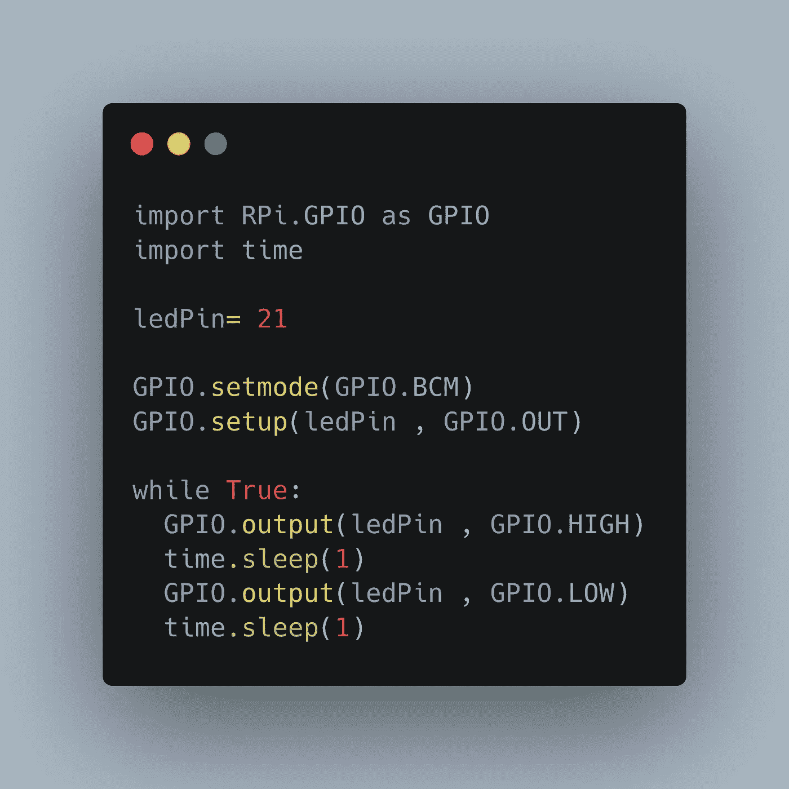

# Raspberry Pi: Python 库上的 GPIO 编程

> 原文：<https://medium.com/geekculture/gpio-programming-on-the-raspberry-pi-python-libraries-e12af7e0a812?source=collection_archive---------2----------------------->



Raspberry Pi 是单板计算机，现在有四个版本和一个极简的零版本。它是不同项目的流行选择，因为它的体积小，功耗低，处理速度快，并且是一台完全基于 Linux 的计算机。

当你想连接几个微控制器时，有几种协议:I2C、SIP 和 UART。在我的前两篇文章中，我解释了这些协议，并展示了使用 Arduino 和 Raspberry Pi 的 C++库的例子。

本文现在展示了使用 Raspberry Pi 的通用 GPIO 库。这些库是 Wiring Pi、Pigpio、Gpiozero、Rpi.GPIO。每个库都有一个描述、其主要特性、一个 Python 代码示例和一个 C 语言代码示例(如果该库支持的话)。我假设您对 GPIO 编程有一个大致的了解，因此不会在示例中详细描述每个源代码行。

*本文原载于【admantium.com】[*我的博客*](https://admantium.com/blog/micro08_raspberry_pi_gpio_programming/) 。*

# 接线端子

WiringPi 库是一个常用的、功能丰富的库，支持 I2C 和 SPI 连接。它是用 C 写的，提供 Python 绑定。不幸的是，正如最初的作者所说的那样，这个库已经被废弃了。自己决定是否要使用这个库:一方面，你在网上找到几个例子，另一方面，Raspberry Pi 社区的成员开始转移到新的库。

这些库的最新版本可以在 Github 上获得:参见 [WiringPi C](https://github.com/WiringPi/WiringPi) 和 [WiringPi Python](https://github.com/WiringPi/WiringPi-Python) 。

# C

```
#include <stdlib.h>
#include <stdbool.h>
#include <wiringPi.h>#define LED_PIN 6int main()
{
  pinMode(LED_PIN, OUTPUT);
  while (true)
  {
    delay(1000);
    digitalWrite(LED_PIN, 0);
    delay(1050);
    digitalWrite(LED_PIN, 1);
  }
}
```

# 计算机编程语言

```
import wiringpi
import timeledPin = 6wiringpi.wiringPiSetup()
wiringpi.pinMode(ledPin,1)while(True):
    wiringpi.digitalWrite(ledPin, 1)
    time.sleep(1)
    wiringpi.digitalWrite(ledPin, 0)
    time.sleep(1)
```

# 皮格皮奥

[pigpio](http://abyz.me.uk/rpi/pigpio/) 是一个积极开发的库，具有一系列令人印象深刻的功能:Raspberry Pi 的所有 gpio 引脚都可以读取、写入、连接到中断处理程序，同时输出 PWM 信号。此外，还实现了 UART、I2C 和 SPI 协议。它是用 C 写的，也提供 Python 绑定。去[官方 Github 库](https://github.com/joan2937/pigpio)在你的 Raspberry Pi 上构建最新版本，或者用`apt install pigpio python-pigpio python3-pigpio`安装。

# C

```
#include <stdlib.h>
#include <stdbool.h>
#include <pigpio.h>#define LED_PIN 6int main()
{
  gpioInitialise()
  gpioSetMode(LED_PIN, PI_OUTPUT);
  while (true)
  {
    gpioDelay(100000);
    gpioWrite(LED_PIN, 1);
    gpioDelay(100000);
    gpioWrite(LED_PIN, 0);
  }
}
```

# 计算机编程语言

```
import pigpio
import timeledPin = 6
pi = pigpio.pi()pi.set_mode(ledPin, pigpio.OUTPUT)while (True):
 pi.write(ledPin, True)
 time.sleep(1)
 pi.write(ledPin, False)
 time.sleep(1)
```

# Gpiozero

由 Raspberry Foundation 官方支持， [gpiozero](https://gpiozero.readthedocs.io/en/stable/) 是一个 Python 专用库，它不仅可以访问 GPIO 引脚，还可以为执行器和传感器的工作提供直接的硬件支持。对于连接其他设备，仅支持 SPI—[I2C 已宣布](https://bennuttall.com/whats-new-gpio-zero-v1-4/)，但尚未包括在内。

Gpiozero 已经安装在当前的 Raspberry Pi 操作系统中——如果没有，只需运行`python3 -m pip gpiozero`。源代码文件可以在 [Github](https://github.com/gpiozero/gpiozero) 上访问。关于 [readthedocs.io](https://gpiozero.readthedocs.io/en/stable/installing.html) 的官方文档提供了丰富的信息和大量示例代码。

# 计算机编程语言

```
from gpiozero import LED
from time import sleepled = LED("6")while True:
  led.on()
  sleep(1)
  led.off()
  sleep(1)
```

# Rpi。GPIO

[RPI。GPIO](https://pypi.org/project/RPi.GPIO/) 库是另一个只支持 Python 的库。它提供了与 GPIO 引脚的基本交互，但是还没有实现任何连接协议。项目 python 文件可以从[Pypi.org](https://pypi.org/project/RPi.GPIO/)下载，项目主页托管在[scourforge](https://sourceforge.net/p/raspberry-gpio-python/tickets/190/)上。

# 计算机编程语言

```
import RPi.GPIO as GPIO
import timeledPin= 21
GPIO.setmode(GPIO.BCM)
GPIO.setup(ledPin , GPIO.OUT)
while True:
  GPIO.output(ledPin , GPIO.HIGH)
  time.sleep(1)
  GPIO.output(ledPin , GPIO.LOW)
  time.sleep(1)
```

# 结论

本文介绍了四个 Raspberry Pi GPIO 编程库:WiringPI、Pi GPIO、Gpiozero、RPI.GPIO。对于每个库，我都解释了其主要特性，链接到它们的主页和/或源代码库，并给出了一个简短的 C 和/或 Python 源代码示例。