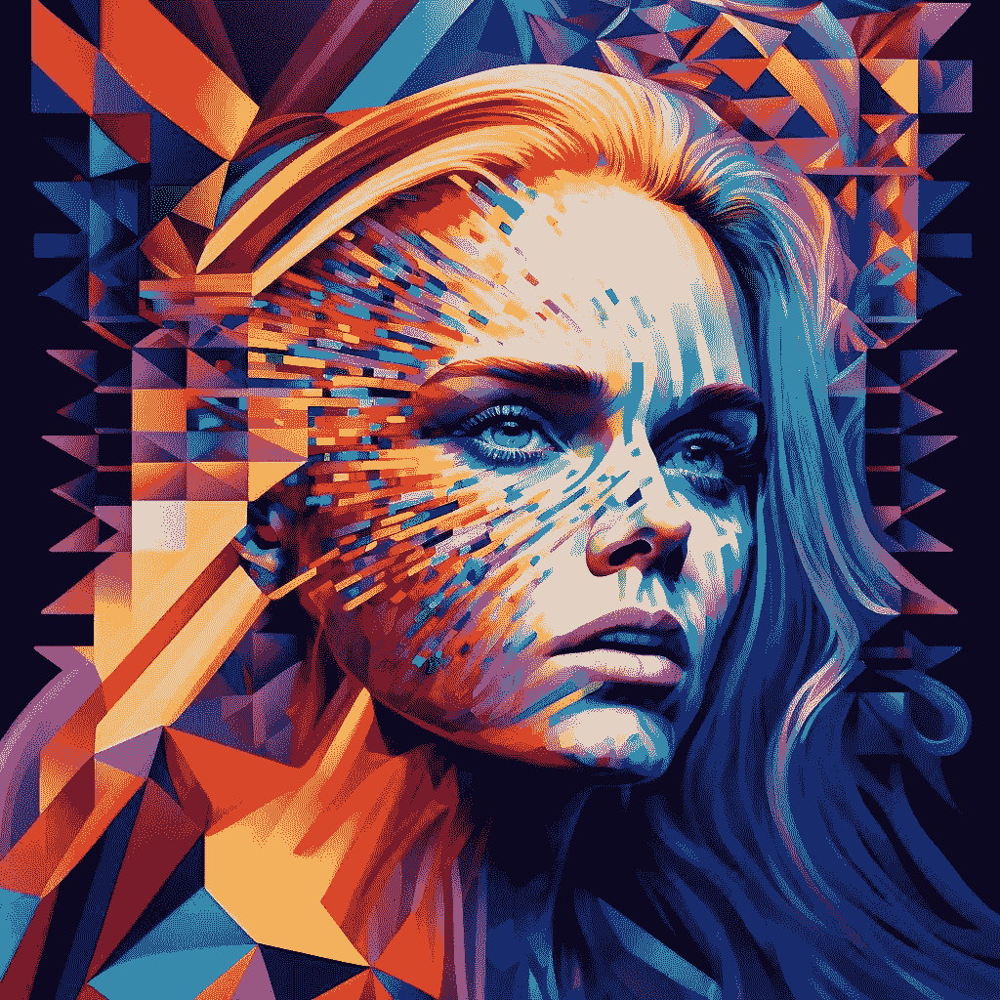
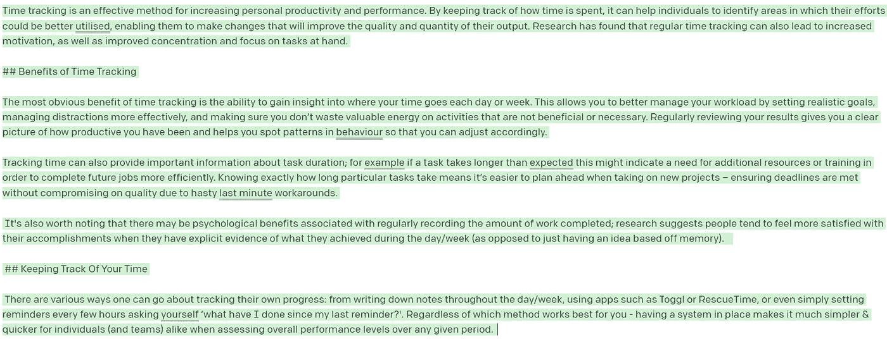
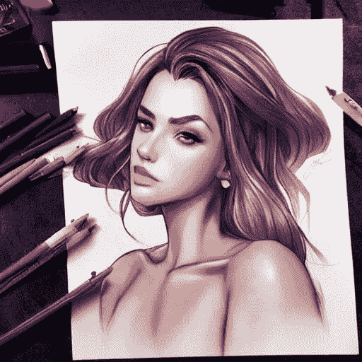

# GPT-3.5 发布，内容公司步履蹒跚

> 原文：<https://medium.com/geekculture/gpt-3-5-released-content-companies-reeling-f35db3ad3b07?source=collection_archive---------1----------------------->

[Into the Matrix by Destiny K](https://twitter.com/destinykrainbow), Midjourney.

## 另外:如何使用人工智能在*秒*内模拟网站登陆页面

W 欢迎来到[风口浪尖](https://nicksaraev.com/#/portal/signup) :用*简单*英语讲解的前沿 AI 新闻(及其含义)。

在本周的杂志中:

*   人工智能在几秒钟内生成令人难以置信的高质量登陆页面设计。
*   **GPT3.5 发布** : longform (+500 字！)现在，只需点击几下鼠标就能看到内容。
*   开发者现在可以使用稳定的扩散 API。

让我们开始吧。

# 人工智能现在可以在几秒钟内生成令人难以置信的高质量登陆页面设计

M [idjourney](https://www.midjourney.com/) ，一个流行的基于扩散的图像生成器，通常用于制作这样令人惊叹的艺术:

但是最近 Marcel Pociot 展示了同样的技术可以在很短的时间内创建高质量的定制登陆页面设计。

这很容易做到(也许令人震惊)。

像“备份网站登录页面、平面矢量、Figma、dribbble、用户界面”这样简单的提示尽管简单，却能提供令人惊叹的结果:

这对营销人员、网页设计师和产品团队的意义是显而易见的:现在你可以用最少的努力创建高质量的登录页面设计，而且在未来的几个月里只会越来越容易。

# 我们如何利用这一点呢？

人工智能生成的登录页面模型没有摧毁任何行业(目前还没有)。这些图像显然仍然存在问题:难以辨认的文本，按钮周围的 JPEG 图像等等。

但这并不意味着它们不能显著改善你的工作流程。例如:

*   营销人员现在有能力通过一些创造性的输入来快速构建他们自己的登录页面模型。
*   然后，他们可以使用这个模型与他们的设计团队一起快速测试不同配置和布局的有效性。

这大大加快了创作过程。你的营销团队可以在几秒钟内获得相同的结果，而不是等待几个小时或几天才能得到一个模型。

设计师也从中受益:

*   人工智能生成的模型为他们提供了一种令人难以置信的快速方式来测试不同的设计想法，并快速获得利益相关者的反馈。
*   设计师需要做的只是生成一组样式，智能删除不连贯的文本，然后根据需要调整设计以获得足够好的效果。

大多数 PPC、网站和设计机构可能会通过智能地实现这一点来加倍他们的产出。

# GPT3.5 发布:*难以置信的*内容现在只需点击几下鼠标

GPT-3 是一个突破性的文本生成模型，能够生成短文、连贯的故事和各种主题的引人入胜的大纲。

现在，OpenAI 已经将 [*文本-达芬奇-003*](https://beta.openai.com/docs/model-index-for-researchers) 添加到曲目中——他们称之为“GPT-3.5”——并且它的性能甚至更好。

经过强化学习范式的训练，GPT-3.5 可以在几秒钟内生成 300-600 字的整篇文章，只需要最少的编辑。

不相信我？下面是一次点击产生的大约 400 个单词(没有挑选):

它不会为你赢得任何普利策奖，但它会为你节省大量的内容支出。

# 我们如何利用这一点呢？

如果你想利用 GPT 3.5 的优势，你可能已经利用了 GPT 3。在这方面不会有太大变化。

不过，值得注意的是:这里的一致性差异至少好了一个数量级:

*   GPT-3 在较长的令牌长度上很快失去了一致性，而 GPT-3.5 保留了它。上下文窗口现在是一个巨大的**4000 个令牌**！
*   许多最初归因于[字节对编码](https://www.gwern.net/GPT-3#bpes)的问题，如押韵、节奏和诗歌，似乎已经解决(或至少最小化)。
*   你可以用最少的提示获得更好的零射击结果。

如果我有一家大型内容公司的全权委托，我会这样做来大幅提高吞吐量:

*   我会使用 Google Sheets 或 Airtable 来组织公司内容日历。
*   我将创建一个自定义函数[来调用 GPT 3.5，带有一个标题、一个简介、一些关键词和一个提示，比如“用以下信息写一篇引人入胜的文章”。](https://developers.google.com/apps-script/guides/sheets/functions#:~:text=A%20custom%20function%20cannot%20affect,to%20run%20a%20function%20instead.)
*   对于每一个新行，我会在工作表中使用 GPT 3.5 预先生成 4-5 个草稿。
*   我的内容团队现在已经完成了大约 70%的工作。然后，他们挑选最好的草稿，混合/匹配其他段落来加长文章，并(作为最后一步)添加链接/图片等。

上述措施将使成本降低*，最少降低*3-4 倍，同时产量也会增加相同的数量。

# 开发者现在可以使用稳定的扩散 API

[稳定扩散](https://stability.ai/)，开源的基于扩散的图像生成器，最近发布了它的 [API](https://api.stability.ai/docs) 。

这意味着开发人员现在有一种更容易的方法来使用稳定扩散的技术生成图像——有了它，出现了大量的可能性。

[By artgerm](https://lexica.art/?q=by%20artgerm), Stable Diffusion.

# 我们如何利用这一点呢？

自然，高级用户已经在本地硬盘上下载、调整并生成了图像。

但是，随着每个人都可以使用标准化的终端，竞争环境变得公平了。您不再需要成为部署/运营专业人员来从稳定扩散中获得价值(也不需要使用昂贵的 GPU)。

这里有 4 个你可以在你的职业生涯或公司中使用 Stable Diffusion API 的方法:

*   **佣金艺术家**:使用少量的 GPT 3.5 将收到的佣金转换成稳定的扩散就绪提示，然后将其路由到稳定的扩散 API。例如，“我想要一幅哥特风格的画，画一个穿着红色裙子的女人和她的狗”，可能变成“女人，红色裙子，牵着狗，哥特风格，1860 年，高品质，艺术品，格雷格·鲁特考斯基”。
*   **增强现有设计**:使用稳定扩散作为升级工具来增强现有的图像和艺术品。让徽标更清晰，旧照片更明亮，或者改进现有的设计。
*   **生成纹理**:使用稳定的扩散为游戏或视频生成详细、逼真的纹理。只需一个 API 调用就可以生成完美的可平铺纹理！
*   **图片搜索引擎**:我上周报道了股票摄影，但是你现在可以很容易地创建一个基于图片的搜索引擎(没有复杂的后端)。在稳定扩散 API &上挂一个搜索框，你就可以开始了。

最终，像稳定扩散这样的图像生成 API 将从根本上改变我们创建和消费媒体的方式。几年后，*互联网上的每一个图像请求*都可能包括对人工智能图像服务的并行请求，用于定制、增强或压缩目的。

我等不及了。

这是一个包裹！

喜欢这个吗？考虑和你认识的人分享。如果你读这篇文章是因为你认识的某个人给你发了这封信，请在这里注册[获取下一期时事通讯。](https://nicksaraev.com/#/portal/signup)

下周见。

尼克