# GPT-纽约市——根据纽约市的本地知识培训 NLP 模型

> 原文：<https://medium.com/geekculture/gpt-nyc-part-1-9cb698b2e3d?source=collection_archive---------16----------------------->

当我最近与一家虚构一代人工智能初创公司的成员聊天时，我预先写好的一个问题是，一个模型是否可以针对特定的非虚构地点进行训练。这是基于我对一个在 [AskNYC subreddit](https://www.reddit.com/r/AskNYC/) 上训练的模型的想法。

*   在语义搜索方法中，我们应该只返回文本相似问题的答案。
*   在问答(QA)方法中，这将被框定为检索或知识图问题，其中我们给模型一些权威数据，并训练它检索适当和相关的答案。
*   在我将在本帖中使用的自然语言生成(NLG)方法中，对于“最浪漫的餐馆是什么”这样的查询，我们没有一个答案或来源，因此 GPT 或 T5 建筑模型可以针对纽约市的用例进行微调。
    这里的一个风险是，结果可能*听起来*正确，但事实上并非如此。

## 挑战问题

*   我怎么去总督岛？/总督岛上的活动
*   你住在哪里，哪里好？
*   布什维克对家庭好吗？
*   你多久去一次中央公园？/时代广场？
*   哪里可以吃到 dosa 之类的南印度菜？/ upma？
*   哪一个最糟糕:G 列车，拉瓜迪亚机场，还是 JFK 机场？

# 获取数据

[/r/AskNYC](https://www.reddit.com/r/AskNYC/) 创建于 2012 年 8 月。当地人的 Reddit 活动目前分为/r/nyc 和/r/newyorkcity，社区规则通常会将游客和新居民的问题重定向到/r/AskNYC。这更像是州或国家的子区域(/r/HawaiiVisitors 和/r/JapanTravel)，而不是城市(/r/chicago 是一个单独的位置)。

PushShift.io 有从 2006 年 1 月到 2019 年 12 月的每月 Reddit 存档(从/r/AskNYC 开始到 Covid-era 问题之前)。
我下载了 2015 年 1 月的评论(32 GB 解压 JSON 行)，用`cat RC_2015–01 | grep 't5_2uqch' > asknyc.jsonl`过滤，只剩下 5478 条评论。
我下载 2019 年 6 月的时候(164 GB 解压)，那个月有 19824 条 AskReddit 评论。我决定添加其他月份的示例:2016 年 10 月、2017 年 8 月和 2018 年 4 月。
我最初计划从 Reddit 上收集原始问题，但发现从 PushShift 上下载和过滤更容易。
在总共 67，195 条收集的评论中，只有 13，400 条是对母问题的直接回复(在帖子中为“子代而非孙代”)。

## 考虑偏倚和毒性

我们可以预测生成内容的偏倚和毒性这两个双重问题。我们希望我们的纽约旅游指南 AI 能够对纽约人的许多文化和经历持积极态度并有所了解。如果这种模式局限于一个行政区，建议不要尝试波斯食物，或者将宗教习俗描述为“奇怪”，那么这是不够礼貌的。

我们可以使用向上投票计数和初始审核来帮助策划我们的评论转储。诚然/r/AskNYC 是一个有自己问题的公共网站。问题的范围从“人们在纽约的哪里购买 matzah？”“为什么纽约所有的照相馆都是由东正教犹太人经营的？”，以及“我们地下室的无家可归者”到“任何纽约人有经验帮助无家可归者注册他们的刺激支票？”。
任何关于少数民族社区的问题都可以被解读为好奇或其他。当人们不知道网络中有人可以回答时，或者当提问被视为对抗、种族主义或同性恋恐惧症时，他们会将这些问题带到/r/AskNYC。红色编辑倾向于对这些问题给出简洁、个人经历和/或政治上受欢迎的答案。

在第二部分，我计划阅读多篇论文，以更好地规范 GPT-纽约模型的输出。

# NLG (GPT-2)方法

## 背景

[GEM 基准](https://gem-benchmark.com/)结合了多种语言生成任务。两个任务包括将文本限制在特定的主题上，例如餐馆。[其中一个例子](https://github.com/UFAL-DSG/cs_restaurant_dataset)是捷克语，所以我无法评估；[另一个](https://github.com/tuetschek/e2e-cleaning)使用数据输入/编码输入生成仅限于餐馆话题的句子。

## 准备我的数据集

[CoLab 链接](https://colab.research.google.com/drive/13BOw0uekoAYB4jjQtaXTn6J_VHatiRLu?usp=sharing)
您可以在这里下载数据集[。](https://github.com/MonsoonNLP/gpt-nyc/blob/main/combined.csv)

## 查找其他令牌

[CoLab link](https://colab.research.google.com/drive/13BOw0uekoAYB4jjQtaXTn6J_VHatiRLu?usp=sharing)
我想对街道、街区、中转站、人、食物和事件进行标记，这样我们就不会在训练时遗漏纽约的特定信息。我将文本与标记器进行比较，以找出标准 GPT-2 和 T5 中缺少哪些通用标记。
[前 200+缺失令牌](https://gist.github.com/mapmeld/e6c0474581ebc70a3901e47577ceaae0)包括

```
touristy, gentrified, Midtown, nyc, blizzard, blotter, Bushwick, Adjudication, bellboy, oncoming, dumpling, bagel, deli, halal, stroller
```

还有很多其他的地方和街道号码。
这并不意味着 GPT-2 对所有这些词视而不见——如果婴儿车的每一次出现都被烤成了 GPT 的*漫步*和*+呃*令牌，那么它可能会被学习到([尝试提示它…](https://huggingface.co/gpt2-large?text=Before+I+got+on+the+bus+I+folded+up+the+baby%27s) )缺少“百吉饼”、“玉米煎饼”、“饺子”和“清真”将会服务不到许多纽约人、美国人和全球人民。
我决定添加这个列表，[地铁站](https://en.wikipedia.org/wiki/New_York_City_Subway_stations#Complete_lists_of_stations)，*第 1*到*第 220th】，[街区](https://en.wikipedia.org/wiki/Neighborhoods_in_New_York_City)，以及来自[世界上 50 种最好的食物](https://www.cnn.com/travel/article/world-best-food-dishes/index.html)和 [99 种让你大吃一惊的食物](https://www.escape.com.au/experiences/lifestyle-and-culture/99-things-to-eat-that-will-blow-your-mind/image-gallery/bb2949abc7b185fccb80c54cf7d1435e)(不是专门针对纽约市的，而是我能与 dosa 和 pho 一起列出的最佳列表)。*

当我第一次放置词汇表时，这些新标记是无意义地选择的，所以我们需要继续训练:

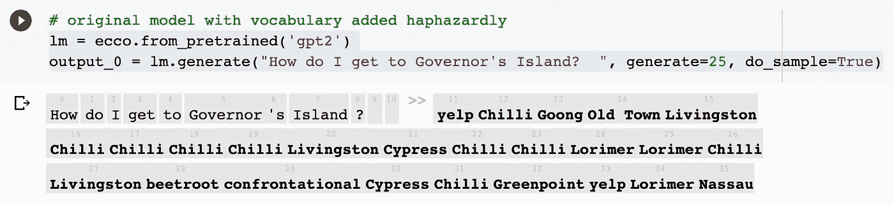

new tokens prior to re-alignment

## 微调 GPT2

我开始在[谷歌实验室](https://colab.research.google.com/drive/1FnXcAh4H-k8dAzixkV5ieygV96ePh3lR?usp=sharing)上微调 GPT2【小】。我对结果感到惊喜，这些结果通常是连贯的，有时甚至是有趣的，即使缺乏事实。

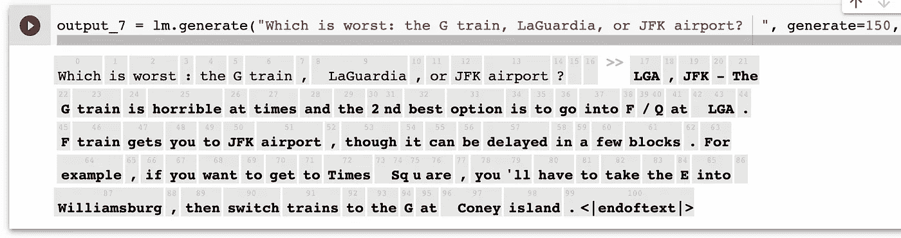

GPT on trains

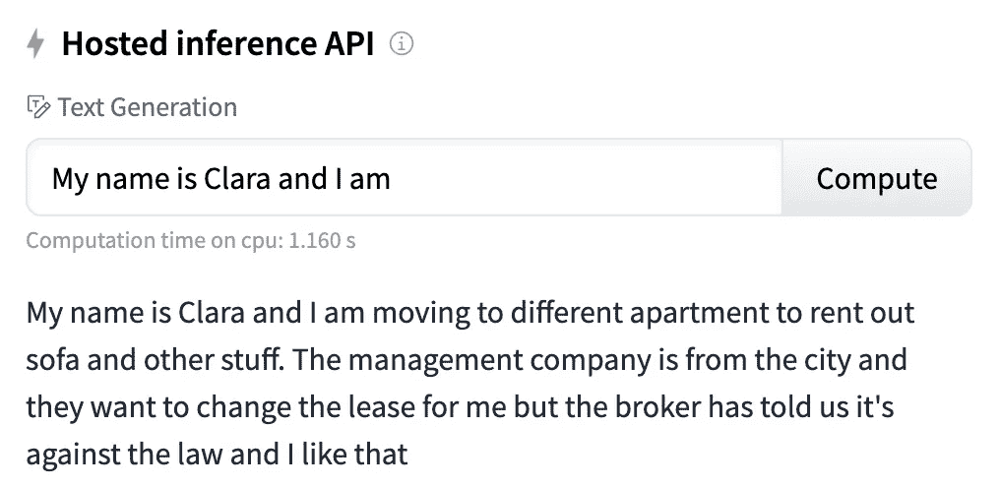

GPT on apartments

我有动力继续在一个更大的模型上工作。
我还重新设计了提示的格式:“问题—附加信息%%注释”。这避免了模型继续问题和附加信息的特定模式。

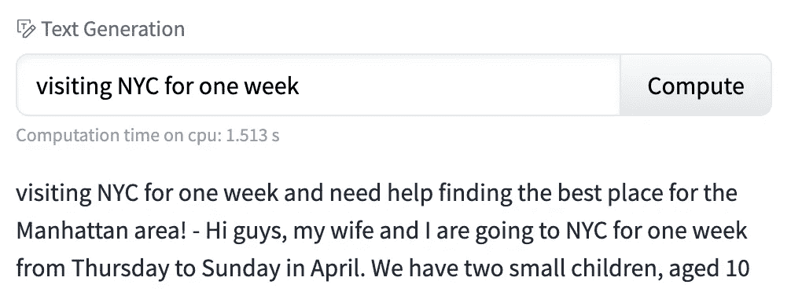

GPT continues the original question

GPT2-Medium 型号太大，无法在 CoLab GPU 上进行微调，所以我需要寻找一个 100 GPU，设备上的内存超过 16GB。训练 5 个纪元大概需要 2 个小时。这种机器在美国很短缺，所以我最终在欧盟的云中运行了这个命令。

```
gcloud compute instances create Sample --project Project --zone europe-west4-a --machine-type a2-highgpu-1g --image-family pytorch-1-6-cu110  --image-project deeplearning-platform-release  --boot-disk-size 100GB --metadata "install-nvidia-driver=True,proxy-mode=project_editors" --scopes [https://www.googleapis.com/auth/cloud-platform](https://www.googleapis.com/auth/cloud-platform) --maintenance-policy TERMINATE
```

## 结果

*   我怎么去总督岛？

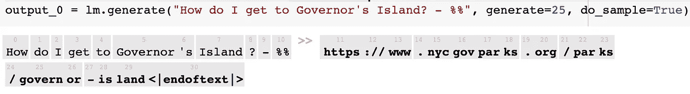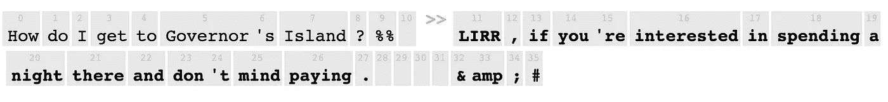

*   你住在哪里，哪里好？

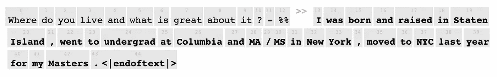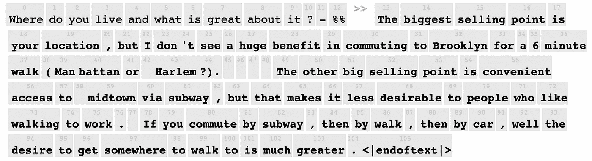

*   布什维克适合家庭/聚会吗？

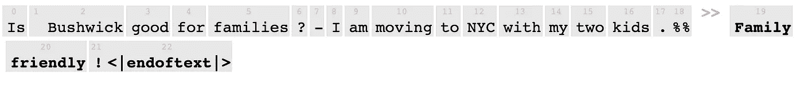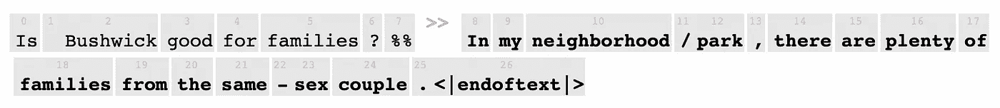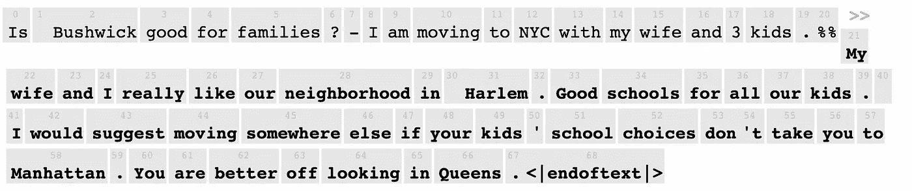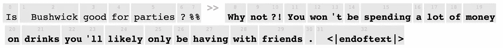

*   你多久去一次中央公园/时代广场？

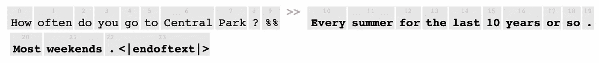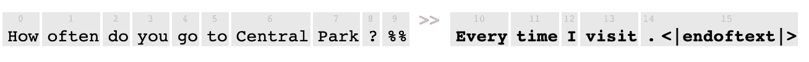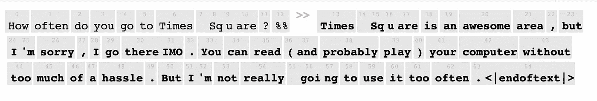

*   哪里可以吃到 dosa 之类的南印度菜？

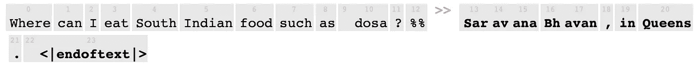

这个其实是准确的！

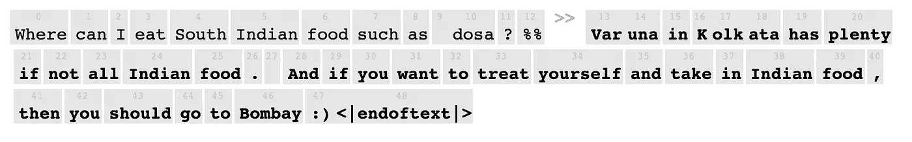

*   哪一个最糟糕:G 列车，拉瓜迪亚机场，还是 JFK 机场？

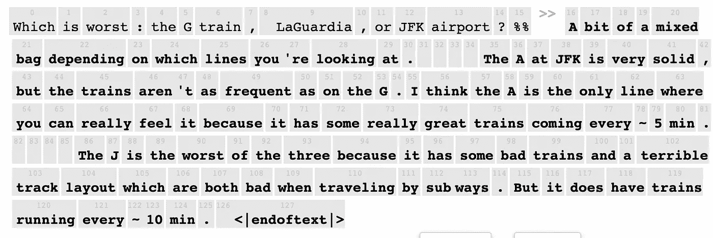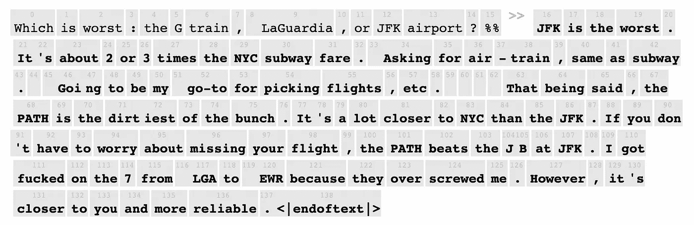

我对这些答案很满意，尽管它们似乎受到记忆和对新词汇过度感兴趣的困扰。对回答进行更严格的调查可能会发现，你没有回答最初的问题，而是给出了一些回答:重复公寓、重复食物、忽略问题(如“不”或“任何地方”)，或者记忆的网址和回答。

# 演示

您可以使用 HuggingFace 托管的推理 API 小部件亲自尝试一下。
坚持公式:`question — info %%`

【https://huggingface.co/monsoon-nlp/gpt-nyc? text = What+food+should+I+try+in+the+Bronx % 3F+% 25% 25

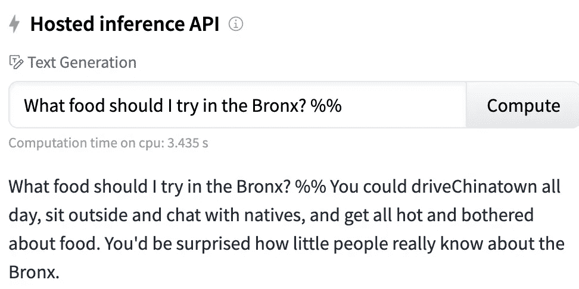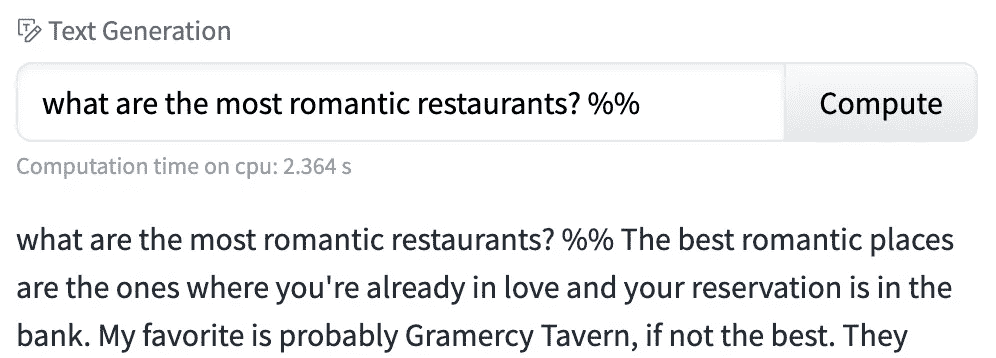