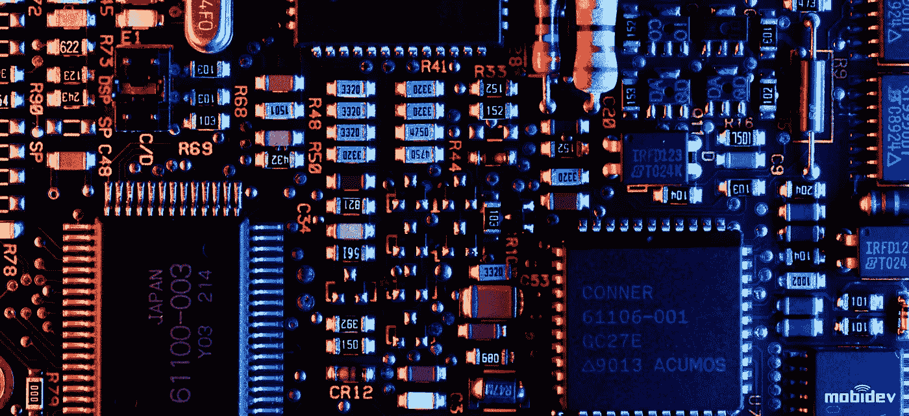
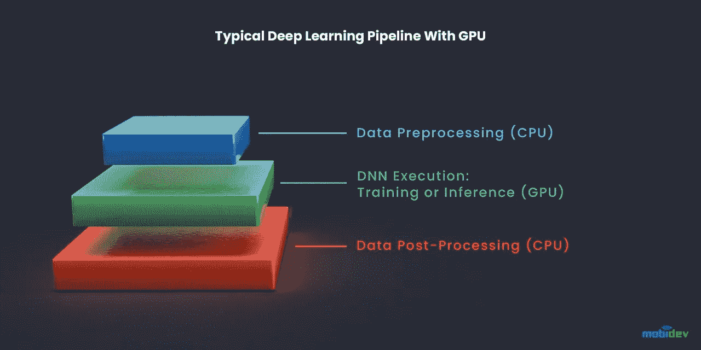

# 用于深度学习的 GPU:内部部署与云的优缺点

> 原文：<https://medium.com/geekculture/gpu-for-deep-learning-benefits-drawbacks-of-on-premises-vs-cloud-2a3e1e0e4ccf?source=collection_archive---------24----------------------->

随着技术的进步，越来越多的组织正在实施机器学习操作( [MLOps](https://www.run.ai/blog/machine-learning-operations-mlops-what-is-it-and-why-we-need-it/) )，人们正在寻找加快过程的方法。对于使用深度学习(DL)流程的组织来说尤其如此，这种流程的运行时间可能会非常长。您可以通过在内部或云中使用图形处理单元(GPU)来加速这一过程。

GPU 是专为执行特定任务而设计的微处理器。这些单元可以并行处理任务，并可以进行优化，以提高人工智能和深度学习过程的性能。

GPU 是一个强大的工具，可以通过深度神经网络来加速数据管道。使用 GPU 的第一个原因是，与价格相同的中央处理器(CPU)相比，DNN 推理在 GPU 上的运行速度快 3-4 倍。第二个原因是，减轻 CPU 的一些负载可以让您在相同的情况下做更多的工作，并降低整体网络负载。

使用 GPU 的典型深度学习管道包括:

*   数据预处理(CPU)
*   DNN 执行:训练还是推理(GPU)
*   数据后处理(CPU)

CPU ram 和 GPU ram 之间的数据传输是最常见的瓶颈。因此，构建数据科学管道架构有两个主要目标。首先是通过将几个样本(图像)聚集成一批来减少传输数据事务的数量。第二种是通过在传输之前过滤数据来减少特定样本的大小。

训练和实现 DL 模型需要使用深度神经网络(DNN)和具有成千上万个数据点的数据集。这些网络需要大量资源，包括内存、存储和处理能力。虽然中央处理器(CPU)可以提供这种能力，但使用图形处理器(GPU)可以大大加快处理速度。

# 使用 GPU 进行深度学习的主要好处

1.  **核心数量**-GPU 可以有大量的核心，可以集群，可以和 CPU 组合。这使您能够显著提高处理能力。
2.  **更高的内存**——GPU 可以提供比 CPU 更高的内存带宽(高达 750GB/s 对 50GB/s)。这使你能够更容易地处理深度学习所需的大量数据。
3.  **灵活性**-GPU 的并行能力使您能够在集群中组合 GPU，并在集群中分配任务。或者，您可以单独使用 GPU 和分配给单个算法训练的集群。

# 当使用 GPU 进行深度学习任务是不理性的

与 CPU 相比，GPU 非常快，对于许多人工智能应用程序来说，GPU 是必备的。但在某些情况下，GPU 是多余的，你至少应该暂时使用 CPU 来节省预算。

这里需要说几句 GPU 计算的成本。我们之前提到过，GPU 明显比 CPU 快，但是计算成本可能比你转用 GPU 获得的速度还要大。

因此，在开发之初，例如，在开发概念证明(PoC)或最低可行产品(MVP)时，您可以使用 CPU 进行开发和准备服务器，如果您的用户可以接受长时间的响应，您可以将 CPU 用于生产服务器，但只能使用很短的时间。

# 用于深度学习的内部 GPU 选项

使用 GPU 进行内部部署时，您有多个供应商选项。两个比较受欢迎的选择是 NVIDIA 和 AMD。

# 英伟达

NVIDIA 是一个受欢迎的选择，至少部分是因为它提供的库，被称为 [CUDA 工具包](https://developer.nvidia.com/cuda-toolkit)。这些库可以轻松建立深度学习流程，并通过 NVIDIA 产品形成强大的机器学习社区的基础。这可以从许多 DL 库和框架为 NVIDIA 硬件提供的广泛支持中看出。

除了 GPU，该公司还提供支持流行的 DL 框架的库，包括 PyTorch。Apex 库尤其有用，它包括几个融合的快速优化器，如 FusedAdam。

NVIDIA 的缺点是，它最近对 CUDA 何时可以使用进行了限制。这些限制要求库只能与 Tesla GPUs 一起使用，不能与较便宜的 RTX 或 GTX 硬件一起使用。

这对培训 DL 模型的组织有严重的预算影响。当你考虑到虽然 Tesla GPUs 并没有比其他选项提供更高的性能，但其价格却高达 10 倍时，这也是一个问题。

# 超微半导体公司

AMD 提供库，被称为 [ROCm](https://rocmdocs.amd.com/en/latest/) 。TensorFlow 和 PyTorch 以及所有主要的网络架构都支持这些库。然而，对发展新网络的支持是有限的，社区支持也是如此。

另一个问题是，AMD 对其深度学习软件的投资没有英伟达多。因此，除了较低的价格点之外，AMD GPUs 与 NVIDIA 相比提供的功能有限。

# 使用 GPU 的云计算

在培训 DL 模型的组织中，一个越来越受欢迎的选择是使用云资源。这些资源可以结合优化的机器学习服务，提供对 GPU 的按使用付费访问。三大提供商都提供 GPU 资源和大量配置选项。

# 微软 Azure

微软 Azure 为 GPU 访问授予了各种实例选项。这些实例已经针对高计算任务进行了优化，包括可视化、模拟和深度学习。

在 Azure 中，有三个主要系列的实例可供选择:

1.  **NC 系列**-针对网络和计算密集型工作负载优化的实例。例如，基于 CUDA 和 OpenCL 的模拟和应用。实例基于 NVIDIA Tesla V100、英特尔 Haswell 或英特尔 Broadwell GPUs 提供高性能。
2.  **ND 系列**-针对深度学习的推理和训练场景优化的实例。实例提供对 NVIDIA Tesla P40、英特尔 Broadwell 或英特尔 Skylake GPUs 的访问。
3.  **NV 系列**-针对虚拟桌面基础架构、流、编码或可视化进行优化的实例，支持 DirectX 和 OpenGL。实例提供对 NVIDIA Tesla M60 或 AMD 镭龙 Instinct MI25 GPUs 的访问。

# 亚马逊网络服务(AWS)

在 AWS 中，您可以从四个不同的选项中进行选择，每个选项都有各种各样的实例大小[。选项包括 EC2 P3、P2、G4 和 G3 实例。这些选项使您能够在 NVIDIA Tesla V100、K80、T4 张量或 M60 GPUs 之间进行选择。根据具体情况，您最多可以扩展到 16 个 GPU。](https://docs.aws.amazon.com/dlami/latest/devguide/gpu.html)

为了增强这些实例，AWS 还提供了 Amazon Elastic Graphics，这是一种使您能够将低成本 GPU 选项附加到 EC2 实例的服务。这使您能够根据需要将 GPU 用于任何兼容的实例。该服务为您的工作负载提供了更大的灵活性。Elastic Graphics 支持 OpenGL 4.3，并可提供高达 8GB 的图形内存。

# 谷歌云

谷歌云使你能够将 GPU 附加到现有的实例上，而不是专用的 GPU 实例。例如，如果您使用 Google Kubernetes 引擎，您可以创建访问一系列 GPU 的节点池。其中包括 NVIDIA Tesla K80、P100、P4、V100 和 T4 GPU。

谷歌云还提供张量流处理单元( [TPU](/sciforce/understanding-tensor-processing-units-10ff41f50e78) )。该单元包括多个设计用于执行快速矩阵乘法的 GPU。它提供了与启用张量核心的 Tesla V100 实例相似的性能。TPU 的优势在于它可以通过并行化节省成本。

每个 TPU 相当于四个 GPU，支持相对较大的部署。此外，PyTorch 现在至少部分支持 TPU。

# 2021 年深度学习任务最好的 GPU 是什么？

到了选择基础架构的时候，您需要在内部部署和云方法之间做出选择。云资源可以显著降低构建 DL 基础架构的财务障碍。

这些服务还可以提供可伸缩性和提供商支持。然而，这些基础设施最适合短期项目，因为持续的资源使用会导致成本激增。

相比之下，内部基础架构的前期成本更高，但为您提供了更大的灵活性。你可以用你的硬件在一个稳定的成本下，在一段时间内做你想做的实验。您还可以完全控制您的配置、安全性和数据。

对于刚刚起步的组织来说，云基础架构更有意义。这些部署使您能够以最少的前期投资开始运行，并让您有时间来完善您的流程和要求。但是，一旦您的业务发展到足够大的规模，就可以选择切换到内部部署。

# MobiDev 使用 GPU 进行人工智能训练

我们的人工智能团队拥有巨大的计算资源，如一组 V100 GPUs。所有这些 GPU 都可以通过我们的内部计算服务访问。

计算服务只是一台安装了大量磁盘空间、RAM 和 GPU 并运行 Linux 的计算机。我们使用这项服务来训练人工智能解决方案和进行研究。

通常情况下，传统的深度学习框架像 Tensorflow、Pytorch 或 ONNX 都不能直接访问 GPU 核来解决其上的深度学习问题。在人工智能应用和 GPU 之间有许多复杂的特殊软件层，如 CUDA 和 GPU 的驱动程序。

在一个过于简化的模式中，它可以如下所示。

即使在一组人工智能工程师使用这样的计算服务构建的情况下，该模式看起来也是合法和健壮的。

但在人工智能软件开发的现实生活中，新版本的人工智能应用程序、人工智能框架、CUDA 和 GPU 驱动程序不断涌现。而且经常出现软件的新版本与旧版本不兼容的情况。例如，我们必须在我们的计算服务上使用与当前版本 CUDA 不兼容的新版本 AI 框架。在这样的情况下，我们该怎么办？我们应该更新 CUDA 吗？

毫无疑问，我们不能这样做，因为其他一些人工智能工程师的项目需要旧版本的 CUDA。这就是问题所在。

所以，问题是我们不能像在其他系统上一样，在我们的计算服务中安装两个不同版本的 CUDA。如果我们可以做一些小把戏，神奇地将我们的应用程序彼此隔离，使它们不接触彼此，并且不知道彼此的存在，那会怎么样？谢天谢地，现在我们确实有这样一个窍门！这个技巧的名字叫停靠化技术。

我们使用 *Docker* 和 *nvidia-docker* 来包装人工智能应用以及所有必要的依赖，如人工智能框架和适当版本的 CUDA。这种方法使我们能够在同一台计算服务机器上维护不同版本的 Tensorflow、Pytorch 和 CUDA。

人工智能解决方案 dockerization 的简单模式如下所示。

# 结论

为了快速前进，机器学习工作负载需要高处理能力。与 CPU 相反，GPU 可以提供更高的处理能力、更高的内存带宽和并行能力。

您可以在内部或云中使用 GPU。流行的本地 GPU 包括 NVIDIA 和 AMD。基于云的 GPU 可以由许多云供应商提供，包括前三名——Azure、AWS 和 Google Cloud。在选择内部部署和云 GPU 资源时，您应该考虑预算和技能。

内部资源通常会带来很高的前期开销，但从长期来看，成本会保持稳定。但是，如果您没有操作内部资源的必要技能，您应该考虑云产品，云产品更容易扩展，并且通常带有托管选项。

由 [Evgeniy Krasnokutsky，](https://mobidev.biz/our-team/evgeniy-krasnokutsky) AI/ML 解决方案架构师在 [MobiDev](https://mobidev.biz/services/machine-learning-consulting) 撰写。

*全文原载于*[*https://mobidev . biz*](https://mobidev.biz/blog/gpu-deep-learning-on-premises-vs-cloud)*，基于 mobi dev 技术研究。*