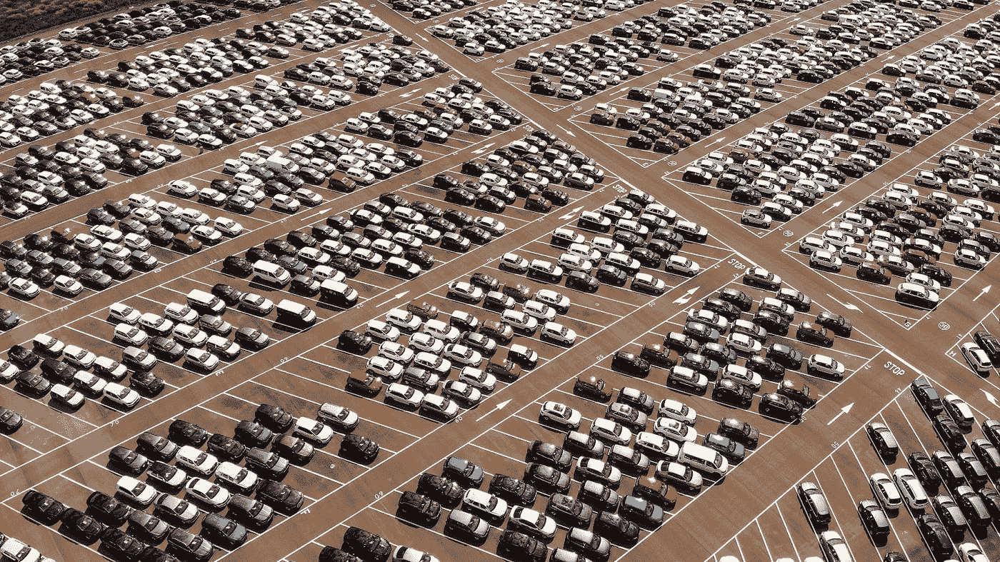
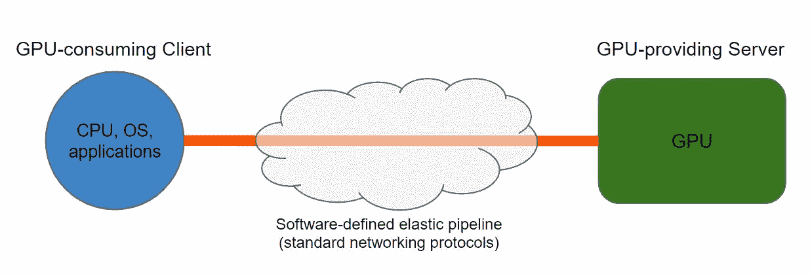
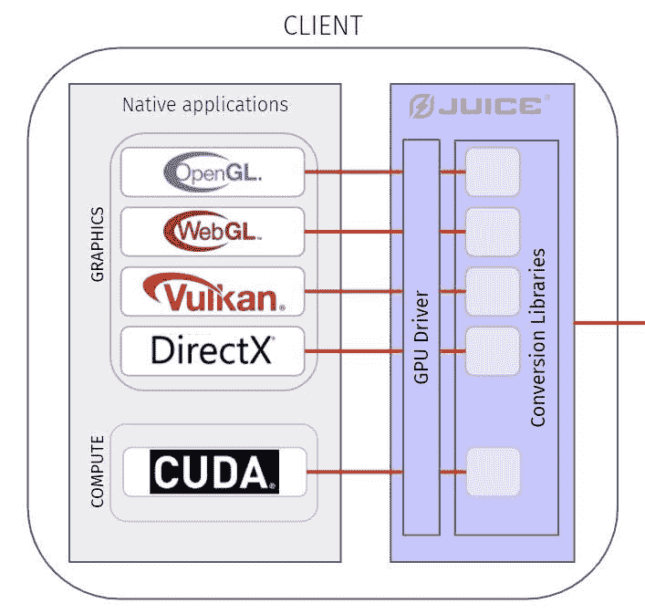
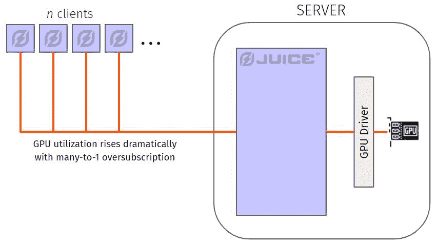
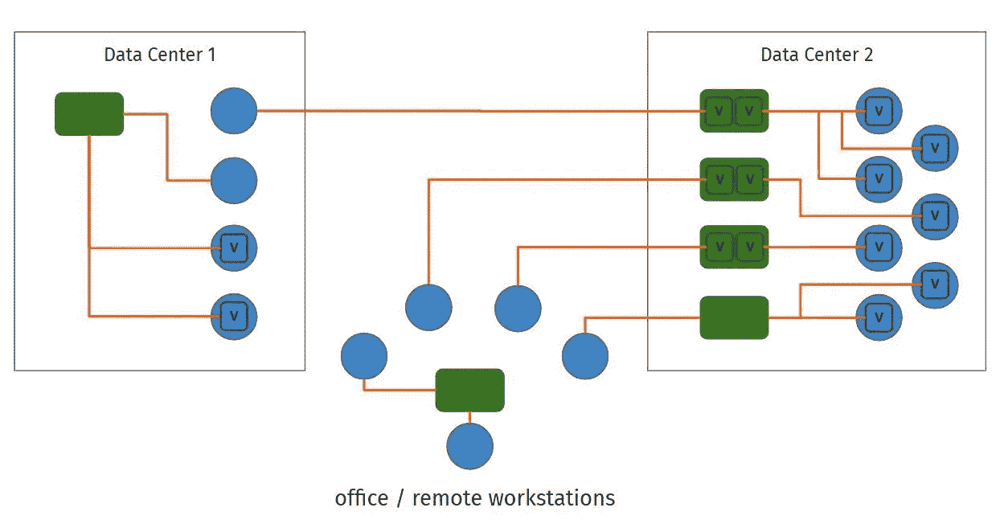

# GPU 应该像电一样不费力

> 原文：<https://medium.com/geekculture/gpu-should-be-as-effortless-as-electricity-a7613df102d7?source=collection_archive---------26----------------------->

将加速计算想象成一种简单、经济的远程服务

本文是三篇系列文章中的第三篇。这里有 [*1*](/swlh/the-crisis-in-computing-how-a-looming-processing-pinch-could-make-or-break-the-global-economy-856956756df4) *和* [*2*](https://towardsdatascience.com/the-hidden-world-of-gpu-inefficiency-776ae1c9cf5) *。*

The world’s GPU capacity is mostly on standby — Photo by [Jen Theodore](https://unsplash.com/@jentheodore?utm_source=unsplash&utm_medium=referral&utm_content=creditCopyText) on [Unsplash](https://unsplash.com/s/photos/dial?utm_source=unsplash&utm_medium=referral&utm_content=creditCopyText)

G PU 加速计算是新兴技术的关键资源，但[宏观趋势指向容量短缺](/swlh/the-crisis-in-computing-how-a-looming-processing-pinch-could-make-or-break-the-global-economy-856956756df4)。高价自然随之而来。

一般来说，现代计算环境是围绕灵活性构建的，包括虚拟机、容器、网络连接存储、软件定义的网络。但 GPU 和其他加速器仍然顽固僵化，将它们整合到动态基础设施中既麻烦又受限制。

因此，尽管 GPU 是一个越来越昂贵的组件，但今天的限制使我们今天的 GPU 容量的整体利用率保持在大约 10-15%*。*

这个[“GPU 低效率的隐藏世界”](https://towardsdatascience.com/the-hidden-world-of-gpu-inefficiency-776ae1c9cf5)并不是一个被广泛讨论的话题。

## **对 GPU 未充分利用的讨论不足**

为什么这几乎是秘密？

**理由 1:** 商业组织内部的实际社会动力，这是[蒂莫西·普里克特·摩根在这里提到的](https://www.nextplatform.com/2020/11/17/counting-the-cost-of-under-utilized-gpus-and-doing-something-about-it/):

> “……[GPU]效率低下即使谈得不多也一直被容忍。没有人会告诉首席执行官或首席财务官，一台理论性能达到令人印象深刻的峰值的超级计算机实际上没有得到充分利用。

想象一下对话会如何进行:

IT 主管:你知道我们在 GPU 上花了很多钱吗？我们需要更多。事实上，在接下来的几年里，我们需要继续增加在 GPU 上的支出，以支持商业计划。

首席财务官:哎哟。我无法证明这一切。你可以得到你想要的一半。

IT 主管:[开始走开]顺便说一下，我们的 GPU 只有 10-15%的利用率。但我对此无能为力，事情就是这样。

财务总监:你被解雇了。

**原因 2:** 技术限制的现状，即“对此我无能为力，事情就是这样”。

我们很少在一个没有可想象的解决方案的问题上花费精力。这就像在我们学会如何生火之前，早期人类抱怨“晚上好黑”。夜晚的黑暗*只是*，GPU 利用不足*只是*——因为一个有望打破现状的解决方案刚刚出现。

## **质疑紧耦合的现状**

回顾一下上次[的内容](https://towardsdatascience.com/the-hidden-world-of-gpu-inefficiency-776ae1c9cf5)，GPU 利用率的主要限制是 PCIe 的短皮带。应用程序空间和加速该应用程序的 GPU 之间的这种物理限制使得潜在的资源平衡池基本为零。

我们都知道汽车的发动机是其最有价值的部件之一——我们也知道此刻在我们周围一英里内可能有成千上万的汽车发动机闲置着。这无疑是一种巨大的浪费，但一辆汽车的引擎与汽车的其他部分是一对一锁定的，这是一个不容置疑的现实。

如果我说“你应该买一辆没有引擎的车——有足够的汽车加速能力闲置不用！”你顶多会高度怀疑。

So much underutilized acceleration capacity! — Photo by [Carles Rabada](https://unsplash.com/@carlesrgm?utm_source=unsplash&utm_medium=referral&utm_content=creditCopyText) on [Unsplash](https://unsplash.com/s/photos/parking-lot?utm_source=unsplash&utm_medium=referral&utm_content=creditCopyText)

要打破 GPU 一对一的锁定模式，需要类似的想象力飞跃。

但我要说的是，这个世界——包括你和你的公司——确实将使用更少的引擎(GPU)运行更多的汽车(驱动商业价值的 GPU 密集型应用)，从而使我们的团队能够创造更多的商业价值。

怎么会？我们将使 GPU 可池化、可共享、易于访问。

为了使这种变革可行，我们的解决方案**必须做**四件事:

1.  挣脱 PCIe 的短皮带
2.  提供与正常 GPU 使用无法区分的功能
3.  允许多个工作负载使用同一个 GPU
4.  仅使用软件

以下是为什么这些是必须做的事情:

1.  **挣脱 PCIe**

如果不消除应用程序主机和 GPU 之间的紧密耦合，我们就无法支持网络上的远程访问，也无法创建可行的(大型)容量提供商和容量消费者池来实现最大程度的资源平衡，从而实现高利用率。

**2。*从应用的角度来看*是一个 GPU**

想象一下，我们的技术不像普通的 GPU 那样工作，而是带有缺陷:它只适用于一些 API，只适用于一些操作系统，只作为特定的大型部署环境的一部分，它需要复杂的设置和维护，使用它的应用程序必须实现一个 SDK…你明白了吧。这些问题中的任何一个都会使它成为一个受限的“点解决方案”,并使它陷入一种狭隘的生存状态——没有使它无处不在并具有高价值的普遍适用性。

**3。超额订阅具有多个工作负载的 GPU**

如果我们只是扩展 GPU 的范围，我们仍然可以通过允许“瘦”客户端访问远程 GPU 来解决一个有趣的问题。但是，如果我们不允许许多消耗 GPU 的客户端使用同一个提供 GPU 的服务器，我们就无法通过叠加峰值工作负载来提高利用率——在利用率图中留下低效的空白。

**4。仅软件**

如果我们的解决方案涉及硬件，那么测试、交付或部署就不容易。它更有可能局限于某个设备、操作系统、环境或芯片供应商。作为一个产品，开发和迭代会比较慢。最后，建造和交付每一个额外单元的成本将会很高，这将很难找到对我们自己和我们的客户都有利的价格点。

因此，我们已经确定了趋势、问题，以及理想的解决方案必须提供什么——我们实际上*要建造什么*？当然，我有偏见，但我们觉得果汁实验室的道路是正确的。我们的解决方案:

***挣脱 PCIe:***

**将 PCIe 连接器**替换为使用标准网络的软件定义的弹性管道，从而将客户端(需要 GPU 的操作系统+应用空间)与服务器(提供 GPU 能力的服务器)分离

为了使我们的管道具有高性能，我们使用压缩和(在可能的情况下)缓存来显著减轻通过管道的数据负载。

***【Be】一个 GPU:***

**用我们自己的“看起来相同”的可安装驱动程序替换客户端上常见的 GPU 驱动程序**——让操作系统+应用程序空间与 GPU 通信的软件——而是将工作负载路由到我们的管道。

在我们的驱动程序和管道中支持所有常见的图形和计算 API，应用程序可能会使用它们与 GPU 进行通信。

***每台服务器多个客户端:***

在我们的服务器安装中构建逻辑，允许服务器 GPU 服务多个客户端。

***仅软件:***

请注意，我们没有引入任何新硬件！我们这里什么都没有。

## 实现这一愿景

将所有这些部分放在一起，我们提供了一个嵌入式、无代码、无附加硬件的解决方案，允许本地应用程序从任何地方访问他们需要的 GPU 在任何操作系统上，在任何部署环境中；适用于任何设备、计算机或数据中心；在云中、内部或边缘—同时汇集和共享容量，以提高接近 100%的利用率。

我们相信这种模式将变得普遍，不仅仅是让公司能够在更大规模的部署中推动更多的商业价值:

A wide pool of virtual or physical clients (blue) served dynamically by virtual or physical GPU servers (green)

…但是实际上加速计算在任何地方都是有用的，比如在移动和物联网的边缘:

在这个前所未有的访问和效率的新世界中，僵化和费用消失了，GPU 容量成为一种高效、易于访问、负担得起的实用工具。

*史蒂夫·戈利克是* [*果汁实验室*](https://www.juicelabs.co/) *的联合创始人，这是一家初创公司，其愿景是让计算能力像电力一样容易流动。*