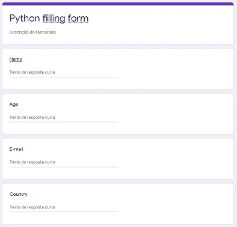
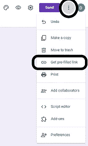
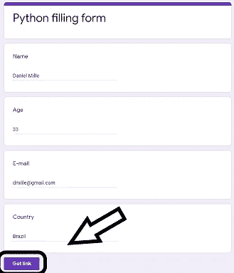
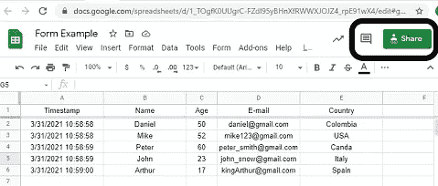
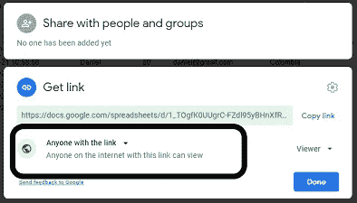
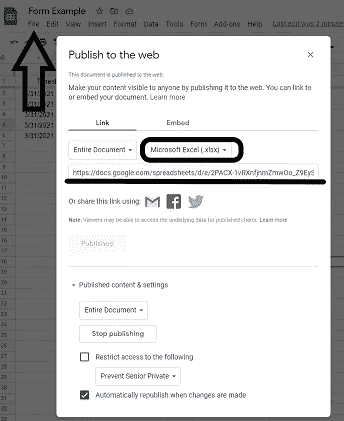

# 喝杯咖啡，让 Python 为您填表

> 原文：<https://medium.com/geekculture/grab-a-coffee-and-let-python-fill-out-a-form-for-you-79c141702a5e?source=collection_archive---------14----------------------->

Photo by [Nathan Dumlao](https://unsplash.com/@nate_dumlao?utm_source=medium&utm_medium=referral) on [Unsplash](https://unsplash.com?utm_source=medium&utm_medium=referral)

有多少次**你让自己陷入了一个彻底又极其无聊的任务**中，从谷歌表单(或 excel 文件)中提取信息，然后将部分信息插入另一个谷歌表单？

这种任务让你的日子**变得无聊**，你上班第一天的兴奋开始*消退……*
你认为你可以从事**更具挑战性的任务**，或者你可以**发展新技能或学习新东西！**

为了**摆脱这种无聊的东西**，让一个简单的`for loop`为你执行工作！！

在这篇文章中，我将详细展示如何使用 Python 语言自动填写一个 Google 表单(然后在 Google 表单上打开它)。此外，我将展示如何使用`pandas.`来阅读 Google 表单

# 如何自动填写谷歌表单

自动填写 google 表单的第一步是创建一个包含必须填写的字段的 google 表单。(表单问题必须用相应的数据类型表示 google 表单上的列)。
下面你可以看到一个有 4 个问题的谷歌表单，代表我的谷歌表单的列。(姓名、年龄、电子邮件、国家)

之后，您需要创建一个预填充的链接。为此，在屏幕右上方转到“更多选项”菜单，然后单击“获取预填链接”按钮，如下所示:

下一步，您需要在表单中填写代表每个问题的信息，您插入的信息将用于识别哪个是该问题的“条目”,稍后我将对此进行解释。填写完表格后，在页面末尾点击“获取链接”并复制链接。

您复制的链接将与我自己创建的链接具有相同的结构:

[https://docs . Google . com/forms/d/e/1 faipqlsd 6 mtytunor 3 hmjstmvrizm 8 w 0 ubfy 06 zx 5 ZC-5 db 95 w0 ihpa/view form？USP = PP _ URL&entry . 316027912 = Daniel+Mille&entry . 272409573 = 33&entry.779187075=dmille@gmail.com&entry . 1382791830 =巴西](https://docs.google.com/forms/d/e/1FAIpQLSd6mtyTunOr3hmJstMVRIZm8W0UbfY06zx5ZC-5dB95w0ihPA/viewform?usp=pp_url&entry.316027912=Daniel+Mille&entry.272409573=33&entry.779187075=dmille@gmail.com&entry.1382791830=Brazil)

让我们把这个网址分成几部分吧！
让我们把出现在“/视图表单”之前的所有东西都叫做`base_url`。这样我的`base_url`是:
[https://docs . Google . com/forms/d/e/1 faipqlsd 6 mtytunor 3 hmjstmvrizm 8 w0 ubfy 06 zx5 ZC-5 db 95 w0 ihpa](https://docs.google.com/forms/d/e/1FAIpQLSd6mtyTunOr3hmJstMVRIZm8W0UbfY06zx5ZC-5dB95w0ihPA/viewform?usp=pp_url&entry.316027912=Daniel+Mille&entry.272409573=33&entry.779187075=dmille@gmail.com&entry.1382791830=Brazil)

请注意，在 URL 中，每个条目都有各自的标识号，旁边是我们在预填充链接中填充的值。例如，条目编号 316027912 代表我们表单上的名称字段答案(Daniel+Mille)。我们将使用这些 id 来实现 Python 的自动化。

让我们检查代码！

我们将要使用的图书馆是`pandas`和`requests`。首先，我创建了一个名为`post_form`的函数，它将接收我们的`base_url`和一个`dictionary`作为参数，包含作为键的条目和作为值的数据帧信息。该函数将返回一个在`base_url`上发布字典信息的请求。

在代码的顶部有我们的`base_url`。在第二部分，我创建了一个数据框架，其中包含我们将在 google 表单上发布的信息，如果您已经有了一个包含您要发布的信息的 excel 文件，您不需要自己创建数据框架，只需使用您的 excel/csv 文件即可。

在代码的底部，我使用了`pandas iterrows`来遍历我们的数据帧，并使用每行的信息来执行`post_function`。请注意，该函数的第二个参数是一个字典，其中包含预填充链接的四个 id 以及来自 dataframe 行的相应值。

**恭喜你！来自数据框的所有信息都发布在表单上，你可以随时通过谷歌表单访问它！**

# 如何阅读带有熊猫的谷歌图片

通过 pandas 读取 google 工作表的方法是使用 read_excel 执行的(与读取 xlsx 文件的方式相同)。不同之处在于，您将使用 google sheet url，而不是使用文件路径作为参数。

要做到这一点，谷歌表单必须首先发布到网络上或用户面前。为了说明这一点，我将阅读一份公开的谷歌表单(确保你不会公开包含敏感信息的谷歌表单！拥有 url 的每个人都可以访问该信息)

要发布您的 google 表单，请在屏幕右上方点击共享按钮，如下图所示:

然后，在“获取链接”字段切换到“任何有链接的人”:

最后一步是发布到网络上。在*文件*上选择*“发布到 web”*选项，然后选择文件扩展名并发布！这个 url 就是我们要传递的参数，用来用`pandas`读取这个文件

现在你的 google sheet 已经在网上公开了，使用带有 google sheet url 的`read_excel`和`pandas`来浏览你的数据吧！

# 最后的想法

小心你发布到网络上的信息！
任何拥有该链接的人都可以访问您的 google 表单上的信息。我公开了我的电子表格来展示代码是如何工作的，但是你可以把你的电子表格限制在你的组织中的人或者仅仅是授权的人！

我希望你喜欢这篇文章，并且你可以摆脱那些来回的工作！

如果你喜欢这篇文章，请毫不犹豫地鼓掌！如果你有任何疑问或要求，请随时使用评论！