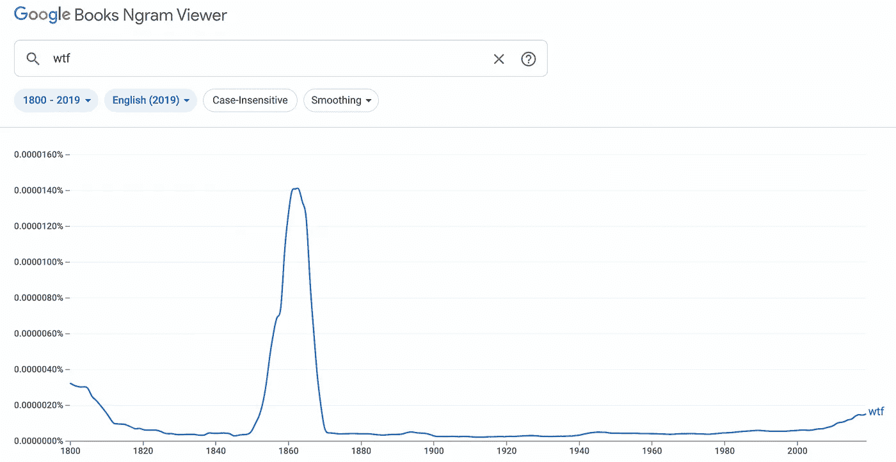
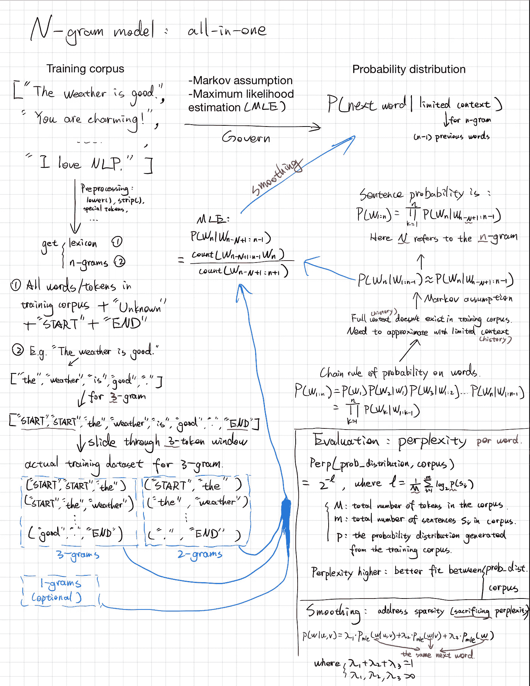

# 抓起就走系列:n 元模型

> 原文：<https://medium.com/geekculture/grab-and-go-series-n-gram-model-8703279c70cb?source=collection_archive---------13----------------------->

## 在一张幻灯片中实现 n 元模型。

Obviously, people were very confused about everything around 1860:)

首先，Google n-gram 是在 1500 年到 2019 年的所有书籍上训练的 n-gram 模型。看看历史上人们是怎么说的。

## 背景

为单词序列分配概率的模型被称为语言模型或 LMs。本文介绍了最简单的 LM: n-gram 模型，包括概念和实现。

我制作了一张幻灯片来回答以下问题:

1.  训练一个 N 元模型需要什么？
2.  N 元模型的最终结果是什么？
3.  用什么概念来近似下一个单词的概率？

要看我在幻灯片中的演示，请点击 **youtube** 链接[这里](https://www.youtube.com/watch?v=lQi3lGWzC4g)。

此外，在我的 **Github** 上抓取 jupyter 笔记本，自己尝试一下:[链接](https://github.com/jink1994/NLPforAll)。

One slide to understand N-gram models.

## n-gram 的优点

*   对于短句建模，它仍然非常强大。比如在[查询扩展](https://en.wikipedia.org/wiki/Query_expansion)的应用中就得心应手。
*   这是可以解释的:你直接从你的训练语料中得到条件概率。
*   重新训练模型并不会花你很多钱。

## 主流程

*   得到一个训练语料库，是句子的列表。
*   基于训练语料库生成词典和 n 元语法元组的集合。
*   用最大似然估计计算 n 元概率。
*   困惑地评估并生成您的句子！

## 参考

*   我的 Github—[https://github.com/jink1994/NLPforAll](https://github.com/jink1994/NLPforAll)
*   展示这张幻灯片的 youtube 视频—[https://www.youtube.com/watch?v=lQi3lGWzC4g](https://www.youtube.com/watch?v=lQi3lGWzC4g)
*   NLP I.M.O .最佳教程——[https://web.stanford.edu/~jurafsky/slp3/3.pdf](https://web.stanford.edu/~jurafsky/slp3/3.pdf)