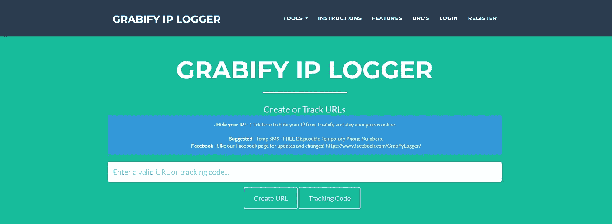

# Grabify: IP 日志和网址缩写——跟踪人们的位置

> 原文：<https://medium.com/geekculture/grabify-ip-logger-url-shortener-track-people-location-c4e489b25627?source=collection_archive---------13----------------------->

Grabify 是由 jLynx 创建的基于 web 的项目，可以使用任何浏览器访问。虽然你不必注册一个帐户来使用 Grabify，但它是免费的，而且在这样做之后还有一些额外的选择。万一你喜欢 Grabify，你可能会喜欢 jLynx 的一些不同的冒险，所以试着看看那些在 *"https://jlynx.net/"上的*