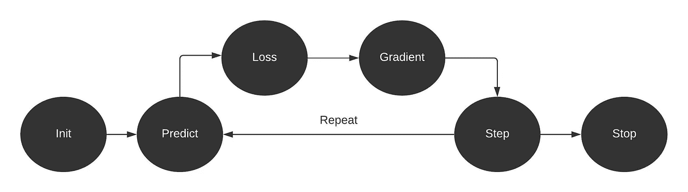
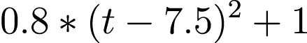
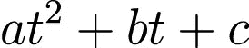
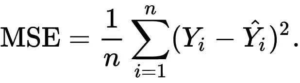
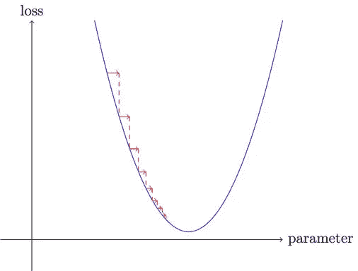

# 梯度下降:设计你的第一个机器学习模型

> 原文：<https://medium.com/geekculture/gradient-descent-design-your-first-machine-learning-model-ad431cb9295f?source=collection_archive---------22----------------------->

使用 Pytorch 从头开始构建一个简单的机器学习模型。

Image by [mygreatlearning](https://www.mygreatlearning.com/blog/gradient-descent/)

梯度下降是一种优化算法，用于训练机器学习模型，现在用于神经网络。训练数据有助于模型随着时间的推移进行学习，因为梯度下降作为一个自动系统，可以调整参数以实现更好的结果。这些参数在每次迭代后更新，直到函数达到最小的可能误差。IBM

下图中的红色箭头是一个梯度，通过在每次迭代后更新我们的参数，我们可以减少损失，这是我们的主要目标。

Edited by Author | Original [Fast.AI](https://console.paperspace.com/tema658q6/notebook/rh2lioxu5no44hu?file=04_mnist_basics.ipynb)

根据 Arthur Samuel 的说法，梯度下降是改变权重以最大化性能的自动处理[快速人工智能](https://course.fast.ai/videos/?lesson=4)。更具体地说，我们将讨论他处理的将功能转化为机器学习模型所需的每一步。

*   **初始化:**我们将参数初始化为随机值。这些初始权重是我们模型的起点，因此我们可以通过使用损失函数来确定我们离目标有多远。
*   **Loss:** 我们需要一个函数，它将采用实际值和预测值来计算误差度量。最常见的损失函数是均方误差。
*   **步骤:**我们将通过增加或减少少量重量来检查体重是增加还是减少，从而找出最佳效果。这种方法效率不高，因为找到正确的方向需要时间。这就是梯度拯救我们的地方。梯度减缓了我们找出我们应该在哪个方向改变权重以获得更好的结果。我们通过函数传递初始权重来预测值，并使用它来计算损失。然后我们取参数的梯度，从原始参数中减去。这个过程重复进行，直到你取得最好的成绩。
*   **停止:**我们需要决定训练模型需要多少个历元。之后这些迭代就会告一段落。

Image by Author | Lucid Chart of Gradient Descent

# 密码

代码受到杰瑞米·霍华德深度学习课程 [Paperspace + Fast 的影响。AI](https://console.paperspace.com/tema658q6/notebook/rh2lioxu5no44hu?file=04_mnist_basics.ipynb) 。我们将使用 [Pytorch](https://pytorch.org/) 进行建模，使用 [Pyplot](https://matplotlib.org/stable/tutorials/introductory/pyplot.html) 进行可视化。最后设置人工种子重现结果。如果您使用的是 Deepnote 环境，您可以复制并粘贴我的代码来获得相同的结果。

## 创造价值

**X** 一个从 0 到 19 的整数序列。我们可以使用`torch.arrange(start,end)`来生成

**Y** 用二次函数计算。我们在代码中添加了**随机噪声，使其看起来像真实数据。**

## 核心功能

找到一个符合我们观察的函数。我们使用一般的二次函数[因为很难考虑所有可能的函数。](https://en.wikipedia.org/wiki/Quadratic_equation)

我们的函数有两个参数， **t** & **params。**梯度下降将改变这些参数以提高我们模型的性能。

我们将使用均方差(MSE)作为损失函数，均方根误差(RMSE)作为性能指标。MSE 是通过计算预测值和实际值之间差值的平均平方来计算的。

**学习率**是一个步长，用于在每次迭代中更新参数，同时使损失最小化。如果学习率太低，将需要许多步骤才能得到最好的结果，另一方面，如果你选择太高，它可能会反弹而不是发散。最佳实践是从小处开始，然后在每次运行后改变它，以实现最小损失。

Edited by Author | Original [Fast.AI](https://console.paperspace.com/tema658q6/notebook/rh2lioxu5no44hu?file=04_mnist_basics.ipynb)

使用`torch.randn(3)`设置初始权重，并告诉 PyTorch 我们想要使用`requires_grad_`跟踪它们的梯度。其次，我们将学习率设置为 1e-5。最后，我们需要创建原始参数的克隆，以便我们可以在以后使用它来展示准确性度量。

## 形象化

可视化功能比较预测值和实际值的散点图。

让我们将初始参数添加到我们的函数中，并尝试使用`matplotlib.pyplot`来预测输出和绘图。正如我们所看到的，两者走向相反的方向。接下来，我们将使用梯度下降，以减少两个函数之间的差异。

## **机器学习模型**

我们将使用 Arthur Samuel 机器学习模型来自动改变参数以减少损失。

1.  使用函数初始化权重
2.  计算损失
3.  使用 parameters.required_grads_ 允许我们回调损失，然后帮助我们计算参数的梯度。
4.  通过乘以学习率然后减去原始参数来计算参数的梯度。
5.  重置参数的梯度
6.  打印 RMSE
7.  回报预测

让我们运行 6 次迭代，并将结果作为实际值和预测值之间的比较。正如我们可以看到的，随着每一次迭代，预测函数的红色散点图正在慢慢模拟我们的实际函数。

现在我们需要使用`orig_params`重置我们的参数。我们将运行 10 次迭代并打印出 RMSE。正如我们可以看到的，在第四次迭代之后，RMSE 度量稳定并且缓慢降低。

# 结论

我曾经认为，你可以在不深入机制的情况下建立机器学习模型，事实证明，我的策略有缺陷，因为我局限于现有的模型和库。如果你想创建自己的尖端深度学习模型，你需要学习神经网络如何工作的机制。你不需要学习数学，但是学习最小的构建模块将会帮助你创建你的模型，它甚至会比现有的模型表现得更好。

在本教程中，我们已经了解了梯度体面如何在深度学习中工作，并通过使用亚瑟塞缪尔的原始框架，我们已经产生了我们的模型，并在该模型上训练我们的数据。我们还通过比较可视化和 RMSE 度量分数来评估我们的结果。

# 学习资源

*   [程序员实用深度学习|程序员实用深度学习(fast.ai)](https://course.fast.ai/)
*   [针对拥有 Fastai 和 PyTorch 的程序员的深度学习:没有博士学位的 ai 应用:Howard、Jeremy、Gugger、Sylvain](https://www.amazon.com/Deep-Learning-Coders-fastai-PyTorch/dp/1492045527)
*   [深度学习 PyTorch 全程/教程— YouTube](https://www.youtube.com/watch?v=GIsg-ZUy0MY)

> 你可以在 [LinkedIn](https://www.linkedin.com/in/1abidaliawan/) 和 [Polywork](https://www.polywork.com/kingabzpro) 上关注我，我在那里发布了关于数据科学和机器学习的惊人文章。

***本文中显示的媒体不归 Analytics Vidhya 所有，由作者自行决定使用。***

*相关*

*原载于 2021 年 8 月 23 日*[*【https://www.analyticsvidhya.com】*](https://www.analyticsvidhya.com/blog/2021/08/gradient-descent-design-your-first-machine-learning-model)*。*