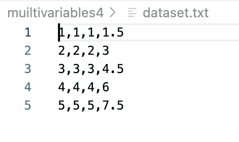
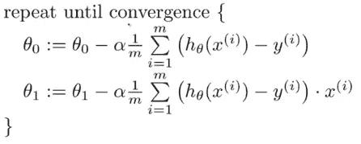
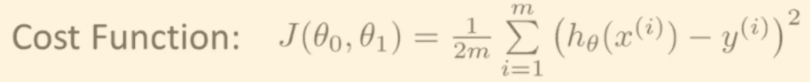

# Matlab/Octave 中的梯度下降

> 原文：<https://medium.com/geekculture/gradient-descent-in-matlab-octave-954160e2d3fa?source=collection_archive---------6----------------------->

你已经读过一些关于线性回归的知识。在机器学习的世界里，这是最常用的方程式之一，而且理由充分。

**线性回归**是一种基于监督**学习**的**机器学习**算法。它执行一个**回归**任务。**回归**基于独立变量对目标预测值进行建模。… **线性回归**根据给定的自变量(x)执行预测因变量(y)的任务。

那么，在 Matlab / octave 中运行梯度下降快速教程预测房价怎么样？

听起来不错吧？

如果你需要一些预读，这里有一些好文章:

1.  [线性回归数据集网站](https://lionbridge.ai/datasets/10-open-datasets-for-linear-regression/)
2.  [矩阵运算](http://www.philender.com/courses/multivariate/notes/matoctave.html)
3.  [对我帮助很大的好文章](https://www.codeproject.com/Articles/879043/Implementing-Gradient-Descent-to-Solve-a-Linear-Re)

如果你喜欢视频，那就关注我在 Youtube 上的 5 集系列。[https://www.youtube.com/playlist?list = plo EB 0 ibyiwzndbu 8 af 9 hvxaljwj 5 odrnm](https://www.youtube.com/playlist?list=PLOEB0iByIwznDBU8aF9hVXALjwj5Odrnm)

你也可以在这里下载源代码:[https://github.com/shaunenslin/gradientdescentmatlab](https://github.com/shaunenslin/gradientdescentmatlab)

梯度下降允许运行几千个θ，直到我们得到最低成本，从而得到最佳θ来进行预测。

[来源](https://alykhantejani.github.io/images/gradient_descent_line_graph.gif)


# 公式

除了梯度下降，我们将使用下面的公式。我们的假设函数用于预测线性回归的结果。在下面的数据中，我们有 3 个特征，因此我们的假设是:

```
hø(x) = ø0 + ø1x + ø2x + ø3x
```

如果你没有接触过假设方程，看看这里的。

# **关于数据**

我们将使用一个精选的数据集。它将有 3 个完全相同的自变量(x ),因变量(y)总是 1.5 * x。这使我们可以在进行过程中检查我们的值，并且它们很容易计算。



# **第一步:加载数据集**

我们首先需要加载数据集，并将其分割成 X/Y 轴。让我们归一化我们的 X 值，使数据范围在-1 和 0 之间。这将有助于大量的梯度下降，并允许更大的学习率和更快地获得我们的最低成本θ。最后，我们添加一列 1 来帮助我们的假设计算，并使计算每个θ的成本成为简单的矩阵算术计算。

```
% load dataset
ds = load(“realestat3.txt”)% split x/y
n = size(ds,2)-1;
x = ds(:,1:n);
y = ds(:,n+1);
m = length(y);% normalise
[x, maxs, mins] = normalize(x, n);% add column with ones — help hypothesis
xo = [ones(m,1),x];
```

# 步骤 2:正常化

归一化很容易通过一些简单的矩阵运算来完成。注意第 2 行注释中的公式。这个函数将我们所有的特征(独立变量)归一化到-1 到 0 之间。我们还返回每个特性的最大值和最小值的向量，以备后用。

```
function [x, maxs, mins] = normalize(x, n)
 % n = (x-max) / (max-min)
 maxs = max(x);
 mins = min(x);
 x = (x-max(x)) ./ (max(x)-min(x));
end
```

# 第三步:梯度下降

首先，梯度下降需要三样东西

1.  学习率——我们猜测为 0.01
2.  重复次数——我们猜测为 1500 次
3.  我们需要以下θ，我们将从零开始
    -θ0-截距
    -θ1-第一特征的θ1
    -θ2-第二特征的θ2
    -θ3-第三特征的θ3

梯度下降现在将学习率应用于每个特征的成本导数函数。参见下面的公式。如果这对你来说是陌生的，就看看上面的一些文章或者看看我的 youtube 系列。



因此，让我们创建下面的代码，接下来我们将看看实际的功能。一旦我们运行了梯度下降，我们将得到我们的最佳θ以及我们通过梯度下降时每个θ的成本。

```
% gradient descent
repeat = 1500;
lrate = 0.1;
thetas = zeros(n+1, 1);
[best, costs] = gradientdescent(repeat, lrate, thetas, xo, y, m, n);
```

使用矩阵运算，我们可以很容易地执行梯度下降。同样，如果下面的内容对你来说是希腊式的，那么请观看我的 YouTube 系列以获得更深入的理解。

```
function [thetas, costs] = gradientdescent(repeat, lrate, thetas, xo, y, m, n)
 costs = zeros(repeat,1);
 for r = 1:repeat
   hc = xo * thetas — y;
   temp = sum(hc .* xo);
   thetas = thetas — (lrate * (1/m)) * temp’;
   costs(r) = cost(thetas, xo, y);
 end
end
```

# 第四步:成本函数

您希望梯度下降调用您的成本函数，这样对于每次重复，您可以计算成本并确保成本下降。请参见下面的等式，我们将在下面付诸实施。



再次，观看我的 youtube 系列，看看学习率的变化以及它如何影响梯度下降达到最低成本的速度。

```
function j = cost(thetas, xo, y)
  hc = xo * thetas — y;
  m = length(y);
  j = (hc’ * hc) / (2 * m);
end
```

# 第五步:预测我们的结果

最后，回到我们的主程序，让我们:

1.  画出我们的成本，这样我们就可以得到一个可视化的成本队列。
2.  获得我们想要预测的特征矩阵(x)。
3.  使用之前的质量/分钟数对预测进行标准化。
4.  执行我们的假设:h = 0+1 * x1+2 * x2+3 * x3。
    (我们加了一个“1”列，这样简单的矩阵乘法就可以做上面的等式)

```
% plot costs
plot(costs, 1:repeat);% predict a value
p = [6;6;6];
% normalise the dependent variables
pn = (p-maxs’)./(maxs’-mins’)
% add a 1 for easy hypothesis calc
pn = [1;pn];
r = pn’ * best
```

在上面运行，您应该得到“9”的结果

如果您想了解所有这些内容，请访问

> [https://www.youtube.com/playlist?list = plo EB 0 ibyiwzndbu 8 af 9 hvxaljwj 5 odrnm](https://www.youtube.com/playlist?list=PLOEB0iByIwznDBU8aF9hVXALjwj5Odrnm)