# 简化的梯度下降

> 原文：<https://medium.com/geekculture/gradient-descent-simplified-631a7ce38cb6?source=collection_archive---------6----------------------->

Photo by [Benjamin Voros](https://unsplash.com/@vorosbenisop?utm_source=medium&utm_medium=referral) on [Unsplash](https://unsplash.com?utm_source=medium&utm_medium=referral) | Descending the mountains 🌄

> 这是一篇技术文章。我建议你了解一些线性代数，了解一些导数的知识*🙂*。然而，它非常简单，有许多视觉效果，所以任何水平的知识都可以使用！

最终，人工智能技术的核心是梯度下降的范例。恰恰是机器学习背后的**‘学习’**本身迭代提高了模型的精度。

事实证明，梯度下降并不是训练 ML 模型的唯一方法。它是包括动量、内斯特罗夫加速梯度、阿达格拉德和阿达德尔塔在内的各种优化功能的一部分。然而，这些优化函数背后的核心原理是相同的。

> 通过本文，您将了解这些基本原则以及它们如何降低成本。

## TL；速度三角形定位法(dead reckoning)

*   前馈简化:前馈功能如何工作，参数(权重+偏差)和成本之间有联系吗？
*   梯度下降简化:如何利用参数和成本之间的这种联系来更新参数本身？什么是梯度，我们如何计算它？我们怎样才能达到全局最小值？

# 简化前馈

## 权重和偏差

任何机器学习模型都需要参数——或权重和偏差——来优化。例如，在简单的线性回归方程中，要优化的权重将是**‘m’**和**‘b’**。

line equation: **y=mx+b**

如果我们要手动增加或减少这些参数，我们可以改变或优化线的位置，以更好地预测未来值。在更复杂的场景中，权重和偏差用于图像识别，增加或减少它们以优化准确性将更快地检测到模式。

> 梯度下降的目标是自动优化权重，以提高预测的准确性。

让我们将这些权重打包到一个列向量(theta)中，以便将来进行更简单的计算:

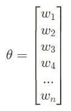

Fig 1\. column vector of weights. the number of thetas will depend on the machine learning algorithm and the number of input features.

## 正向输送

前馈功能是产生盲预测的机器学习组件。我们把这个函数简称为感知器。

感知器只是输入特征加上可选偏差的加权和。由于我们的列向量中的权重是通过梯度下降迭代优化的，所以函数的输出从盲开始产生更精确的值。感知器算法由以下等式表示:

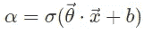

Fig 2\. feedforward equation. the sigma 👆 is to represent all activation functions not only the sigmoid

这里 alpha 是输出预测，sigmoid 是任何激活函数。[激活函数](https://towardsdatascience.com/7-popular-activation-functions-you-should-know-in-deep-learning-and-how-to-use-them-with-keras-and-27b4d838dfe6)的总体目标主要是简化输入特征，并将非线性引入感知器。

> 正是不同激活函数的使用定义了机器学习算法的独特性。

通过前馈功能，感知器计算输入特征和权重(加上偏差)之间的点积，从中我们得到一个非线性值作为输出。

让我们以一个带有标签的分类问题为例:“预测人们的心脏病”。我们将首先为我们的每个输入特征初始化一个权重向量(随机的或从另一个模型转移来的):“血压”、“性别”、“年龄”和“身体质量指数”。然后，我们取点积，加上我们的偏差。最后，我们将计算我们的激活，这是我们的预测。

> 但是，我们如何确定优化权重的方法呢？

> 作为复习，我们将成本函数定义为前馈函数的输出和标签之间的“差异”——假设问题是监督学习问题。成本越接近零，精确度就越高。

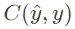

The cost function takes the prediction from the feedforward function and the labels. The 2 main cost functions are: cross-entropy (classification problems) and mean squared error (regression problems).

答案是确定我们预测的准确性。如果我们假设有一个已经用梯度下降训练过的模型，那么与具有随机初始化的权重的模型相比，权重将被更好地调整并且将具有更高的准确性。

因此，我们的目标是计算权重和成本之间的关系，以了解如何在未来优化我们的参数——这一概念将通过本文变得更加清晰。

# 简化的梯度下降

## 梯度下降方程

众所周知，为了降低成本，我们优化了权重，为了优化权重，我们计算了权重和成本之间的关系。在这张图上，你可以看到这种关系。

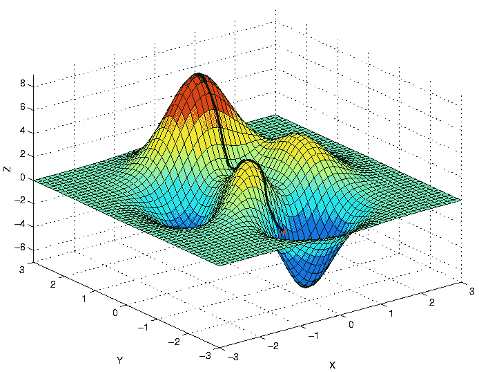

‘x’ and ‘y’ are two thetas from our weight vector and ‘z’ is the cost of the prediction. note that only two thetas with their cost are graphed. if the weight vector was graphed, this would be a hyperdimensional space.

我们的目标是计算该函数的全局最小值或成本最低的权重组合。

这就引出了最速下降的概念，我们通过最速路径迭代下降函数。

我们首先计算成本函数和每个θ之间的偏导数，或者用机器学习术语“方向导数”。因此，我们创建了一个偏导数向量或“每个点的陡度”，这个向量就是我们所说的梯度。

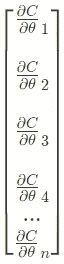

a column vector of partial derivatives for each theta value

为了简单起见，上面的偏导数向量可以改写成这个表达式:

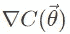

we take the gradient of the theta cost relationships

实现最佳权重值的下一步是更新权重本身的值！为此，我们从 theta 向量中减去负梯度向量(与梯度方向相反),以产生更好的优化的新 theta 向量*。这确保了梯度的下降。*

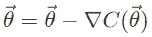

updating and optimizing weights | one optimization step

注意为了达到关系的最小值，将会有许多优化步骤。这是因为每一步下降都是相对于偏导数进行的，导数越陡，步长越大。这就是我们称梯度下降为迭代过程的原因！步骤越多，成本越低——假设不存在像[过度拟合](https://en.wikipedia.org/wiki/Overfitting)这样的问题。

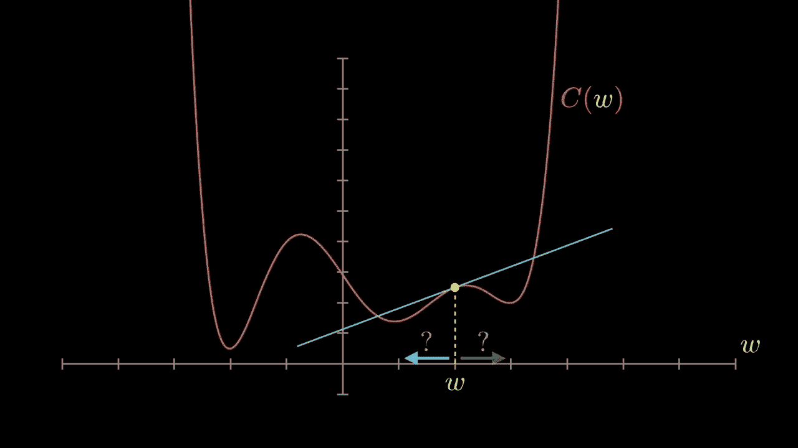

theta is being optimized in each learning step!

因此，我们已经了解了机器如何通过优化参数来学习背后的科学！然而，这种逻辑也有可能出错的地方。

## 学习率问题

如果梯度值接近于零会怎样？或者更形象地说，成本和来自θ向量的一个权重之间的关系大概具有平坦的斜率。优化时，每一步的距离都很小，因此权重需要时间来优化。

如果我们将常数(η)乘以梯度，我们就可以调整——增加或减少导数的大小——学习的速度和每一步的幅度。

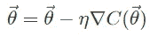

> 通过学习率，我们可以设置每个学习步骤的幅度，以提高效率和准确性。

选择最佳的学习速率是关键。学习率太大会导致模型收敛太快，导致模型错过最小值，而学习率太小会导致过程太慢。

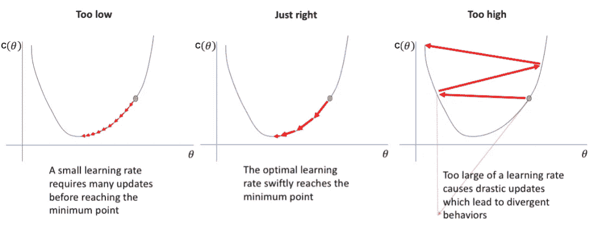

> 降低不工作模型的学习率是一个通用的经验法则。

## 动量和随机随机重启

然而，我们怎么能确定我们的模型处于全局最小值，而不是局部最小值呢？梯度下降算法选择最陡的下降路径。因此，优化器可能以局部极小值而不是全局极小值结束，如下所示:

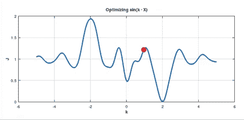

optimizer ends in local minima

这个问题延伸到这样一个事实，即到达全局最小值完全受运气和θ向量的随机初始化的影响。

实现全局最小值的一种方法是在随机位置同时创建多个权重优化器。虽然有些可能不会以全局极小值结束，但它们有更高的机会。这种方法被称为随机重启，它被广泛用于机器学习。

random restart

另一种达到全局最小值的方法是动量下降法。很像物理学的定义，动量考虑了前一步的θ变化，以加速超过局部最小值。

为了将动量合并到梯度下降函数中，我们使用常数 **β** 一个介于 0 和 1 之间的数字，表示动量对优化器的影响程度。

> **β** 的较高值表示动量衰减较小，而较低值表示动量衰减较大。

为了将动量的概念应用到我们的梯度下降算法中，除了常规梯度之外，我们还添加了上一步的运动。下面是更新的带动量的梯度下降算法:

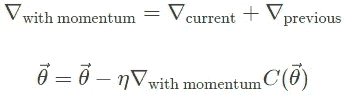

虽然这种方法更复杂，但它的使用在机器学习领域取得了令人难以置信的结果。

## 编程梯度下降理论！

**随机梯度下降**——一种梯度下降——可以用以下代码进行优化:

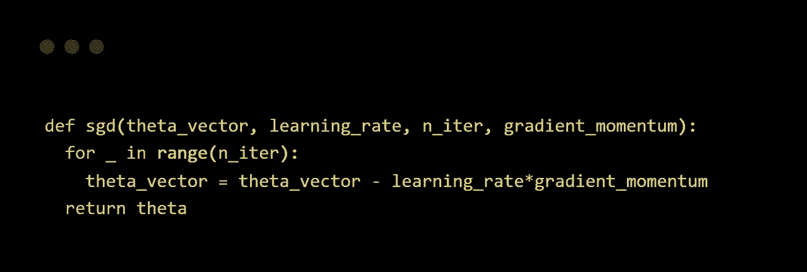

`sgd()`接受 4 个位置参数:

*   `theta_vector`:随机初始化权重的输入向量。通过这个函数，这些权重将被迭代优化。
*   `learning_rate`:训练运行的速率。用更专业的术语来说，这是训练步骤的幅度。
*   `n_iter`:是`theta_vector`将被优化的训练步数或迭代次数。
*   `gradient_momentum`:梯度动量向量是 theta-cost 关系的梯度加上前一个学习步骤的梯度向量(如果有)。没有示出达到梯度的计算，因为它取决于什么算法(例如逻辑回归、回归等。)正在被使用。

# 在你走之前…

> 通过这篇文章，你已经了解了梯度下降的基本原理！🎉🎊我们探讨了前馈功能、如何优化权重以及阻碍成功的主要障碍！祝你的机器学习之旅好运！
> 
> 机器学习一直是我的研究热点。无论是在 snapchat 过滤器还是垃圾邮件分类器中，它都被广泛使用。今天，它更像是一种生活方式，而不是流行语。
> 
> 这就是我进入数据科学领域的原因。从一开始，我就上瘾了，我希望我会一直上瘾。
> 
> 如果你喜欢阅读这篇文章，请联系我的社交网站*🤗* [LinkedIn](https://www.linkedin.com/in/arjun-mahes-a46200220/)|[简讯](https://arjunmahes.substack.com/) | [推特](https://twitter.com/mahes_arjun)