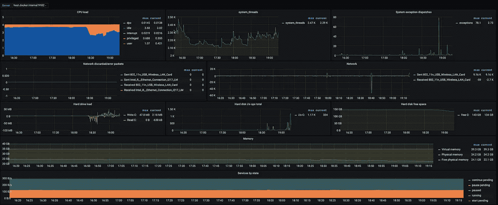
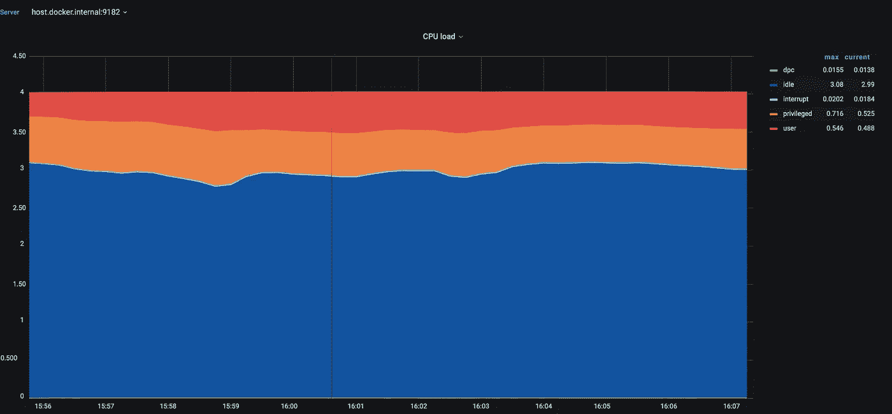
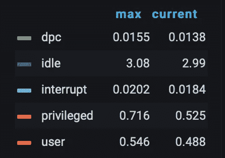
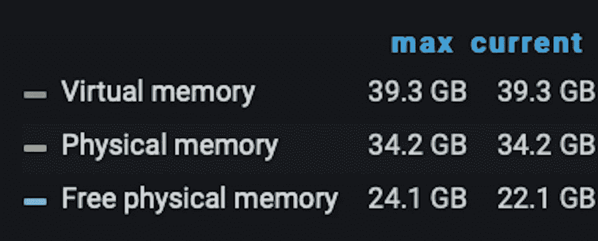

# 用于 Windows 服务器的 Grafana 仪表板

> 原文：<https://medium.com/geekculture/grafana-dashboards-for-windows-servers-80697d59d1dd?source=collection_archive---------4----------------------->

## 了解两个关键的服务器性能指标

Photo by [Ibrahim Boran](https://unsplash.com/@ibrahimboran?utm_source=medium&utm_medium=referral) on [Unsplash](https://unsplash.com?utm_source=medium&utm_medium=referral)

Prometheus 和 Grafana 正在成为监控 linux 服务器的事实上的标准。你会发现无数的指南，告诉你如何在 10 分钟内完成普罗米修斯和格拉夫纳的比赛。这包括开箱即用的漂亮的交互式仪表盘。

但是如何监控 Windows 服务器呢？如何使用 Prometheus 和 Grafana 设置窗口的指导空间要空得多。好消息是你仍然可以用 Prometheus 和 Grafana 监控你的 windows 服务器。坏消息是，现成可用的指标和 Grafana 仪表板的种类非常有限。

但是不要绝望。在这个操作指南中，我将向您介绍最流行的用于 Windows 服务器的 Grafana 仪表板。您将大致了解如何读取有关 CPU 和内存的仪表板数据。

# **仪表盘**

关于 Grafana 的典型帖子关注于设置数据源、导入仪表板和调整窗格的“外观和感觉”。我将向您介绍如何从 Grafana 仪表盘中获益，而不是介绍技术设置部分。最后，理解仪表板告诉你的性能是最有价值的部分。

Grafana dashboard

用于 Windows 服务器的最受欢迎的 Grafana 仪表板被称为“Windows Node ”,可以从 Grafana 网站[这里](https://grafana.com/grafana/dashboards/2129)下载。这款仪表盘与 WMI exporter 0.12 兼容，你可以在这里下载[，并按照 Github 页面上的](https://github.com/prometheus-community/windows_exporter/releases/tag/v0.12.0)[说明](https://github.com/prometheus-community/windows_exporter/tree/v0.12.0)进行安装。

“windows 节点”Grafana dashboard 包含许多面板，显示 Windows 服务器的各种性能。CPU 和内存是目前最重要的服务器资源。为了理解这些，我们需要更深入地了解在 Windows 中如何管理 CPU 和内存。

## 中央处理器

Grafana 仪表板中的 CPU 面板如下所示:

CPU Load panel

这个面板显示了 CPU 在一段时间内所做的工作。

在左侧，您可以看到顶部值为 4 的 Y 轴。在该特定示例中，被监控的服务器具有 4 核的单个处理器(例如，4 个逻辑处理器)，因此 Y 轴的最大值是 4。

在面板的右侧，我们看到代表处理器 5 种不同活动的图例: *dcp、空闲、中断、特权、用户*。

让我们仔细看看这个传说:

CPU Load panel legend

这些活动的另一个名称是“处理器模式”。当我们说“处理器处于 X 模式”时，我们的意思是处理器正在做 X 类型的工作。

让我们来看看这些模式的定义。

*用户模式*代表为应用程序和不同子系统所做的工作。我们在服务器上运行的典型应用程序是在*用户模式*下执行的。如果您的应用程序是计算密集型的，您将会看到用户模式指标激增。

*特权模式*是处理器为 Windows 操作系统做的工作。当调用一个 Windows 系统服务时，该服务通常会运行在*特权模式*下，以获得对系统私有数据的访问权。此类数据受到保护，不会被在*用户模式*下执行的线程访问。

*中断模式*是 Windows 系统为处理硬件请求而做的一种工作。高水平的中断可能表明硬件或驱动程序有问题。

## 记忆

Memory panel legend

仪表板中的内存窗格显示有关服务器内存的三个关键指标的信息:

*   虚拟内存
*   物理内存
*   自由物理内存

物理内存是安装在服务器上的内存(RAM)。应用程序的进程不直接访问物理内存，只有操作系统才这样做。相反，这些进程使用由操作系统创建的虚拟内存。

为什么我们需要虚拟内存？进程有时需要比可用物理内存更多的内存。在这种情况下，操作系统会将进程顺序加载到物理内存中。它等待每个进程结束，然后加载下一个进程。这种切换对所有使用虚拟内存的进程重复进行。

为此，操作系统使用了一种叫做*分页*的技术。当服务器没有足够的物理内存用于所有进程时，物理内存中的部分信息会保存到一个名为 P *age File* 的磁盘文件中。

# 总结

现在，您应该已经了解了如何阅读 CPU 和内存消耗图表。在评估服务器的性能瓶颈时，这些指标涵盖了您 80%的需求(很好地说明了帕累托原则)。

如果你需要深入观察你的应用程序如何影响 CPU 和内存，看看 [Prometheus 客户端库](https://prometheus.io/docs/instrumenting/clientlibs/)。您可以将这些库直接添加到您的应用程序中，以收集应用程序运行时指标。运行时度量通常有助于回答性能瓶颈调查中的“为什么”问题。