# Grafana 可视化 AWS 云观察指标

> 原文：<https://medium.com/geekculture/grafana-to-visualize-the-aws-cloud-watch-metrics-6b55533fde36?source=collection_archive---------5----------------------->

## 使用凭证文件方法可视化云观察指标

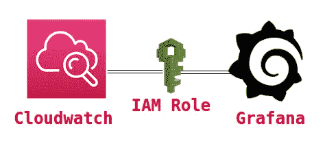

Some Random dude on Google Images

每个人都知道公共云和私有云。因为现在是 2021 年，我们大多数人都在云平台的帮助下工作。我之所以谈论一些不相关的东西，是因为有些人希望使用一个工具同时监控公共云和私有云。尽管在 AWS 中有一种叫做云观察的东西，我们可以用它来跟踪一切。尽管如此，当需求就像您的客户正在使用任何混合云或者他想要可视化指标时，管理员不能直接访问云观察。

因此，有这样一个一站式解决方案，这就是开源工具 Grafana。通过 Grafana，我们可以连接多个云应用程序来监控和可视化 it。此外，用户可以根据自己的需要轻松编辑和监控仪表板。

另一方面，它是一个开源工具，所以我们不必为此投资任何东西。

这些监控主要帮助我们优化成本，因为我们可以跟踪哪些应用程序使用得更多，也就是说，哪些应用程序或服务器使用过度，因此我们可以想出一种替代方法，或者缩减规模，甚至在特定时间关闭。

并不是说 Grafana 可以单独使用，我们也可以使用一些其他的应用，比如 Zabbix。我不打算讨论开源工具列表的细节。因为这个博客是基于 Grafana 的。

对于本教程，我们假设您已经在 AWS EC2 上安装了 Grafana 服务器。

如果没有，不用担心，我写了另一个博客，请看看。

[](/geekculture/install-grafana-in-any-cloud-vm-for-monitoring-868f6436162d) [## 在任何云虚拟机中安装 Grafana 进行监控

### 在 EC2 上安装 Grafana，并以自动启动方式启动

medium.com](/geekculture/install-grafana-in-any-cloud-vm-for-monitoring-868f6436162d) 

Grafana 与 AWS CloudWatch 配合使用的 3 种方式如下:

*   与 IAM 政策的 ARN 号码
*   使用凭据文件
*   通过将凭证输入数据源(在 Grafana Dashboard 中)

在这个博客中，我们将使用方法 2，即凭证文件

好了，现在让我们从改变图像开始…

> **注:**
> 
> **只是一个小小的更新，如果你们想知道我是什么，那么看看下面，**
> 
> **我的角色是什么？**
> 
> IAM 角色是向您信任的实体授予权限的一种安全方式。实体的例子包括如下:
> 
> **我是另一个账户的用户**
> 
> **在 EC2 实例上运行的应用程序代码需要对 AWS 资源执行操作。AWS 服务需要对您帐户中的资源进行操作以提供其功能**
> 
> **公司目录中使用 SAML 身份联盟的用户。**
> 
> IAM 角色发布短期内有效的密钥，使其成为更安全的授权访问方式。好吧，如果你还是不明白，那么让我们从它开始，这样你会更好地理解它。

## **步骤 1:创建新策略**

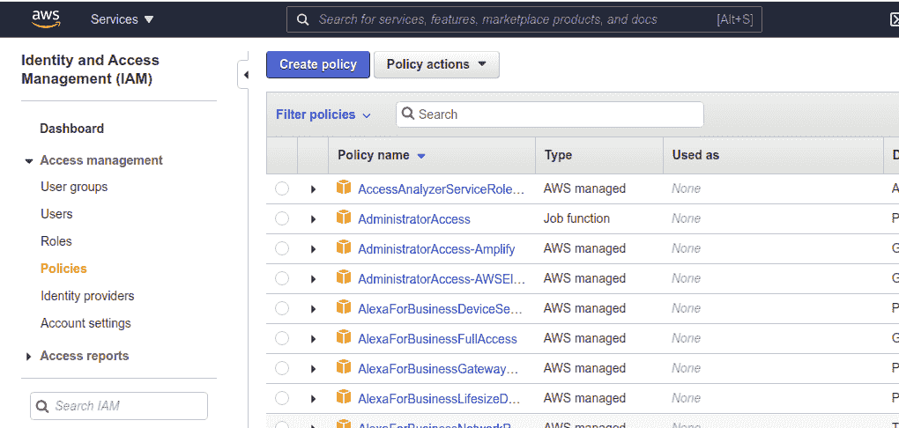

**create_policy_IAM**

按照这个，在**服务下→选择 IAM →策略→创建策略**

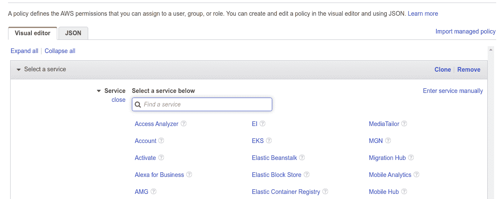

**choose_service**

现在在服务→云观察下

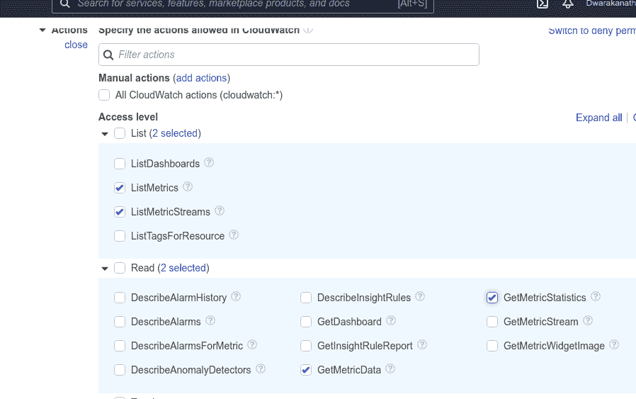

**access_level_read_permission**

之后，请选择以下访问级别策略，我们可以在 Grafana 中获得这些策略的指标报告。然后检查您的策略，为您的策略命名，并描述该策略包含的内容，以便我们将来查看它时，能够了解该策略的特点。这只是为了让我们的工作更容易。

一旦你完成了，你必须验证 did 是否已经被创建，只是为了交叉检查。


**verify_grafana_policy**

## **第二步:创建角色**

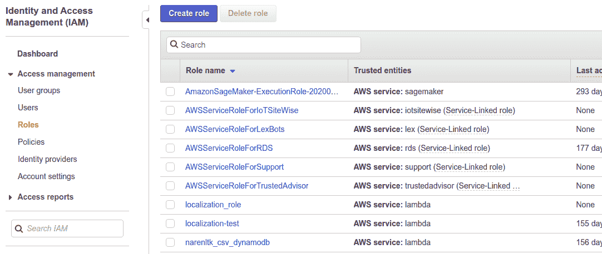

**create_roles**

只需按照这个，在**服务下→选择 IAM →角色→创建角色**

现在选择 AWS 服务→ EC2(在通用用例下)→下一步:权限

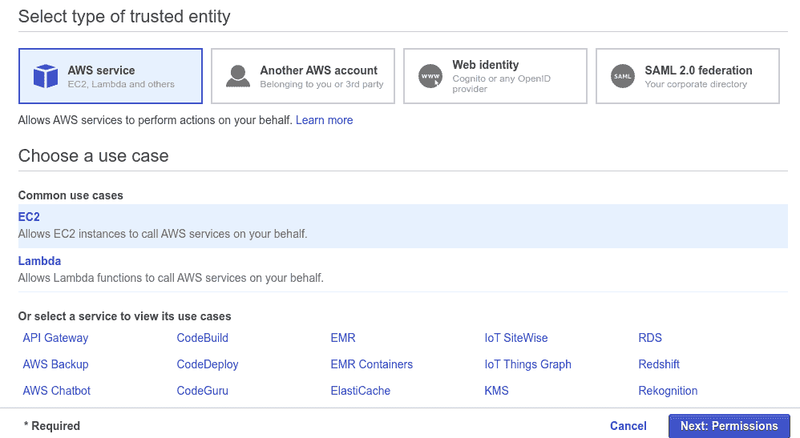

**choose_use_cases**

好了，现在我们必须附加我们之前为此角色创建的策略，如下所示，

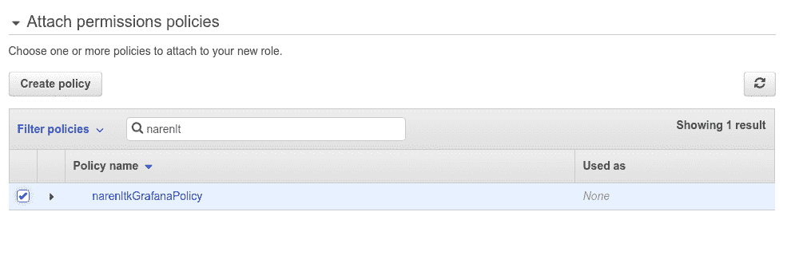

**attach_permission**

一旦附加了策略，我们必须检查它，应该在哪里更新角色名称和描述等..完成后，我们可以选择“创建角色”。

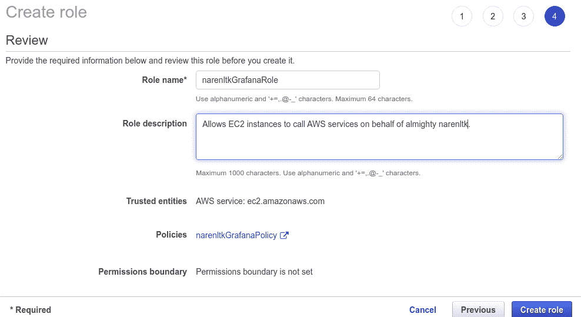

**review_role**

完成后，我们需要验证我们创建的角色是否存在，

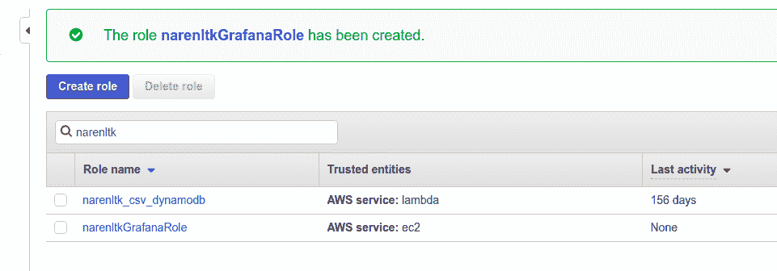

verify_grafana_role

## **第三步:创建用户**

首先，我们创建了策略，然后创建了角色，然后将策略与角色关联起来，现在我们创建用户，以便可以将它关联到 EC2 实例。

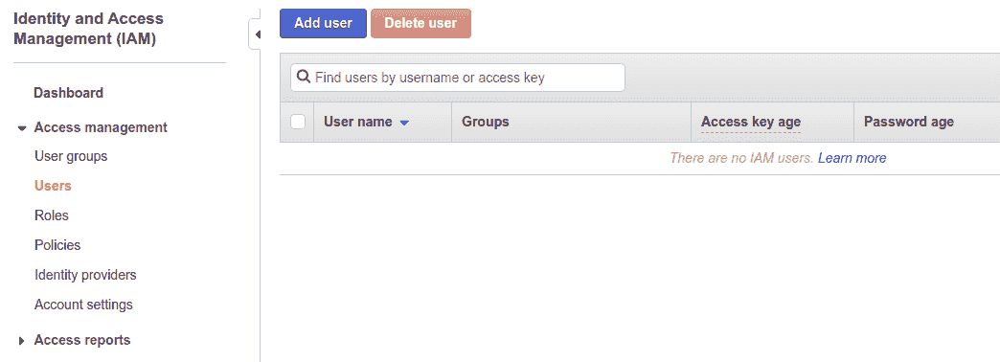

**create_iam_users**

现在选择添加用户。

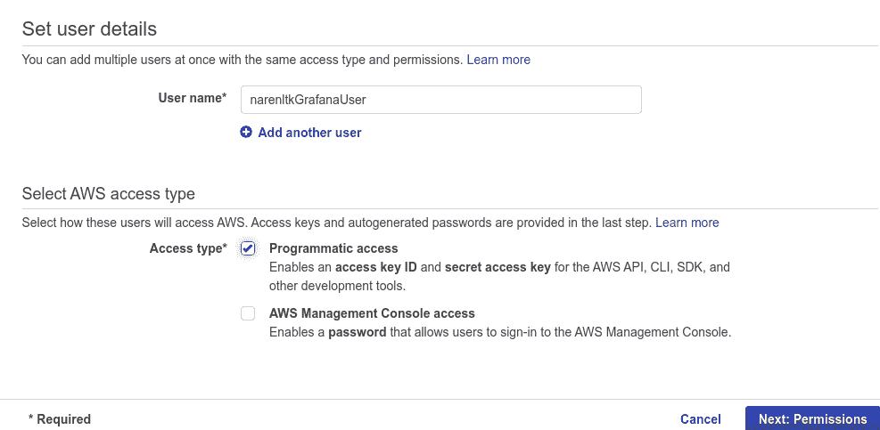

**update_user_details**

给出用户名。

请确保在选择 AWS 访问类型下的访问类型中选择编程访问。这将为您提供访问密钥和秘密密钥的详细信息。请务必记下它，因为它只会生成一次，如果您忘记了，则需要再次创建它。

然后选择下一个权限。

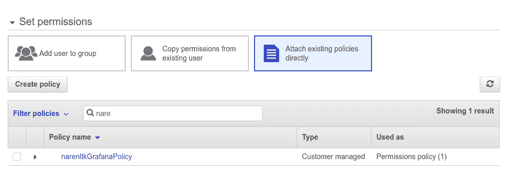

**attach_grafana_policy**

现在设置权限，如果您已经创建了任何组，则意味着选择将用户添加到组，或者继续直接附加现有策略→搜索我们在上一步中创建的策略并继续。

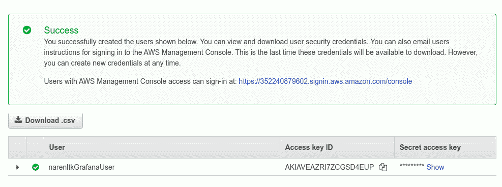

**grafana_user_Cred**

现在，您可以看到访问密钥 ID 和秘密访问密钥，这是我之前提到的。

是的，你必须保存它，因为它只会显示一次，就像谚语“金玉其外，败絮其中”。

我想现在我们都准备好了…现在剩下的只是将用户与我们拥有的 EC2 实例关联起来。

## **步骤 4:将用户附加到 EC2 实例**

在这里，我希望你们都准备好 EC2 实例，也就是说，它应该已经启动了。

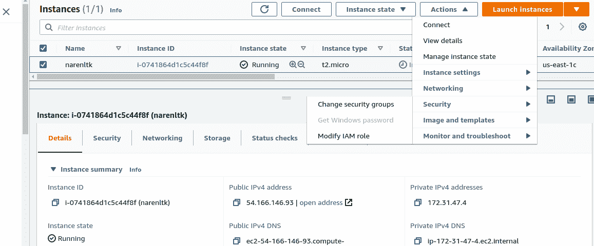

**attach_iam_role**

现在选择要更新 IAM 用户的实例，并单击

**动作→安全→修改 IAM 角色**。(这是自 AWS 持续更新以来的最新数据)

如果你提到了 YouTube 上的旧视频或者一些旧的媒体博客，那么你会被导航到

**操作→实例设置→附加/替换 IAM 角色。**

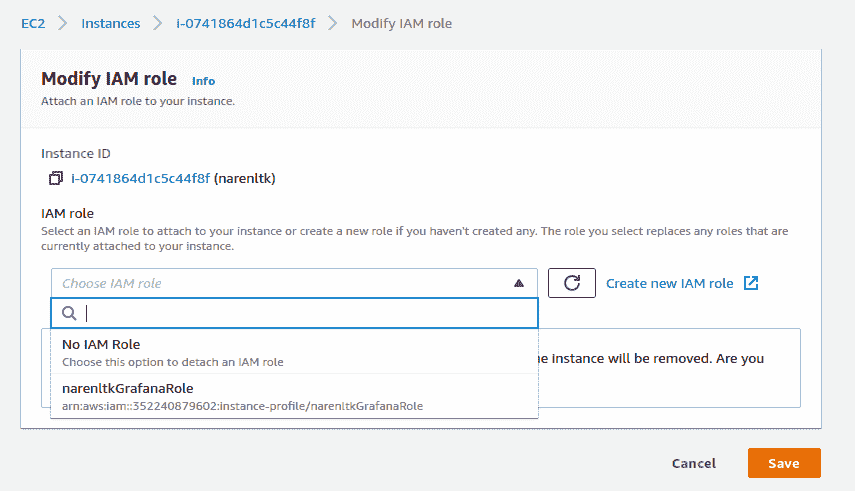

**select_grafana_role**

现在，您需要搜索您创建的角色，选择并保存它。

现在您也应该验证这一点，所以请检查 EC2 实例的安全组设置，如下所示，

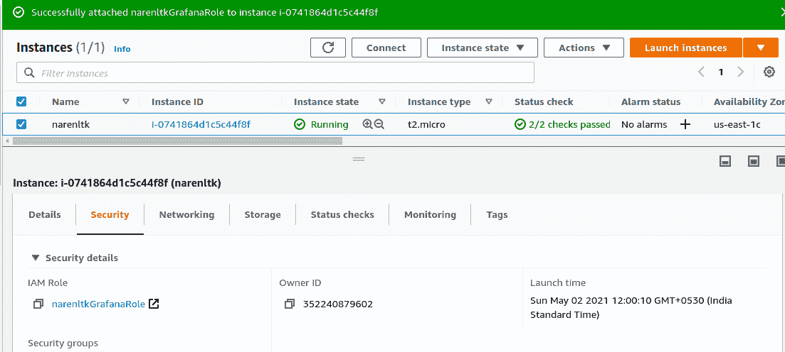

**verify_security_tab_iam_role**

您可以验证附加到安全组的 IAM 角色。

现在，我们将凭证文件附加到 EC2 实例

## **第五步:创建凭证文件**

现在，登录到您在上一步中附加了 IAM 角色的 EC2 实例，执行如下所示的操作，


**credentials_share_grafana**

这里的代码如下所示，

```
**sudo nano /usr/share/grafana/.credentials**
```

我们正在为我们的 Grafana 创建凭证文件，以便使用我们在上一步中创建的**访问 ID** 和**密钥**进行访问。

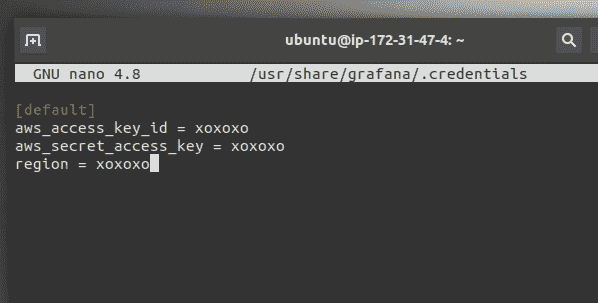

**aws_access_creditial_default**

用您自己的**访问密钥 id** 和**密钥**和**区域**替换 **xoxoxo** 。

保存它，现在我们将授予它访问它的权限。

代码如下所示，

```
**sudo chmod 0644 /usr/share/grafana/.credentials**
```

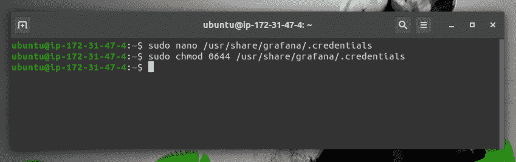

**chmod_0644_cred**

## **第六步:用 AWS 云手表配置 Grafana**

现在，使用您已经配置好的 uname 和 pwd 登录到您的 Grafana 仪表板，

> **注:**
> 
> **默认 uname 和 pwd 如下**
> 
> **Uname → admin**
> 
> **Pwd → admin**

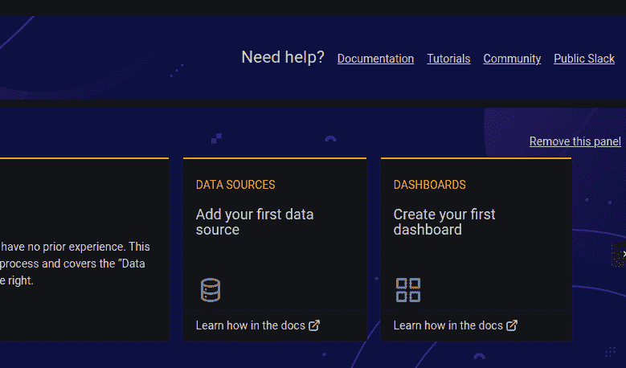

**select_data_source**

在这里，您应该会看到如上所示的仪表板面板，并友好地选择数据源，即添加您的第一个数据源。

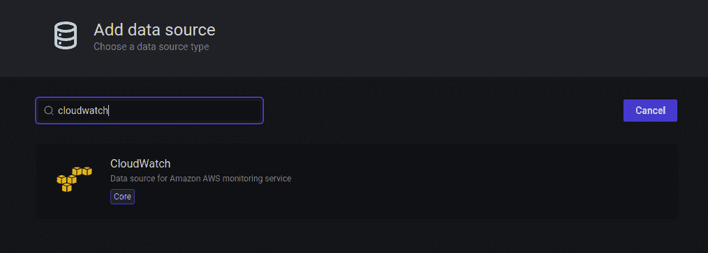

**search_cloud_watch**

现在在搜索栏中搜索 Cloud Watch，然后选择它来配置凭据详细信息。

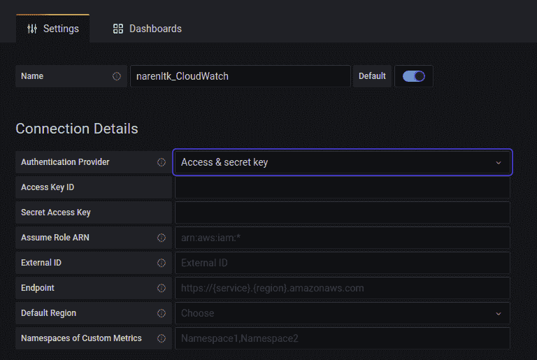

**udpate_access_secret_key**

在这里你需要给出你想要的名字，然后在认证提供者下选择访问和密钥。

现在给出访问密钥和秘密访问密钥的细节以及默认区域。

然后单击 Save and Test，您应该得到以下输出。

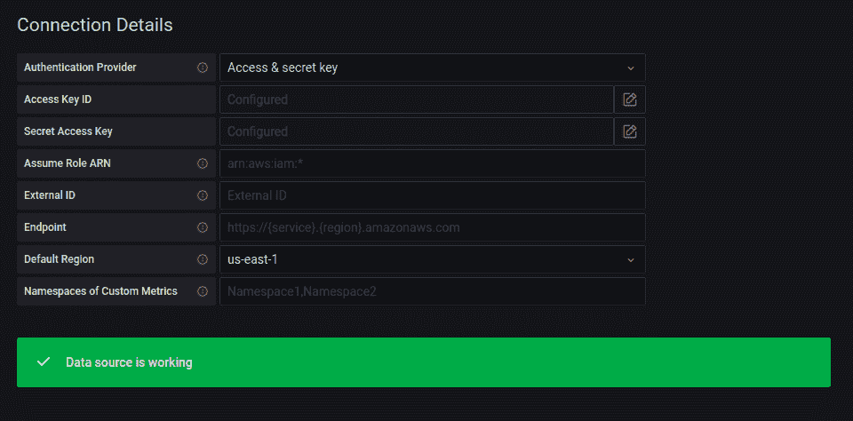

**verify_udpated_details_correct**

如果您在任何地方发现任何您想要跟踪的错误，那么进入 EC2 实例终端并给出下面的命令**来检查日志报告，**

```
**cd /var/log/grafana/****ls****vi grafana.log (or else) nano grafana.log**
```

这将为您提供您所面临的错误的所有细节。

## **第七步:创建你漂亮的仪表板**

现在你需要选择**“+→仪表板”**

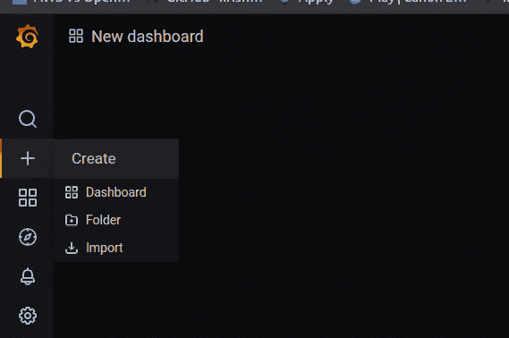

**click_dashboard_for_making_panel**

现在，您可以选择右上角的添加面板，因为有时会使用添加空白面板和添加行来创建面板，如下所示，

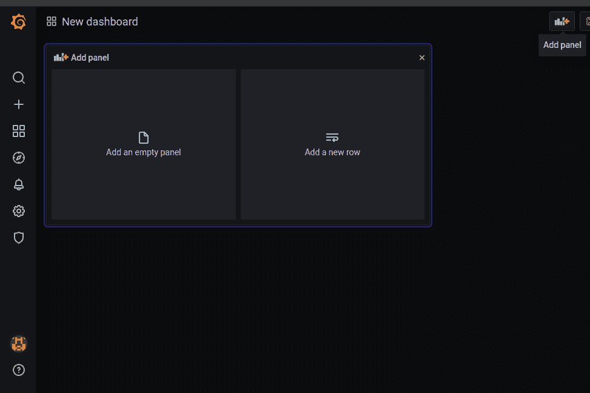

**select _add_panel**

然后所有的 grafana 查询我会让你们做，因为它很容易。

这里我做了一个 CPU 利用率的例子。

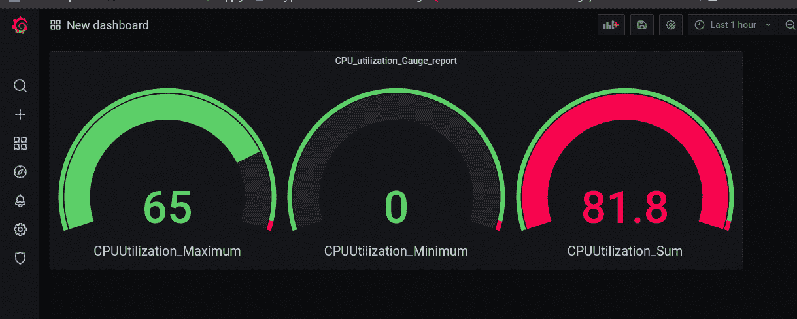

**Cpu_utilization**

我在这个博客中使用的 Grafana 版本是 7.5.5

> **如果您希望保持联系，**

[](https://www.linkedin.com/in/narenltk/) [## Narendiran Krishnan —印度泰米尔纳德邦哥印拜陀|职业简介| LinkedIn

### 查看世界上最大的职业社区 LinkedIn 上 Narendiran Krishnan 的个人资料。纳伦德兰有 6 份工作…

www.linkedin.com](https://www.linkedin.com/in/narenltk/) [](https://github.com/narenltk) [## narenltk —概述

### 骗人的把戏。需要咖啡来聚焦…！！！narenltk 有 10 个可用的存储库。在 GitHub 上关注他们的代码。

github.com](https://github.com/narenltk) 

> 你可以用谷歌搜索“narenltk / narendiran krishnan”或者发邮件到→narenltk@gmail.com→乐意帮忙..！！！