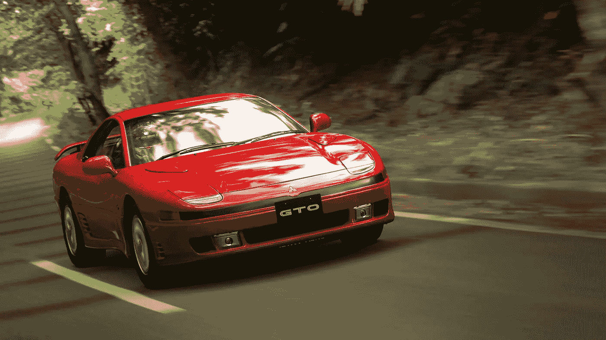

# gt 赛车 7 有一个大问题

> 原文：<https://medium.com/geekculture/gran-turismo-7-has-a-major-issue-f3abce1b0487?source=collection_archive---------1----------------------->

## 赌博

## 下载可能需要非常长的时间

Source: [Press-Start](https://press-start.com.au/reviews/ps5-reviews/2022/03/02/gran-turismo-7-review-approachable-simulation/)

我上个月从 Target 预定了 PS5 的 gt 赛车 7。我耐心地数着日子，直到我可以重新点燃童年的一些时刻。今天终于来了，我不断地查看塔吉特百货的网站，看看它什么时候会出现。上面写着“今天到达:3 月 4 日”，但是没有任何进展。中午来了；什么都没变。下午来了，这是同样的故事。最后，它说要到周四才能到。

可笑的是，你可以预先订购一款游戏，但它很可能不会准时出现，今天我还是在我女朋友的推荐下，去店里买了一份。一旦预购的货终于到了，我就退回去。

终于，在安全到家后，我把它拿在手中。我甚至拿起了一个新的“银河紫”配色的双感控制器。我打开游戏包装，把光盘扔进去，它就开始下载了。没问题。它说需要几个小时。“这可以理解；差不多有 100GB，”我说。

好吧，五个小时过去了，还没完成。事实上，现在是 80%,估计还需要 4 个小时。尽管有千兆互联网和硬连线 PS5(通过以太网)，游戏仍然没有结束。最初，我认为这可能需要一段时间，这是可以理解的。然而，花了*这个*长得令人讨厌。这是一个异常值，考虑到以前没有游戏花这么长时间下载；即使是文件大小大于 100GB 的游戏。

所以，我开始搜索。最初，我找不到任何答案。我看到有帖子说网速慢的人抱怨一旦他们最终得到游戏要花多长时间，但没有人抱怨他们下载游戏时的实时时间。最终，我开始怀疑自己，并担心这可能是我这边的问题，尽管我的互联网看起来很好。我运行速度测试，重启我的路由器，更新 PS5 上的 DNS 设置以使用谷歌的 DNS 地址(根据 Reddit 的推荐)；一切都无济于事。

我没有太多游戏下载成为问题的历史。事实上，自从 PS2 之后，我还没有过游戏机，而那个*几乎没有任何互联网功能。我的观点是，我真的不知道“标准”是什么，但我知道，鉴于我的网速和以前的一些下载，5 个多小时是可笑的。我几乎可以肯定(更绝望地希望)这不是我的错，所以我继续寻找。*

最终，我发现[几天前的另一篇 Reddit 帖子](https://www.reddit.com/r/PS5/comments/t5tvpr/psa_if_you_have_slow_internet_gran_turismo_7_disc/)提到，对于网速慢的人来说，下载 gt 赛车需要很长时间。这并不适用于我，但吸引我眼球的是最高评级的评论。全文如下:

> 删除目前下载的内容，断开 PS5 的网络连接。弹出并重新插入光盘，让它安装。从预计的 6 个小时缩短到 45 分钟内完成。
> 
> 然后重新连接互联网并下载最新更新。不能说这要花多长时间，但至少为初次安装节省了几个小时。

在这条评论下面，还有许多人感谢发帖人提供的信息。许多第一手观察数据显示，下载进度因为做了一些你永远不会想到要做的事情而加快，因为为什么*会做*或者*应该做*呢？

似乎出于某种原因，PS5 完全无视赛车 7 的磁盘上有任何数据。所以，当你插入光盘，它明白你想玩游戏，但仅此而已。它不知道你有办法玩它，并试图从头安装整个游戏。不管出于什么原因，这样做要花费极其荒唐的时间。

所以，如果你发现自己处于我的困境，请按顺序做以下事情:

*   取消下载赛车 7
*   从 PS5 中弹出磁盘
*   断开 PS5 与互联网的连接
*   再次插入磁盘

**注意:不要将 PS5 重新连接到互联网**

我执行了上面的步骤，当我终于听到磁盘驱动器在运行时(之前是死一般的寂静)，我松了一口气。我检查了下载速度，从 0%开始，它显示只需要一个小时。

当互联网连接被禁用时，您想要重新插入磁盘的原因是 PS5 可以识别磁盘及其内容。然后，它会直接从磁盘安装游戏。你可能会听到磁盘驱动器的嗡嗡声，这表明它实际上在做什么。这将有望大大加快你的下载速度，你终于可以玩你一直想玩的游戏了。

你可能认为这在 2022 年不是问题，但这就是我们所拥有的。快乐的比赛。