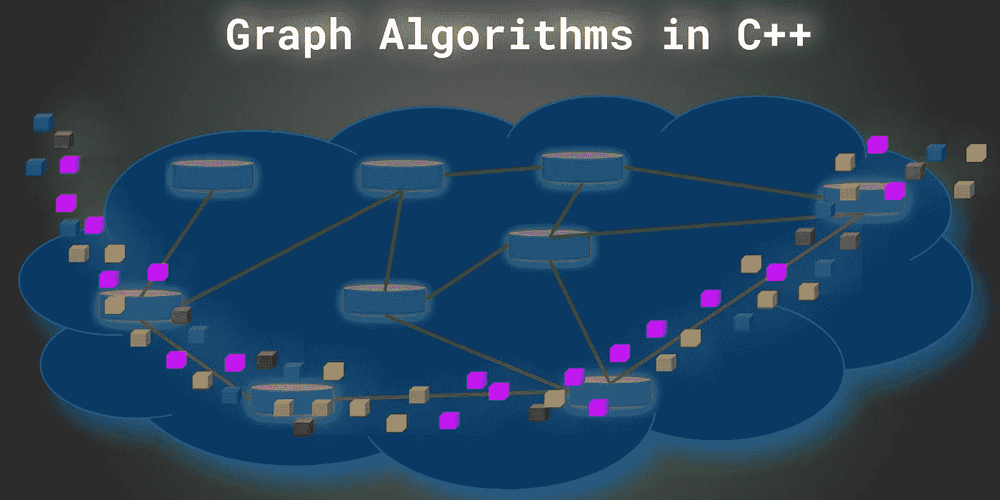
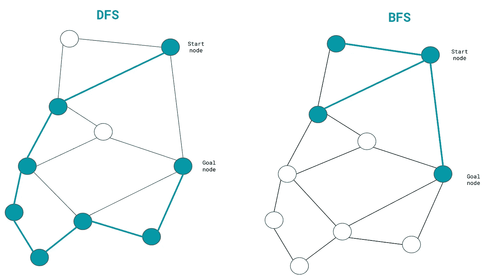
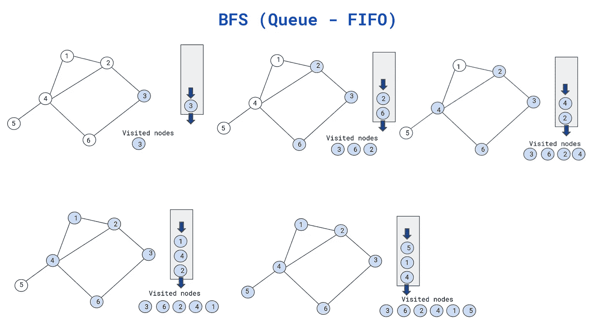
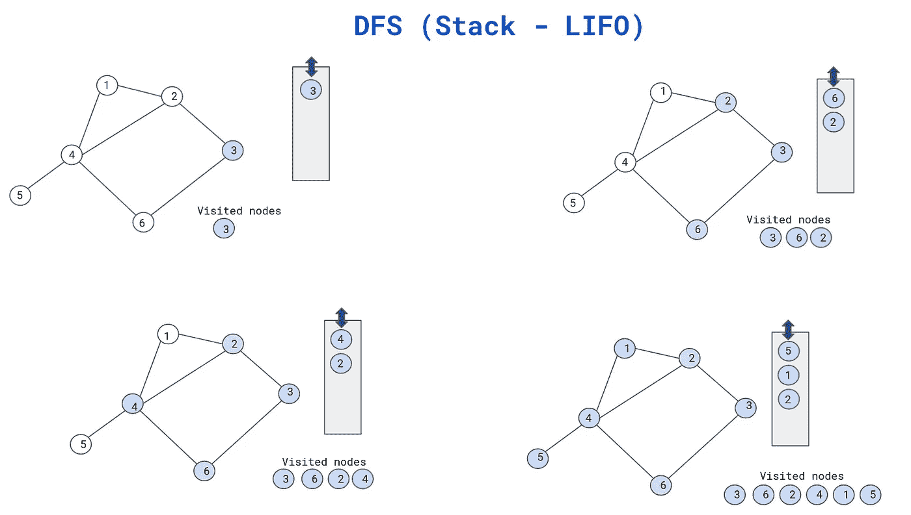
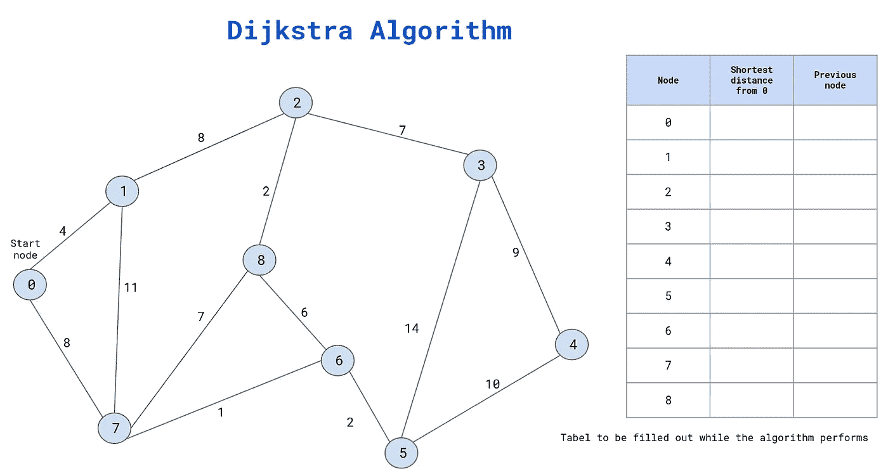
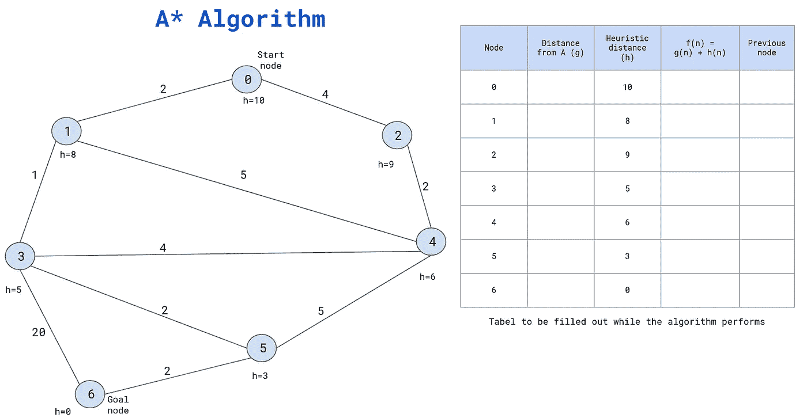

# C++中的图形算法

> 原文：<https://medium.com/geekculture/graph-algorithms-in-c-161d2d3c245?source=collection_archive---------4----------------------->



by author

下面的文章介绍了基本算法，这些算法在我们对图形进行计算时经常用到。我们将从像 [**深度优先搜索**](https://en.wikipedia.org/wiki/Depth-first_search)**(DFS)**[**广度优先搜索**](https://en.wikipedia.org/wiki/Breadth-first_search)**【BFS】**这样的基础知识开始。由于我对机器人领域的偏好，我也将描述路径规划中常用的算法。我们将考察 [**Dijkstra 算法**](https://en.wikipedia.org/wiki/Dijkstra%27s_algorithm) 和 [**A*算法**](https://en.wikipedia.org/wiki/A*_search_algorithm) 。

我的这些算法的 C++实现可以在我的 [**GitHub**](https://github.com/markusbuchholz/graph_algorithms_in_cpp) 上找到。注意，在下面这篇文章中，我尽力描述了这些原则。请首先尝试自己实现这些算法，并最终与我的进行比较。

# **图形介绍**

图是一种数据结构，可以与通过边(链接)连接的顶点(使用树术语的节点)的网络类型相关联。该图类似于树数据结构，但是有独特的功能，使图形独特和非常强大的广泛应用。考虑下图中绘制图形和树的位置。这两种常见数据结构之间的主要区别可以讨论如下。
除了两个结构中的每个节点都有唯一的 ID 之外，树还有根节点，它与树的起点相关联。树是一种从根到底的分层结构。然而，该图并不遵循这一概念，所有节点都可以是我们研究的起点。让我们考虑这个例子。城市/国家的地图逻辑上是图，它通过不同的道路、路径(图边)连接城市或家庭。使用同样的地图，我们可以寻找从 A 地到 B 地或从 C 城到 D 城的最短路径，等等。在这些情况下，起点是地点 A 或城市 c。
在使用图形时，我们可以使用循环，这意味着通过一个节点，我们可以使用不同的方式返回到该节点(如果存在)。使用树时，此功能不存在。

# **BFS 和 DFS 算法**

在本节中，我们将讨论这些算法的主要原理和常见用法。我们将详细说明主要的区别并进行模拟(这些算法的实现可以在我的 GitHub 上找到)。请考虑下图，我希望它能帮助你使用所讨论的算法来可视化导线测量的主要原理。



by author

**BFS 算法的概念**与**队列**直接相连，这是一种在 [**FIFO**](https://en.wikipedia.org/wiki/FIFO_(computing_and_electronics)) 上下文中操作的容器。FIFO 代表:先入先出，可以与内存(容器)相关联，在内存中，项目从一侧进入，从另一侧取出。让我们考虑一个例子来说明我们的讨论。

我们可以认为我们需要遍历呈现的图中的所有节点。我们可以从每个节点开始，因为图不是层次结构。
我们从 3 开始，所以 3 进入队列，并被标记为被访问的节点。接下来，我们从队列容器(FIFO)中删除(弹出)该节点，同时我们插入(推入)与先前弹出节点直接相连的未访问节点。在我们的例子中，我们插入节点 nr 6 和 2。

现在重复该过程，我们将节点 nr 6 标记为已访问节点(从队列中弹出)并检查(推入)将直接连接到节点 6 的未访问节点排入队列，并将它们推入队列。节点 nr 4 位于队列中，并被标记为被访问。

当您考虑队列的当前状态时，我们必须评估节点 2，它已从队列中删除。

接下来，我们考虑节点 2 的未访问邻居。在这种情况下，我们添加节点 1。节点 4 被访问，所以不考虑

现在，我们检查节点 4 并添加未访问的邻居。节点 5 未被访问。此外，我们检查节点 1 和 5，它们与未被访问的节点没有任何连接，因此该过程可以终止。我们访问了所有的节点(遍历了图形)。



by author

在两种情况下(BFS 和 DFS ),我将图初始化为一个列表(每个节点一个列表)。该列表(对于每个节点)包括该节点的邻居。列表提供了直接推动和弹出的机会。

与 BFS a **相反，DFS 算法**使用了[**栈**](https://en.wikipedia.org/wiki/Stack_(abstract_data_type)) 的概念。这种类型的容器作为一个 **LIFO** 操作，这意味着元素作为最后一个进入，作为第一个弹出。它可以被关联为“单向门”容器。

为了理解这个概念，我们可以考虑和前面一样的图表。我们也从节点 nr 3 开始遍历该图，节点 NR 3 被插入到堆栈中并被标记为已访问(当已访问时，我们从堆栈中移除该节点)。接下来我们考虑连接到节点 3 的未访问节点(类似于 BFS)。节点 2 和 6 进入堆栈，并在一处标记为已访问。此外(与 BFS 不同),我们采用并扩展位于堆栈顶部的节点。这里我们有节点 6。

应用相同的方法，我们将节点标记为已访问，并检查连接到 6 的未访问节点。在这种情况下，我们可以从堆栈中移除节点 6，并将节点 4 压入。现在，节点 4 位于堆栈的顶部(并标记为已访问)。我们从堆栈中删除这个节点，同时通过直接链接的节点 1 和 5 进行扩展。我们不考虑 2，因为该节点仍在堆栈上并被标记为已访问。在堆栈的顶部是 5，它没有任何到未访问节点的链接，所以我删除了节点 5，我们取堆栈中的下一个节点。还剩下一个未被访问的节点。接下来，我们从堆栈中取出节点 1。由于不再有未被访问的节点，所以该节点没有被消耗。接下来，我们取栈上的剩余节点，在我们的例子中是节点 2。此操作(堆栈为空)终止图形的遍历。请考虑下图。



by author

C++代码

在许多应用中，这两种算法都可以使用。然而，为了记住哪种算法最适合某个应用，我们必须记住可以从其他场景(应用)推导出的两种情况。

**BFS** 主要用于应用程序，其中我们需要**找到到该节点的最短路径**，因为我们将所有邻居消耗到该节点。

[**DFS**](https://www.youtube.com/watch?v=xLyfegzK6AU&t=123s) 主要用于下棋或决策相关游戏等场合**。我们采取一个决定(行动)。这个决定(动作)会影响下一个动作。如果我们去节点 6(从节点 3；见图表)所以我们不考虑另一个选项(在这种情况下是节点 2)。我们按照堆栈顺序，寻找节点 4，等等。**

# **Dijkstra 算法**

Dijkstra 算法的主要目标是找到图中任意两个节点(顶点)之间的最短路径。然而，我们需要注意的是，当应用 Dijkstra 算法时，我们找到了从图中的起始节点到其他节点的最短路径。我们访问图中的所有节点，这意味着我们可以轻松地提取图中任何节点之间的最短路径。
考虑下图，我们可以考虑一下。正如您所看到的，节点之间的路径包括关于距离或成本或其他有用值的信息，它提供了对节点之间转换工作的估计。

我想提一下，对以下算法的理解将很快让你顺利理解/部署我们将在下一节讨论的 A*算法。
出于该算法的目的，我们必须分配一个表。为每个节点存储特定值的存储器。此外，我们需要存储关于被访问节点的信息。

正如您在下面看到的，我们已经为图形中的所有现有节点创建了表格。第二列包括从起始节点(在我们的例子中是节点 0)开始的最短路径的信息。开始时，该列被初始化为无穷大值。最后一列包含关于前一个节点的信息，该信息指示到目前为止已经为其计算了从起点开始的最短路径的前一个节点的名称。请注意，表中的信息会不断更新，而算法不会终止(我们必须访问图中的所有节点)。



by author

让我们考虑一下我们的图表。我们从 0 开始。从这个节点开始，到 0 的最短路径等于 0。
从节点 0 我们可以过渡到节点 1 和 7。与节点 7 的成本等于 8 相比，节点 1 的成本更低，等于 4。现在奇迹正在发生。这是该算法的基础。
我们需要看看我们如何从开始节点执行最短距离(成本)的更新。

已经执行了从节点 0 到节点 1 的转换。到节点的旅行成本为 0(因为有一个起始节点),但是旅行的距离(成本)等于 4。到达节点 1 的总距离(成本)等于 0 + 4 = 4。如果该计算值低于存在于初始化表中的值(对于特定节点；在我们的例子中，节点 1)因此我们更新了关于最短路径和先前节点的信息。在我们的例子中，我们将距离初始化为无穷大，所以等于 4 的距离肯定更小。

与节点 1 相似，我们计算节点 7 的最短路径。在这种情况下，计算也很简单。到节点 7 的无限距离更新为值 8 = 0 + 8(见图表)。
在两个预览案例中，我们都从节点 0 过渡，因此该信息也包含在表中。我们将节点 0 标记为已访问，并且我们不打算再次访问此节点(顶点)。

现在要考虑的下一个节点是距离起始节点(我们的情况是 0)最短的节点。在我们的例子中，节点 1 的距离最短。接下来，我们通过向列表中添加节点 1 的邻居来扩展节点 1。我们添加节点 2 和节点 7。未添加节点 0，因为它被标记为已访问。

到节点 2 和 7 的距离必须相应地更新。对于节点 2，我们使用先前的公式进行更新，其中我们获取到达先前节点的距离和到我们考虑的节点的距离。对于节点 2，我们从节点 2 中转(对于该节点，参见表格，我们计算的距离等于 4)。节点 1 和节点 2 之间的实际距离等于 8，因此总距离等于 12 = 8 + 4。我们更新我们的表，因为先前的值是无穷大。

类似于节点 2，我们考虑节点 7。通过节点 1 到达节点 7 的开销(路径距离)为 15 = 4 + 11。从表中可以看出，4 是到节点 1 的距离以及 1 和 7 之间的距离。在这种情况下是 11。现在，我们需要评估到 7 的距离，它(现在)可以直接从 0 开始或通过 4 到达。在第一种情况下，距离等于 8(已经在我们的表中)，最后计算出 15。值 8 小于 15，因此我们不更新该表。

接下来，如前所述，我们考虑从起点到终点距离最短的未访问节点。我们检查桌子。最低值是与节点 2 相对的节点 7 的值，为 12。请注意，节点 1 被标记为已访问。

对于节点 7，我们扩展(添加)到未访问邻居列表。节点 8 和节点 6。重复该过程，直到访问了所有节点，因此可以终止图的遍历。
流程终止后，表格包含所有必要信息，以提取从起始节点到每个节点的最短路径。为了获得更多的灵感，我真的推荐在 YouTube 频道上观看下面的视频(文章末尾的链接)。

# **A*算法**

最后一个算法，我们将要讨论的是 A*算法。算法(及其衍生算法)经常用于机器人路径规划，其中机器人知道目标，感知环境(使用相机、激光雷达或其他传感器)并做出关于下一步移动的决定。在我们的例子中，我们计算静态环境的路径。

首先，我想指出 Dijkstra 算法的某些不同之处。除了图中的所有边包括节点之间的距离之外，然而在我们开始之前，每个节点由 [**试探法**](https://en.wikipedia.org/wiki/Heuristic_(computer_science)#:~:text=The%20objective%20of%20a%20heuristic,solving%20the%20problem%20at%20hand.&text=Heuristics%20underlie%20the%20whole%20field,there%20are%20no%20known%20algorithms.) 函数(在我们的情况下为某个值)初始化，这简化了理论，可以与提供给系统的附加信息相关联，以便加速搜索过程(算法更快地收敛到目标)。

使用不同的方法和假设，启发式函数可以任意计算，然而对于我们的“机器人”移动的整个环境(节点)是一致的(适用的)。通常额外的信息(启发式)被计算为节点和目标之间的[曼哈顿距离](https://en.wikipedia.org/wiki/Distance)。正如我们稍后展示的，启发式算法可以被认为是一种额外的知识，以便估计到目标的剩余距离(当我们的机器人通过时)。

其次，我们需要注意，Dijkstra 算法计算到图中所有节点的最短路径(必须访问所有节点，算法才能终止)，然而 A*计算两个特定节点之间的最短路径(不需要访问所有节点)。

最后一个区别是微不足道的，因为我们需要(在软件中)模拟该表，该表像以前一样包括所有节点的列，s 从开始节点的距离，启发式-从考虑的节点到目标的估计距离。此外，对于每个节点，我们必须计算(当机器人通过和探索图形时，值将被更新)函数:

```
f(n) = g(n) + h(n),where *n* is associated with node, *g*(*n*) is the cost of the path from the start node to *n*, and *h*(*n*) is a [heuristic](https://en.wikipedia.org/wiki/Heuristic) function that estimates the cost of the shortest (cheapest) path from *n* to the goal.
```

最后一列保存关于前一节点的信息(类似于 Dijkstra 算法),该信息“表示”到达该节点的最短距离。

A*算法假设创建(类似于 Dijkstra 算法)两个列表。我们需要保存关于访问过的节点和我们考虑的当前节点的邻居的信息。

让我们来看看下图。我们将尝试找到从节点 0 到节点 5 的最短路径。考虑自然距离。还要记住，除了“自然”距离之外，距离的“成本”还可以包括其他因素，如道路类型(例如，道路可能会湿滑、上坡或完全黑暗等)。这个“特征”存在于我们的例子中。检查节点 3 和目标 6 之间的连接。费用是 20。我们可以想象我们有一条湿滑的道路，我们的机器人在这种道路上行走将会比预期使用更多的能量。该算法试图“检测”异常并找到最佳解决方案。正如我们所料，最短的路径应该避开这条边。



by author

我们从节点 0 开始。在机器人启动(机器人控制系统计算路径)之前，必须用启发式值(对于每个节点)填充该表。

在我们的例子中，有一个常量向量(图中节点数量的大小)。

```
std::vector<int> heuristic{10, 8, 9, 5, 6, 3, 0};
//eg. heuristic value for node 1 to goal is 8.
```

接下来，我们扩展节点 0(我们添加到列表中)的邻居:节点 1 和节点 2。对于这两个节点，我们计算 f(n)。

```
**f(n) = g(n) + h(n); //g - current distance from start, h - heuristic**f(0) = 0 + 10 = 10;f(1) = 2 + 8 = 10; // 2 - distance from 0 to 1, h = 10 heuristic for node 1f(2) = 10 + 9 = 19; // 10 - distance from 0 to 2, h = 9 heuristic fro node 2
```

现在，我们将节点 0 标记为已访问，并选择具有最低 f(n)值的节点进行进一步分析。在我们的例子中是节点 1，其中 f(1) = 10。我们将节点 1 扩展为邻居:节点 3 和节点 4，并计算 f(n)值。

```
f(3) = (2 + 1) + 5 = 8; // 2 + 1 - distance from 0 to 1 and 1 to 3, h = 5 for node 3 heuristicf(4) = (2 + 5) + 6 = 13; // 2 + 5 - distance from 0 to 1 and 1 to 4, h = 6 for node 4 heuristic
```

记得“更新”我们的虚拟表(通常是在软件中完成的——参见我的 C++代码)。节点 1 作为受访者登陆。

我们再次选择已经为节点 1 的邻居计算的最低值。这一次，我们选择节点 3，节点 6、节点 5 和节点 4 的开销也是如此。请注意，节点 6 是我们的目标。

```
f(6) = (2 + 1 + 20) + 0 = 23; // 2 + 1 + 20 - distance from 0 to 1 and 1 to 3 and 3 to 6; h = 0 since node 6 is the goalf(4) = (2 + 1 + 4) + 6 = 13; // 2 + 1 + 4 - distance from 0 to 1, 1 to 3 and 3 to 4; h = 6 for node 4 heuristicf(5) = (2 + 1 + 2) + 3 = 8; // 2 + 1 + 2- distance from 0 to 1, 1 to 3 and 3 to 5; h = 3 for node 5 heuristic
```

我们再次选择已经为节点 3 的邻居计算的最低值。这一次我们选择节点 5，节点 6 和节点 4 的开销也是如此。访问节点 3。由于节点 6 是我们的目标，我们终止了算法。我们的机器人到达目的地和节点 4。

请观看以下视频中对 A*算法的精彩解释。

两个推荐链接:

1.  [迪杰斯特拉算法](https://www.youtube.com/watch?v=pVfj6mxhdMw&t=316s&ab_channel=ComputerScience)
2.  [A*算法](https://www.youtube.com/watch?v=eSOJ3ARN5FM&t=425s&ab_channel=ComputerScience)

我建议你去看看 SOTA 的 YouTube 频道:

1.  [CoffeeBeforeArch](https://www.youtube.com/c/CoffeeBeforeArch)

感谢您的阅读。