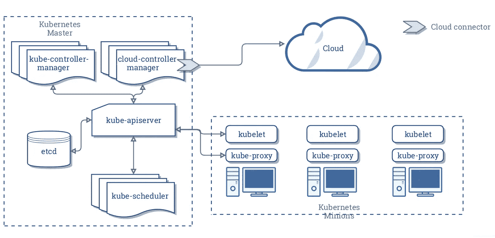
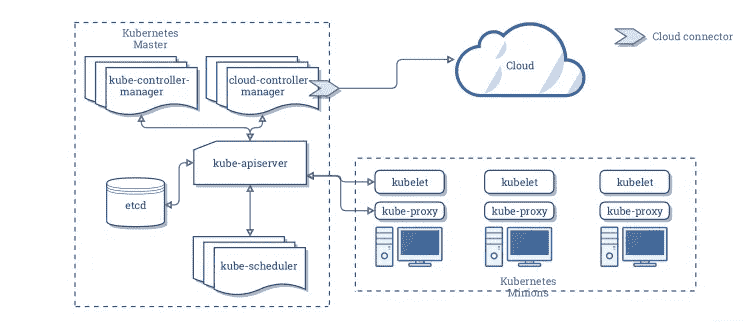

# Kubernetes 上的图形数据库实践

> 原文：<https://medium.com/geekculture/graph-database-in-practice-on-kubernetes-38932dc3396f?source=collection_archive---------15----------------------->



# 什么是 Kubernetes

Kubernetes 是一个开源平台，用于管理云平台上多个主机上的容器化应用程序。Kubernetes 旨在使用户能够简单高效地部署容器化的应用程序。它为用户提供了一套部署、规划、更新和维护应用程序的机制。

在架构上，Kubernetes 为用户部署、维护和扩展应用程序提供了一系列构建块。构成 Kubernetes 的组件是松散耦合和可伸缩的，旨在支持各种工作负载。可伸缩性主要是由 Kubernetes APIs 实现的，这些 API 主要用作伸缩的内部组件和运行在 Kubernetes 上的容器。



Kubernetes 主要由以下核心组件组成:

*   `etcd`。存储整个集群的状态。
*   `kube-apiserver`。提供操作资源的唯一条目，并提供验证、身份验证、访问控制以及 API 注册和查找操作。
*   `kube-controller-manager`。观察集群的状态，例如故障检测、自动扩展和滚动更新。
*   `kube-scheduler`。计划资源。调度器根据预定义的调度策略将 pod 分配给相应的节点。
*   `kubelet`。维护容器的生命周期并管理卷和网络。
*   `kube-proxy`。在群集内提供服务发现和负载平衡。

# Kubernetes 和数据库

数据库容器化现在非常流行，那么 Kubernetes 能给数据库带来什么呢？

*   **故障恢复** : Kubernetes 提供故障恢复特性。如果一个数据库部署在 Kubernetes 上，当应用程序停止运行时，Kubernetes 允许它自动重启或迁移到集群中的另一个节点。
*   **存储管理** : Kubernetes 支持各种存储解决方案，因此部署在其上的数据库可以透明地使用不同的存储解决方案。
*   **负载平衡** : Kubernetes 服务提供了负载平衡功能，因此它可以平衡对数据库实例的不同副本的外部访问。
*   **水平可伸缩性**:根据数据库集群的资源利用率，Kubernetes 可以扩展副本的数量以提高资源利用率。

到目前为止，许多数据库，如 MySQL、MongoDB 和 TiDB，在 Kubernetes 集群上运行良好。

# Kubernetes 上实践中的星云图

NebulaGraph 是一个分布式开源图形数据库。它有三个主要组件:用于查询引擎的 nebula-graphd、用于数据存储的 nebula-stored 和用于元数据的 nebula-metad。Kubernetes 为 NebulaGraph 带来了以下好处:

*   Kubernetes 可以在 nebula-graph、nebula-metad 和 nebula-stored 的不同副本之间平衡负载。它们可以通过 Kubernetes 的域服务自动发现彼此。
*   使用 StorageClass，用户不需要感知 PVC (PersistentVolumeClaim)和 PV (PersistentVolume)的设计。Kubernetes 可以透明地访问本地卷或云存储。
*   在 Kubernetes 上部署 NebulaGraph 集群只需几秒钟，而且 Kubernetes 还可以在用户察觉不到的情况下升级集群。
*   Kubernetes 能够自动恢复星云星团。如果单个副本崩溃，Kubernetes 可以自动恢复它，无需人工干预。
*   Kubernetes 可以根据资源利用率弹性地扩展星云星团以提高其性能。

现在，我来详细介绍一下这种做法。

# 集群部署

## 软件和硬件要求

以下是本练习中涉及的硬件和操作系统的规格:

*   操作系统是 CentOS-7.6.1810 x86_64。
*   虚拟机配置:
*   4 个 CPU
*   8G 内存
*   50G 系统盘
*   50G 数据磁盘 A
*   50G 数据磁盘 B
*   Kubernetes 版本:1.14 或更高版本
*   NebulaGraph 版本:2.0.0-rc1
*   数据存储:本地 PV
*   CoreDNS 版本:1.6.0 或更高版本

## 集群的规划

下表列出了集群的组成方式。

服务器 IPNebula 服务 192 . 168 . 0 . 1 主机 192.168.0.2graphd，metad-0，存储-0 节点 192.168.0.3graphd，metad-1，存储-1 节点 192.168.0.4graphd，metad-2，存储-2 节点

## 要部署的组件

*   舵 3
*   本地卷和本地卷的插件
*   星云图

# 安装舵 3

Helm 是 Kubernetes 的包装经理。Helm 可以简化 Kubernetes 上应用程序的部署。我不会在这篇文章中涉及 Helm 的细节。如果你有兴趣，请参考舵手的[快速入门指南。在本练习中，将使用舵 3。](https://www.hi-linux.com/posts/21466.html)

1.  下载并安装 Helm 3:打开一个终端，运行以下代码。

```
$ wget https://get.helm.sh/helm-v3.5.2-linux-amd64.tar.gz
$ tar -zxvf helm/helm-v3.5.2-linux-amd64.tgz
$ mv linux-amd64/helm /usr/bin/helm
```

2.查看头盔版本

要查看 Helm 的版本，请运行`helm version`。在此示例中，将返回以下行。

```
version.BuildInfo{Version:"v3.5.2", 
GitCommit:"167aac70832d3a384f65f9745335e9fb40169dc2", 
GitTreeState:"dirty", GoVersion:"go1.15.7"}
}
```

# 配置本地卷

在每台服务器上，完成以下配置:

1.  创建一个名为`/mnt/disks`的挂载点。

```
$ sudo mkdir -p /mnt/disks
```

2.格式化数据磁盘。

```
$ sudo mkfs.ext4 /dev/diskA 
$ sudo mkfs.ext4 /dev/diskB
```

3.在挂载点上挂载数据磁盘。

```
$ DISKA_UUID=$(blkid -s UUID -o value /dev/diskA) 
$ DISKB_UUID=$(blkid -s UUID -o value /dev/diskB) 
$ sudo mkdir /mnt/disks/$DISKA_UUID
$ sudo mkdir /mnt/disks/$DISKB_UUID
$ sudo mount -t ext4 /dev/diskA /mnt/disks/$DISKA_UUID
$ sudo mount -t ext4 /dev/diskB /mnt/disks/$DISKB_UUID$ echo UUID=`sudo blkid -s UUID -o value /dev/diskA` /mnt/disks/$DISKA_UUID ext4 defaults 0 2 | sudo tee -a /etc/fstab
$ echo UUID=`sudo blkid -s UUID -o value /dev/diskB` /mnt/disks/$DISKB_UUID ext4 defaults 0 2 | sudo tee -a /etc/fstab
```

4.为本地卷安装插件。

```
$ curl https://github.com/kubernetes-sigs/sig-storage-local-static-provisioner/archive/v2.4.0.zip
$ unzip v2.4.0.zip
```

5.修改`v2.4.0/helm/provisioner/values.yaml`中的`classes`部分:将`hostDir: /mnt/fast-disks`替换为`hostDir: /mnt/disks`，删除`# storageClass: true`中的`#`。然后运行以下命令:

```
$ helm install local-static-provisioner --namespace default sig-storage-local-static-provisioner/helm/provisioner# View the deployment of local-static-provisioner
$ helm list
NAME                        NAMESPACE   REVISION    UPDATED                                 STATUS      CHART               APP VERSION
local-volume-provisioner    default     1           2021-02-10 11:06:34.3540341 +0800 CST   deployed    provisioner-2.4.0   2.4.0
```

# 部署星云图集群

## 下载星云图

```
# Download nebula-charts
$ helm repo add nebula-charts https://vesoft-inc.github.io/nebula-docker-compose/charts
$ helm pull nebula-charts/nebula
$ tar -zxvf nebula-0.2.0.tgz
```

## 设置 Kubernetes 节点

下表列出了 Kubernetes 集群的所有节点。一些节点必须被标记以便调度。在这个例子中，我用`nebula: "cloud"`标记了`192.168.0.2`、`192.168.0.3`和`192.168.0.4`。

服务器 IPkubernetes 角色 dename 192 . 168 . 0 . 1 主机 192 . 168 . 0 . 1192 . 168 . 0 . 2 节点 192 . 168 . 0 . 2192 . 168 . 0 . 3 节点 192 . 168 . 0 . 3192.168.0.4 节点 192 . 168 . 0 . 4

这些命令如下所示。

```
$ kubectl  label node 192.168.0.2 nebula="cloud" --overwrite 
$ kubectl  label node 192.168.0.3 nebula="cloud" --overwrite
$ kubectl  label node 192.168.0.4 nebula="cloud" --overwrite
```

## 更改默认值

这是星云图目录的层次结构。

```
master/kubernetes/
└── helm
    ├── Chart.yaml
    ├── templates
    │&nbsp;&nbsp; ├── configmap.yaml
    │&nbsp;&nbsp; ├── deployment.yaml
    │&nbsp;&nbsp; ├── _helpers.tpl
    │&nbsp;&nbsp; ├── NOTES.txt
    │&nbsp;&nbsp; ├── pdb.yaml
    │&nbsp;&nbsp; ├── serviceaccount.yaml
    │&nbsp;&nbsp; ├── service.yaml
    │&nbsp;&nbsp; └── statefulset.yaml
    └── values.yaml1 directory, 11 files
```

您可以更改`charts/nebula/values.yaml`文件中的默认值以满足您的要求。

## 用头盔安装星云图数据库

```
$ helm install nebula charts/nebula 
# View the deployment status
$ helm status nebula
NAME: nebula
LAST DEPLOYED: Fri Feb 19 12:58:16 2021
NAMESPACE: default
STATUS: deployed
REVISION: 1
TEST SUITE: None
NOTES:
NebulaGraph Cluster installed!1\. Watch all containers come up.
  $ kubectl get pods --namespace=default -l app.kubernetes.io=nebula -w
# View the status of the NebulaGraph cluster deployed on K8s
$ kubectl get pods --namespace=default -l app.kubernetes.io=nebula
NAME                             READY   STATUS    RESTARTS   AGE
nebula-graphd-676cfcf797-4q7mk   1/1     Running   0          6m
nebula-graphd-676cfcf797-whwqp   1/1     Running   0          6m
nebula-graphd-676cfcf797-zn5l6   1/1     Running   0          6m
nebula-metad-0                   1/1     Running   0          6m
nebula-metad-1                   1/1     Running   0          6m
nebula-metad-2                   1/1     Running   0          6m
nebula-storaged-0                1/1     Running   0          6m
nebula-storaged-1                1/1     Running   0          6m
nebula-storaged-2                1/1     Running   0          6m
```

连接到图表服务

```
$ kubectl get service nebula-graphd
NAME            TYPE       CLUSTER-IP      EXTERNAL-IP   PORT(S)                                          AGE
nebula-graphd   NodePort   10.105.47.116   <none>        9669:31646/TCP,19669:30554/TCP,19670:32386/TCP   22m# Use nebula-console to test the Graph service.
$ docker run --rm -ti --entrypoint=/bin/sh vesoft/nebula-console:v2-nightly# Connect to the Graph service with the NodePort mode
/ $ nebula-console -addr 192.168.0.4 -port 31646 -u root -p vesoft
2021/02/19 05:04:55 [INFO] connection pool is initialized successfullyWelcome to NebulaGraph v2.0.0-rc1!(root@nebula) [(none)]> show hosts;
+---------------------------------------------------------------+------+----------+--------------+----------------------+------------------------+
| Host                                                          | Port | Status   | Leader count | Leader distribution  | Partition distribution |
+---------------------------------------------------------------+------+----------+--------------+----------------------+------------------------+
| "nebula-storaged-0.nebula-storaged.default.svc.cluster.local" | 9779 | "ONLINE" | 0            | "No valid partition" | "No valid partition"   |
+---------------------------------------------------------------+------+----------+--------------+----------------------+------------------------+
| "nebula-storaged-1.nebula-storaged.default.svc.cluster.local" | 9779 | "ONLINE" | 0            | "No valid partition" | "No valid partition"   |
+---------------------------------------------------------------+------+----------+--------------+----------------------+------------------------+
| "nebula-storaged-2.nebula-storaged.default.svc.cluster.local" | 9779 | "ONLINE" | 0            | "No valid partition" | "No valid partition"   |
+---------------------------------------------------------------+------+----------+--------------+----------------------+------------------------+
| "Total"                                                       |      |          | 0            |                      |                        |
+---------------------------------------------------------------+------+----------+--------------+----------------------+------------------------+
Got 4 rows (time spent 2608/4258 us)
```

# 常见问题解答

> *如何创建 Kubernetes 集群？*

要创建高可用的 Kubernetes 集群，请参考文档:[https://Kubernetes . io/docs/setup/production-environment/tools/kube ADM/high-avail ability/](https://kubernetes.io/docs/setup/production-environment/tools/kubeadm/high-availability/)。

> 如何调整部署星云星团的参数？

使用`helm install`命令中的`--set`覆盖`nebula-charts`目录下的`values.yaml`文件中的变量。更多信息，请参考[https://helm.sh/docs/intro/using_helm/](https://helm.sh/docs/intro/using_helm/)

> *如何从 K8s 星团外部访问 NebulaGraph 的内部组件？*

在本例中，通过节点端口模式访问图表服务。您也可以通过主机端口、主机网络、入口或负载平衡器模式来访问它。您可以选择合适的选项来满足您的环境要求。

> 如何查看已部署的星云图星团的状态？

运行`kubectl get pods --namespace=default -l app.kubernetes.io=nebula`命令。或者使用 Kubernetes Dashboard 查看集群的状态。

> *如何使用其他类型的储物解决方案？*

请参考[https://kubernetes . io/zh/docs/concepts/storage/storage-classes/](https://kubernetes.io/zh/docs/concepts/storage/storage-classes/)

# 你可能也会喜欢

1.  [星云图建筑——鸟瞰图](https://nebula-graph.io/posts/nebula-graph-architecture-overview/)
2.  [nebula graph 的存储引擎介绍](https://nebula-graph.io/posts/nebula-graph-storage-engine-overview/)
3.  [nebula graph 的查询引擎介绍](https://nebula-graph.io/posts/nebula-graph-query-engine-overview/)