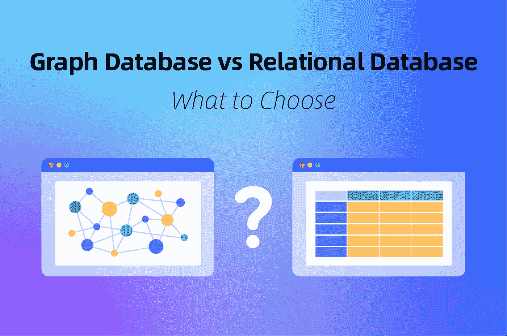

# 图形数据库 vs 关系数据库:选择什么？

> 原文：<https://medium.com/geekculture/graph-database-vs-relational-database-what-to-choose-6c37d6300e31?source=collection_archive---------11----------------------->

数据在推动业务增长中的地位显而易见，许多组织都在积极收集和利用数据。随着数据变得更容易访问和分析，它在帮助组织识别趋势、了解客户行为、优化产品和实现利润最大化方面发挥着越来越重要的作用。在许多方面，数据已经成为“新的石油”——一种可以用来推动增长和竞争优势的宝贵商品。谨慎的数据组织、操作和管理是这种新石油商品化的核心。如果没有数据库工具，我们今天看到的这种突破性的数据驱动的应用是不可能实现的。从社交网站到电子商务市场的推荐引擎，都是为了从数据中创造价值，而数据库是这里的核心。事实上，[数据库管理系统全球市场](https://www.researchandmarkets.com/reports/5310748/database-management-systems-dbms-global)预计将以 12.2%的 CAGR 增长，到 2027 年将达到 142.7 万亿美元。

根据您想用数据实现的目标，您可能经常会走到十字路口，必须在数据库之间做出选择。图形数据库与关系数据库就是这样一个十字路口，许多人可能都在苦苦挣扎。下面我们来区分一下这两个，帮你选择合适的。

# 什么是图形数据库？

图形数据库是一个 [NoSQL 数据库](https://nebula-graph.io)，其中数据存储为网络图。典型的图形数据库包含表示和存储数据的边、节点和属性。关系是图形数据库中的一等公民，用唯一的键来标识。通过使关系成为一等公民，图数据库可以更有效地存储、检索和遍历数据。图形数据库擅长处理具有复杂关系的数据，因此对社交网络、[推荐引擎](https://nebula-graph.io/posts/use-cases-of-graph-databases-in-real-time-recommendation)和欺诈检测等应用非常有用。

一个[开源图形数据库](https://nebula-graph.io/)总是最好的起点，因为他们有一个支持性的社区，最终创造了完美的生态系统。

# 图形数据库是如何工作的？

图形数据库通过使用两个基本元素来工作:节点和边。图中的节点代表实体，边代表这些实体之间的关系。这允许更灵活和有效的查询。例如，在一个社交网络中，每个用户由一个节点表示，而边则表示用户之间的关系。图形数据库可以很容易地回答诸如“谁是我朋友的朋友？”或者“我通过什么途径连接到另一个用户？”

他们执行遍历查询并应用算法来确定模式、影响者、路径、故障点和社区。了解这些方面可以让用户有效地分析海量数据。

# 图形数据库的类型

基于数据模型和存储，图形数据库可以分为两大类。

# 基于数据模型的图形数据库

这一类别下有三种主要类型，即属性段落、RDF 图和超图

## 1.属性图

属性图组织关系、节点和属性中的数据，并将数据存储在关系或节点上。

节点是实体，可以保存多个称为属性的属性。您可以使用代表节点在域中的角色的标签来标记节点。此外，标签可以将元数据(如约束或索引信息)附加到特定节点。

关系提供不同节点之间的相关连接。该关系是定向的、命名的，并且具有开始和结束节点。此外，关系具有量化属性，如距离、成本、评级、权重、强度和时间间隔。关系被有效地存储，因此节点可以共享关系而不损害性能。关系的导航可以在任一方向上进行，尽管事实上它们是单向存储的。

## 2.超图

超图是允许关系连接到多个节点的数据模型，允许在任一端有几个节点。这将使用户能够分析和存储具有众多[多对多关系](https://condor.depaul.edu/gandrus/240IT/accesspages/relationships.htm)的数据。超图中的关系被称为超边。

与属性图相比，超图有多维边，使它们更一般化。然而，这两者是同构的，也就是说你可以将一个超图呈现为一个属性图，但你不能反过来。

## 3.资源描述框架(RDF)

RDF 或三重存储以主题-数据-对象数据结构的三部分格式存储数据。单独的节点用于显示任何附加信息。RDF 图模型由弧和节点组成，图符号由两个节点表示，一个表示主语，另一个表示宾语，弧表示谓语。

三元组存储被归类为数据模型图数据库，因为它们处理逻辑链接的数据。但是，它们的存储引擎没有针对属性图进行优化，也不支持无索引邻接；因此，它们不是本地图形数据库。

RDFs 可以水平扩展，但不能快速横向扩展关系，因为它们将三元组存储为单个元素。他们必须从独立的事实中创建连接，并增加执行图形查询的延迟。三重存储主要应用于离线分析，因为它们在延迟和规模方面存在缺点。

# 基于存储的图形数据库

此类别还包含三种主要类型，即本机存储图、关系存储图和键值存储图:

## 1.本地图形存储

本地图形存储使用边和顶点单元来存储和管理图形数据库。它最适合多跳或深层链接图分析。本机图形存储旨在最大化任意图形算法中的遍历速度。

## 2.相关存储器

这个图形数据库使用关系模型存储边和顶点表。在运行时，关系“连接”将两个表连接在一起。关系模型使用直观且易于理解的方式在表格中表示数据。每一行都是一个带有键的记录，键是惟一的 ID。每列保存数据的一个属性，每条记录都有属性值。这使得识别数据点之间的关系变得容易。

## 3.键值存储

键值存储是一种使用 NoSQL 数据库存储数据的非关系数据库。它以键-值对的形式存储数据，其中键是唯一的标识符。键和值的范围从复杂的复合对象到简单的对象。

也许键-值图数据库相对于关系数据库的最大好处是键-值图是高度可划分的。因此，它允许大多数数据库类型无法实现的水平伸缩。

# 图形数据模型与关系数据模型

尽管图形数据和关系模型都关注数据关系，但它们的做法不同。

您决定哪些实体将成为节点和链接，哪些实体将在图形数据模型中被丢弃。这将产生一个蓝图，您可以使用它来创建图表的可视化模型。

关系数据模型使用一个值表，根据数据库条目之间的关系对它们进行分组。表中的每一行代表相应的数据值，并表示现实世界的关系。表名和列名有助于解释每行中的值。

图形数据模型在单个记录级别存储关系。另一方面，关系数据模型使用预定义的结构，称为表定义。但是，您可以将关系数据库转换为图形数据库。

# 图形数据库和关系数据库的主要区别

图形数据库和关系数据库的根本区别在于如何处理关系。在图形数据库中，关系是由数据点驱动的。在关系数据库中，关系是由数据表中的列驱动的。

以下是详细的区别:

*   **存储格式:**一个图形数据库将实体存储为节点，将关系存储为边。关系数据库将数据存储在具有行和列的表中，并使用“连接”进行快速查询。
*   **数据集大小:**图形数据库即使对于大型数据集也很快，而关系数据库则较慢。
*   **索引**:图数据库通常使用无索引邻接，这意味着每个节点都与数据库中的每个其他节点相连，而关系数据库使用索引指针来连接相关数据。
*   **事务:**图数据库通常不太支持事务，而关系数据库可以完美地支持事务，甚至会计。
*   **处理能力:**图形数据库需要更多的处理能力和存储空间。

# 图形数据库相对于关系数据库的优势

您选择图形数据库而不是关系数据库是有原因的，这是由优势决定的。以下是关系数据库相对于图形数据库的主要优势:

# 1.图形数据库更擅长处理关系

当涉及到处理关系时，图形数据库是王者，因为它们的构建方式。它们可以很容易地表示数据点之间的复杂关系。

当您试图对自然分层的数据(如社交网络或业务关系)进行建模时，这是一个巨大的优势。使用图形数据库，您可以轻松地创建实体并跟踪它们之间的关系。这使得查找和理解数据变得更加容易，当您试图基于对数据的洞察做出快速决策时，这一点至关重要。

在关系数据库中，您必须提前定义表之间的关系。使用图形数据库，您可以动态定义关系，这使得处理复杂的数据模型变得更加容易。

# 2.图形数据库更具可扩展性

这意味着图形数据库可以处理大量数据而不会遇到问题。随着数据量的持续增长，这是一个越来越重要的考虑因素。

您可以轻松地将数据库划分到多个服务器上，同时保持重要的合规性，如隐私要求。

# 3.图形数据库可以更高效

当谈到图形数据库与关系数据库的性能时，数据在图形数据库中以图形格式存储，这使得导航和查找数据点之间的连接更加容易。其次，图形数据库中数据的组织方式使得更有效地索引数据成为可能。这意味着查询可以更快地执行，从而带来更好的性能和用户体验。

实际上，您可以在不影响性能的情况下增加关系。

# 4.图形数据库提供了更灵活的数据建模

有了图形数据库，您可以按照自己的意愿对数据建模，这意味着您不再局限于关系数据库的僵化结构。通过将数据表示为一系列相互连接的节点，图形数据库可以更准确地捕捉错综复杂的关系网。

# 5.图形数据库更容易理解

图形数据库中的事情更容易理解。事实上，您可以将图数据库视为节点和节点间关系的集合。就是这样！

没有必要担心表、列或外键。只要创建你的节点和关系，你就可以开始了。这使得数据管理变得轻而易举，也让其他人更容易理解你在做什么。

# 6.图形数据库更容易被信任

图形数据库更值得信任，因为它们基于一个表的模型。在图形数据库中，表被称为图形，它包含关于实体和实体之间关系的所有信息。

这使得查找信息更加容易，因为不需要连接表或运行复杂的查询。您需要做的就是找到您感兴趣的节点，并查看与之相关的关系。

# 7.图形数据库可以更好地处理数据一致性

假设你是一个零售商，你有一个客户数据库。关系数据库可以很好地存储关于客户的信息，但它不是处理客户-产品交互的最佳工具。

为什么？因为关系数据库是基于规范化模型的，这意味着数据被分为表和列。当你试图查询数据时，这会导致不一致。例如，如果您想获得特定产品的所有客户的列表，您可能需要查询两个或三个不同的表。

另一方面，图形数据库基于非规范化模型，这意味着数据存储在一个地方。这使得查询数据变得更加容易，因为所有的东西都在一个地方。

# 8.图形数据库可以更具扩展性

这仅仅意味着它们可以处理更多的数据组合。例如，假设您想要跟踪人、组织和事物之间的关系。图形数据库非常适合这项任务，而关系数据库很快就会过载。

图形数据库也非常适合管理快速变化的数据，如社交媒体数据或传感器数据。这是因为他们可以快速适应数据模型的变化，而不必执行完整的数据库重建。

# 什么时候应该使用图形数据库？

图形数据库非常适合需要存储和检索可以用图形表示的数据的应用程序，例如社交网络、地图和网络。它们也非常适合需要分析以复杂方式连接的数据的应用，例如[欺诈检测](https://nebula-graph.io/posts/fraud-detection-using-knowledge-and-graph-database)和推荐引擎。

例如，在社交网络中，用户的朋友也是彼此的朋友。一个图数据库可以快速找到一个用户的朋友的所有朋友。相比之下，关系数据库需要执行多次连接才能找到相同的信息。通过区分关系的优先级，图形数据库可以提供对数据更深入的了解。一般来说，任何能够将数据表示为互连节点网络的应用程序都是图形数据库的理想选择。

# 结论

理解图形数据库和关系数据库是构建有效数据模型的第一步，这将为互联数据提供有价值的见解。同样重要的是要注意，这两者不是可替代的，而是各有不同的用途。

在图形和关系数据库中，您需要记住的最重要的一点是，图形数据库更适合需要数据点之间的多种关系的应用程序，而关系数据库更适合数据结构不太复杂的应用程序。

# 常见问题部分

# 图形数据库和关系数据库有什么不同？

一个[图形数据库](https://nebula-graph.io)使用图形结构进行语义查询，用节点、边和属性来表示和存储数据。另一方面，关系数据库使用表和它们之间的关系来存储数据。图形数据库用于查询复杂的关系，而关系数据库用于更简单的关系结构。此外，图形数据库通常比关系数据库需要更少的连接。因此，在处理复杂数据时，图形数据库可以更快、更有效。

# 图数据库比关系数据库好吗？

很大程度上是的。图形数据库比关系数据库更好，因为它们更灵活，可以处理更复杂的数据关系。关系数据库基于数据的表结构，一旦数据进入数据库，就很难改变。另一方面，图形数据库基于数据的图形结构，这种结构很容易改变。考虑到数据变得越来越复杂，像 NebulaGraph 数据库这样的图形数据库对于大多数优先处理复杂数据的用例来说要好得多。

# 图形数据库不适合做什么？

图形数据库非常适合存储具有复杂关系的数据，例如社交网络或财务数据。然而，图形数据库不太适合于存储易于用表格格式表示的数据，如产品目录或客户订单。