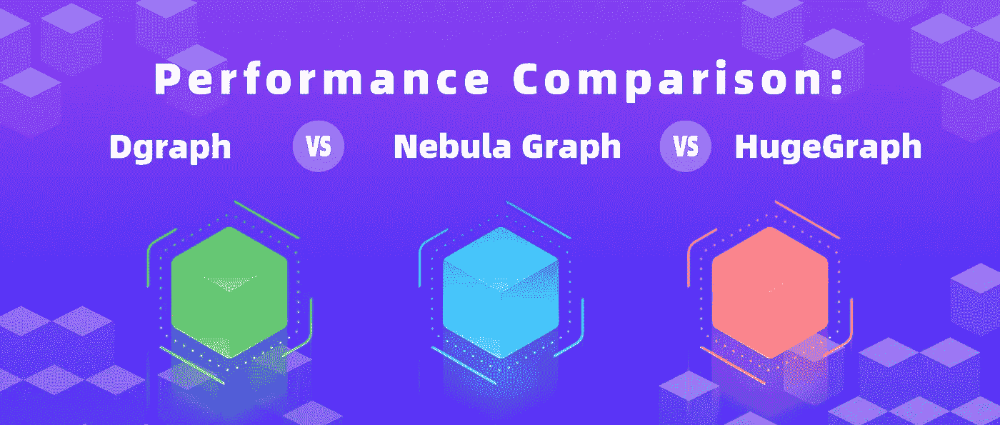
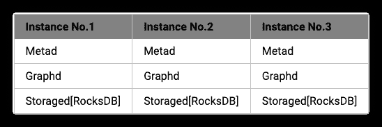
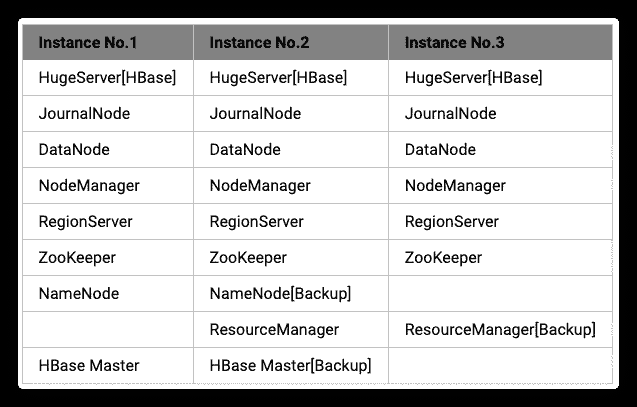
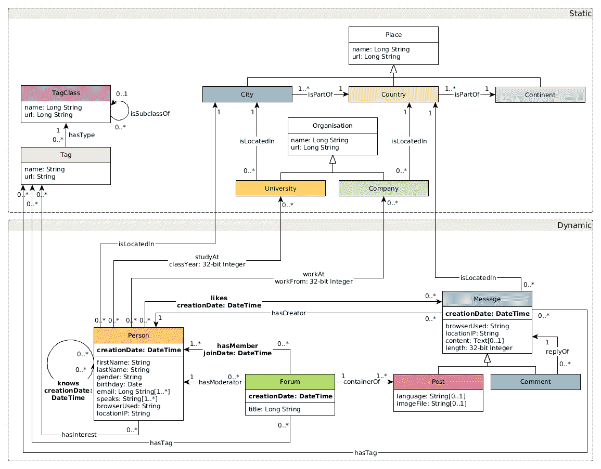

# 图表数据库比较:nebula graph vs . Dgraph vs . Janus graph

> 原文：<https://medium.com/geekculture/graph-databases-comparison-nebulagraph-vs-dgraph-vs-janusgraph-bb785db819fe?source=collection_archive---------5----------------------->



深度学习和知识图谱技术近年来发展迅速。与深度学习的“黑盒”相比，知识图具有高度的可解释性，因此在搜索推荐、智能客户支持和金融风险管理等场景中被广泛采用。美团在过去几年中一直在深入挖掘隐藏在海量商业数据中的联系，并逐步开发了近十个领域的知识图表，包括美食图表、旅游图表和商品图表。最终目标是提升智能本地生活。

与传统的关系数据库相比，图数据库可以有效地存储和查询知识图。选择图数据库作为存储引擎在多跳查询中具有明显的性能优势。目前，市场上有几十种图形数据库解决方案。美团团队当务之急是选择一个能够满足业务需求的图数据库解决方案，并将该解决方案作为美团的图存储和图学习平台的基础。该团队根据我们的业务现状概述了以下基本要求:

1.  这应该是一个开源项目，也是商业友好的，通过控制源代码，美团团队可以确保数据安全和服务可用性。
2.  它应该支持聚类，并且应该能够在存储和计算能力方面进行水平扩展。美团中的知识图数据大小总共可以达到数千亿个顶点和边，吞吐量可以达到数万个 QPS。话虽如此，单节点部署无法满足美团的存储需求。
3.  它应该在 OLTP 场景下工作，具有毫秒级的多跳查询能力。为了确保美团用户的最佳搜索体验，团队严格限制了所有路径链的超时值。因此，在第二级响应查询是不可接受的。
4.  它应该能够批量导入数据知识图数据通常存储在像 Hive 这样的数据仓库中。图形数据库应该具备将数据从这些仓库快速导入图形存储的能力，以确保服务的有效性。

美团团队在 [DB-Engines](https://db-engines.com/) 上尝试了排名前 30 的图数据库，发现大多数知名的图数据库只支持其开源版本的单节点部署，例如 Neo4j、ArangoDB、Virtuoso、TigerGraph、RedisGraph。这意味着存储服务无法横向扩展，无法满足存储大规模知识图数据的需求。经过彻底的研究和比较，该团队为最后一轮选择了以下图形数据库:NebulaGraph、Dgraph 和 HugeGraph。

# 测试过程的总结

## 硬件配置

1.  数据库实例:运行在不同机器上的 Docker 容器
2.  单实例资源:32 个内核、64 GB 内存、1 TB 固态硬盘(英特尔至强金牌 5218 CPU @ 2.30 GHz)
3.  实例数量:三个

## 部署计划

星云图 1.0.1 版

元服务负责管理集群元数据。查询服务负责查询的执行。存储服务负责存储分片数据。RocksDB 充当存储后端。请参见下面的详细信息:



图表 v20.07.0

Zero 负责集群元数据管理。Alpha 负责查询执行和数据存储。存储后端由 Dgraph 开发。请参见下面的详细信息:


HugeGraph v0.10.4

HugeServer 负责集群元数据管理和查询执行。尽管 HugeGraph 支持 RocksDB 作为存储后端，但它不支持 RocksDB 作为集群的存储后端。因此，该团队选择 HBase 作为存储后端。请参见下面的详细信息:



用于基准测试的数据集

该团队使用 [LDBC](https://github.com/ldbc) 数据集进行基准测试。



以下是对数据集中数据的简要介绍:

1.  数据生成参数:分支=稳定，版本=0.3.3，规模=1000
2.  实体:四类 26 亿个实体
3.  关系:19 种类型的 177 亿个关系
4.  数据格式:CSV
5.  压缩后的数据大小:194 GB

# 基准测试结果

基准测试从三个角度进行，即批量数据导入、实时数据写入和数据查询。

## 批量数据导入

批量导入数据的步骤如下:

1.  在配置单元中生成 CSV 文件
2.  图形数据库支持的中间文件
3.  将数据导入图形数据库

每个图形数据库中的数据导入过程描述如下:

*   敬星云图。在 Hive 中执行 Spark 任务，在 RocksDB 中生成 SST 文件；然后把 SST 文件上传到 NebulaGraph。
*   敬 Dgraph。在 Hive 中执行 Spark 任务，生成 RDF 文件；然后执行批量加载操作，为集群的每个节点生成持久文件。
*   敬 HugeGraph。执行 loader 直接将数据从 Hive 插入 CSV 文件中的 HugeGraph。

**数据导入检测结果**

数据库|导入方式|每一步消耗的时间|导入前占用(gziped)|导入后占用|空间放大比|节点间负载均衡-|-|-|-|-|-|-星云|1。Hive->sst 文件
2。sst 文件- > DB|1。3.0h
2。0.4h | 194g | 518g | 2.67 x | 176g/171g/171g
节点间均衡 Dgraph|1。Hive- > rdf 文件
2。rdf 文件- > DB |1。4.0h
2。8.7h
OOM |4.2G
不能全尺寸进口。|24G
导入的用户关系仅用于空间放大测试|5.71x|1G/1G/22G
节点间不平衡 HugeGraph|1。蜂巢- > csv
2。csv- > DB|1。2.0h
2。9.1h
磁盘空间不足|4.2G
无法以完整大小导入。|41G
导入的用户关系仅用于空间放大测试|9.76x|11G/5G/25G
节点间不平衡

从上面的结果可以看出，该团队发现 NebulaGraph 的性能最好，因为它的时间消耗最低，存储放大比最小。数据按主键散列分布，存储在节点间平衡。

在 Dgraph 中，原始数据大小为 194 GB，服务器内存为 392 GB 由于 OOM，大容量装载操作在 8.7 小时后暂停，导致部分成功。RDF 模型中的数据由谓词分布，一种类型的关系只能存储在同一个节点上，这导致了节点间存储和计算的严重不平衡。

在 HugeGraph 中，原始数据大小为 194GB。执行数据导入操作时，1000GB 的节点已满，导入部分成功。HugeGraph 中存储放大倍数最大，节点间数据分布严重不平衡。

## 实时数据写入

该测试旨在实时向图形数据库插入顶点和边，并测试每个数据库的写入性能。下面是如何定义指标的简要描述。

1.  **响应时间。**以固定的 QPS 发送 50，000 个写请求，记录成功发送所有请求所用的时间。根据 avg、p99 和 p999，获得从发送请求到在客户端收到响应所消耗的时间。
2.  **最大吞吐量。**以逐渐增加的 QPS 发送 1，000，000 个写请求，并持续查询数据。一分钟内的峰值 QPS(成功的请求)是最大的吞吐量。

**如何将节点插入图形数据库**

星云图

```
INSERT VERTEX t_rich_node (creation_date, first_name, last_name, gender, birthday, location_ip, browser_used) VALUES ${mid}:('2012-07-18T01:16:17.119+0000', 'Rodrigo', 'Silva', 'female', '1984-10-11', '84.194.222.86', 'Firefox')
```

数据图表

```
{
    set {
        <${mid}> <creation_date> "2012-07-18T01:16:17.119+0000" .
        <${mid}> <first_name> "Rodrigo" .
        <${mid}> <last_name> "Silva" .
        <${mid}> <gender> "female" .
        <${mid}> <birthday> "1984-10-11" .
        <${mid}> <location_ip> "84.194.222.86" .
        <${mid}> <browser_used> "Firefox" .
    }
}
```

胡格格拉夫

```
g.addVertex(T.label, "t_rich_node", T.id, ${mid}, "creation_date", "2012-07-18T01:16:17.119+0000", "first_name", "Rodrigo", "last_name", "Silva", "gender", "female", "birthday", "1984-10-11", "location_ip", "84.194.222.86", "browser_used", "Firefox")
```

**如何在图形数据库中插入边**

星云图

```
INSERT EDGE t_edge () VALUES ${mid1}->${mid2}:();
```

数据图表

```
{
    set {
        <${mid1}> <link> <${mid2}> .
    }
}
```

胡格格拉夫

```
g.V(${mid1}).as('src').V(${mid2}).addE('t_edge').from('src')
```

**实时写入测试结果**

**响应时间**

实时写入
响应时间(毫秒)|在 QPS 插入顶点= 100
avg/p99/p999 |在 QPS 插入边=100
avg / p99 / p999 -|-|-星云| 3/10/38 | 3/10/34 DGraph | 5/13/54 | 5/9/43 huge graph | 37/159/1590 | 28/93/1896

**最大吞吐量**

实时写
最大吞吐量|插入顶点
QPS |插入边缘
QPS -|-|-星云| 84000 | 76000 DGraph | 10138 | 9600 huge graph | 410 | 457

**实时写测试结果分析**

从上面的结果可以看出，NebulaGraph 的响应时间和吞吐量在测试中处于领先地位，因为由于其架构，写请求可以分布到多个存储节点。

在 Dgraph 中，响应时间和吞吐量与 NebulaGraph 相比并不好，因为一种类型的关系可以按照其结构存储在相同的节点上。

HugeGraph 在响应时间和吞吐量方面表现最差，因为存储后端是 HBase，其并发读写能力低于 RocksDB(Nebula Graph 采用)和 BadgerDB(d Graph 采用)。

## 数据查询

数据查询基准测试是为了测试候选图形数据库的读取性能，它基于以下常见查询:返回 ID 的 n 跳查询、返回属性的 n 跳查询和共享朋友查询。下面是如何定义指标的简要描述。

1.  **响应时间**。以固定的 QPS 发送 50，000 个读取请求，并记录发送所有请求所用的时间。根据 avg、p99 和 p999，获得从发送请求到在客户端收到响应所消耗的时间。如果在发送读取请求后 60 秒内没有收到响应，则返回超时错误。
2.  **最大吞吐量。**以逐渐增加的 QPS 发送 1，000，000 个读取请求，并持续查询数据。一分钟内的峰值 QPS(成功的请求)是最大的吞吐量。
3.  **缓存配置**。该测试中的所有图形数据库都支持从高速缓存中读取，并且该特性在默认情况下是打开的。每次进行测试之前，团队都会清理服务器缓存。

**返回 ID 为的 N 跳查询示例代码**

星云图

```
GO ${n} STEPS FROM ${mid} OVER person_knows_person
```

数据图表

```
{
 q(func:uid(${mid})) {
   uid
   person_knows_person { #${n}Hops = Embedded layers
     uid
   }
 }
}
```

胡格格拉夫

```
g.V(${mid}).out().id() #${n}Hops = out()Length of the link
```

**返回属性的 N 跳查询示例代码**

星云图

```
GO ${n} STEPS FROM ${mid} OVER person_knows_person YIELDperson_knows_person.creation_date, $$.person.first_name, $$.person.last_name, $$.person.gender, $$.person.birthday, $$.person.location_ip, $$.person.browser_used
```

数据图表

```
{
  q(func:uid(${mid})) {
    uid first_name last_name gender birthday location_ip browser_used
    person_knows_person { #${n}Hops = Embedded layers
      uid first_name last_name gender birthday location_ip browser_used
    }
  }
}
```

胡格格拉夫

```
g.V(${mid}).out()  #${n}Hops = out()Length of the link
```

**共享好友查询示例代码**

星云图

```
GO FROM ${mid1} OVER person_knows_person INTERSECT GO FROM ${mid2} OVER person_knows_person
```

数据图表

```
{
  var(func: uid(${mid1})) {
    person_knows_person {
      M1 as uid
    }
  }
  var(func: uid(${mid2})) {
    person_knows_person {
      M2 as uid
    }
  }
  in_common(func: uid(M1)) @filter(uid(M2)){
    uid
  }
}
```

胡格格拉夫

```
g.V(${mid1}).out().id().aggregate('x').V(${mid2}).out().id().where(within('x')).dedup()
```

**返回 ID 为的 N 跳查询的测试结果**

ID 为的 N 跳查询返回
响应时间(毫秒)|N = 1，QPS = 100
avg / p99 / p999|N = 2，QPS = 100
avg / p99 / p999|N = 3，QPS = 10
avg / p99 / p999 -|-|-|-星云| 4/13/45 | 24/160/268 | 1908/11304/11304d graph

ID 为的 N 跳查询返回了
最大吞吐量(QPS)|N = 1
返回的平均邻居数= 62|N = 2
返回的平均邻居数= 3844|N = 3
返回的平均邻居数= 238328-|-|-|-Nebula | 80830 | 6950 | 32 Dgraph | 8558 | 100 | time out huge graph | 804 | time out | time out

**返回了属性的 N 跳查询的测试结果**

单个顶点上属性的平均大小是 200 字节。

返回属性的 N 跳查询
响应时间(毫秒)|N = 1，QPS = 100
avg / p99 / p999|N = 2，QPS = 100
avg / p99 / p999|N = 3，QPS = 10
avg / p99 / p999 -|-|-|-星云| 5/20/49 | 99/475/1645 | 48052/>60s/>60s DG

ID 为的 N 跳查询返回了
最大吞吐量(QPS)|N = 1
返回的平均邻居数= 62|N = 2
返回的平均邻居数= 3844|N = 3
返回的平均邻居数= 238328-|-|-|-Nebula | 36400 | 730 | 2dgraph | 80 | time out | time out huge graph | 802 | time out | time out

**共享好友查询的测试结果**

*该测试不包括最大吞吐量。*

共享好友查询
响应时间(毫秒)| QPS = 100
avg / p99 / p999 -|-|-星云| 4/20/42 Dgraph | 4/13/36 huge graph | 39/366/1630

**数据查询检测结果分析**

在返回 ID 的一跳查询的响应时间(延迟)测试中，NebulaGraph 和 Dgraph 需要搜索一次外出边。由于 Dgraph 中的存储架构，相同类型的边存储在同一个节点中。因此，Dgraph 中的一跳查询不存在网络消耗。在星云图中，边被分布到多个节点，这就是为什么 Dgraph 在这次测试中比星云图表现得稍微好一点。

在返回 ID 的一跳查询的吞吐量(QPS)测试中，集群的 CPU 负载受到存储边的单个节点的限制，导致集群的 CPU 占用率较低。所以 Dgraph 的最大吞吐量只有那个 od 星云图的 11%。

在返回 ID 的两跳查询的响应时间(延迟)测试中，由于上述相同的原因，当 QPS 设置为 100 时，Dgraph 中的实际负载几乎达到了集群的上限。因此，Dgraph 中的潜伏期显著延长至星云图中的 3.9x。

在返回属性的单跳查询测试中，NebulaGraph 将顶点上的所有属性作为数据结构存储在单个节点中。因此，搜索的次数等于输出边 y 的数量。在 Dgraph 中，顶点上的属性被视为输出边，并被分配给不同的节点。因此，搜索的数量等于 X(即属性的数量)和 Y(即输出边的数量)的乘积。正因如此，Dgraph 的性能比星云图差。同样的规则也适用于多级跳查询。

共享好友查询的测试与返回 ID 的两个单跳查询的测试几乎相同。因此，两次测试的结果非常相似。

HugeGraph 的存储后端是 HBase，并发读写能力低于 RocksDB(星云图采用)和 BadgerDB(DG Graph 采用)。因此，在响应时间和吞吐量方面，HugeGraph 的表现比其他两个要差。

# 结论

美团团队最终选择了 NebulaGraph 作为我们的图形存储引擎，因为它在批量数据导入速度、实时写入性能和 n 跳查询性能方面优于其他两个候选引擎。

# 参考

*   NebulaGraph 基准:[https://discuse . nebula-graph . io/t/nebula-graph-1-0-Benchmark-report/581](https://discuss.nebula-graph.io/t/nebula-graph-1-0-benchmark-report/581)
*   腾讯云团队的图形数据库性能对比:[https://discuse . nebula-graph . io/t/Performance-Comparison-neo4j-vs-nebula-graph-vs-Janus graph/619](https://discuss.nebula-graph.io/t/performance-comparison-neo4j-vs-nebula-graph-vs-janusgraph/619)
*   Dgraph 基准:【https://dgraph.io/blog/tags/benchmark/ 
*   TigerGraph 基准:[https://www.tigergraph.com/benchmark/](https://www.tigergraph.com/benchmark/)
*   RedisGraph Benchmark:[https://redis labs . com/blog/new-RedisGraph-1-0-achieves-600 x-faster-performance-graph-databases/](https://redislabs.com/blog/new-redisgraph-1-0-achieves-600x-faster-performance-graph-databases/)

> *本次基准测试由美团 NLP 团队的赵登昌和高晨进行。*