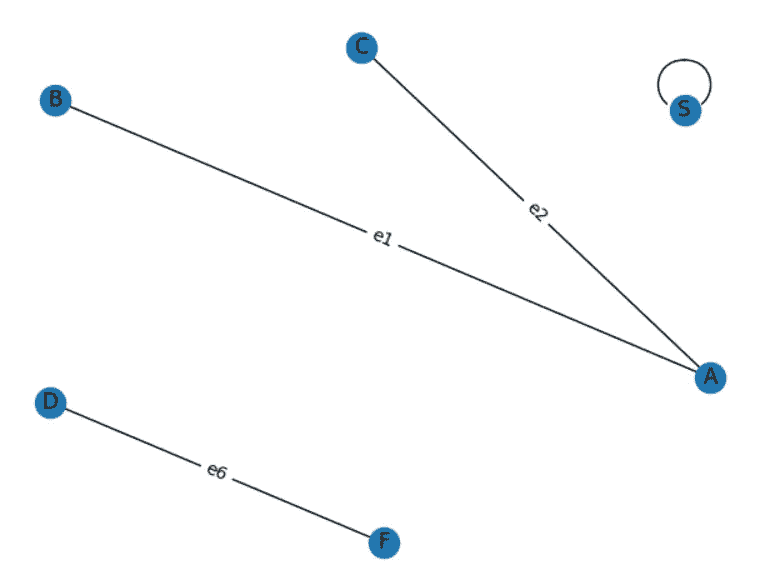
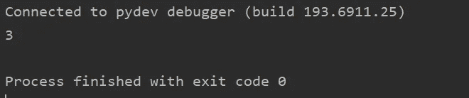

# 图形或网络—第 4 章

> 原文：<https://medium.com/geekculture/graph-or-networks-chapter-4-a04a34a2f084?source=collection_archive---------8----------------------->

**通过深度优先搜索找到图形组件的数量**

如果你没有读过以前的文章，并且是图论的新手，我强烈建议你访问下面的链接，以便更好地理解。

*   [第 1 章](/geekculture/graphs-or-networks-chapter-1-57aa9497be06)
*   [第二章](/geekculture/graphs-or-networks-chapter-2-2af64596858e)
*   [第三章](/p/d3d4f6a66f01)

**问题陈述:**在下图中找出不同部件的数量。



Graph 1

```
import networkx as nx
import matplotlib.pyplot as plt
import pandas as pd

data = [('A','B','e1'),("A","C",'e2'),("D","F",'e6'),("S","S",'e7')]
df = pd.DataFrame(data=data,columns=['node1','node2','edge'])
graph = nx.from_pandas_edgelist(df=df, source='node1', target='node2', edge_attr='edge',create_using=nx.Graph())
pos = nx.spring_layout(graph, k=5)
nx.draw(graph, pos, with_labels=True)
labels = {edge_attribute: graph.edges[edge_attribute]['edge'] for edge_attribute in graph.edges}
nx.draw_networkx_edge_labels(graph, pos, edge_labels=labels)
plt.show()
```

通过视觉观察，我们可以看到图 1 包含 3 个不同的部分，即(D，F)，(A，B，C)和(S)。

我们可以在 DFS 算法之上添加一个逻辑来获得组件的数量。

*   存储元件数量的计数器。
*   DFS 上的一个循环和条件，用于检查是否所有的节点都被访问过。

```
import networkx as nx
import pandas as pd

data = [('A','B','e1'),("A","C",'e2'),("D","F",'e6'),("S","S",'e7')]
df = pd.DataFrame(data=data,columns=['node1','node2','edge'])
graph = nx.from_pandas_edgelist(df=df, source='node1', target='node2', edge_attr='edge',create_using=nx.Graph())
total_nodes = len(graph.nodes)
is_seen = [False] * total_nodes
n_component = 0

def depth_first_algo(graph,start_node='A'):
    start_node_index = list(graph.nodes).index(start_node)
    if is_seen[start_node_index]:
        # print('retracting from',start_node)
        return 0
    is_seen[start_node_index] = True
    node_neighbours = graph.neighbors(start_node)
    for neighbour in node_neighbours:
        # print('neighbour:',neighbour)
        depth_first_algo(graph,start_node=neighbour)

for i in range(total_nodes):
    if False in is_seen:
        start_node = list(graph.nodes)[is_seen.index(False)]
        depth_first_algo(graph,start_node=start_node)
        n_component += 1

print(n_component)
```



在上面的代码中，我们在一个循环中调用 DFS 算法(循环限制设置为图中的节点数)。

*   一个循环从图中的一个根节点开始，并在解析所有邻居时结束。
*   在循环期间，代码更新“ **is_seen** ”列表，在被访问节点的索引处具有真值。
*   在迭代之后，如果一些节点没有被访问，则意味着这些节点不在与开始节点相同的组件中。
*   DFS 算法仅当在" **is_seen"** 列表中找到任何" **False"** 值时才运行。因此，DFS 运行的次数表示图中出现的组件数量(" **n_component"** )。

请在评论区分享您的观点或对后续文章的任何建议。干杯！

# 舒巴姆·萨凯特

*   如果你喜欢这篇文章，请关注我的*[***中的***](https://saket-shubham16.medium.com) *以获取更多此类文章。**
*   **在*[***LinkedIn***](https://www.linkedin.com/in/shubham-saket)***上跟我连线。****