# 图形或网络—第 3 章

> 原文：<https://medium.com/geekculture/graph-or-networks-depth-first-search-algorithm-d3d4f6a66f01?source=collection_archive---------14----------------------->

**深度优先搜索算法**

如果你还没有读过以前的文章，并且是图论的新手，我强烈建议你访问下面的链接来加深理解。

*   [第 1 章](/geekculture/graphs-or-networks-chapter-1-57aa9497be06)
*   [第二章](/geekculture/graphs-or-networks-chapter-2-2af64596858e)

图的遍历是图论中最有趣的课题之一，深度优先搜索是最基本最简单的遍历算法之一。

> **DFS 从根节点开始，在回溯之前，即当它遇到叶节点或已经看到的节点时，尽可能地搜索每条边。根节点可以是随机的或用户定义的。**

**发展直觉**:

*   让我们创建一个图表，我们将在其上实现 DFS。

```
import networkx as nx
import matplotlib.pyplot as plt
import pandas as pd

data = [('A','B','1'),("A","C",'2'),("C","D",'6'),("C","E",'4'),
        ("B","C",'3'),("F","D",'7'),("D","B",'5')]
df = pd.DataFrame(data=data,columns=['node1','node2','edge'])
graph = nx.from_pandas_edgelist(df=df, source='node1', target='node2', edge_attr='edge',create_using=nx.Graph())
pos = nx.spring_layout(graph, k=5)
nx.draw(graph, pos, with_labels=True)
labels = {edge_attribute: graph.edges[edge_attribute]['edge'] for edge_attribute in graph.edges}
nx.draw_networkx_edge_labels(graph, pos, edge_labels=labels)
plt.show()
```

注意:边数仅用于识别边，而不是权重。

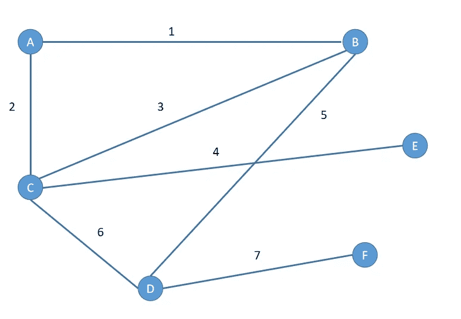

Graph 1

*   设根节点为“A”。(选择根节点作为“A”的决定是任意的。)

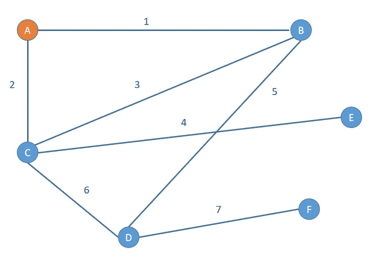

Graph 2

*   因为 A 有两个邻居“B”和“C”。(任意选择任一节点。).在这个例子中，让我们遍历边 1。

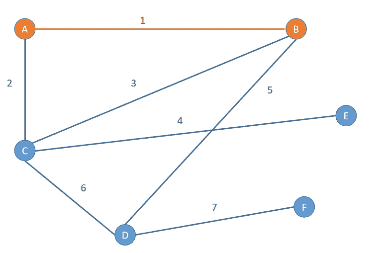

Graph 3

*   现在，“B”有三个邻居，但是我们已经访问了节点“A”。所以我们选择了 edge 3。

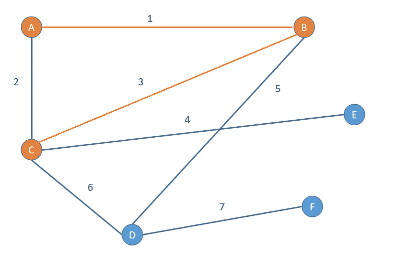

Graph 4

*   现在，“C”有 3 个邻居，让我们遍历边 2。

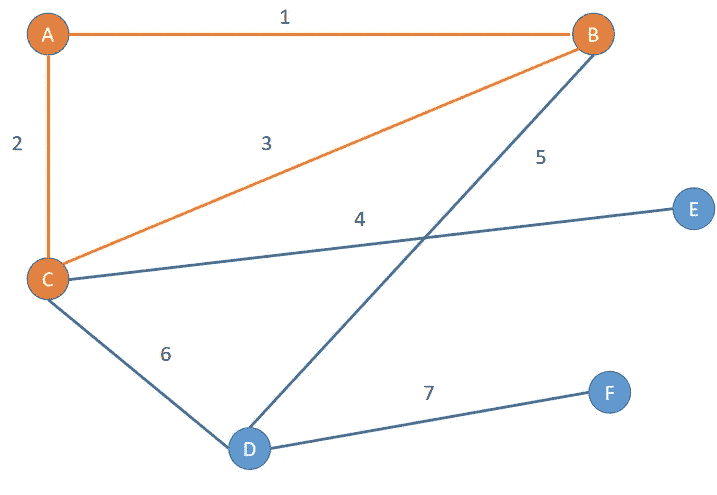

Graph 5

*   通过这次遍历，我们再次到达节点 A，因此算法将返回到 c。

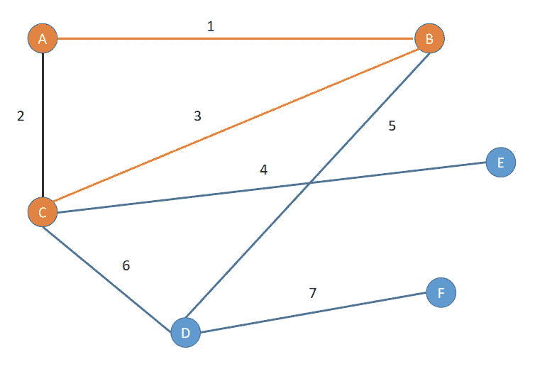

Graph 6

*   DFS 遍历边 4。

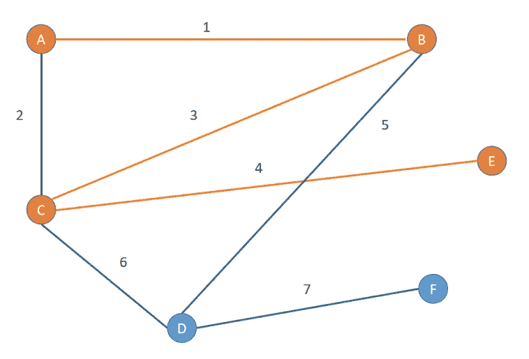

Graph 7

*   由于边 E 除了 C 没有任何邻居，算法将回溯。

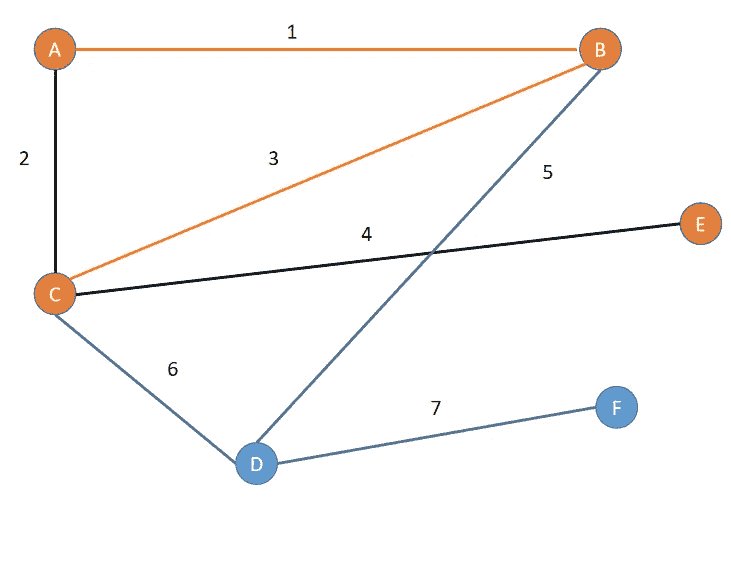

Graph 8

*   搜索遍历边 6。

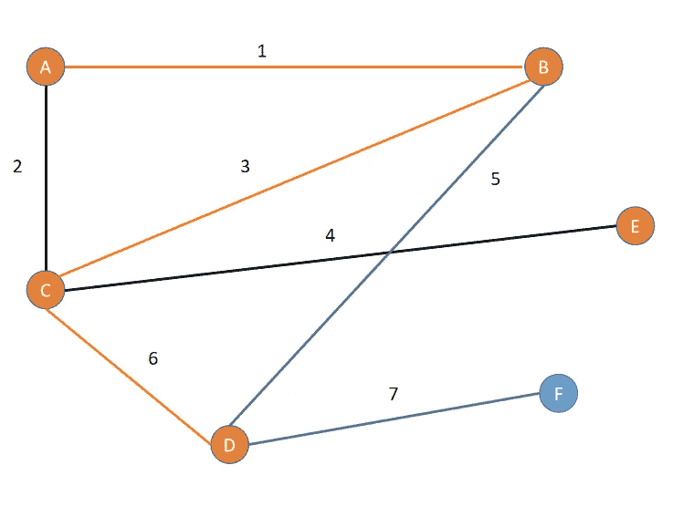

Graph 9

*   DFS 遍历边缘 5。

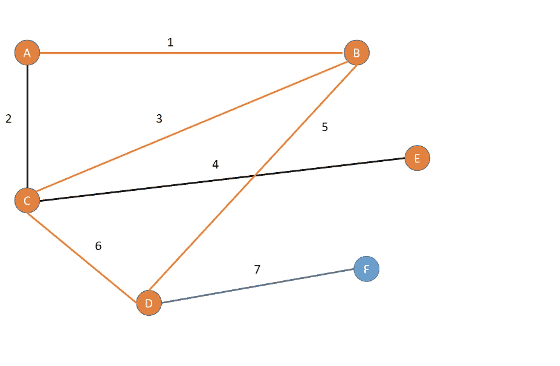

Graph 10

*   DFS 再次回溯到“D”节点。

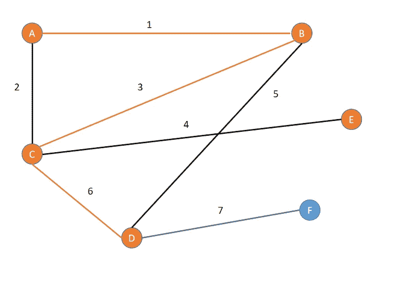

Graph 11

*   DFS 通过边 7 到达 f。

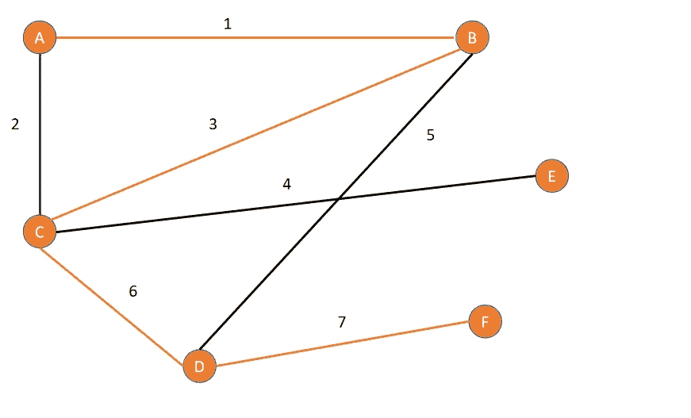

Graph 12

*   因为节点“F”没有任何邻居。算法回溯。

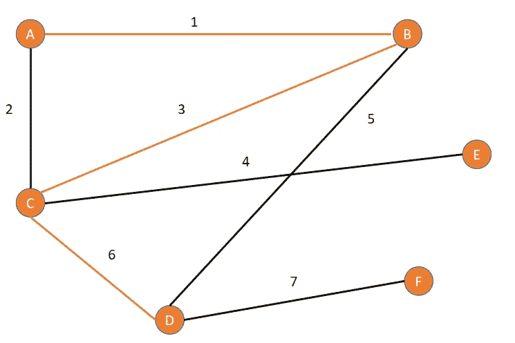

Graph 13

同样的，

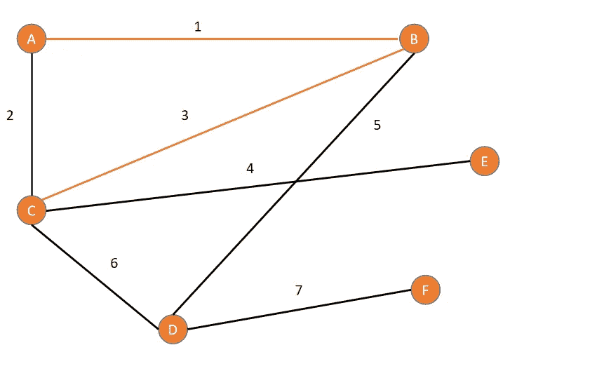

Graph 14

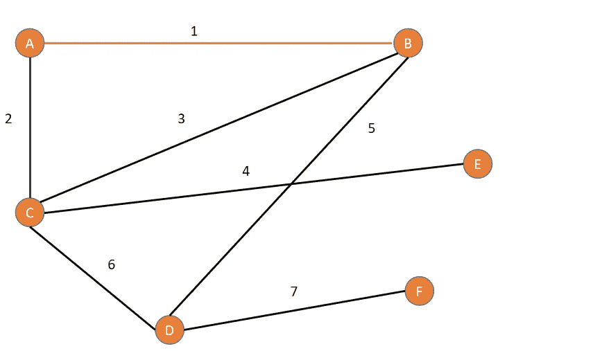

Graph 15

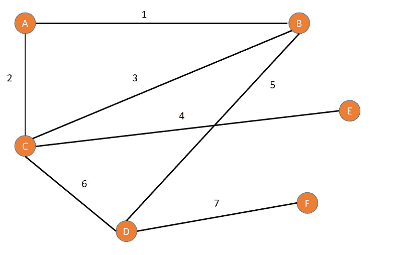

Graph 16

在 **Python** 中编码 DFS:

```
import networkx as nx
import pandas as pd

data = [('A','B','1'),("A","C",'2'),("C","D",'6'),("C","E",'4'),
        ("B","C",'3'),("F","D",'7'),("D","B",'5')]
df = pd.DataFrame(data=data,columns=['node1','node2','edge'])
graph = nx.from_pandas_edgelist(df=df, source='node1', target='node2', edge_attr='edge',create_using=nx.Graph())

total_nodes = len(graph.nodes)
is_seen = [False] * total_nodes

def depth_first_algo(graph,start_node='A'):
    print(start_node,end='--->')
    start_node_index = list(graph.nodes).index(start_node)
    if is_seen[start_node_index]:
        print('retracting from',start_node)
        return 0
    is_seen[start_node_index] = True
    node_neighbours = graph.neighbors(start_node)
    for neighbour in node_neighbours:
        print('neighbour:',neighbour)
        depth_first_algo(graph,start_node=neighbour)
depth_first_algo(graph)
```

我希望这篇文章能帮助你发展对 DFS 的直觉。

如果你想了解 DFS 算法在网络中的应用，请点击 [**这里**](https://saket-shubham16.medium.com/graph-or-networks-chapter-4-a04a34a2f084) 阅读下一篇文章。

使用的代码也可以在 github 上找到:[**https://github.com/Shubham-Saket/graphNetworks**](https://github.com/Shubham-Saket/graphNetworks)。