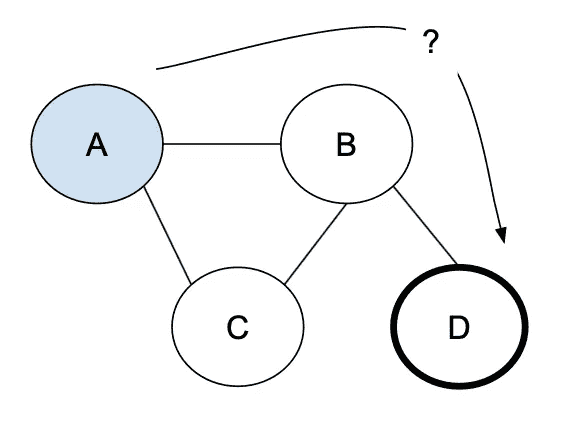

# 图形遍历

> 原文：<https://medium.com/geekculture/graph-traversals-7818d700d4ef?source=collection_archive---------20----------------------->

## 图遍历是从图中的起始顶点开始浏览或搜索一个顶点。

图中任何连通的顶点只访问一次(以避免循环)；所使用的顺序将根据所选择的算法来定义。

为了避免多次访问顶点，我们需要向顶点/节点类添加一个“已访问”属性。