# 投资和华尔街赌注图表

> 原文：<https://medium.com/geekculture/graphing-r-investing-and-r-wallstreetbets-c9f9f9276d69?source=collection_archive---------7----------------------->

看看 r/Investing 和 r/WallStreetBets 的图形表示，通常被视为 reddit 熊市与牛市情绪的代表。希望从这些表示中，我们可以根据语义相似性对用户、帖子和股票进行聚类，同时根据它们对每个特定子主题的社交网络的影响对它们进行排名。集群和排名应该能够告诉我们，哪些股票是一起推广，在哪些职位，由谁和他们如何在这两个社区不同。

*TL；DR* 一些交互式仪表盘，用于[投资](https://public.tableau.com/profile/zuye.zheng#!/vizhome/GraphAnalyticsonrInvesting/rInvesting)和[华尔街下注](https://public.tableau.com/profile/zuye.zheng#!/vizhome/GraphAnalyticsonrWallStreetBets/rWallStreetBets)的最终聚类和排名(使用左上角的符号图表导航)。

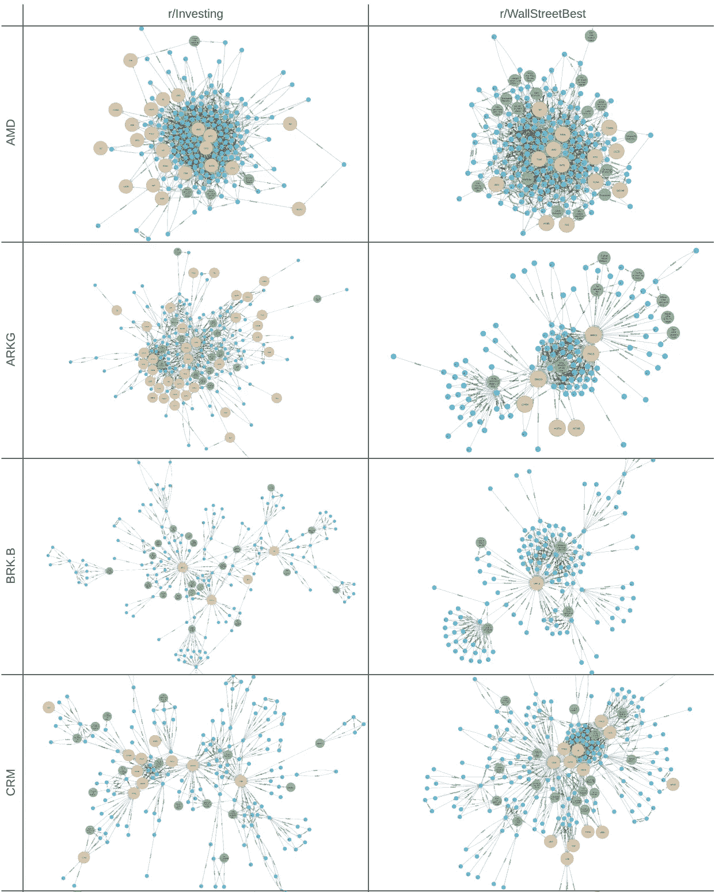

Rorschach of graph communities of stocks (beige), posts (green), and users (blue).

从 2020 年 1 月 1 日到 2021 年 2 月 28 日，每天都有排名前 20 的帖子。对于投资，从 104，605 个用户中提取了 8，411 个帖子和 **777，516 条评论。对于 WallStreetBets，从 288，645 个用户中提取了 8，380 个帖子和 2，219，525 条评论。评论数量的差异可能来自于子 reddit 的大小(1.7M 对 9.5M)和 Reddit 基于其自身指标对回复树的默认剪裁。**

# 构建图表

Reddit 已经是一个图表，有帖子，有回复的树，还有回复的用户。此外，我们需要提取和链接代表股票符号的节点，并旋转图形，以更好地模拟用户和股票之间的社交互动。

所以对于每个帖子，比如这个简单的单个分支的例子:

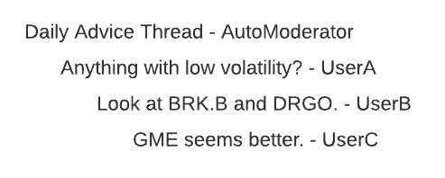

我们将创建 1 个发布节点、4 个用户节点(`AutoModerator, UserA, UserB, UserC`)和 3 个符号节点(`BRK.B, DGRO, GME`)。

将用户和符号连接到单个 post 节点的边将被创建，其中边权重将与深度成反比，因此`AutoModerator → Post`将具有 1 的边权重，`UserA → Post`将具有 1/2 的边权重，`UserB`为 1/3，`UserC`为 1/4。重量为 1/3 的`BRK.B`和`DGRO`以及重量为 1/4 的`GME`也是如此。

边也将把用户连接到他们在回复链中回复的人，并进行类似的加权。`UserA → AutoModerator`权重为 1，`UserB → UserA`权重为 1，`UserB → AutoModerator`权重为 1/2，以此类推。用户被进一步连接到回复链中提到的符号，使得`UserC → GME`的权重为 1，`UserC → BRK.B, DGRO`的权重为 1/2，而`UserB → BRK.B, DGRO`的权重为 1。

一篇文章的结果图看起来像这样，文章用绿色，符号用米色，用户用蓝色。

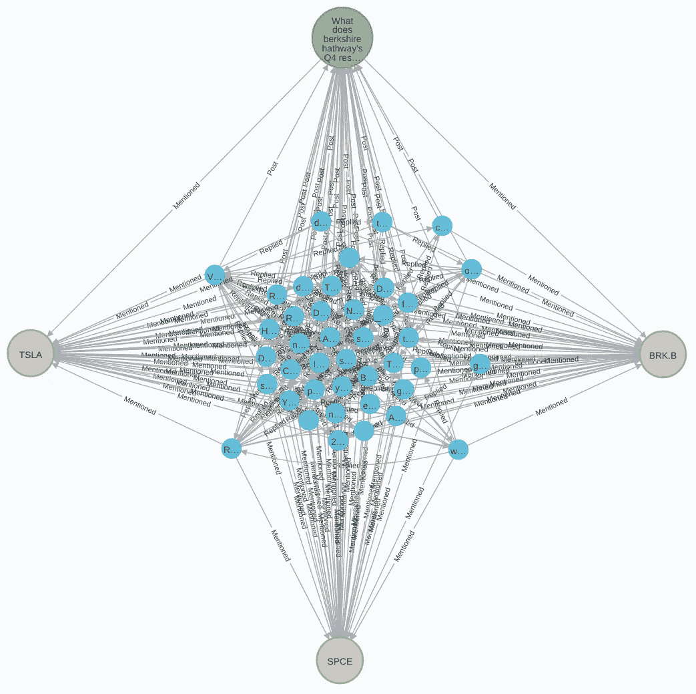

r/Investing 的结果图是 116，696 个节点和 3，803，470 条边的图；和 11，616，316 条边的图。

# 聚类和排序

这是一个 50 个节点的图，考虑到多达 300，00 个节点的完整图，我们首先需要对节点进行聚类和排序，以便我们可以分割和考虑各个子图。

使用 [Louvain](https://en.wikipedia.org/wiki/Louvain_method) 模块性，我们能够对图进行聚类(这样每个节点只能属于一个聚类)以达到两个目的。使用只有边的有向图来划分用户和帖子的符号，我们能够形成包含许多帖子和用户，但只有一个符号的聚类。这种聚类允许我们查询特定股票代码的图表，例如`BRK.B`，以找到该代码最有影响力的帖子和用户。

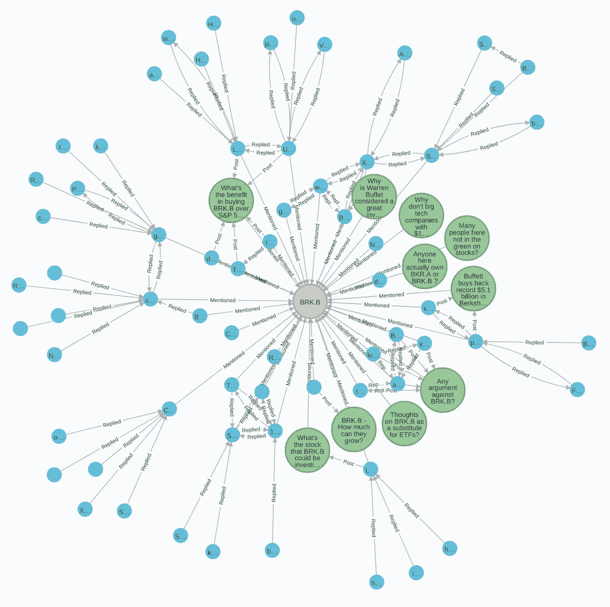

BRK.B subgraph in r/Investing

通过在聚类之前将边改变为无方向的符号，我们现在还可以查询相似的符号，其中我们发现`BRK.A, BRK.B`和`BH`聚集在同一个社区中。

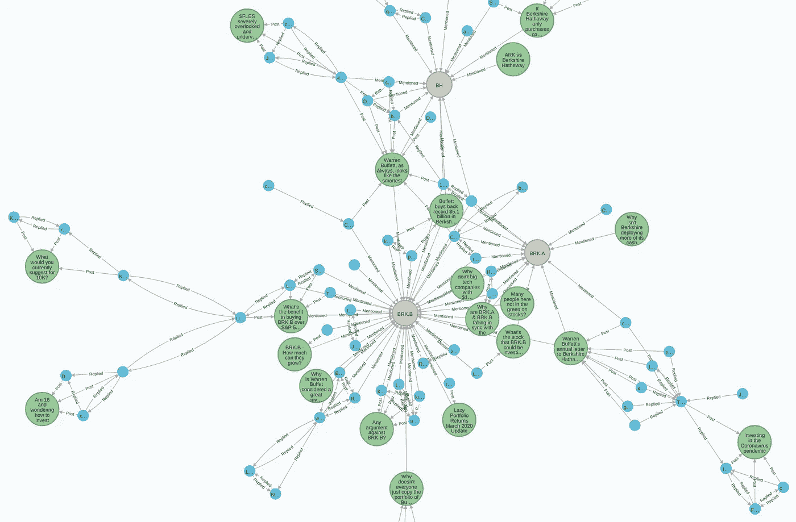

BRK.B subgraph with similar symbols in r/Investing

r/wsb 中的另一个展示了`PINS`和`ETSY`在单个社区中的聚集，以及`CRM`与多个企业云公司(如`OKTA, TWLO, VEEV,`和`WDAY`)的聚集。

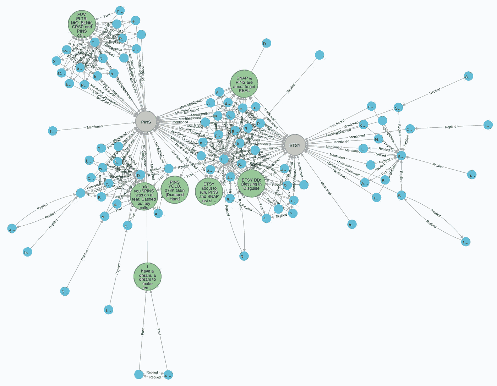

PINS subgraph in r/wsb

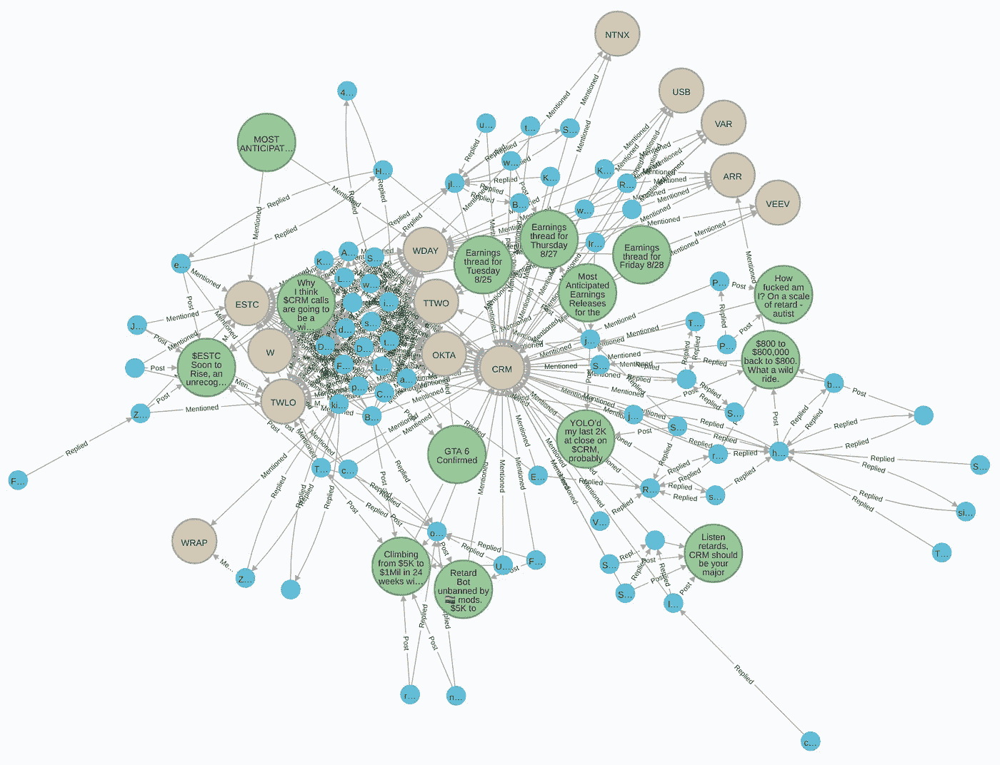

CRM subgraph in r/wsb

现在，我们可以通过符号查询热门帖子和用户，以及基于常见用户和帖子的类似符号。[由边“深度分数”加权的 PageRank](https://en.wikipedia.org/wiki/PageRank) 然后可以用于对结果进行排序，因为这些子图也变得相当大。

我们可以将这些结果放到仪表板上(用于 [r/Investing](https://public.tableau.com/profile/zuye.zheng#!/vizhome/GraphAnalyticsonrInvesting/rInvesting) 和 [r/WallStreetBets](https://public.tableau.com/profile/zuye.zheng#!/vizhome/GraphAnalyticsonrWallStreetBets/rWallStreetBets) )，以便更容易地探索社区。选择左上方的一个符号将过滤其他 3 个图表中的热门用户和该符号以及类似符号的帖子。

快速检查一下，DFW 大学在 r/wsb 中的 GME 排名第二。

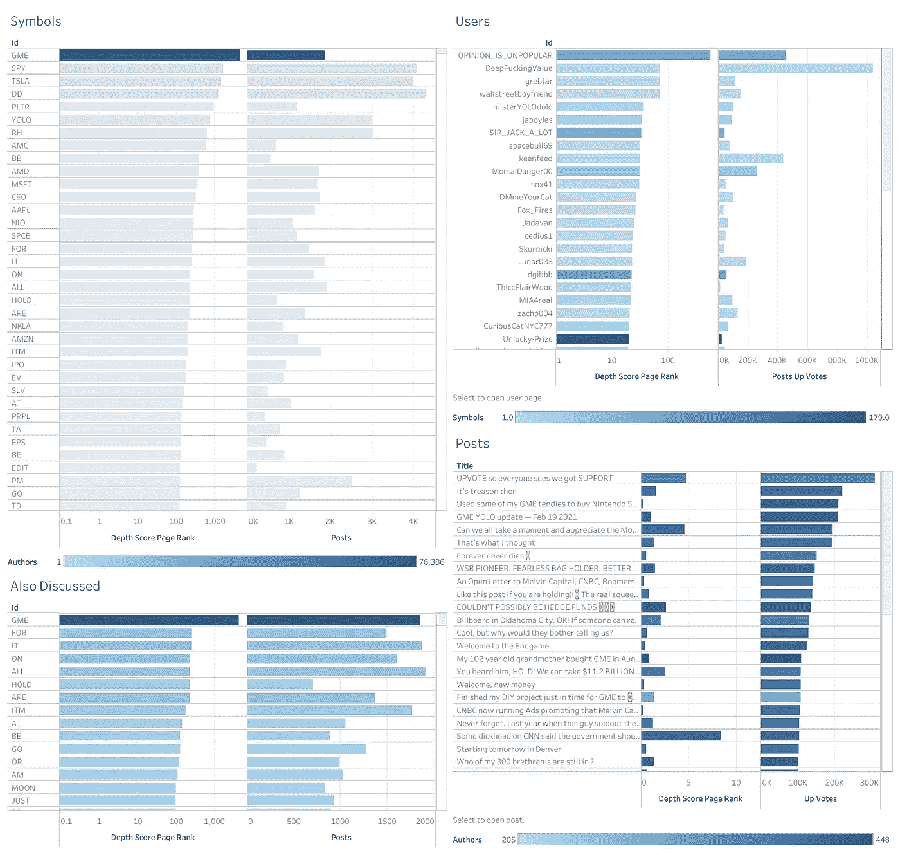

Top Users, Posts and similar Symbols of GME on r/wsb

# 权重和情绪的支持票

Upvotes 似乎是边缘权重的一个明确选择，通常用于这些子区域中帖子的“情绪”分类，正面意义为看涨，负面意义为看跌。然而，我认为赞成票更像是大众认同和情绪的同义词。我可以说一只特定的股票将会崩溃，这是一种悲观的情绪，会被投票赞成，或者一只特别不受欢迎的股票将会下跌。

类似地，作为权重的向上投票(尽管提取到图表中)似乎赋予特定帖子或回复更普遍的认同，而不是这些用户、帖子和符号的相关性有多强。尽管存在边缘[情况](https://www.reddit.com/r/wallstreetbets/comments/libn68/screw_with_the_hedgefunds/)，但是反向深度分数似乎工作得很好。

# 符号识别

文本中的股票符号识别实际上并不简单。排名前三的交易所中有大约 9000 个符号，其中许多与常用词和首字母缩略词相同，从 HOLD 到 CEO 到 DD 再到 YOLO。

一个稍微严格的正则表达式，查看所有大写单词或那些以`$`开头或包含`:`的单词(如在纽约证券交易所:PLTR)似乎就足够了，但 a 肯定会导致许多误报，正如可以看到的 YOLO 和 DD 在符号列表中名列前茅。

一个更健壮的方法是像定制训练的 NER 模型一样，考虑句子的语法。

# 代码

[https://github.com/zuyezheng/RedditSentiment](https://github.com/zuyezheng/RedditSentiment)

# [数]子图

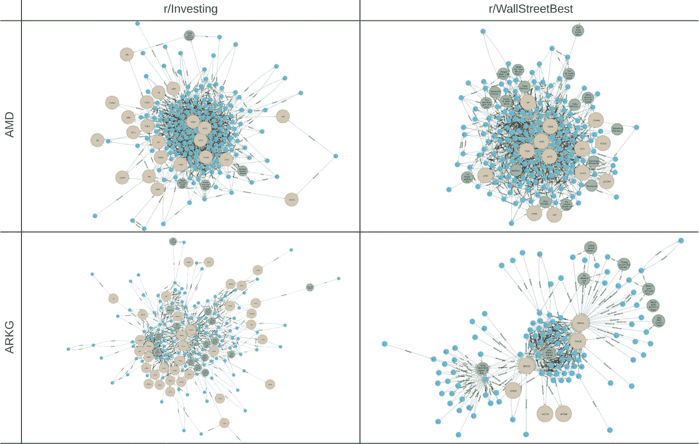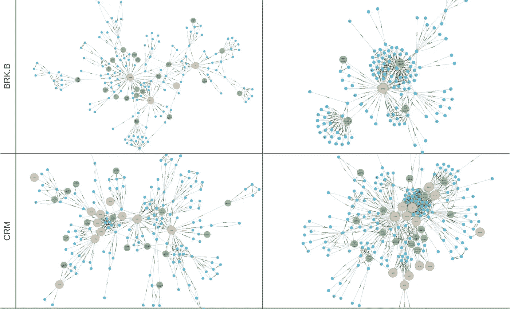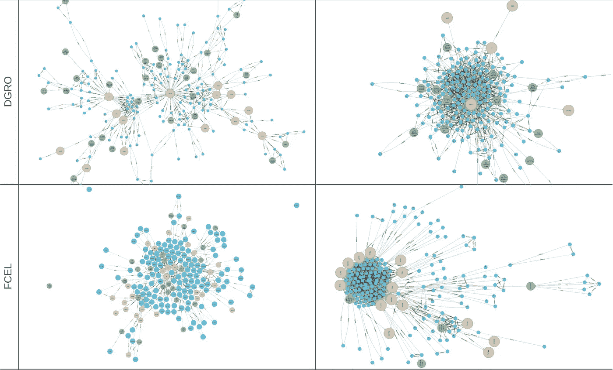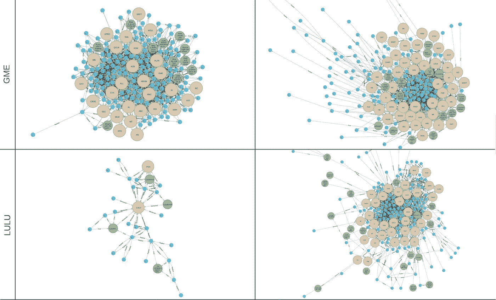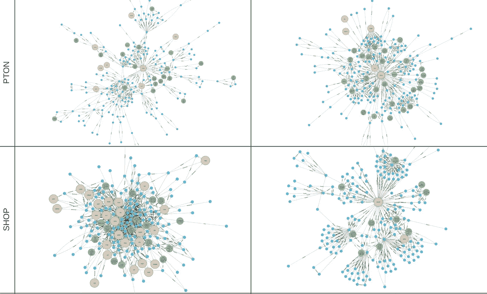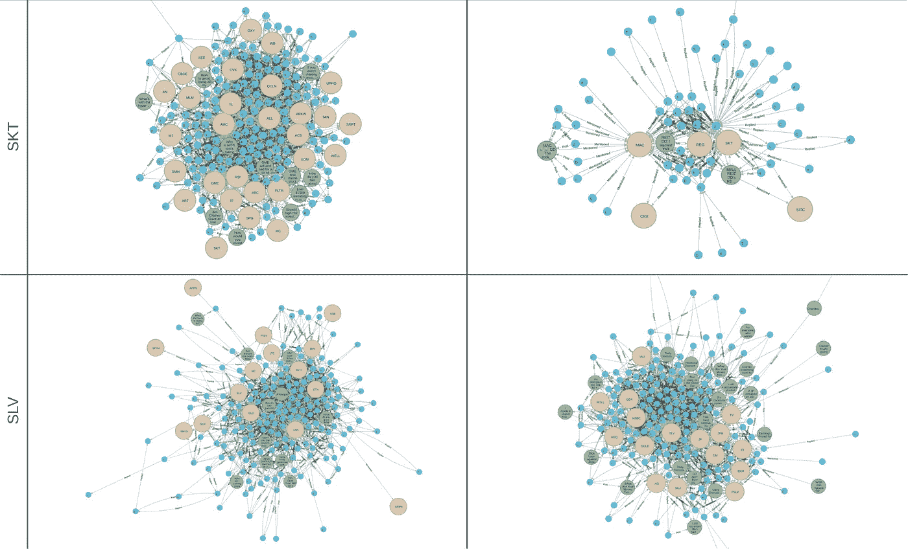