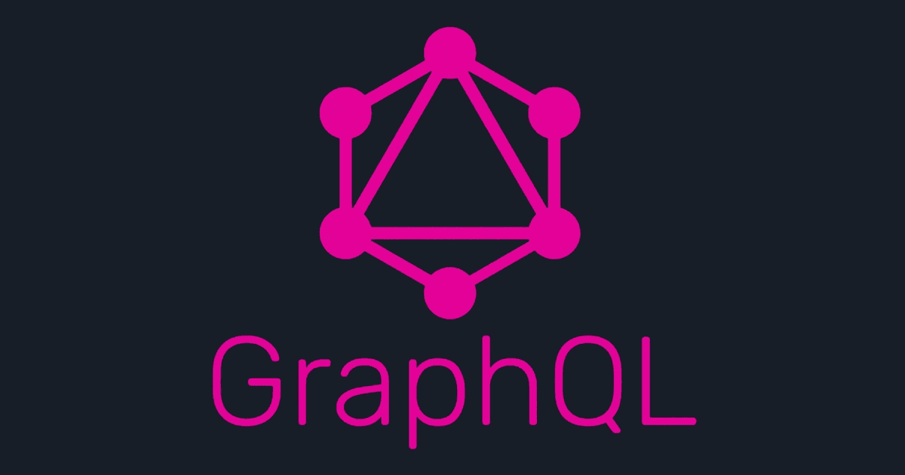
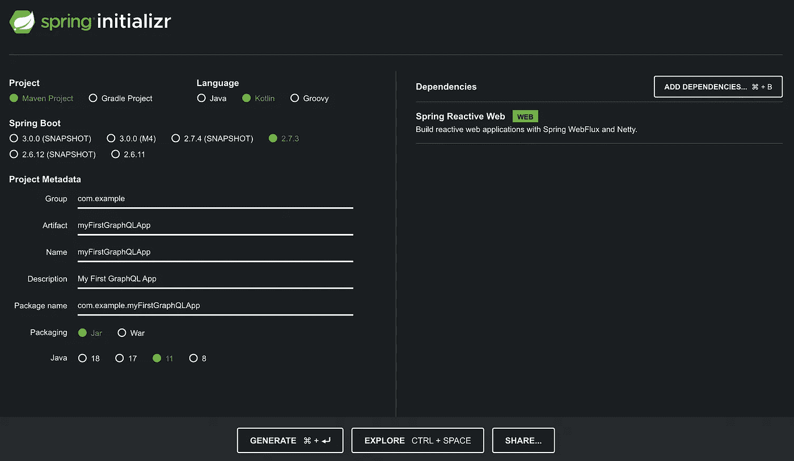
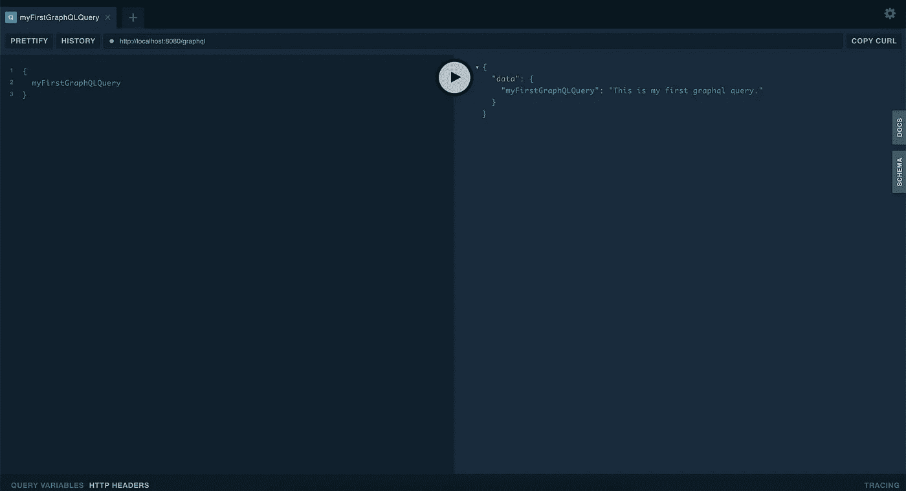
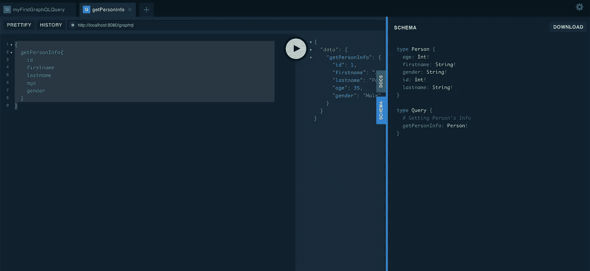
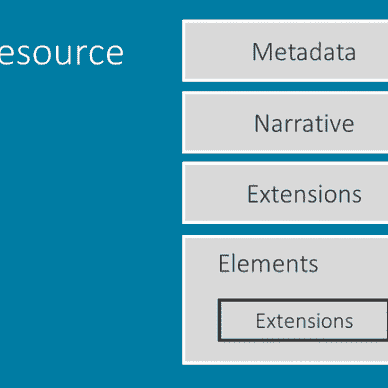

# GraphQL 在 5 分钟内

> 原文：<https://medium.com/geekculture/graphql-app-in-5-mins-69700ce11a3c?source=collection_archive---------14----------------------->

了解 GraphQL，只需 5 分钟即可构建支持 GraphQL 的应用



随着正在开发的软件解决方案越来越复杂，软件工程师正在为这些系统之间的通信开发越来越有效和聪明的解决方案。GraphQL 就是这样一个解决方案，由脸书的工程师开发，并于 2015 年向公众发布，以消除传统 Rest 架构的各种弱点。

在本文中，我们将学习创建一个简单的 GraphQL 应用程序，它可以帮助您实际操作 GraphQL，或者如果您想使用 graphql 构建一个新的应用程序，这可能是您的解决方案的一个良好起点。

# GraphQL 简介？

GraphQL 代表图形查询语言，与传统的查询语言不同，图形不直接与数据库交互。但是 GraphQL 定义了客户机与 API 服务器交互的契约。简而言之，GraphQL 是 API 的查询语言，也是使用为数据定义的类型系统执行查询的服务器端运行时。GraphQL 不依赖于任何特定的数据库或存储引擎，而是由您现有的代码和数据提供支持。

在简单介绍了 graphql 之后，让我们进入本文的主题构建 graphql 应用程序。对于这个应用程序，我们将使用 Kotlin 的 Springboot 应用程序。我们可以使用各种各样的 graphql 依赖项。但是我们将关注 Expedia 的 graphql 库，它是基于 graphql-java 构建的，在我看来，它是可以用来创建 graphql 应用程序的最好的库之一。Expedia 库的主要优点是，它允许您专注于编写逻辑，抽象出所有手动创建 graphql 模式的手动任务。

在开始这些步骤之前，我建议你下载 **JDK 11+** 和**阿帕奇 maven** 作为应用的先决条件。

# GraphQL 应用程序的步骤

## 第一步:

使用 [spring initializer](https://start.spring.io/) 下载应用。对于这个应用程序，我们将使用 Spring Reactive Web，因为 graphql-kotlin-spring-server 库在 Spring Reactive Web 上工作。其他需要选择的选项，可以参考下面的截图。在提供了所有选项之后，只需点击 generate 按钮，就可以准备好自己的 spring boot 应用程序进行进一步的开发了。



Spring Initializer

## 第二步:

使用 spring initializer 下载应用程序后，下一步是在 IDE 中导入相同的内容。在第一次导入时，可能需要一些时间来下载项目的所有依赖项。下载完所有的依赖项后，您可以通过运行主类来尝试运行应用程序，在我们的示例中，它将是 MyFirstGraphQLAppApplication.kt。应用程序应该能够运行应用程序而不会出现任何错误。它将启动一个 netty 服务器，这是 Spring Reactive Web 的内置服务器。

## 第三步:

因为下一步是添加 graph QL-kot Lin-spring-server in-app。将以下依赖项添加到 pom.xml 文件中。添加完依赖项后，只需在终端中运行 **mvn install** 即可下载依赖项。这里我们使用 6.0.0 版本的依赖项，但是您可以使用阅读本文时可用的任何最新版本。

```
<dependency>
   <groupId>com.expediagroup</groupId>
   <artifactId>graphql-kotlin-spring-server</artifactId>
   <version>6.0.0</version>
</dependency>
```

## 第四步:

现在我们已经准备好编写第一个 graphQL 查询了。在开始查询之前，让我们为查询创建一个单独的文件夹和文件。新建一个文件夹，文件**查询> SampleQueries.kt** 。下一步，将以下代码添加到 SampleQueries.kt 文件中。

```
import com.expediagroup.graphql.server.operations.Query
import org.springframework.stereotype.Component

@Component
class SampleQueries: Query { @GraphQLDescription("My first query")
    fun myFirstGraphQLQuery():String{
        return "This is my first graphql query.";
    }

}
```

上面的代码包含一个简单的函数，它将返回一个简单的字符串。但是，如果您尝试按原样运行代码，您将会得到一个由于缺少包而导致的错误，要解决这个问题，请向 application.property 添加以下属性。这是 kotlin graphql 库的**所需的**。

```
graphql.packages=com.example.myFirstGraphQLApp.queries
```

请在上述更改后再次尝试运行该应用。它应该运行良好，没有任何错误。当您的应用程序运行良好后，您可以在 graphql playground 中尝试查询，对此您需要做些什么？没什么。Kotlin graphql 库带有内置的 Prisma labs playground，可以在这里访问。

```
{
  myFirstGraphQLQuery
}
```



**它是如何工作的？Expedia GraphQL 库将扫描包中的查询文件。对于要查询的类，我们需要实现查询接口。该库将基于该类中的函数生成所有的模式和查询。**

对于更复杂的示例，您可以在以下代码中使用它们:

人员的数据分类:

```
package com.example.myFirstGraphQLApp.schema

data class Person(
    val id: Int,
    val firstname:String,
    val lastname: String,
    val age: Int,
    val gender: String,
) {
}
```

查询以获取信息:

```
package com.example.myFirstGraphQLApp.queries

import com.example.myFirstGraphQLApp.schema.Person
import com.expediagroup.graphql.generator.annotations.GraphQLDescription
import com.expediagroup.graphql.server.operations.Query
import org.springframework.stereotype.Component

@Component
class SampleQueries: Query {

    @GraphQLDescription("Getting Person's Info")
    fun getPersonInfo(): Person{
        return Person(
            id = 1,
            firstname = "Jhonny",
            lastname = "Parker",
            age = 35,
            gender = "Male"
        )
    }

}
```

应用程序.属性:

```
graphql.packages=com.example.myFirstGraphQLApp.queries, com.example.myFirstGraphQLApp.schema
```

查询:

```
{
  getPersonInfo{
    id
    firstname
    lastname
    age
    gender
  }
}
```

我们可以在 playground 中的 schemas 菜单下看到所有生成的模式。



Generated Schemas

# 下一步是什么？

在本文中，我们已经触及了使用 kotlin graphql 库所能做的一切。它为您提供了大量的特性，您可以轻松地使用这些特性来定制您的应用程序，这超出了本文的范围。如果你感兴趣，留下你的评论，用不同的特点和实际操作的例子创造另一篇文章。此外，如果您有一个现有的应用程序，您可以导入相同的依赖到这个应用程序，并使用它来创建复杂的查询。

# 摘要

在本文中，我们简要了解了 graphql。我们还查看了创建您自己的第一个简单 graphql 应用程序的步骤。希望这将为您开始使用 graphql 并探索更多内容提供一个良好的平台。

如果你喜欢我的作品，请**喜欢并分享**这篇文章(**免费:)**)。还有，做 [**关注**](/@jaideeppahwa1) me 更多这样的文章。

另外，看看我的其他文章:


[贾迪普·帕瓦](/@jaideeppahwa1?source=post_page-----69700ce11a3c--------------------------------)

## 面向开发人员的 FHIR

[View list](/@jaideeppahwa1/list/fhir-for-developers-ea551cc4840c?source=post_page-----69700ce11a3c--------------------------------)9 stories[](/illumination/work-life-balance-hacked-e05ecee236b1) [## 工作生活平衡:被黑

### 更好地平衡工作与生活的生产力秘诀

medium.com](/illumination/work-life-balance-hacked-e05ecee236b1)