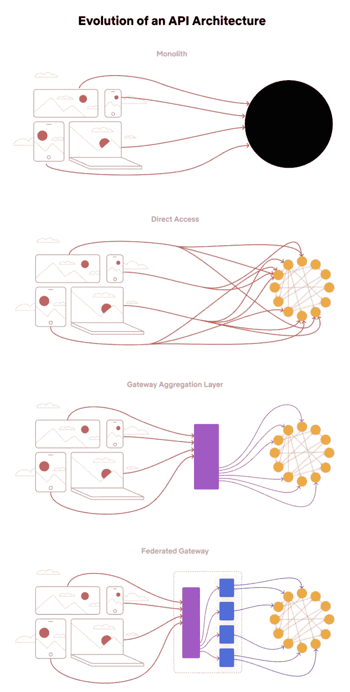
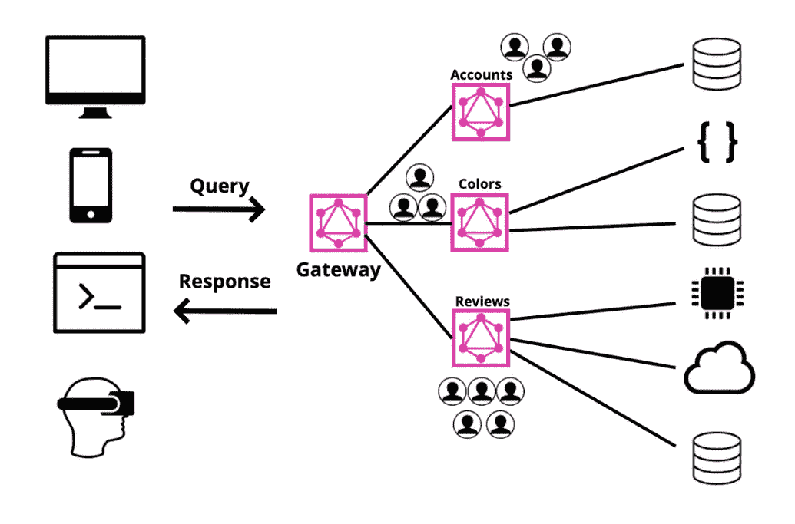

# 使用 Rover CLI 和 graphql-inspector 进行 GraphQL 兼容性测试

> 原文：<https://medium.com/geekculture/graphql-compatibility-testing-using-rover-cli-and-graphql-inspector-e03c366c7550?source=collection_archive---------7----------------------->


最近，我参与了与 GraphQL 相关的开发，我们希望对最近的开发进行兼容性测试。我们遇到了一个好方法，并想到分享我在这个故事中获得的知识和经验。首先，我们来了解一下什么是 GraphQL，为什么需要进行兼容性测试。

GraphQL 是一种强大的开源数据查询和服务器端运行时操作语言，用于 API，优先为客户提供他们所请求的数据。与 [GraphQL](https://www.redhat.com/en/topics/api/what-is-graphql) 中的 REST APIs 不同，它不会返回客户端没有请求的数据。因此，GraphQL 被设计成使 API 更加灵活、快速和对开发人员更加友好。

在 GraphQL 中，我们可以遵循我们在[联盟架构](https://netflixtechblog.com/how-netflix-scales-its-api-with-graphql-federation-part-1-ae3557c187e2)中的实现，该架构最初由网飞推出，通过在边缘提供一个统一的 API 聚合层供 UI 开发人员使用，使他们的微服务更加松散耦合和高度可伸缩。这里的实现有两个主要部分，一个是 **GraphQL 网关(supergraph)** ，它主要负责向客户端提供 GraphQL 查询，第二个是 **GraphQL 服务(子图)**的集合。



Evolution of an API Architecture



Federated Architecture

# 为什么我们需要 GraphQL 的兼容性测试？

当我们使用联邦架构开发 GraphQL 查询时，需要维护 **GraphQL 网关**和其他暴露的 GraphQL 之间的契约。在没有向后兼容性的情况下删除或更改查询解析器或其协定不是一个好的做法，因为这会影响网关和已经在使用它的客户端。为了解决这个问题并使应用程序即使在新的部署发生后也能顺利工作，需要在部署过程中进行兼容性测试。

# 我们如何对 GraphQL 进行兼容性测试？

为了进行兼容性测试，我们要做的主要事情是将现有的 ***生产环境超图*** 与新生成的 ***超图*** 进行比较。

因此，我们必须有一个工具来生成 GraphQL 模式并找出差异。我们遇到了两个工具，可以用来满足这个需求。

## 漫游者 CLI

这是一个强大的 CLI 工具，我们可以用它来管理和维护数据图表。我们可以使用这个工具生成现有的和新的 GraphQL 模式，并组成超级图。

## graph QL-检查员/ci

使用 [@graphql-inspector/ci](https://www.npmjs.com/package/@graphql-inspector/ci) ，我们可以进行许多与 CI/CD 相关的模式验证操作。对于兼容性测试，我们可以使用这个工具来[获得部署管道期间超级图的差异](https://graphql-inspector.com/docs/essentials/diff)。

# GraphQL 的兼容性测试

让我们看看如何使用这些工具对 GraphQL 实现进行兼容性测试，graph QL 实现是使用 [apollo federation](https://www.apollographql.com/docs/federation/) 按照联邦架构实现的。

首先，我们必须下载并[安装 Rover CL](https://www.apollographql.com/docs/rover/getting-started/) I。我使用的是 ubuntu，下面的命令是针对 ubuntu 的。根据您的操作系统，您可以通过提供的链接使用其他安装。

```
curl -sSL https://rover.apollo.dev/nix/latest | sh
```

然后我们必须启动并运行我们的 GraphQL 服务。我的服务是用 NodeJs 编写的，所以下面给出的命令是启动并运行节点服务。

```
node start
```

现在假设您有两个 GraphQL 子图和一个 GraphQL 网关。

[https://subgraph-1-production/graph QL](https://subgraph-1-production/graphql)

[https://sub graph-2-production/graph QL](https://subgraph-1-production/graphql)

为了获取产品的 GraphQL 模式，我们可以使用下面的命令。[阅读更多...](https://www.apollographql.com/docs/rover/subgraphs/)

```
rover subgraph introspect [https://subgraph-1-production/graphql](https://subgraph-1-production/graphql)  > prod-subgraph1.graphqlrover subgraph introspect [https://subgraph-2-production/graphql](https://subgraph-1-production/graphql)  > prod-subgraph2.graphql
```

假设我们对 subgraph2 服务进行了更改，那么我们可以使用 below 命令来获取 subgraph2 的新更改的子图。

```
rover subgraph introspect http://localhost:3000/graphql > local-subgraph2.graphql
```

现在我们有了生成现有的和新的超图模式所需的所有子图模式，这些模式可用于验证兼容性测试。

为了生成超图，我们需要一个额外的配置。漫游者引用的 yaml 文件用来组成超图。这两个。yaml 内容如下。[阅读更多…](https://www.apollographql.com/docs/rover/supergraphs/)

local-supergraph.yaml

```
subgraphs:
  products:
    routing_url: http://localhost:3000/graphql
    schema:
      file: ./local-subgraph2.graphql
  orders:
    routing_url: [https://subgraph-1-production/graphql](https://subgraph-1-production/graphql)
    schema:
      file: ./prod-subgraph1.graphql
```

prod-supergraph.yaml

```
subgraphs:
  products:
    routing_url: [https://subgraph-1-production/graphql](https://subgraph-1-production/graphql)
    schema:
      file: ./prod-subgraph1.graphql
  orders:
    routing_url: [https://subgraph-2-production/graphql](https://subgraph-1-production/graphql)
    schema:
      file: ./prod-subgraph2.graphql
```

现在我们可以用这两个。yaml 文件，使用下面给出的命令生成 local-supergraph.graphql 和 prod-supergraph.graphql。

```
rover supergraph compose --config ./local-supergraph.yaml > local-supergraph.graphqlrover supergraph compose --config ./prod-supergraph.yaml > prod-supergraph.graphql
```

现在我们有了现有的(prod-supergraph.graphql)和新的(local-supergraph.graphql)来比较区别。为了比较这种差异，我们可以使用下面给出的 graphql-inspector diff 命令。[阅读更多…](https://graphql-inspector.com/docs/essentials/diff)

```
graphql-inspector diff prod-supergraph.graphql local-supergraph.graphql
```

上述命令将识别所提供的两种模式(旧-新)之间的差异。GraphQL Inspector 定义了三种变化:

*   不间断变化
*   危险的变化
*   突破性变化

当至少有一个突破性的改变时，过程失败，否则，它成功。

现在我们可以在。sh 文件，并和我们的测试脚本一起执行它们。

兼容 _ 测试. sh

```
curl -sSL https://rover.apollo.dev/nix/latest | shnohup yarn start &
sleep 10allErrors=""{ err=$(rover subgraph introspect [https://subgraph-1-production/graphql](https://subgraph-1-production/graphql) 2>&1 >&3 3>&-); } 3> ./tests/prod-subgraph1.graphql
echo $err;
allErrors+="$err"{ err=$(rover subgraph introspect [https://subgraph-2-production/graphql](https://subgraph-1-production/graphql) 2>&1 >&3 3>&-); } 3> ./tests/prod-subgraph2.graphql
echo $err;
allErrors+="$err"{ err=$(rover subgraph introspect [https://subgraph-1-production/graphql](http://localhost:3000/graphql) 2>&1 >&3 3>&-); } 3> ./tests/local-subgraph2.graphql
echo $err;
allErrors+="$err"{ err=$(rover supergraph compose --config ./tests/prod-supergraph.yaml 2>&1 >&3 3>&-); } 3> ./tests/prod-supergraph.graphql
echo $err;
allErrors+="$err"{ err=$(rover supergraph compose --config ./tests/local-supergraph.yaml 2>&1 >&3 3>&-); } 3> ./tests/local-supergraph.graphql
echo $err;
allErrors+="$err"{ err=$(graphql-inspector diff ./tests/prod-supergraph.graphql ./tests/local-supergraph.graphql 2>&1); }
echo $err;
allErrors+="$err"if [[ $allErrors == *"error"* ]]; then
  echo "$(tput setaf 1)compatibility check failed with some errors...$(tput sgr0)"
  exit 1
fi

exit 0
```

如果您想为您的实时图传递一些授权

```
{ err=$(rover subgraph introspect [https://subgraph-1-production/graphql](https://subgraph-1-production/graphql) --header “Authorization: Bearer XXXYYYZZZ” 2>&1 >&3 3>&-); } 3> ./tests/prod-subgraph1.graphql
```

然后将它与您的测试一起运行(在 package.json 中)

```
"test:compatibility": "sh tests/compatible_test.sh",
```

这是对 GraphQL 联邦实现进行兼容性测试的一千种方法之一。希望这个故事能帮助您对 GraphQL 实现的兼容性测试有所了解。快乐编码…

**感谢阅读，关注我了解更多。**如果您有任何问题，请留下您的评论。我一定会回答你的问题。如果你觉得这对其他开发者有用，请点赞并分享。