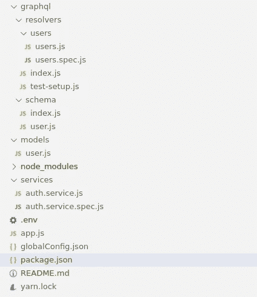
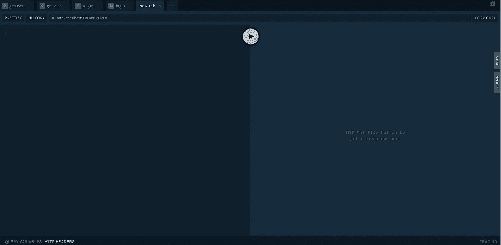

# GraphQL | Node.js | MongoDB:用用户模型和 auth 设置一个基本服务器

> 原文：<https://medium.com/geekculture/graphql-node-js-mongodb-set-up-a-basic-server-with-user-model-and-auth-d05ed4d5a864?source=collection_archive---------13----------------------->

在这个教程里(我有史以来第一次！有多紧张😮)，我将向您展示如何设置一个基本的 **Node.js** 服务器，通过 **GraphQL** 公开存储在 **MongoDB** 数据库中的用户模型。我们还将在此基础上增加一些测试和验证工具！

*   [要求](#acbd)
*   [先于一切](#5de7)
*   [依赖关系](#78b9)
*   [用户模型](#40b2)
*   [认证服务](#7d91)
*   [graphql 模式](#8bc3)
*   [graphql 解析器](#a43f)
*   [测试](#262c)
    [与解析器](#d41e)
    [与服务](#4efd)
*   [app.js](#5094)
*   [游乐场](#0f69)


The beautiful tools we’ll be using in this tutorial

# 要求

*   在你的机器上安装并运行 [MongoDB](https://docs.mongodb.com/manual/installation/)
*   安装 [Node.js](https://nodejs.org/en/download/) (转到版本 14 或更高版本，因为我使用了版本 13 及以下版本不支持的可选链接)
*   对 javascript 和 node 有一些了解

# 在所有人之前

你会在[这个公共回购](https://gitlab.com/steeveox/base-mongo-node-graphql-server)上找到完整的服务器。

如果您想在这个过程中自己构建它，那么创建一个新的文件夹，并根据您希望哪个包管理器来设置项目，键入`yarn init`或`npm init`。

说到包，让我们从安装本教程中需要的所有依赖项开始！

(但在此之前，让我们快速看一下这个项目一旦启动并运行将由哪些文件夹和文件组成)



# 属国

下面是所有项目依赖项的列表，以及我们将使用它们的目的(我使用`yarn`来管理包，但是没有什么可以阻止你使用这个好的 ol’`npm`):

*开发依赖关系*

*   `jest`:将用于测试，很容易设置，允许并行测试并提供一个简洁的 API
*   将用于在本地运行我们的服务器，一旦启动，它将监视文件的变化，并在保存项目中的任何修改后重新启动
*   `@shelf/jest-mongodb`:将提供使用 MongoDB 运行测试所需的所有配置

`yarn add jest jest-cli nodemon @shelf/jest-mongodb --dev`

*依赖关系*

*   `bcrypt`:将用于散列和加盐我们的用户密码。它可靠、易用，自 1999 年以来，世界各地的开发者都在使用它，没有任何抱怨
*   `dotenv`:将用于从`.env`文件**中加载环境变量到`process.env`中，你永远不会提交**，这样你就可以将你的秘密从代码中分离出来
*   `jsonwebtoken`:将用于生成和解析我们的用户 jwt
*   `mongoose`:将用于连接和交互我们的 MongoDB 数据库
*   所有的肉。一个易于使用的 GraphQL 服务器，需要最少的配置，基于`apollo-server`,它本身是生成自文档化 GraphQL APIs 的最佳工具

`yarn add bcrypt dotenv jsonwebtoken mongoose graphql-yoga`

# 用户模型

如果您还不知道(如果您愿意使用它，我希望您知道)，MongoDB 是一个非关系的、面向文档的数据库。它存储文档，比通常的关系数据库灵活得多。如果你想进一步了解这个特殊的话题，MongoDB 团队写了一篇关于它的文章:[https://www.mongodb.com/non-relational-database](https://www.mongodb.com/non-relational-database)

在`models/user.js`中，我们将定义我们的用户模型。模型负责从数据库中创建和读取文档。

`models/user.js`

这里没什么特别的。我们需要`mongoose`，为我们的数据库使用创建一个新的模式，并为我们的每个用户文档的属性设置参数。然后我们以名称`User`将其导出。

# 授权服务

auth 服务将用于管理与身份验证相关的一切，从散列密码到解析 jwt。

`services/auth.service.js`

`services/auth.service.js`

让我们一个方法一个方法地分解它:

*   `hashPassword`:用于哈希密码。与可以逆转的加密相反，从散列的字符串中获取原始字符串几乎是不可能的。`salt`是一个随机字符串，在哈希过程中添加到密码中以增加安全性。`saltRounds`使算法更慢，使其更安全，因为它也增加了攻击者等待破解散列密码的时间。
*   `matchPasswords`:使用`bcrypt`比较法，将用户提供的密码与数据库中的密码进行比较。
*   `generateJwt`:用于生成一个 json web 令牌，以便在用户登录后对其进行身份验证。我们向它传递可能对应用程序使用有用的用户数据、用于签署您的令牌的秘密字符串(该字符串必须是您的应用程序独有的)以及它将处于活动状态的延迟时间。

*关于 app secret 的一个注意事项:如果你看一下公共存储库，你会发现一个* `*.env.example*` *文件，而不是本文开头显示的项目树结构中的* `*.env*` *文件。如前所述，* `*.dotenv*` *库允许我们检索存储在该文件中的环境变量。这不是故意的。秘密越随机越复杂越好。我通过使用 Node.js 中包含的* `*crypto*` *lib 来生成 mine，为此，我在一个节点控制台中运行以下命令(只需在终端中键入 Node 来打开它):* `require('crypto').randomBytes(64).toString('hex')`

*   `getJwtPayload`:用于从 jwt 中检索用户数据。
*   `getUserId`:用于从令牌中检索用户 Id，或者从传入请求中检索`authorization`头。

# GRAPHQL 模式

GraphQL 模式描述了连接到它的客户机可用的类型、查询和变化。它是使用[模式定义语言](https://www.prisma.io/blog/graphql-sdl-schema-definition-language-6755bcb9ce51)构建的。它用于文档和数据验证目的。与 REST APIs 相反，GraphQL API 公开了一个端点来操作数据。突变和查询是你与它交互的两种方式。

`graphql/schema/user.js`

`graphql/schema/user.js`

`Query` : GraphQL 对象，包含所有用于获取数据的方法。这里我们将实现两个简单的方法来检查用户的数据。它只是为了指导的目的而实现的，因为这些信息已经在 jwt 中了。

`Mutation` : GraphQL 对象，包含用于写操作(post、put、delete)的所有方法。在这里，用户将能够使用`signup`创建一个用户，并使用`login`进行认证。如果你不熟悉打字，让我们快速分解一下`login`原型:
-所有参数(电子邮件、用户名和密码)都是字符串
-无论如何都只需要密码，因此`!`
-电子邮件和用户名是不需要的，因为用户将被允许向我们提供任何一个，解析器将负责确保其中一个或另一个确实被提供了

`User`:描述用户在我们公开的 API 中的样子。我们在这里输入密码，这样当你在**游乐场**玩的时候，你就可以看到密码被散列后的样子了(稍后会有更多的介绍)。但是，在刺激的情况下，你不应该暴露它。您应该理解的是，MongoDB 中用于文档存储的`User`模型和 GraphQL `User`类型不必相同。您可以添加未存储在数据库中的动态属性，这些属性将在解析器中计算。

是的，解决者。我第二次谈论他们，但是他们是什么？

# GRAPHQL 解析器

GraphQL 解析器是用于实现查询或变异背后的逻辑的实际函数。每个查询和每个变异都应该有一个。

`graphql/resolvers/users/users.js`

`graphql/resolvers/users/users.js`

`Query`:

*   getUsers:不需要任何认证。在这里，您可以看到一个简单的查询是如何工作的，这样您就可以检索您将使用`signup`变异创建的用户的 id。
*   getUser:这个更有趣。它需要三个参数:
    _:用于在解析器之间将数据从父对象传递到子对象的`root`对象。我用得不多，但如果你想了解更多，paypal 团队写了一篇关于解析器的好文章:[https://medium . com/paypal-tech/graphql-resolvers-best-practices-CD 36 fdbcef 55](/paypal-tech/graphql-resolvers-best-practices-cd36fdbcef55)
    -{ id }:客户端传递给 graph QL 的 args。
    -context:我们在 GraphQL 服务器实例化期间覆盖的一个对象，将从用户的 jwt 中检索到的 userId 添加到该对象中。

如果没有`userId`出现在上下文中，这意味着用户没有通过身份验证，所以我们抛出。如果用户的 id 与请求的 id 不同，我们会抛出，因为您应该只能请求自己的数据。这就是我们如何保护需要认证的解析器。

`Mutation`:

*   注册:用于创建新用户。它使用我们之前在`auth.service`中实现的散列方法。
*   登录:如果没有提供`username`或`email`，则抛出。成功登录后，生成一个返回给用户的 jwt。

# 测试

在这个小项目中有两种测试方法。

## 使用解析器

所有数据库操作都发生在解析器中。在一个完美的世界中，它将被分离在另一个层中，并且可能存在于[库](https://deviq.com/design-patterns/repository-pattern)中，但是对于这样大小的应用程序，解析器处理 db 逻辑是完全可以接受的。我们与数据库交互的事实意味着我们的测试需要一些额外的设置，因此有了`graphql/resolvers/`中的`test-setup.js`文件。

`graphql/resolvers/test-setup.js`

对于每个测试套件(也就是说，对于每个测试文件)，我们将连接到不同的数据库。异步运行每个测试文件，它允许我们确保不同的测试套件不会共享同一个数据库。

我们导出了带有一个`databaseName`参数的`setupDB`函数，这个参数显然是测试套件的 db 的名称。然后我们使用一些`jest`钩子来:

*   在运行任何东西之前，连接到测试套件数据库
*   在每次测试后清理每个集合(MongoDB 相当于表),所以我们从每个新集合清理一个 DB 开始
*   完成所有测试后，删除所有集合并关闭数据库连接

我们现在可以在每个测试套件中使用这个配置。让我们看看它在`graphql/resolvers/users/users.spec.js`里是什么样子的

`graphql/resolvers/users/users.spec.js`

你会注意到开头使用了`setupDB`。我不会描述每个测试做了什么，因为它是不言自明的。正如您所看到的,`Jest`语法非常直观:

`describe`描述了我们将要测试的方法

`it`定义一个新的测试，将测试名称作为第一个参数(它应该尽可能精确地描述您实际测试的内容),将包含您的测试逻辑的回调作为第二个参数

`expect`是实际测试，断言无论如何必须为真。当然，您可以在一个测试中做出多个断言。

## 带服务

基本上，我们的服务处理在代码的不同部分有用的逻辑，并且是幂等的:这意味着给定相同的输入，我们的服务方法之一的输出将总是相同的。

`services/auth.service.spec.js`

`services/auth.service.spec.js`

我用的`genericToken` const 是一个 jwt 我用以下秘密签名的:' 864 c0a 4 f 6640 Fe 0307 E4 cddd 178 a 33 B2 ba 2 e 00487 AC 0 b 636 cc 3c 5 ab 360 e 0481355 e 9563 a 15 ceea 2 ff 35 c 9948 FD 2c 094 f 067 b 03 e 77 C4 a40 a 75 f 29 a9 CB 220 de '。如果您想让它开箱即用，只需在. env.example 文件中填充`TOKEN_SECRET`变量，您应该将该文件重命名为`.env`。或者，您可以用自己的令牌生成自己的 jwt。也就是说，**您的项目中应该有一个** `**.env**` **文件，并带有一个** `**TOKEN_SECRET**`文件，这样测试套件才能工作。

要运行所有的测试套件，只需在项目的根目录下键入以下命令:`npx jest`

# APP。射流研究…

现在，我们的小系统的每个部分都已经就绪，我们只需要实例化我们的 GraphQL 服务器，这样我们就可以向世界公开我们的 API 了！

`app.js`

app.js

我们需要来自 graphql-yoga 的`GraphQLServer`和用于连接数据库的`Mongoose`。`auth-service`将允许我们将`authorization`头中的`userId`添加到`context`对象中，正如我们之前看到的，所有解析器都可以访问该对象(`graphql-yoga`从`apollo-server`继承了`req`对象，而`apollo-server`又从`express`继承了它)。

`typeDefs`是我们将向客户公开的模式，而`resolvers`是我们的解析器。这两者都是创建 GraphQL 服务器所必需的。为了便于导入，可以在`graphql/resolvers` & `graphql/schema`中找到一个`index.js`文件。它们的内容非常简单:

`graphql/resolvers/index.js`

```
const User = require('./users/users')

module.exports = [
  User
]
```

`graphql/schema/index.js`

```
const User = require('./user')

module.exports = [
  User
]
```

然后，我们在上下文中使用我们的 auth 服务添加我们的`userId`,我们尝试连接到数据库，如果我们这样做了，我们实例化我们的小服务器！

只需将以下内容添加到`package.json`中，您就可以开始了！

```
"scripts": { "start": "nodemon app.js"},
```

# 操场

现在您已经设置好了，您所要做的就是在终端中的项目根目录下键入`yarn start`。你可以在以下网址找到[阿波罗游乐场](https://www.apollographql.com/docs/apollo-server/testing/graphql-playground/):`localhost:3000/graphql`

它应该是这样的:



在右边，您会发现所有自动生成的文档都在`DOCS`和`SCHEMA`选项卡后面。

在底部，单击`HTTP HEADERS`将允许您设置`authorization`标题，通过键入以下命令来尝试和验证使用`getUser`查询:

```
{
  "authorization": "Bearer YOUR_JWT"
}
```

你是否应该用…你自己的 jwt 来代替`YOUR_JWT`,这是通过使用登录变异得到的。

在游戏区的左边，您可以测试您的突变和查询，然后单击中间的大 PLAY 按钮，看看您的解析器在右边返回了什么。

要测试一个查询/方法，开始输入`q`或`m`，你会看到 playground 为你提供了一个甜蜜的自动完成功能。在选择了是否要获取数据或写入数据库之后，打开括号，键入`ctrl` + `space`以查看所有可用的方法。

例如，创建一个带有`signup`突变的新用户如下所示:

```
mutation {
  signup(email: "[a](mailto:juju@gmail.com)nemail@gmail.com", username: "some cool name", password: "plop") 
}
```

要获取数据，还必须指定要从解析器中检索什么数据。假设您创建了 5 个用户，并希望检索他们的 id 和电子邮件，它看起来像这样:

```
query {
  getUsers{
    email
    id
  }
}
```

`getUsers`没有任何参数，所以在调用它之后，你只需要打开括号，描述你感兴趣的属性。

我想就这样了，伙计们！希望这篇教程对你有所帮助。如有问题或建议，请随时评论:)