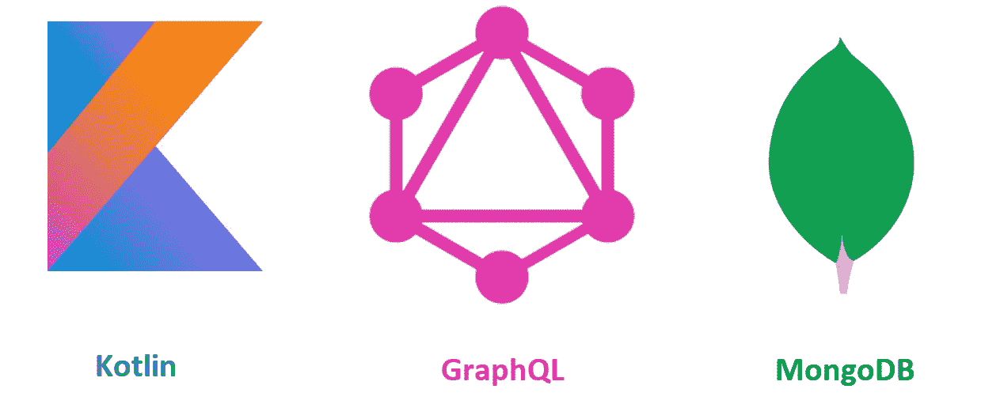
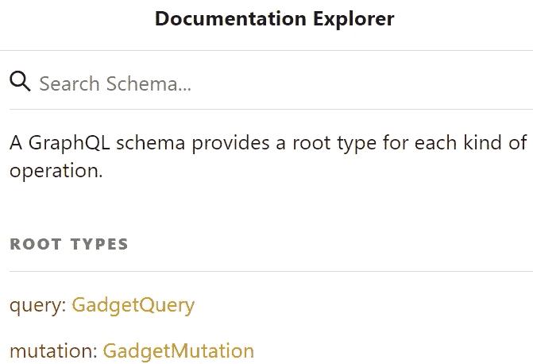
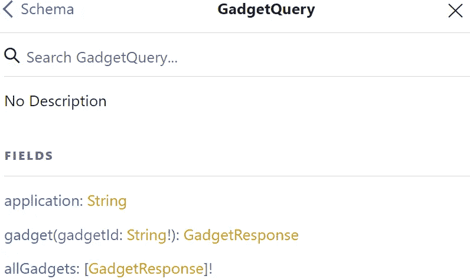
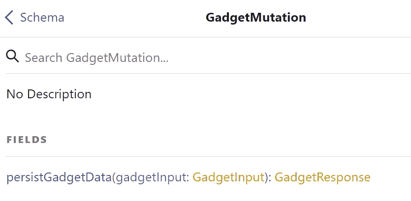
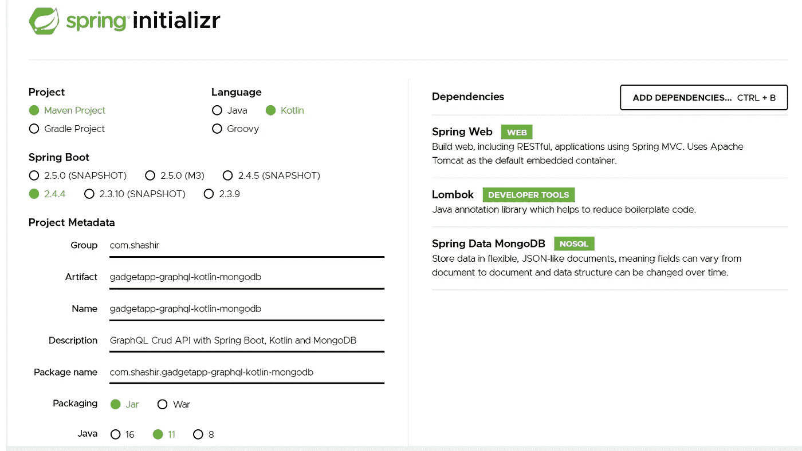
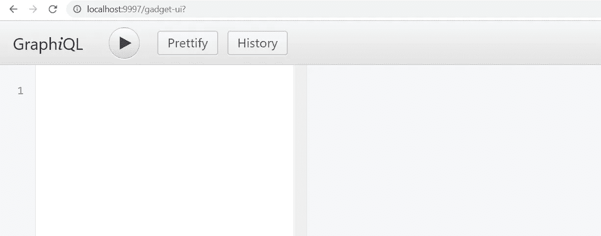
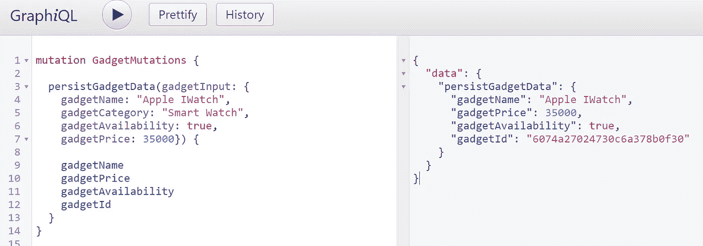
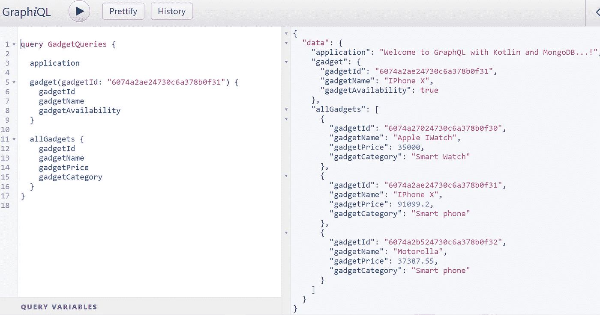
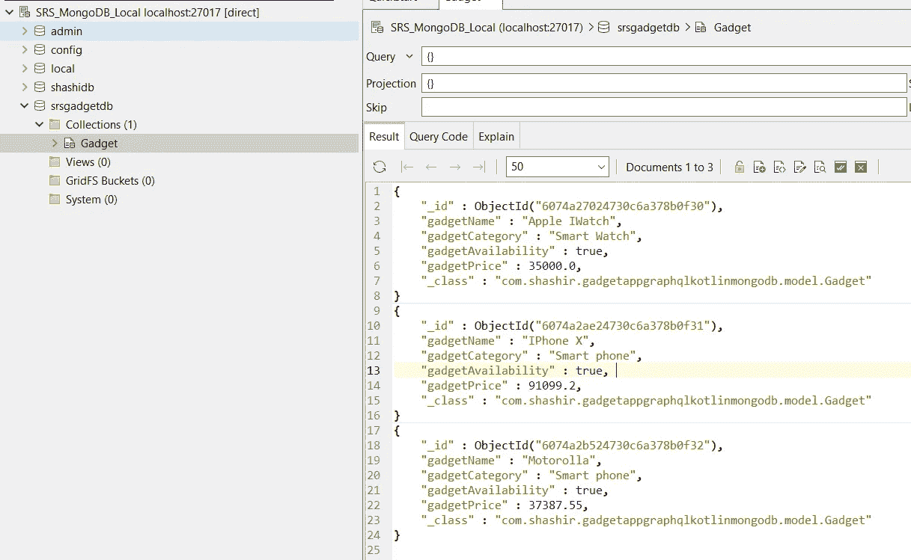

# 使用 Spring Boot、科特林和 MongoDB 的 GraphQL 快速入门

> 原文：<https://medium.com/geekculture/graphql-quickstart-with-spring-boot-kotlin-and-mongodb-c16f301b8aeb?source=collection_archive---------6----------------------->

***先说 GraphQL 官方定义*** *:*

GraphQL 是一种 API 查询语言，也是一种用现有数据完成这些查询的运行时语言。GraphQL 为 API 中的数据提供了完整且易于理解的描述，使客户能够准确地要求他们需要的东西，使 API 更容易随时间发展，并支持强大的开发工具。



Logo’s taken from official sites

在本文中，我们将了解什么是 GraphQL，通过用 Spring Boot 和 MongoDB 构建一个简单的 GraphQL 服务器来使用 GraphQL 的好处，以及它相对于 REST 实现的好处。

有了上面的官方定义，我们可以理解以下几点

*   它是 API 的查询语言，也是完成查询的运行时
*   它还提供了 API 数据的完整描述，这有助于客户端根据需要获取数据。

GraphQL 允许我们定义需要获取的数据的结构和格式，还允许我们在一个请求中查询多个模型。

GraphQL 架构将在扩展名为'的文件中定义。“graphqls ”,它包含模式、查询、变异和对象类型。

**graph QL 如何解决 REST API 的缺点:**

*   GraphQL 为消费者提供了根据需要请求属性的灵活性，即它在请求中提供动态数据。REST API 响应总是固定的，因为它为每个请求发送整个 JSON 对象。
*   REST API 存在取多取少的问题。
*   用更少的代码获得更好的性能。
*   GraphQL 为所有带有查询和变异的操作及其 HTTP POST 方法公开了一个端点。在 REST 中，每个操作都有一个单独的 API，根据需求使用不同的 HTTP 动词(GET、PUT、POST、DELETE)。
*   GraphQL 依赖于为应用程序定义的模式文件。只有在架构文件上指定的属性或操作才会向使用者公开。

## **GraphQL 模式:**

Schema 根据查询和变异操作以及它们的类型和属性来表示 GraphQL API。

```
**schema** {
    **query** : GadgetQuery
    **mutation**: GadgetMutation
}
```



## **查询类型:**

查询类型是 GraphQL 模式中的根类型，用于创建从 GraphQL 服务器获取数据的查询。它通常用于定义只读(GET)操作。让我们考虑一个 Gadget gallery 应用程序的例子，查询类型可以用来定义一组操作，如下所示

***注*** *:数组或对象列表用一对方括号/方框表示，例如:[Gadget]，感叹号表示为其强制/必需属性。*

> 按 GadgetId 获取小工具
> 获取所有小工具
> 按类别获取小工具
> 按类别获取可用小工具

```
*## Root type* **type** GadgetQuery {
    **application** : String
    **gadget**(gadgetId : String!) : GadgetResponse
    **allGadgets** : [GadgetResponse]!
}
```



**突变类型:**

突变类型是 GraphQL 模式中的另一个根类型，用于定义操纵数据的操作(POST、PUT、DELETE)。让我们考虑 Gadget gallery 应用程序的同一个例子，突变类型可以用来定义如下操作

```
**type** GadgetMutation {
    **persistGadgetData**(gadgetInput : GadgetInput) : GadgetResponse
}
```



**对象类型:**

对象类型用于定义用户定义的类型(Java/Kotlin 中的类),属性和数据类型用作输入/输出参数，以执行模式文件中定义的查询和变异类型的操作。

*示例:*可以在模式文件中定义小工具类型，如下所示。

***注*** *:感叹号表示其为强制/必需参数。例句:串串！*

```
**type** Gadget {
    **gadgetId**: String!
    **gadgetName**: String!
    **gadgetCategory**: String
    **gadgetAvailability**: Boolean!
    **gadgetPrice**: Float!
}
```

**GraphQL 解析器:**

*   ***GraphQLQueryResolver****:*

*它是用于解析查询类型操作的主要解析器之一。它充当应用程序(模式文件)中定义的所有只读操作的起点。*

*GadgetQueryResolver 实现了“GraphQLQueryResolver ”,并为模式文件中定义的查询操作提供实现。Spring 扫描解析器 beans 的包结构，并调用模式文件中声明的正确方法。*

```
**class** GadgetQueryResolver : GraphQLQueryResolver {...}
```

*   ***graphqlmationresolver****:*

这是另一个主要的解析器，用于解析突变类型的操作。它充当 GraphQL 模式文件中定义的所有 alter data 操作(即 POST、PUT 和 DELETE 操作)的起点。

*GadgetMutationResolver 类实现了“GraphQLMutationResolver ”,并为模式文件中定义的所有变异方法提供了实现。*

```
**class** GadgetMutationResolver : GraphQLMutationResolver {...}
```

*   ***graphql resolver:***

它充当 GraphQL 模式文件中所有其他类型(自定义用户定义类型)的通用解析器。当我们有多个通过一些映射相互链接的模型类时，这尤其有用。为了识别类型，它使用泛型。

```
**class** PhoneTypeResolver : GraphQLResolver<Phone> {...}
```

**GraphQL 服务器:动手示例**

***技术/工具*** :

> IDE:IntelliJ(STS/Eclipse)
> Kotlin:1.4 . x
> graph QL&GraphiQL:5 . x . x
> 构建工具:Maven
> Spring Boot: 2.4.x
> 数据库:MongoDB 服务器(或任何其他数据库——H2 或 MySQL)

[Spring Boot + MongoDB +科特林配置](https://start.spring.io/#!type=maven-project&language=kotlin&platformVersion=2.4.4.RELEASE&packaging=jar&jvmVersion=11&groupId=com.shashir&artifactId=gadgetapp-graphql-kotlin-mongodb&name=gadgetapp-graphql-kotlin-mongodb&description=GraphQL%20Crud%20API%20with%20Spring%20Boot%2C%20Kotlin%20and%C2%A0MongoDB&packageName=com.shashir.gadgetapp-graphql-kotlin-mongodb&dependencies=web,lombok,data-mongodb)



在下面添加 GraphQL Maven 依赖项

```
<**dependencies**>
   ...
   *<!-- Enable GraphQL servlet-mapping at URI - '/graphql' -->* <**dependency**>
      <**groupId**>com.graphql-java-kickstart</**groupId**>
      <**artifactId**>graphql-spring-boot-starter</**artifactId**>
      <**version**>5.7.0</**version**>
   </**dependency**>

   *<!-- GraphQL UI at '/graphiql' by default - GraphQL testing -->* <**dependency**>
      <**groupId**>com.graphql-java-kickstart</**groupId**>
      <**artifactId**>graphiql-spring-boot-starter</**artifactId**>
      <**version**>5.5.0</**version**>
   </**dependency**>

   <**dependency**>
      <**groupId**>com.graphql-java-kickstart</**groupId**>
      <**artifactId**>graphql-java-tools</**artifactId**>
      <**version**>5.4.1</**version**>
   </**dependency**>
   ...
</**dependencies**>
```

应用配置—***application . yml***

这里我们将默认的 graphiql url 从“graphiql”覆盖到“gadget-ui ”,并提供了 MongoDB 配置

```
*## Server port* **server**:
  **port**: 9997

*## Graphiql Mapping* **graphiql**:
  **mapping**: gadget-ui

*## MongoDB configuration (optional - if not provided spring boot takes default values)* **spring**:
  **data**:
    **mongodb**:
      **host**: localhost
      **port**: 27017
      **database**: srsgadgetdb
```

Mongo 存储库——连接 MongoDB 服务器

```
@Repository
**interface** GadgetRepository : MongoRepository<Gadget?, String?> { }
```

让我们看看放在项目类路径中的小工具库应用程序“gadget.graphqls”的完整 GraphQL 模式。

```
**schema** {
    **query** : GadgetQuery
    **mutation**: GadgetMutation
}

*## Root type* **type** GadgetQuery {
    **application** : String
    **gadget**(gadgetId : String!) : GadgetResponse
    **allGadgets** : [GadgetResponse]!
}

*## Root type* **type** GadgetMutation {
    **persistGadgetData**(gadgetInput : GadgetInput) : GadgetResponse
}

**type** Gadget {
    **gadgetId**: String!
    **gadgetName**: String!
    **gadgetCategory**: String
    **gadgetAvailability**: Boolean!
    **gadgetPrice**: Float!
}

**type** GadgetResponse {
    **gadgetId**: String!
    **gadgetName**: String!
    **gadgetCategory**: String
    **gadgetAvailability**: Boolean!
    **gadgetPrice**: Float!
}

**input** GadgetInput {
    **gadgetName**: String!
    **gadgetCategory**: String
    **gadgetAvailability**: Boolean!
    **gadgetPrice**: Float!
}
```

带有属性集的小工具集合和文档详细信息

```
@Document(collection = **"Gadget"**)
**data class** Gadget(

    @Id
    **val gadgetId**: String? = **null**,
    **var gadgetName**: String? = **null**,
    **var gadgetCategory**: String? = **null**,
    **var gadgetAvailability**: Boolean? = **true**,
    **var gadgetPrice**: Double? = **null** )
```

**T5【GadgetQueryResolver:**

在这个类中，我们为查询根类型的模式文件中定义的操作提供了实现。

```
@Component
**class** GadgetQueryResolver : GraphQLQueryResolver {

    @Autowired
    **var gadgetRepository**: GadgetRepository? = **null

    fun** application() : String {
        **return "Welcome to GraphQL with Kotlin and MongoDB...!"** }

    **fun** getGadget(gadgetId: String): GadgetResponse? {
        **var** gadget = **gadgetRepository**?.findById(gadgetId)?.get()
        **return** mapGadgetToGadgetResponse(gadget)
    }

    **fun** getAllGadgets(): List<GadgetResponse?>? {
        **return** getGadgetResponse(**gadgetRepository**?.findAll() **as** List<Gadget>)
    }

    **private fun** getGadgetResponse(gadgetList: List<Gadget>): List<GadgetResponse>? {
        **val** gadgetResponseList: MutableList<GadgetResponse> = ArrayList()
        gadgetList.stream().forEach **{** gadget: Gadget **->** gadgetResponseList.add(mapGadgetToGadgetResponse(gadget))
        **}
        return** gadgetResponseList
    }

    **private fun** mapGadgetToGadgetResponse (gadget : Gadget?) : GadgetResponse {
        **var** gadgetResponse = GadgetResponse()
        gadgetResponse.**gadgetId** = gadget?.**gadgetId** gadgetResponse.**gadgetName** = gadget?.**gadgetName** gadgetResponse.**gadgetCategory** = gadget?.**gadgetCategory** gadgetResponse.**gadgetPrice** = gadget?.**gadgetPrice** gadgetResponse.**gadgetAvailability** = gadget?.**gadgetAvailability
        return** gadgetResponse;
    }
}
```

***GadgetMutationResolver:***

在这个类中，我们提供了在模式文件中为突变类型定义的操作的实现。

```
@Component
**class** GadgetMutationResolver : GraphQLMutationResolver {

    @Autowired
    **var gadgetRepository**: GadgetRepository? = **null

    fun** persistGadgetData(persistGadget: GadgetInput): GadgetResponse {
        **val** saveGadgetData = Gadget()
        saveGadgetData.**gadgetName** = persistGadget.**gadgetName** saveGadgetData.**gadgetCategory** = persistGadget.**gadgetCategory** saveGadgetData.**gadgetPrice** = persistGadget.**gadgetPrice** saveGadgetData.**gadgetAvailability** = persistGadget.**gadgetAvailability
        val** persistedGadget: Gadget? = **gadgetRepository**?.save(saveGadgetData)
        **return** mapGadgetToGadgetResponse(persistedGadget)
    }

    **private fun** mapGadgetToGadgetResponse (gadget : Gadget?) : GadgetResponse {
        **var** gadgetResponse = GadgetResponse()
        gadgetResponse.**gadgetId** = gadget?.**gadgetId** gadgetResponse.**gadgetName** = gadget?.**gadgetName** gadgetResponse.**gadgetCategory** = gadget?.**gadgetCategory** gadgetResponse.**gadgetPrice** = gadget?.**gadgetPrice** gadgetResponse.**gadgetAvailability** = gadget?.**gadgetAvailability
        return** gadgetResponse;
    }
}
```

**GraphQL —小工具应用测试:**

默认情况下，GraphQL servlet 映射如下
[http://localhost:9997/graph QL](http://localhost:9997/graphiql)

*基于 application.yml 文件中提供的配置自定义 URL:*[*http://localhost:9997/gadget-ui*](http://localhost:9997/gadget-ui)



**测试小工具突变:**



**测试小工具查询:**



验证 MongoDB 数据库中的小工具集合，我们可以在其中找到如下 3 个文档:



好了..我希望这篇文章对您开始使用 GraphQL 有所帮助。在本文中，我们从 GraphQL 的基础知识以及如何使用 GraphQL 实现查询和变异开始，并给出了一个从 MongoDB 持久化和读取数据的例子。

上面例子的完整代码可以在 GitHub 上找到

[](https://github.com/shashirl9/gadgetapp-graphql-kotlin-mongodb) [## shashirl 9/gadgetapp-graph QL-kot Lin-MongoDB

### Permalink 无法加载最新的提交信息。验证 MongoDB 数据库的小工具集合，在那里我们可以找到 3…

github.com](https://github.com/shashirl9/gadgetapp-graphql-kotlin-mongodb) 

GraphQL 官方文档:

[](https://graphql.org/learn/) [## GraphQL 简介

### 了解 GraphQL，它如何工作，以及如何使用它。寻找关于如何构建 GraphQL 服务的文档…

graphql.org](https://graphql.org/learn/)