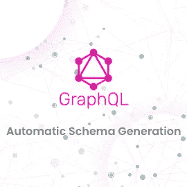

# GraphQL 模式

> 原文：<https://medium.com/geekculture/graphql-schema-e70547fe2c81?source=collection_archive---------21----------------------->



# 介绍

GraphQL 服务器用法模式是指可用数据的形式。该模式描述了具有字段的类型的命令链。这些都是从后端数据存储中解决的。该模式还准确地陈述了哪些查询和变化可供客户端执行。

在本文中，我们将学习模式的重要构建块，以及如何为 [GraphQL 服务器构建一个模式。](https://www.technologiesinindustry4.com/2021/08/interaction-with-an-apollo-graphql-server-from-the-frontend.html)

# 描述

GraphQL 模式对于任何 [GraphQL](https://www.technologiesinindustry4.com/2021/08/interaction-with-an-apollo-graphql-server-from-the-frontend.html) 服务器应用程序都是必不可少的。它指的是连接到它的客户端使用的现有功能。我们可以使用任何编程语言来形成一个 GraphQL 模式，并围绕它形成一个界面。

GraphQL 运行时概述了一个通用的基于图形的模式。也就是发布它所表示的数据服务的能力。客户端应用程序可以在其能力范围内查询模式。这种方法将客户机与服务器分离，允许一起自由地改变和扩展。

我们需要准备的就是使用 GraphQL 模式语言来识别 API 的类型。用作构建模式函数的参数。

[GraphQL](https://www.technologiesinindustry4.com/2021/08/graphql-queries-and-mutations.html) 模式语言关心的是 String、Int、Float、Boolean 和 ID 的标量类型。因此，我们可以在传递的模式中公开使用这些来构建模式。

默认情况下，每种类型都可以为空。将 null 作为任何标量类型返回是真实的。用于指定类型的感叹号不能为空。所以，字符串！是不可为空的字符串。

用方括号将类型括起来，以使用列表类型。因此，[Int]是一个整数列表。这些类型都直接映射到 JavaScript。因为我们可以在返回这些类型的 API 中返回普通的旧 JavaScript 对象。

**举例:**

```
var express = require('express');var { graphqlHTTP } = require('express-graphql');var { buildSchema } = require('graphql'); // Construct a schema, using GraphQL schema languagevar schema = buildSchema(` type Query { quoteOfTheDay: String random: Float! rollThreeDice: [Int] }`); // The root provides a resolver function for each API endpointvar root = { quoteOfTheDay: () => { return Math.random() < 0.5 ? 'Take it easy' : 'Salvation lies within'; }, random: () => { return Math.random(); }, rollThreeDice: () => { return [1, 2, 3].map(_ => 1 + Math.floor(Math.random() * 6)); },}; var app = express();app.use('/graphql', graphqlHTTP({ schema: schema, rootValue: root, graphiql: true,}));app.listen(4000);console.log('Running a GraphQL API server at localhost:4000/graphql');
```

# 字段定义

我们定义了许多具有一个或多个字段的模式类型。每个字段都返回指定类型的数据。[字段的返回类型可以是标量、对象、枚举、联合或接口。](https://www.technologiesinindustry4.com/)

```
# This Book type has two fields: title and authortype Book { title: String  # returns a String author: Author # returns an Author}
```

# makeExecutableSchema 的函数语法

此函数采用对象类型的单个参数{}。[使用该功能的语法描述如下:](https://www.technologiesinindustry4.com/)

```
import { makeExecutableSchema } from 'graphql-tools';const jsSchema = makeExecutableSchema({ typeDefs, resolvers, // optional logger, // optional allowUndefinedInResolve = false, // optional resolverValidationOptions = {}, // optional directiveResolvers = null, // optional schemaDirectives = null,  // optional parseOptions = {},  // optional inheritResolversFromInterfaces = false  // optional});
```

更多详情请访问我的网站:[https://www.technologiesinindustry4.com/](https://www.technologiesinindustry4.com/)