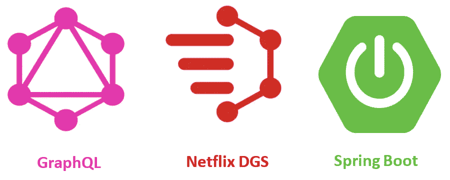
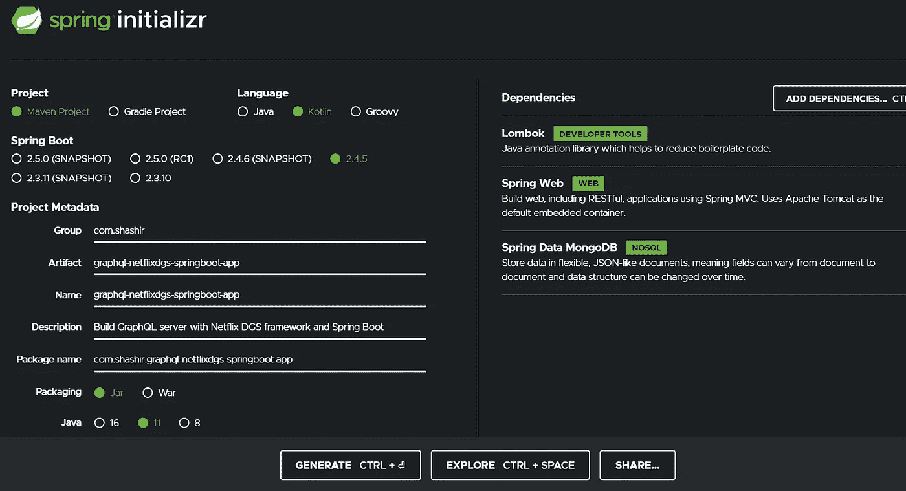
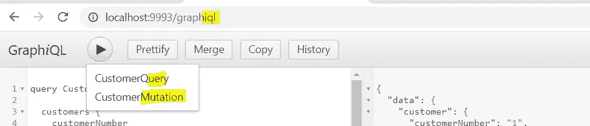
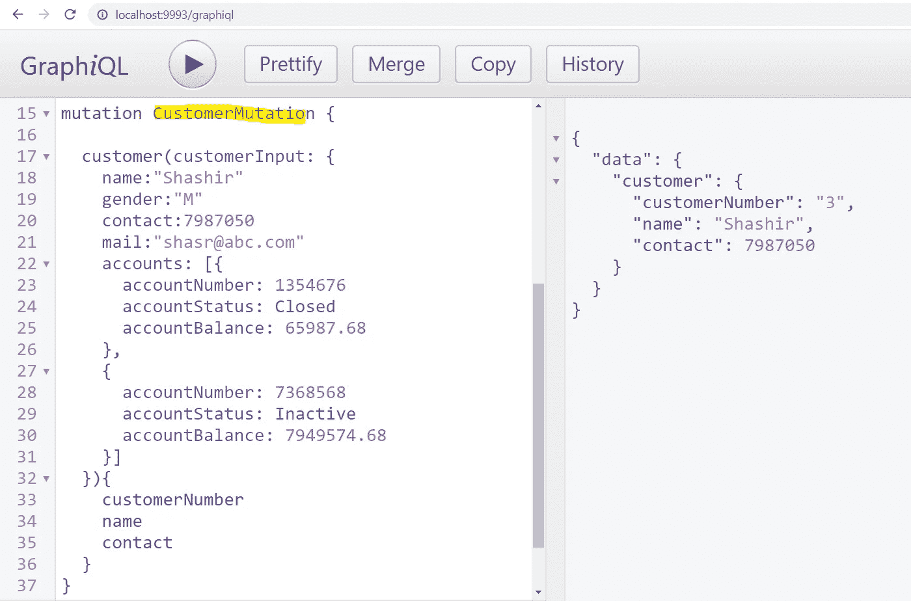
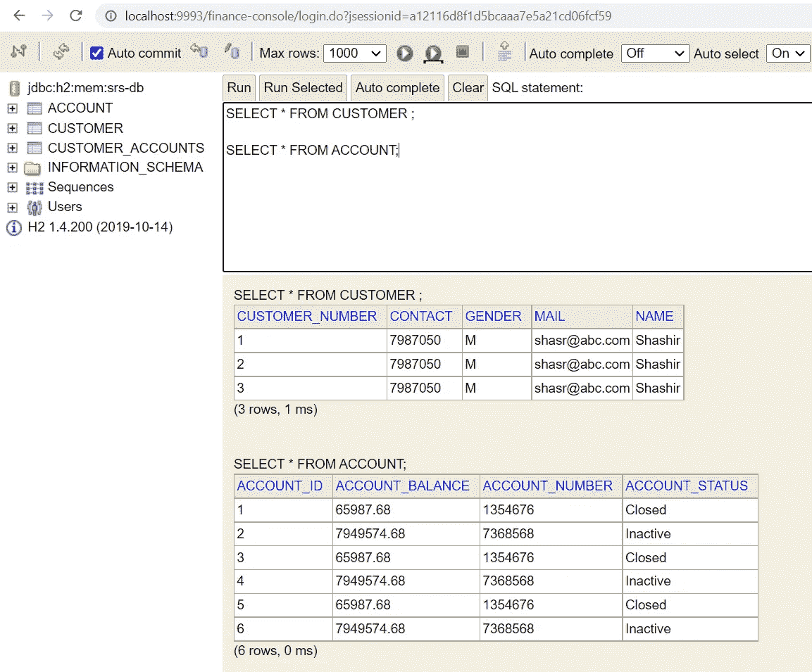
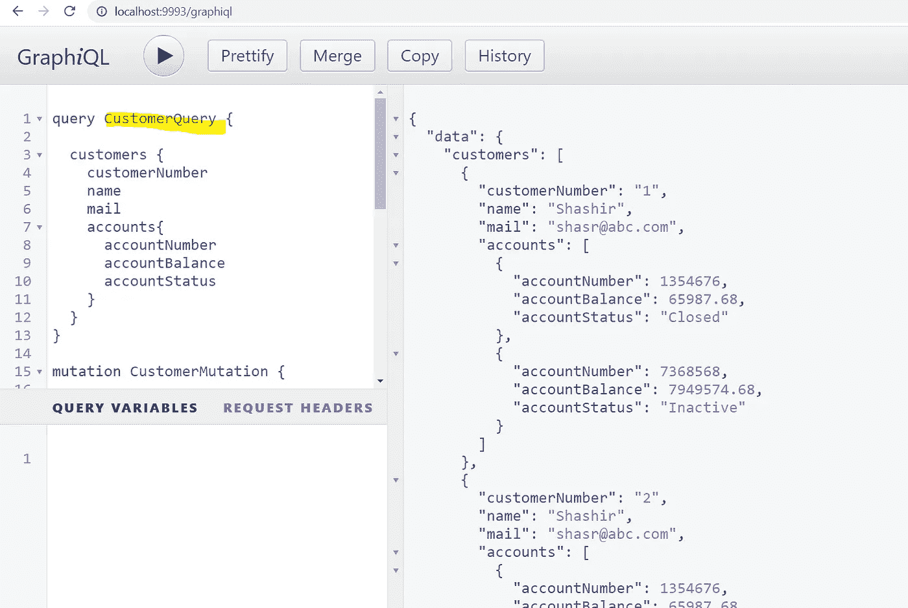

# 网飞·DGS 和 Spring Boot 的 GraphQL 服务器

> 原文：<https://medium.com/geekculture/graphql-server-with-netflix-dgs-and-spring-boot-2b2f1b42d163?source=collection_archive---------1----------------------->

***定义*** :
*GraphQL 是一种 API 的查询语言，也是一种用你现有的数据完成那些查询的运行时。GraphQL 为 API 中的数据提供了完整且易于理解的描述，使客户能够准确地要求他们需要的东西，使 API 更容易随时间发展，并支持强大的开发工具。*


Photo by [Thomas Couillard](https://unsplash.com/@thomascouillard?utm_source=medium&utm_medium=referral) on [Unsplash](https://unsplash.com?utm_source=medium&utm_medium=referral)

什么是网飞 DGS？

网飞 DGS(域图服务)是一个基于 Spring Boot 用 Kotlin 编写的 GraphQL 服务器框架，除了 Spring 框架之外，它被设计成具有最小的外部依赖性。

DGS 还附带了 code-gen 插件，用于从 GraphQL 模式生成 Java 或 Kotlin 代码。

[GraphQL 初学者—从这里开始](/geekculture/graphql-quickstart-with-spring-boot-kotlin-and-mongodb-c16f301b8aeb)



**GraphQL API 开发**

有两种开发 GraphQL API 的方法，如下所示

1.  ***模式优先 API 开发*** *:这里我们用 GraphQL 模式文件定义 API，为查询/变异*操作提供服务实现。
2.  ***代码优先 API 开发*** *:与上面相反，这里 GraohQL 模式是在运行时从代码定义中得到生成的。*

比起代码优先的方法，网飞·DGS 更喜欢模式优先的开发。

**GraphQL 模式类型(它来自 graph QL——不特定于 DGS)**

1.  **查询**类型:定义只读操作(例如:GET)
2.  **突变**类型:定义数据变更操作(如:上传、发布、删除、修补)
3.  **输入**类型:定义用户自定义的 json 类型，作为查询/变异操作的请求参数。
4.  **输出**类型:定义用户自定义的 json 类型，作为查询/变异操作的响应类型。
5.  **枚举**类型:定义常量——可用于输入/输出类型中的属性。
6.  **标量**类型:所有 GraphQL 默认原语类型都被认为是标量。
7.  **接口**类型:我们可以使用接口类型作为响应参数。

让我们从一个简单的例子开始:

[](https://start.spring.io/#!type=maven-project&language=kotlin&platformVersion=2.4.5.RELEASE&packaging=jar&jvmVersion=11&groupId=com.shashir&artifactId=graphql-netflixdgs-springboot-app&name=graphql-netflixdgs-springboot-app&description=Build%20GraphQL%20server%20with%20Netflix%20DGS%20framework%20and%20Spring%20Boot&packageName=com.shashir.graphql-netflixdgs-springboot-app&dependencies=lombok,web,data-mongodb) [## 弹簧初始化 r

### Initializr 生成的 spring boot 项目正好是你快速启动所需要的！

start.spring.io](https://start.spring.io/#!type=maven-project&language=kotlin&platformVersion=2.4.5.RELEASE&packaging=jar&jvmVersion=11&groupId=com.shashir&artifactId=graphql-netflixdgs-springboot-app&name=graphql-netflixdgs-springboot-app&description=Build%20GraphQL%20server%20with%20Netflix%20DGS%20framework%20and%20Spring%20Boot&packageName=com.shashir.graphql-netflixdgs-springboot-app&dependencies=lombok,web,data-mongodb) 

[](https://mvnrepository.com/artifact/com.netflix.graphql.dgs/graphql-dgs-spring-boot-starter)****:【超链接附后】****

*   **Maven:**

```
<**dependency**>
   <**groupId**>com.netflix.graphql.dgs</**groupId**>
   <**artifactId**>graphql-dgs-spring-boot-starter</**artifactId**>
   *<!-- Set the latest framework version! -->* <**version**>3.11.0</**version**>
</**dependency**>
```

*   **格拉德:**

```
repositories {
    mavenCentral()
}dependencies {
    implementation "com.netflix.graphql.dgs:graphql-dgs-spring-boot-starter:latest.release"
}
```

*   **格雷尔+科特林:**

```
repositories {
    mavenCentral()
}dependencies {
    implementation("com.netflix.graphql.dgs:graphql-dgs-spring-boot-starter:latest.release")
}
```

***让我们从 GraphQL 模式文件*开始**

**这里，我们使用两个模型对象——Account 和 Customer 来理解一些 GraphQL 概念，以及当我们有多个带有 hibernate 映射的实体时它的用法。**

**这里我们有查询、变异、输入、枚举和标量类型**

```
**type** Query {
    **customers**: [Customer]
}

**type** Mutation {
    **customer**(customerInput: CustomerInput): Customer
}

**type** Customer {
    **customerNumber**: String!
    **name**: String!
    **gender**: String!
    **contact**: Int!
    **mail**: String
    **accounts**: [Account]
}

**type** Account {
    **accountId**: String
    **accountNumber**: Int
    **accountStatus**: AccountStatus
    **accountBalance**: Float
}

**input** CustomerInput {
    **name**: String!
    **gender**: String!
    **contact**: Int!
    **mail**: String
    **accounts**: [AccountInput]
}

**input** AccountInput {
    **accountNumber**: Int
    **accountStatus**: AccountStatus
    **accountBalance**: Float
}

**enum** AccountStatus {
    ***Active***, ***Inactive***, ***Closed*** }
```

****用@DgsComponent** 实现数据提取器**

**@DgsComponent —它的作用类似于@RestController 批注。**

```
@DgsComponent
**public class** CustomerDataFetcher {

    @Autowired
    CustomerRepository **customerRepository**;

    @Autowired
    AccountRepository **accountRepository**; *@DgsData methods* *@DgsMutation methods* *@DgsQuery methods*
}
```

*****GraphQL 查询带@DgsQuery 和@DgsData 标注*****

*****@DgsQuery*** —与' @GetMapping '注释相同**

**它是一个方法级的注释，用于将该方法作为一个数据提取器。它只有一个参数——“字段”。它将用于执行提取操作。**

**这里，parentType 是“Query”，从注释本身和“field”中派生出来，如果指定的话，从提供的值中选择，否则将从方法名中派生出来。**

```
@DgsQuery(field = **"customers"**)
**public** List<Customer> customers() {
    **return customerRepository**.findAll();
}
```

*****@DgsData —*** 与“@RequestMapping”注释相同**

**它是一个方法级的注释，用于将该方法作为一个数据提取器。它有两个参数——“父类型”和“字段”。**

*   **parentType —它是一种包含字段的类型。**
*   **字段—指示数据提取器负责的字段。**

**这里要注意的是，参数“field”是一个可选参数，它将从方法名中派生出来。**

**我们不能在一个方法中定义@DgsQuery 和@DgsMutation，而是可以将@DgsData 与 parentType 一起用作“查询”或“变异”。**

```
@DgsData(parentType = **"Query"**, field = **"customers"**)
**public** List<Customer> customers() {
    **return customerRepository**.findAll();
}@DgsData(parentType = **"Customer"**, field = **"accounts"**)
**public** List<Account> accounts(DgsDataFetchingEnvironment dgsDataFetchingEnvironment) {
    Customer customer = dgsDataFetchingEnvironment.getSource();
    List<Account> accountList = **new** ArrayList<>();
    **for** (Account account : customer.getAccounts()) {
       Account accountResponse = **accountRepository**.findById(account.getAccountId()).get();
       accountList.add(accountResponse);
    }
    **return** accountList;
}
```

*****GraphQL 突变用@DgsMutation 标注*****

*****@ DgsMutation—***与“@PostMapping，@PutMapping，@DeleteMapping”注释相同**

**它是一个方法级的注释，用于将该方法作为一个数据提取器。它只有一个参数——“字段”。它将用于执行持久化/更新/删除操作。**

**在这里，parentType 是“Mutation”，从注释本身和“field”派生而来，如果指定的话，从提供的值中选择，否则它将从方法名派生而来。**

```
@DgsMutation
**public** Customer customer(CustomerInput customerInput) {
    Customer customer = Customer.*builder*()
            .contact(customerInput.getContact())
            .name(customerInput.getName())
            .gender(customerInput.getGender())
            .mail(customerInput.getMail())
 .accounts(mapCustomerAccounts(customerInput.getAccounts()))
            .build();
    Customer customerResponse = **customerRepository**.save(customer);
    **return** customerResponse;
}
```

**让我们从 GraphiQL web 控制台开始测试应用程序:**

*****模型类—账户*****

```
@Data
@Entity
@Builder
@NoArgsConstructor
@AllArgsConstructor
@Table(name = **"account"**)
**public class** Account { @Id
    @GeneratedValue(strategy = GenerationType.***IDENTITY***)
    **private** String **accountId**;
    **private** Long **accountNumber**;
    **private** String **accountStatus**;
    **private** Double **accountBalance**;
}
```

*****模型类—客户*****

```
@Data
@Entity
@Builder
@NoArgsConstructor
@AllArgsConstructor
@Table(name = **"Customer"**)
**public class** Customer { @Id
    @Column(name = **"CUSTOMER_NUMBER"**)
    @GeneratedValue(strategy = GenerationType.***IDENTITY***)
    **private** String **customerNumber**;
    **private** String **name**;
    **private** String **gender**;
    **private** Long **contact**;
    **private** String **mail**; @OneToMany(cascade = CascadeType.***ALL***)
    **private** List<Account> **accounts**;
}
```

**JPA 存储库—帐户和客户**

```
@Repository
**public interface** CustomerRepository **extends** JpaRepository<Customer, String> {}@Repository
**public interface** AccountRepository **extends** JpaRepository<Account, String> {}
```

**让我们从 GraphiQL web 控制台开始测试应用程序:**

****

**通过选择“CustomerMutation ”,我们正在执行将条目输入到我们的 H2 数据库中的 POST 操作。**

********

**通过选择“CustomerQuery ”,我们执行 GET 操作，从 H2 数据库中获取所有客户。**

****

**我希望你发现这篇文章有助于理解网飞 DGS 框架的基础知识。在这里，我们从网飞·DGS 的基础知识开始，介绍了如何使用它来编写 GraphQL 组件，以及如何使用它来实现查询和变异，并给出了一个从 H2 数据库持久化和读取数据的例子。**

**上面例子的完整代码可以在 GitHub 上找到**

**[](https://github.com/shashirl9/neflixdgs-graphql-javaapp) [## GitHub-shashirl 9/neflixdgs-graph QL-javaapp:用网飞 dgs 框架和 Spring 启动 graph QL…

### 用网飞 DGS 框架和 Spring Boot-GitHub-shashirl 9/neflixdgs-GraphQL-javaapp 启动 graph QL:启动 GraphQL…

github.com](https://github.com/shashirl9/neflixdgs-graphql-javaapp) 

***参考文献*** :

 [## 家园- DGS 框架

### @DgsComponent 公共类 ShowsDataFetcher { @ DGS data(parent type = " Query "，field = "shows ")公共列表…

netflix.github.io](https://netflix.github.io/dgs/) [](https://github.com/Netflix/dgs-framework/blob/master/CONTRIBUTING.md) [## 网飞/dgs 框架

### 感谢您对 DGS 框架感兴趣！本指南有助于找到最有效的投稿方式，询问…

github.com](https://github.com/Netflix/dgs-framework/blob/master/CONTRIBUTING.md)**