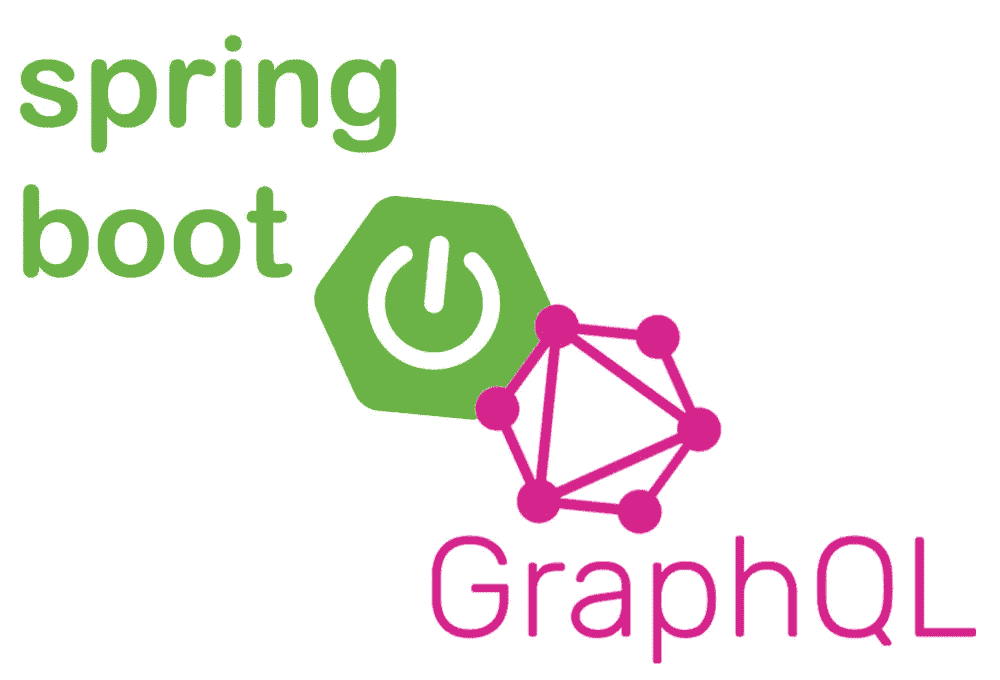
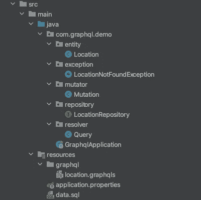
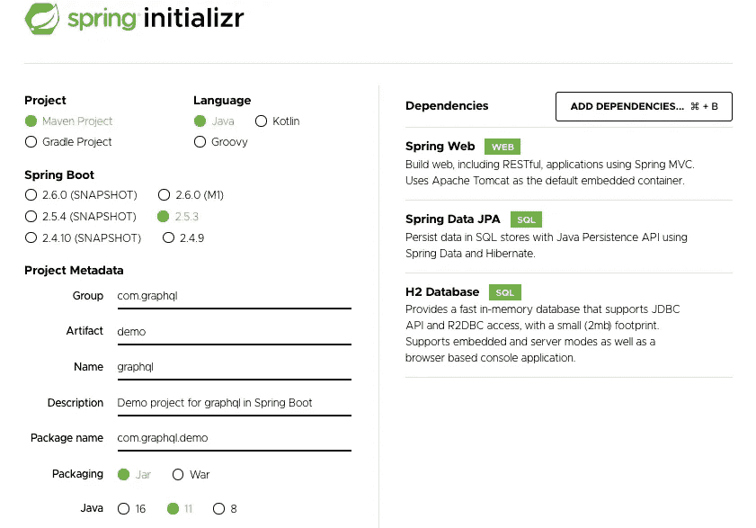
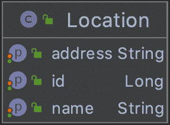

# 带 Java 的 GraphQL Spring Boot 入门

> 原文：<https://medium.com/geekculture/graphql-spring-boot-starter-with-java-533fe368264d?source=collection_archive---------11----------------------->

## 用 Spring Boot 框架和 JPA 创建一个 GraphQL API

GraphQL 既是一种 API 查询语言，也是使用当前数据执行这些查询的运行时。GraphQL 允许客户要求他们所需要的，而不是更多，使 API 随着时间的推移更容易发展，并通过提供 API 中数据的清晰易懂的描述来支持强大的开发工具。

在本文中，我们将创建一个简单的机场定位应用程序。

# 生成项目

转到[https://start.spring.io/](https://start.spring.io/)并生成一个项目，别忘了添加 Spring Web、H2 数据库和 Spring Data JPA 依赖项。

Source:[https://start.spring.io](https://start.spring.io/)

# 添加依赖关系

要启用 GraphQL，请在下面添加这两个依赖项。

# 架构:

GraphQL 模式定义了通过 API 可用的数据点。该模式描述了数据类型及其关系，以及可用的操作，例如检索数据的查询以及创建、更新和删除数据的变异。

在 ***资源*** 文件夹中，创建一个带有“.graphqls "扩展名，整个名称将为" location.graphqls "。

“！”表示该字段是必需的。

# 实体和存储库

现在创建一个名为 Location 的实体。位置应该有三个属性:id、名称和地址，这在模式中已经提到过。当然还会生成 Getters、Setters 和 Constrictors。

那么对于这个例子，一个存储库只使用 ***CrudRepository、*** 并扩展位置实体。

# 查询和例外:

**1。查询**:

查询允许我们检索数据。每个查询都可以有一个特定的对象，该对象完全基于查询中指定的字段返回，您可以添加或删除字段以匹配您需要的精确数据，从而适应您的特定用例。

创建一个解析器包，然后添加一个新的**查询**类，该类实现了 **GraphQLQueryResolver** 并添加了 *@Component* 注释。我们只需要添加我们之前输入到 *location.graphqls* 中的查询。

**2。变异者:**

GraphQL 中的突变允许它更新存储在服务器上的数据。与查询不同，创建、更新或删除等变化会改变您的数据。

现在创建一个 mutator 包，然后添加一个新的类 **Mutation** ，它实现了**graphqlmationresolver**并添加了 *@Component* 注释。另外，添加我们之前输入到 *location.graphqls* 中的突变。

**3。例外:**

创建一个异常包，然后添加一个新类**LocationNotFoundException**，它扩展了 **RuntimeException** 并实现了 **GraphQLError。**

现在 GraphQL API 已经可以使用了！

**资源:**

[https://www.graphql-java.com](https://www.graphql-java.com/)

[https://graphql.org](https://graphql.org/)

源代码 [***此处***](https://github.com/sabbarmehdi/graphql) ***。***