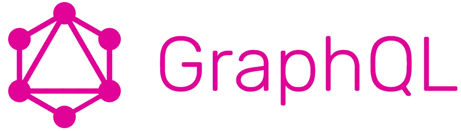

# GraphQL —更好的休息

> 原文：<https://medium.com/geekculture/graphql-the-better-rest-3e65a6145752?source=collection_archive---------4----------------------->

本文主要关注普通的 GraphQL 功能。



Source: graphql.org

## **什么是 GraphQL？**

GraphQL 是一种查询语言，**对如何从服务器**加载数据提供了完整且可理解的描述。GraphQL 支持声明性数据提取，客户端可以准确地指定它需要从 API 获取什么数据。

## GraphQL 与 REST

REST 是公开服务器数据的一种流行方式。但是随着应用程序变得越来越复杂，人们开始面临 REST 架构风格的问题。让我们考虑一个*电影审查系统*的例子来更好地理解这一点。

假设我们有三个资源——电影、收视率和评论。我们的要求是获取所有电影的名称、评论以及每个评论的点赞数。API 端点将是`/v1/movies`、`/v1/movies/reviews/{movieId}`和`/v1/movies/reviews/{reviewId}`。

上述场景的问题
— **多个端点:**在 REST 中，使用不同的端点来获取不同的资源。因此开发人员必须维护这些端点的列表。
— **过度抓取:**这意味着客户端下载的信息多于应用程序实际需要的信息。在上面的示例中，我们只需要一部电影的名称，但是响应将包含其他信息，如电影的演员或上映日期，这对客户端没有用，因为它只需要电影的名称。
— **欠取**和**n+1-请求:**这意味着一个特定的端点没有提供足够的所需信息，客户端将不得不发出额外的请求来获取它所需要的一切。在上面的例子中，我们想要显示所有电影的评论，所以我们首先获取电影，然后通过调用另一个端点获取它们的评论。这就造成了*n+1-请求*的问题。

## 以上问题的解决方法: **GraphQL**

开发 GraphQL 是为了满足对更高灵活性和效率的需求！它充当客户端和一个或多个数据源之间的一个层，接收客户端请求并根据给定的指令获取必要的数据。

考虑上面的例子，让我们为给定的需求编写一个 GraphQL 查询。

```
{
   movies {
       movieId
       name
       reviews {
           reviewId
           likes
       }
   }
}
```

客户端发送的查询指定了数据的形状，服务器以完全相同的形状进行响应。这就解决了取多取少的问题。客户端的工作不是从不同的端点获取数据。客户机只是指定它需要的数据的形式，然后由服务器负责完成工作。处理多个端点的问题也是这样解决的。GraphQL 中只有一个端点，查询作为字符串传递给服务器。

GraphQL 的另一个主要特征是它使用强类型系统来描述数据和验证客户端发送的查询。GraphQL 还允许对后端请求的数据进行深入分析。使用 GraphQL，我们还可以对服务器处理的请求进行底层性能监控。

# 核心概念

GraphQL 有三个主要构件:*模式、查询和解析器*。

## **图式**

模式是可以通过服务器获取的数据的模型。它定义了允许客户端进行哪些查询，可以从服务器获取哪些类型的数据，以及这些类型之间的关系。编写模式的语法被称为*模式定义语言(SDL)。让我们考虑一个如何使用 SDL 定义一个简单模式的例子。*

```
type Book {
    id: Int!
    title: String!
    published: Date
    author: Author
}
type Author {
    id: Int!
    name: String
    books: [Book]!
}
```

*   `Book`和`Author`都是 *GraphQL 对象类型*，也就是有一些字段的类型。
*   `id`、`title`、`published`、`author`是`Book`类型上的*字段*。这意味着这些是唯一可以出现在任何对图书类型进行操作的查询中的字段。
*   `Int`、`String`、`Date`为内置*标量*类型。
*   `String!`意味着 fields 是*不可空的*，意味着当我们查询这个字段时，我们将总是得到一个值。
*   `[Book]!`代表图书对象的一个*数组*。`!`表示列表非空。

模式中有一些特殊的类型:

```
schema {
   query: Query
   mutation: Mutation
   subscription: Subscription
}
```

*   `query` type 用于从数据库中获取数据。
*   `mutation`类型用于对现有数据进行修改。
*   `subscription` type 用于与服务器进行实时连接，以便立即获得关于重要事件的通知。

每个 GraphQL 服务都有一个`query`类型，可能有也可能没有`mutation`或`subscription`类型。这些类型定义了每个 GraphQL 查询的*入口点*。我们将在下一个主题中看到如何定义查询的入口点。

## **查询**

GraphQL 让客户端通过向服务器发送一些信息来决定实际需要什么数据，这些信息被称为*查询。*让我们看一个客户机可以发送给服务器的示例查询。

```
{
    author {
        name
    }
}
```

回应应该是这样的

```
{
    "data": {
        "author": [
            { "name": "William Shakespeare" },
            { "name": "Siddhartha Mukherjee" },
            ...
        ]
    }
}
```

您可以立即看到该查询与结果具有完全相同的形状。这意味着我们总是得到我们所期望的，而且服务器也知道客户在要求什么。

如果在模式中为该查询定义了入口点，则该查询将被执行。让我们为上述查询定义一个入口点。

```
type Query {
    author: [Author]
}
```

在查询中，字段也可以引用*对象*。在这种情况下，我们可以对该对象的字段进行子选择。让我们看一个这种情况的例子。

```
{
    author {
        name
        book {
           title
        }
    }
}
```

响应应该是这样的:

```
{
    "data": {
        "author": [
            { 
               "name": "William Shakespeare",
               "books": [ 
                   { "title": "The Tragedy of Macbeth" },
                   { "title": "Measure for Measure" },
                   ...
               ] 
            },
            ...
        ]
    }
}
```

GraphQL 还提供了将**参数**传递给字段的能力。例如:

```
{
    author(id: "101") {
        name
    }
}
```

响应应该是这样的:

```
{
    "data": {
        "author": { 
            "name": "Siddhartha Mukherjee"
        }
    }
}
```

在 GraphQL 中，每个字段和嵌套对象都可以获得自己的一组参数，这使得 GraphQL 完全可以替代多次 API 获取。

到目前为止，我们一直在使用一种简化的语法，其中我们省略了`query`关键字和查询名称，但是使用它们使我们的代码不那么模糊是很有用的。让我们看一个例子，其中包括关键字`query`作为*操作类型*和`AuthorNameAndBooksTitle`作为*操作名称*。

```
query AuthorNameAndBooksTitle {
    author(id: "101") {
        name
        book {
           title
        }
    }
}
```

*   *操作类型*或者是*查询*、*突变*或者是*订阅*，描述你打算做什么类型的操作。
*   *操作名称*是您的操作的一个有意义且明确的名称。

在上面的例子中，我们已经在查询字符串中传递了`id`的值。但是在查询字符串中直接传递这些动态参数并不是一个好主意。相反，GraphQL 提供了一种更好的方法来从查询中提取动态值，并分别传递它们。这些值被称为*变量*。让我们看一个例子:

```
query AuthorNameAndBooksTitle($id: Int) {
    author(id: $id) {
        name
        book {
           title
        }
    }
}
```

这是表示查询中哪些参数应该是动态的好方法。

## 下决心者

现在我们已经定义了 GraphQL 服务器的结构——它的模式，接下来是决定服务器行为的具体实现。实现的关键组件被称为*解析器*功能。

解析函数的唯一目的是获取其字段的数据。在 GraphQL 服务器实现中，每个字段恰好对应一个解析器函数。因此，当服务器收到查询时，它将调用查询有效负载中指定的字段的所有函数。因此，它解析查询并检索每个字段的正确数据。

GraphQL 解析函数可以包含任意代码，这意味着 GraphQL 服务器可以与任何类型的后端对话，甚至是其他 GraphQL 服务器。例如， *Author* 类型可以存储在 SQL 数据库中，而 *Book* 类型可以存储在 MongoDB 中，甚至可以由微服务来处理。

让我们用类型 *Author* 和 *Book* 为上面的模式编写一个解析函数。

```
Query: {
   book(root, args, context, info) {
      return fetchBookById(args.id);
   }
}
```

*   如果没有另外指定，每个解析器调用中的`root`参数只是前一个调用的结果，初始值是`null`。
*   `args`实参携带用于查询的参数。
*   `context`参数被提供给每个解析器，并保存重要的上下文信息，如对数据库的访问。
*   `info`参数保存与当前查询和模式相关的字段特定信息。

假设定义了一个函数`fetchBookById`并返回一个`Book`的实例，resolve 函数启用模式的执行。

这里我们将解析器放在`Query`上，因为我们想要直接在*根级别*上查询`book`。但是我们也可以为子字段提供解析器，例如`book`的`author`字段:

```
Book: {
   author(book) {
      return fetchAuthorByBook(book); //hit the database
   }
}
```

解析器也可用于修改数据库的内容，在这种情况下，它们被称为*突变解析器*。

## 查询执行

从高层次来看，服务器分三步响应查询

1.  **解析查询** 首先服务器解析字符串，变成抽象语法树。如果有任何语法错误，执行将被终止。
2.  验证这个阶段确保在执行开始之前，给定模式的查询是有效的。
3.  **执行** 

让我们为上面提到的获取`author`及其`book`的查询编写执行流程。

```
1: run Query.author
2: run Author.name and Author.books (for Author returned in 1)
3: run Book.title (for Book returned in 2)
```

## 结论

GraphQL 初看起来可能很复杂，因为它是一种 API 技术，可以在任何使用 API 的环境中使用。但是正如你所看到的，一旦我们深入研究，GraphQL 就很容易理解了。

在大多数情况下，用 GraphQL 构建应用程序是比 REST 更好的选择，因为它提供了一个单程关系查询而不是多次往返查询的标准，减少了要编写的代码量，不容易出错，并提供了内置文档。

GraphQL 的标准化架构最终比 REST 更好、更便宜、更快。

## 参考

[1][https://www.howtographql.com/](https://www.howtographql.com/)
【2】[https://graphql.org/learn/](https://graphql.org/learn/)
【3】[https://www.apollographql.com/docs/](https://www.apollographql.com/docs/)