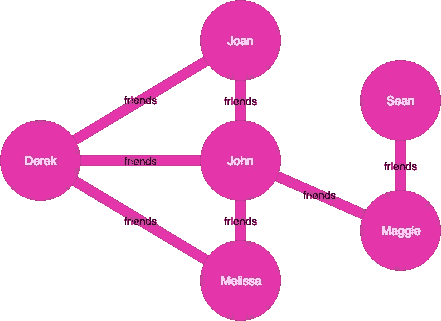
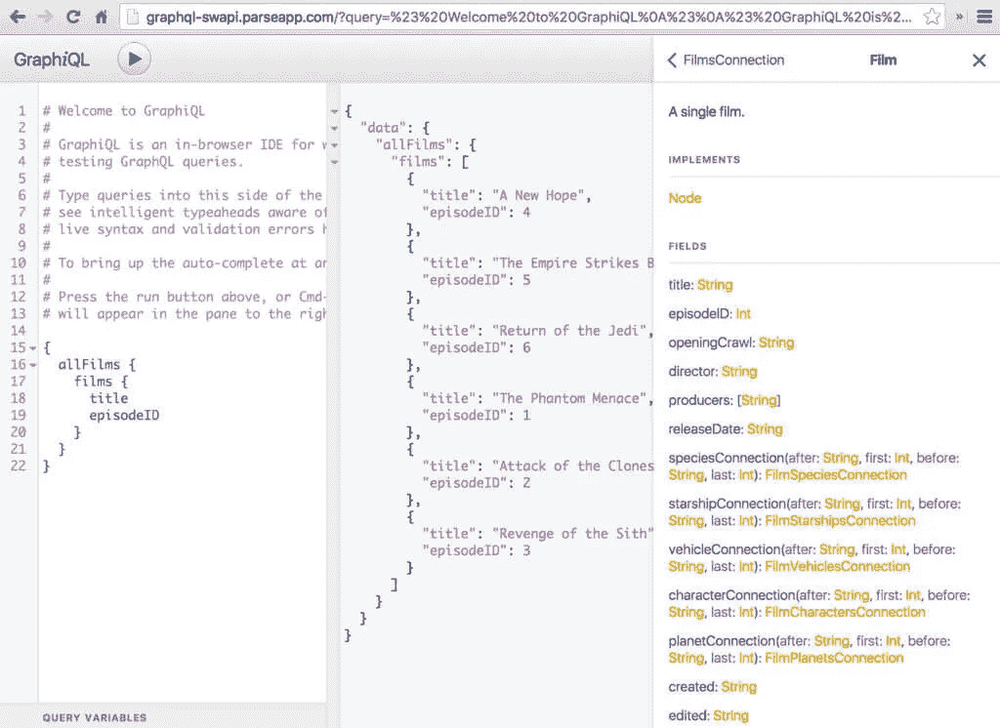

# GraphQL:好的、坏的和底线

> 原文：<https://medium.com/geekculture/graphql-the-good-the-bad-and-the-bottomline-623de7dbcffb?source=collection_archive---------9----------------------->

GraphQL 不同方面的概述

> “只知道自己一方情况的人对此知之甚少。他的理由可能是好的，可能没有人能够反驳。但是，如果他同样无法反驳相反方面的理由，如果他甚至不知道它们是什么，他就没有理由倾向于任何一种意见……他从自己的老师那里听到对手的意见也是不够的，因为他们陈述这些意见，并伴随着他们提供的反驳。他必须能够从真正相信它们的人那里听到它们……他必须知道它们最可信和最有说服力的形式。”
> 
> ― **约翰·斯图亚特·密尔、** [**论自由**](https://www.google.com/books/edition/On_Liberty/3xARAAAAYAAJ?hl=en&gbpv=1)

最近，我真的迷上了 GraphQL，并开始向我能找到的每一个人传播福音，但我看到了两个视频(见帖子底部)让我停顿了一下。他们都没有真正抨击 graph QL——相反，他们试图展示基于多年经验的争论的另一面。

所以我想我会尝试阐明 GraphQL 的平衡立场，让读者决定他们对它的感受。不过，我要声明，我仍然是 GraphQL 的超级粉丝——但是我对使用 GraphQL 的优点和缺点有着成熟的理解

**好的**

GraphQL 基于这样一个想法，即我们可以像遍历图形一样遍历数据库。假设我想得到德里克的朋友，我可以得到德里克的朋友，但我也可以得到德里克的朋友的朋友。也就是说，我不仅可以获得到给定数据节点的直接连接，还可以获得来自该节点的所有路径。美妙之处在于，我可以明确地请求它，并且在前端没有任何设置的情况下获得它。所有这些都在后端的一个调用中！

这可以用任何数据来完成。GraphQL 网站使用的例子是书籍和作者——我可以获得一个作者列表，然后获得他写的书籍，并根据流派获得类似的书籍。所有这一切只需调用一次我的 API！

GraphQL 的另一个优点是它有内置的文档。它有一个漂亮的界面(取决于您使用的语言和软件包),在这里您可以尝试对后端的某些调用——称为查询或变异。Graphiql 会自动为您生成一个文档，详细解释您的后端是如何构建的，而不必自己编写文档。

GraphQL 的另一个绝对惊人的方面是它将权力放在了前端开发人员身上。前端决定它想要什么， ***只有*** 得到它所要求的。即使你需要的数据有很多字段，但是你只想要几个，那也是你所能得到的。不多不少。这彻底颠覆了权力动态。这也意味着前端不会因为不想要或不需要的数据而变得臃肿。

所有这些的一个好处是 GraphQL 附带了一个类型化系统。一切都是打字的，清晰的，有打字的所有好处。

**坏了**

让我们解决房间里的大象:GraphQL 是新的。有些人可能会对 GraphQL 望而却步，认为它是新的东西，并因此而放弃它。这是有一定道理的。GraphQL 在给定语言和生态系统中的实现还不太成熟。他们准备好战斗了吗？他们准备好生产了吗？如果你是一家公司，当 GraphQL 在你给定的语言中成熟时，你准备好改变实现了吗？这些都是实实在在的担忧。

另一个可能发生的问题是，GraphQL API 对数据库的影响可能比您想象的要大。不赘述，这个问题叫做[“N+1 问题”](/the-marcy-lab-school/what-is-the-n-1-problem-in-graphql-dd4921cb3c1a)。例如，如果您想获得一个图书列表，并获得这些图书的作者及其姓名和其他信息，您最终会比您拥有的作者数多查询一次数据库，即 N+1，其中 N 是作者数。

有一些方法可以解决这个问题，例如，通过一些缓存层或使用 DataLoader(见下面的视频)，但这是一个针对 GraphQL 的合理问题。

这只是其中的几个问题。我不打算深入讨论这些问题，但我只想讨论一些容易理解的大问题。

最后，我会说这真的取决于你的用例:你想构建什么？这是一个决定，但我认为 GraphQL 在很多情况下都是有益的。

关于激发这篇文章的视频，请参见: