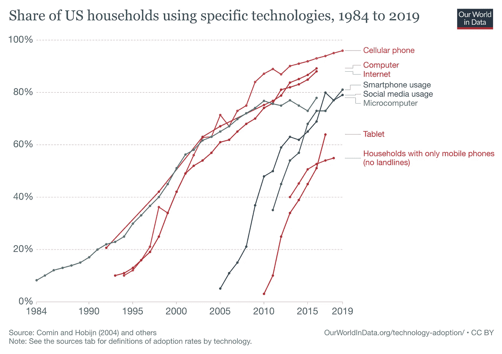
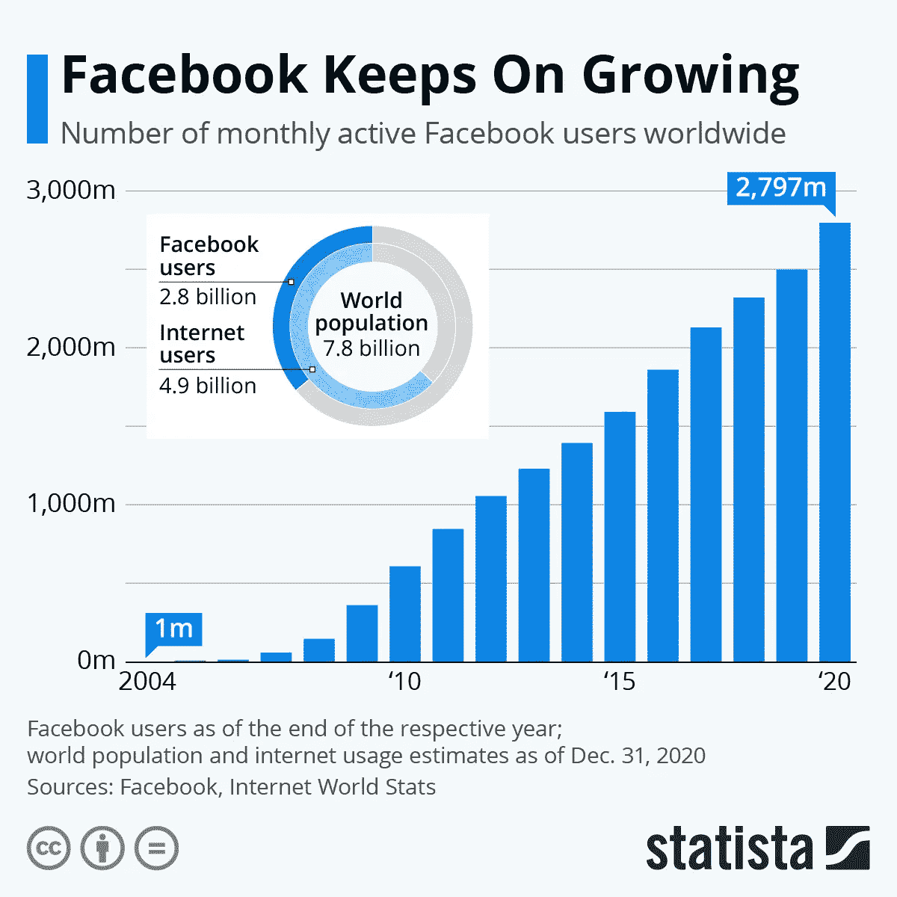
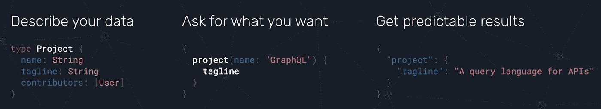

# GraphQL？为什么！

> 原文：<https://medium.com/geekculture/graphql-why-d160523a1122?source=collection_archive---------29----------------------->

## 酷派科技系列

## 本文将遵循这一模式，首先讨论 GraphQL 背后的愿景，然后讨论它为什么诞生，它的发展情况如何，以及您可以用它做什么。

[Thanks weblab-tech for this image!](/@weblab_tech/graphql-everything-you-need-to-know-58756ff253d8) And follow the link, it is an amazing resource to understand better GraphQL.

像社会中的任何进步一样，它并不是因为一切都运转良好而诞生的，而是一种需求的存在。这种需求来自另一项创新，即始于 2007 年 iPhone 的移动应用。

[Thanks Our World In Data for this amazing graph!](https://ourworldindata.org/technology-adoption) Make sure to check this resource for amazing analytics for free.

虽然 GraphQL 的创意来自脸书公司，该公司在网络上规模巨大，但移动应用的速度却出乎他们的意料，尽管他们改进了自己的网页，以跟上数百万用户的需求。

[Thanks Statista for this amazing graph!](https://www.statista.com/chart/10047/facebooks-monthly-active-users/) It was free, if you are looking for free and good analytics check them out.

他们忽视了移动市场，所以他们必须快速行动，因为失去这个市场很容易意味着竞争接管，因此他们有了这个想法，用 RESTful API 制作原生 iOS 新闻提要。

这导致了很多问题，因为它们的实现使用了 RESTful API 架构:

*   网络速度很慢，他们不得不协调来自许多相关模型的网络请求，这些模型组成了 newsfeed，通过不稳定的 3g 移动连接进行多次往返。
*   脆弱的，对 API 的修改需要小心地传递到客户端代码，否则应用程序就会崩溃。
*   API 文档已经过时，无法实施。
*   繁琐的代码和过程。

## 这让他们重新思考 GraphQL 存在的最佳实践。

# 它是如何工作的？

> “GraphQL 是一种用于 API 的查询语言，也是用现有数据完成这些查询的运行时。GraphQL 为您的 API 中的数据提供了完整且易于理解的描述，使客户能够准确地要求他们需要的东西，使 API 更容易随着时间的推移而发展，并支持强大的开发工具。”—[GraphQL.org](https://graphql.org/)

[Thanks GraphQL Foundation for this image!](https://graphql.org/)

## 有什么了不起的！

*   GraphQL 查询构造其响应的形状。它返回一个匹配的结果，GraphQL 请求和响应总是被请求的，没有别的。
*   它在网络上的速度很快，因为它只需要获取和准备所请求的内容，并且整个结果总是可以在一次网络往返中交付。
*   易于测试，客户端用 GraphQL 查询描述它们的响应或需求，这意味着可以在查询运行之前对其进行验证，并且可以在服务器上对 GraphQL 类型的更改进行静态检查，以发现重大更改，这消除了整个类别的软件风险。
*   文档是 GraphQL 类型系统的一等公民，所以它的文档是自动生成的，并且总是最新的。
*   它适应性很强，GraphQL 与数据库无关，GraphQL 类型由任意用户代码支持，这意味着它们可以在 API 的现有服务之上使用，允许在需要的地方快速采用。
*   GraphQL 有超过 12 种语言的适配，很有可能你可以在后台服务中使用你喜欢的语言。
*   它是 Linux 基金会的一部分。

虽然我很乐意分享一个关于如何使用它的很好的解释，但我自己还不知道如何使用这项技术，我将很快发布一个 GraphQL 系列，尽管如此，现在有很多人已经为您提供了很好的资源来尝试它，这里有一些例子，希望它们能推动您使用 GraphQL。

*   了解它的模式结构、优点和缺点的重要资源，它工作的一些例子和大量有用的信息来制作更好的 API。
*   [它的官方文档，它如何工作的例子和惊人的图表来说明 GraphQL 可以在你的组织中扮演的角色。](https://www.graphql.com/) + [一些案例分析。](https://www.graphql.com/case-studies/)
*   [带动手方法的教程。](https://www.howtographql.com/)
*   [使用 ApolloGraphQL 构建 GraphQL 的 app 的教程。](https://www.apollographql.com/docs/tutorial/introduction/)
*   [实际的 GraphQL 组织网页。](https://graphql.org/)

# 你如何与它一起成长！

最终，任何技术都取决于你如何利用它，与它一起成长，并总是敢于尝试更多，这就是推动想法成为项目的原因，有时这些项目最终成为开源软件，许多人最终做出贡献，使看起来遥不可及的想法成为现实。

请记住这是 Linux 开始的原话，“我正在为 386(486) [在](https://en.wikipedia.org/wiki/IBM_Personal_Computer/AT)克隆做一个(免费的)操作系统(只是一个爱好，不会像 gnu 一样庞大和专业)。这从 4 月份就开始酝酿，并开始准备。我希望得到关于人们喜欢/不喜欢 minix 的任何反馈，因为我的操作系统有点像它(文件系统的相同物理布局(由于实际原因)等等)。我目前已经移植了 [bash](https://en.wikipedia.org/wiki/Bash_(Unix_shell)) (1.08)和 [gcc](https://en.wikipedia.org/wiki/GNU_Compiler_Collection) (1.40)，看起来一切正常。这意味着我将在几个月内得到一些实用的东西[……]是的——它没有任何 minix 代码，并且它有一个多线程的 fs。它是不可移植的[ [*原文*](https://en.wikipedia.org/wiki/Sic) ](使用 386 任务切换等)，它可能永远不会支持除了 AT-harddisks 之外的任何东西，因为这是我所有的:-(。”——莱纳斯·托瓦尔兹