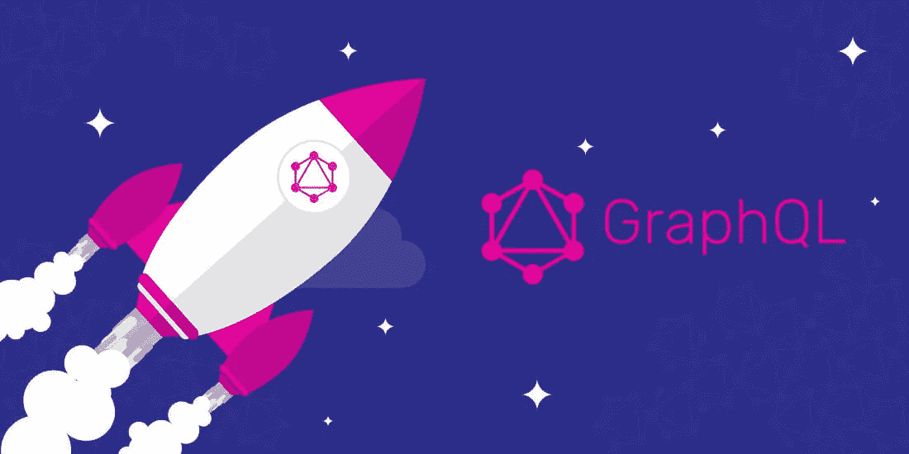
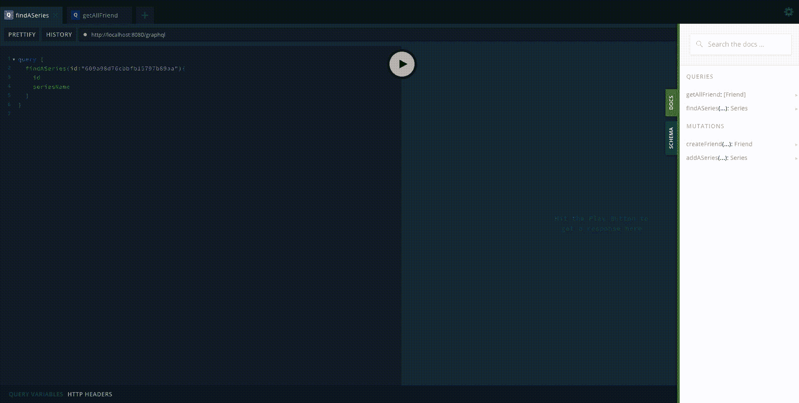

# 使用 MongoDB 和 ExpressJS 的 GraphQL

> 原文：<https://medium.com/geekculture/graphql-with-mongodb-and-expressjs-26e1b94ab886?source=collection_archive---------0----------------------->



Pic Courtesy: [Multidots](https://www.multidots.com/graphql-efficient-alternative-rest/)

GraphQL，即图形查询语言，是一种用于 API 的查询语言。它赋予您以下能力:

> 询问你需要什么数据，你会得到确切的数据
> ——在单个请求中获得许多资源
> ——添加新的字段并改进你的 API 而无需版本。
> 
> 参考资料: [GraphQL](https://graphql.org/)

您可以查看官方文档来了解更多关于 GraphQL 特性的信息。

现在，我们来谈谈实现。我们将使用 MongoDB 创建一个 express-graphql 服务器来保存数据。

我们开始吧，

*   通过运行以下命令创建 package.json，

```
npm init
```

*   安装开发依赖项，

```
npm i --save-dev babel-cli babel-preset-env babel-preset-stage-0 @types/node
```

*   安装项目依赖项，

```
npm i --save apollo-server-express express graphql mongodb mongoose nodemon
```

> **apollo-server-express** :这是 GraphQL 服务器的 express 和 Connect 集成。Apollo Server 是一个社区维护的开源 GraphQL 服务器，可以与许多 Node.js HTTP 服务器框架一起工作。
> 
> **express** : NodeJS web 应用框架。
> 
> **graph QL**:graph QL 的 JavaScript 参考实现。
> 
> **mongodb**:node . js 的官方 MongoDB 驱动。
> 
> **mongose**:mongose 是一个 MongoDB 对象建模工具，设计用于在异步环境中工作。
> 
> **nodemon** : nodemon 是一个帮助开发 node 的工具。基于 js 的应用程序，方法是在检测到目录中的文件更改时自动重新启动节点应用程序。

安装完所有依赖项后，您的 package.json 应该如下所示，

*   现在，如果 package.json 已经准备好了，那么在根文件夹下创建一个带有预置的. babelrc 配置文件，

*   对于 graphql 支持，在带有内容的根文件夹下添加一个 graphql.config.js 文件，这将添加支持并突出 graphql 语法。

现在，让我们为应用程序和 MongoDB 连接字符串添加一个配置文件。我们可以看到下面的文件，我们已经定义了服务器端口和数据库连接字符串。

现在，我们将使用 mongoose 工具为 MongoDB 定义不同的模式。与关系数据库类似，模式包含我们将在数据库中创建的各种表的结构。

我们将为此演示创建两个模式。

1.  FriendsSchema(关于他/她的朋友的信息)
2.  SeriesSchema(电视剧模式)。

> 编译。ts 文件，然后运行应用程序将它们传输到。js 文件。

由于我们已经定义了各种数据库模式，现在我们可以初始化我们的 MongoDB 连接。

> 这个文件使用必需的环境变量、连接字符串和注册到数据库的模式来配置 MongoDB 连接。

到目前为止，我们已经初始化了我们的应用程序，安装了依赖项，添加了数据库支持。现在我们将转移到配置 GraphQL 实例的主要任务。

1.  我们将首先定义 graphql 模式，使用来自 [apollo-server-express](https://www.apollographql.com/docs/apollo-server/) 的 graphql-query-language(gql)工具。graphQL 服务器使用一个**模式**来描述数据图的形状。这个模式定义了一个**类型**的层次结构，其中的字段是从后端数据存储中填充的。该模式还精确地指定了哪些**查询**和**突变**可供客户端针对您的数据图执行。

> 这里，我们定义了不同的类型以及查询和变异入口点。

2.现在，我们将定义 GraphQL 解析器。服务器需要知道如何为模式中的每个字段填充数据，以便能够响应对该数据的请求。为此，它使用解析器。

> **解析器是负责为模式中的单个字段填充数据的函数。**它可以以您定义的任何方式填充数据，例如从后端数据库或第三方 API 获取数据。

在这里，我们可以看到不同类型的查询类型和变异类型的解析器。这些是在 schema.graphql 文件中定义的相同函数和类型。

如果到目前为止我们已经完成了所有的配置，那么我们就成功地初始化、设置了我们的 MongoDB、GraphQL Apollo 服务器。

现在我们剩下的最后一块拼图是要初始化的 express-server。这个服务器将是我们整个服务器的入口点。

至此，我们已经完成了所有配置的设置任务。现在，是运行服务器的时候了。

尝试安装依赖项，如果没有，运行下面的命令。

```
npm install
OR
yarn
```

现在，通过运行以下命令来运行服务器

```
npm start
```

您将看到服务器将开始在[http://localhost:8080/graph QL](http://localhost:8080/graphql)上运行。它将打开一个 GraphQL 游乐场。(当您在非生产环境中运行 GraphQL Playground 时，Apollo Server 会自动托管它)。了解关于这个 [GraphQL 游乐场](https://www.apollographql.com/docs/apollo-server/getting-started/#step-8-execute-your-first-query)的更多信息。



GraphQL Apollo Server Playground

到此，我们结束这篇文章。您可以在下面的 Github 资源库中查看完整的代码库。

务必启动存储库以获得 GraphQL 的未来更新。

另外，如果您喜欢这篇文章，请鼓掌，它对您的 GraphQL 服务器设置有所帮助。😊

[](https://github.com/akrsh24/GraphQL-Medium) [## akrsh 24/graph QL-中等

### 使用 MongoDB 和 Apollo Server 的 GraphQL 教程的存储库- akrsh24/GraphQL-Medium

github.com](https://github.com/akrsh24/GraphQL-Medium) [](https://www.apollographql.com/docs/apollo-server/) [## 阿波罗服务器简介

### Apollo Server 是一个开源的、符合规范的 GraphQL 服务器，它与任何 GraphQL 客户端兼容，包括…

www.apollographql.com](https://www.apollographql.com/docs/apollo-server/)