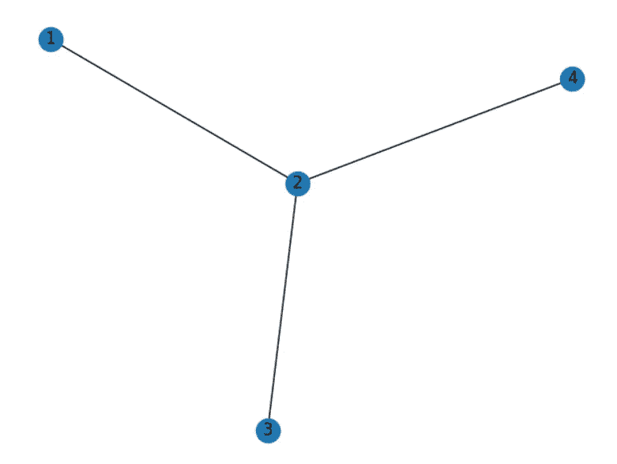
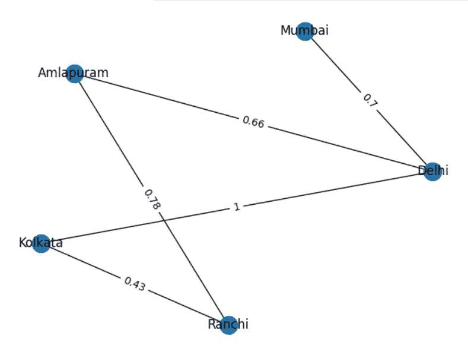
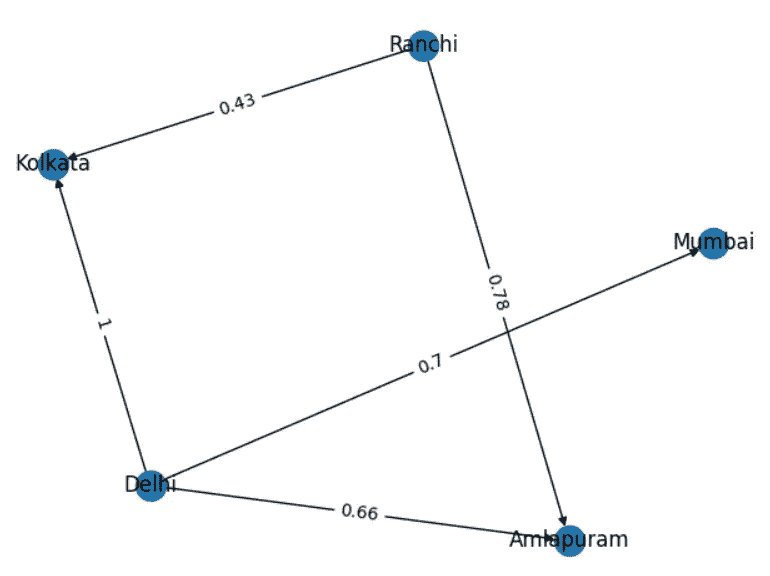
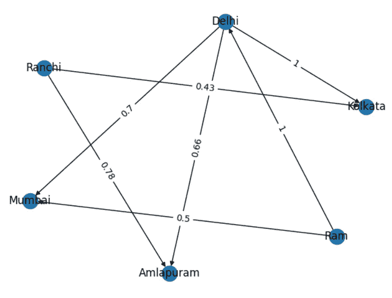

# 图形或网络—第 1 章

> 原文：<https://medium.com/geekculture/graphs-or-networks-chapter-1-57aa9497be06?source=collection_archive---------5----------------------->

高效学习

## 图表是数据的非线性表示。它由通过边/链接链接的顶点/节点组成。它提供了数据集的多维视图。节点和边类型之间的相互关系可以为分析师提供对数据集的不同视角。

网络不是一个新概念。它已被应用于各种任务，如寻找最佳路径，管道网络，供应链依赖等。

让我们画一个小图来形象地展示网络的样子。"**networkx**" python 中的库是图形和网络分析中最常用的库之一。

```
import networkx as nx
import matplotlib.pyplot as plt

'''
Initializing networkx graph
'''

graph = nx.Graph()

'''
Adding nodes to graph
'''

graph.add_node(1,name="A")
graph.add_node(2,name="B")
graph.add_node(3,name="C")
graph.add_node(4,name="D")

'''
Connecting nodes via links
'''

graph.add_edge(1,2)
graph.add_edge(2,3)
graph.add_edge(2,4)

'''
Plotting graph
'''

nx.draw(graph,with_labels=True)
plt.show()
```



我们可以在边上添加权重来描述距离、在边上移动的努力等。

让我们看看一个有边权重的网络会是什么样子。

```
import networkx as nx
import matplotlib.pyplot as plt
import pandas as pd

data = [('Delhi','Kolkata','1'),("Delhi","Mumbai",'0.7'),("Ranchi","Kolkata",'0.43'),("Ranchi","Amlapuram",'0.78'),("Delhi","Amlapuram",'0.66')]
df = pd.DataFrame(data=data,columns=['city1','city2','distance'])
graph = nx.from_pandas_edgelist(df=df, source='city1', target='city2', edge_attr='distance')
pos = nx.spring_layout(graph, k=5)
nx.draw(graph, pos, with_labels=True)
labels = {edge_attribute: graph.edges[edge_attribute]['distance'] for edge_attribute in graph.edges}
nx.draw_networkx_edge_labels(graph, pos, edge_labels=labels)
plt.show()
```



> 如果一个人“Ram”想从*兰契*到*德里*，哪条路径对他来说是最好的，即权重最小的路径？
> 
> 由于没有从*兰契*到*德里*的直接路径，所以*拉姆*必须经过*加尔各答*或*阿姆拉普拉姆*。如果拉姆选择经由*加尔各答*飞行，总重量将是 0.43 + 1 = 1.43，如果他经由*阿姆拉普兰*旅行，总重量将是 0.78 + 0.66 = 1.44。因此我们可以得出结论，拉姆应该从*兰契*经由*加尔各答前往*德里*。*

**无向图**:边可以双向穿越的图。设 G 是图，u ∈ V 和 v **∈** V 其中 V 是所有顶点的集合，那么边可以表示为 E≦(u，V)。两个相连顶点的顺序并不重要..以上例子都是无向图。

**有向图:**有向图中的边是有方向的。在有向图中，边的方向用箭头表示。有向边是有序对(v，u)或(u，v)。



> 上图中边的方向使得*撞锤*无法从*兰契*到达*德里*。

**异构图:**异构图是一种特殊的信息网络，它或者包含多种类型的顶点，或者包含多种类型的边。顶点和边的类型也被称为顶点标签和边标签。

在下图中，我们有城市和人类型的顶点。

> 图节点分类的任务是识别节点类型或顶点标号。

```
data = [('Delhi','Kolkata','1'),("Delhi","Mumbai",'0.7'),("Ranchi","Kolkata",'0.43'),
        ("Ranchi","Amlapuram",'0.78'),("Delhi","Amlapuram",'0.66'),("Ram","Delhi",'1'),("Ram","Mumbai",'0.5')]df = pd.DataFrame(data=data,columns=['city1','city2','distance'])graph = nx.from_pandas_edgelist(df=df, source='city1', target='city2', edge_attr='distance',create_using=nx.DiGraph())pos = nx.spring_layout(graph, k=5)
nx.draw(graph, pos, with_labels=True)
labels = {edge_attribute: graph.edges[edge_attribute]['distance'] for edge_attribute in graph.edges}
nx.draw_networkx_edge_labels(graph, pos, edge_labels=labels)
plt.show()
```



**同向性:**网络同向性是指[网络科学](https://en.wikipedia.org/wiki/Network_science)中的理论，该理论认为，基于节点属性，相似的节点可能比不相似的节点更有可能相互附着。(维基百科)

我希望这篇文章能帮助你理解什么是网络，以及如何用 python 创建一个简单的网络。

请点击[此处](/geekculture/graphs-or-networks-chapter-2-2af64596858e)为 [**第二章**](/geekculture/graphs-or-networks-chapter-2-2af64596858e) 。