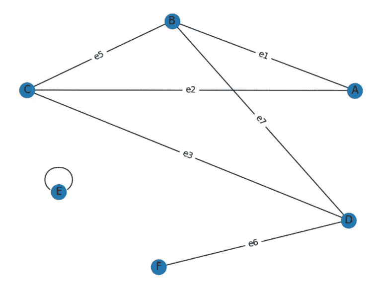
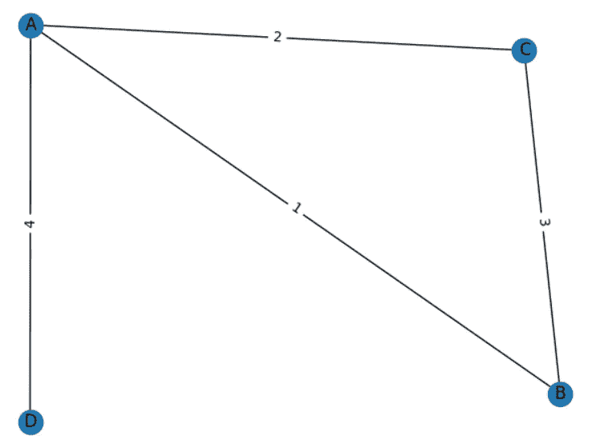
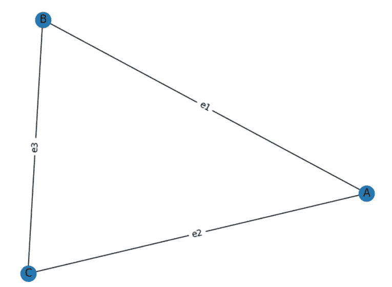
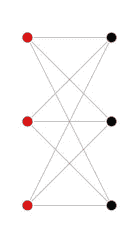
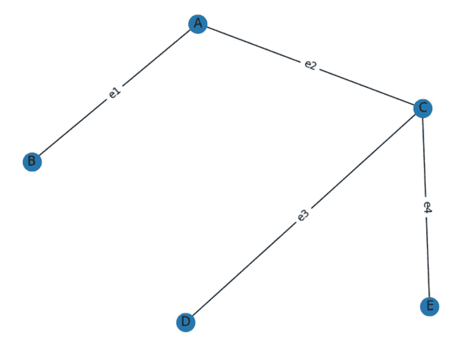
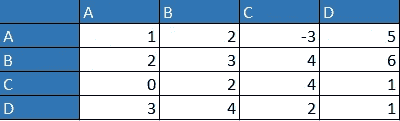
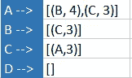
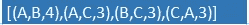

# 图或网络第 2 章

> 原文：<https://medium.com/geekculture/graphs-or-networks-chapter-2-2af64596858e?source=collection_archive---------12----------------------->

高效学习。

第 1 章请点击[**此处**](/p/57aa9497be06) 。

在本章中，我们将讨论一些与图形相关的常用术语。

让一个图或一个网络用**“G”**来表示。

**Graph 1**

**子图**:一个图“ **S** ”称为“ **G** ”的子图当且仅当“ **S** ”的顶点和边是“ **G** 的顶点和边的子集。

**相邻节点**:如果一个图中的两个顶点相互连接，则这一对称为相邻节点。例如:(A，B)，(C，D)等等。

**平行边:**如果两条边有相同的起点和终点，这一对称为平行边。

**简单图**:如果一个图没有平行的边或环，那么这个图被认为是简单图。图 1 不是一个简单的图，因为它有像 BCAB 那样的回路。此外，图 1 在顶点 e 处有一个顶点回路

**Weighted Graph**

**加权图**:如果图中的边包含表示某个实体的权重，如成本、流量、距离等。，则该图被视为加权图。通常表示为(u，v，w ),其中 u 是起始节点，v 是结束节点，w 是权重。

**完全图:**如果一个图中每对顶点都是相邻的或者每对顶点都有一条边连接它们，那么这个图就是完全图。一个完整图形中的边数可以由 **ⁿC₂** 给出，其中 n 是图形中的顶点数。

**2- regular graph, complete graph**

**顶点的度数:**关联在顶点上的边数就是顶点的度数。它用度(v)或度(v)来表示。注意:-图中每条边在整个图(无向图)中贡献 2 度。所以图 1 中的 d(E)是 2。如果一个图的所有顶点的度都是 k，那么这个图称为 **k 正则**图。

**Bipartite Graph (**[https://mathworld.wolfram.com/BipartiteGraph.html](https://mathworld.wolfram.com/BipartiteGraph.html)**)**

**行走:**集合 V 的顶点和集合 E 的边的交替序列，以顶点开始和结束，是行走。**当起点和终点顶点相同时，封闭行走**。

*   **小径:**所有边缘都清晰的小径。
*   **路径:**一条边和顶点都不同的路。
*   **循环:**起点和终点相同的行走。
*   **连通的:**所有顶点都可以被一条路径覆盖的图。
*   **欧拉轨迹:**一个图中的轨迹，它访问图中所有的边一次。
*   **哈密顿圈:**包含图中所有顶点的圈。这个图叫做**哈密顿图。**

**图的直径:**是图的两个顶点之间最短路径的最大值。 **max(dist(v，u))** 其中 max 为最大值函数， **dist()** 为最短路径。

**图同构:**如果 Graph1 和 Graph2 是两个图，如果存在一个函数 I 即 I : v →v 且 E 的(u，v)元到 E 的(u，v)元，则称 I 同构，Graph1 和 Graph2 是同构图。

**Tree**

**特殊图形:**

*   **树:**它是一个无环(不包含任何循环)的无向图。
*   **外树:**如果一棵树有一个指定的根节点，并且所有的边都指向远离该根节点的方向，则该树被认为是外树或树状。
*   **In Tree:** 如果一棵树有一个指定的根节点，并且所有的边都指向这个根节点，那么这个树被认为是 In Tree 或者反树状。
*   **有向无环图(DAG):** 顾名思义，没有圈的有向边的图是有向无环图。
*   **二部图:**一个可以再分为两部分的图，使得 E 中的边连接第一部分中的一个顶点和第二部分中的一个顶点，这样的图是二部图。

**图的表示:**由于图不是一种原始的数据结构。它表示如下:

**Adjacency Matrix**

**Adjacency List**

**Edge List**

*   **邻接矩阵**:它是一个矩阵，它的(I，j)位置表示图中从 I 到 j 节点的一条边，该位置的值表示边的权重。
    **优点:**
    -对于稠密图和完全图是空间高效的。
    -查找边权重时间复杂度 O(1)。
    -图形的最简单表示。
    **缺点:**
    -需要 O(v)空间。因此，当涉及稀疏图时，它不是空间有效的。
    -迭代所有边的复杂度为 O(v)。
*   邻接表:它将图表示为从节点到边列表的映射。
    **优点:
    -** 对稀疏图的空间高效。
    -迭代边是高效的。
    **缺点:
    -** 密集图空间效率较低
    -边权重查找 O(E)
*   **边列表:**是边三元组的无序列表。 **优点:
    -** 对稀疏图高效**-
    -**所有边迭代简单 **缺点:
    -** 边权查找为 O(E)
    -对密集图效率不高。

我希望这篇文章丰富了您关于图形的知识。

请点击[此处](/geekculture/graph-or-networks-depth-first-search-algorithm-d3d4f6a66f01)为[**第三章**](/geekculture/graph-or-networks-depth-first-search-algorithm-d3d4f6a66f01) 。