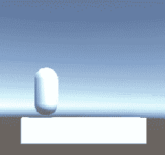
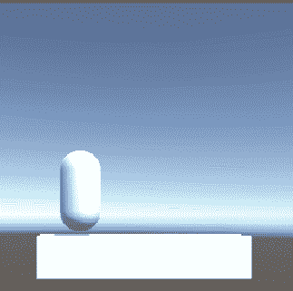
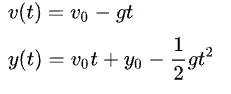
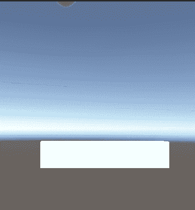

# 重力、跳跃和——为什么不——双跳

> 原文：<https://medium.com/geekculture/gravity-jumping-and-why-not-double-jumping-868930a9d343?source=collection_archive---------14----------------------->

**目标**:实现一个定制的简单物理来创造重力和跳跃的能力

正如我所承诺的，是时候制造我们自己的重力了。先复习一些基础物理吧。或者跳到下一段！

## 关于体重的小论文

任何有质量的物体都会受到地球中心**的引力吸引。嗯，不完全是中心，因为地球自转(昼夜循环)是一个非惯性参考系，所以物体不仅受到重力的影响，还受到一系列其他所谓的虚拟力的影响，或者更恰当地说，是惯性力，如科里奥利力、离心力…**

当也考虑这个力时，物体似乎不再被吸引向行星的中心，而是被吸引向它附近的一个点。力的大小也会受到影响。这个力更恰当地称为重量，并用著名的公式表示

这个新的力沿着一个新的方向施加，该新的方向明确地定义了我们可以称之为垂直方向的方向(T11 ),即垂直于垂直方向的方向(整个平面(T15)的方向(T16 ))的水平方向(T13)。因为如果与行星相比，我们是微小的蚂蚁，我们可以假设在我们周围(在一个合理的*大*区域内)这个垂直方向不会明显改变，力的大小也是如此:对于给定的质量，它是恒定的——这就是为什么建筑物看起来是**箱形**而不是**楔形**。

那么`g`是一个物体的**加速度**只受其重量的影响，因为它是恒定的，所以下落的物体将以所谓的恒定加速度运动，这是定律(由[维基百科](https://en.wikipedia.org/wiki/Free_fall)提供)

其中 g 是重力加速度常数，v 和 y 表示速度和位置的初始值(t=0 时)。我们能注意到的是，速度随时间线性增长，而位置有二次定律。这些信息对于我们在游戏中的实现至关重要。

## 游戏中的重力

现在，在我们的平台中没有任何物理现象发生，我们能够沿着 x 轴移动角色，即使它脚下没有平台！

让我们考虑重力。我们使用的是`Move(vector3)`方法，它接受向量 3 形式的位移。排水量已计算为`velocity * Time.deltTime`。我们也可以这样做我们的下降运动。

正如伽利略·伽利雷曾经说过的:*运动结合了*，所以我们可以把下落的运动加到速度向量中，然后做一个单独的`Move()`调用。

可能会比较混乱，因为这是最后的结果，但过一会儿就清楚了。重力，或重量作为力施加到身体上**总是**。一直都是。即使它被地板挡住而静止不动。这种情况和自由落体的区别在于地板抵消了重量的平衡:没有总的力施加在身体上。在我们的简单世界中，我们不是在模拟力，而是在应用运动学。

角色控制器已经**在接触碰撞器时停止**，但是这不会自动发生在我们的**计算**中。我们的工作就是阻止它。

角色控制器属性`isGrounded`就派上了用场:如果角色接触到下面的东西，它就是真的，否则就是假的。我们可以简单地说:好，如果它是接地的，那么速度向量的 y 分量是零，否则它是用二次法则计算的(`time.deltaTime`乘以两次)。

> 轻松点。但是既然角色已经停在地板上了，为什么我们还需要把速度设为零呢？答案很简单:如果我们不清除速度，它将继续增长，即使角色没有下降，这意味着在那一刻，它的脚下将没有地板…它将以令人难以置信的速度下降，而不是像预期的那样开始下降！

还有一个问题，这不是我们的错。如果你记录下`isGrounded`属性，你会看到当角色在地上时它在闪烁，它不会停在真值上！虽然有一个解释:当角色接地时，它与地面“接触”，但是当谈到“接触”时，统一并不真正一致。实际上，角色控制器正试图**穿透**地面，反过来，**将地面推出**。这个循环的结果是，它将试图穿过地板上下下落。动作幅度实际上很小，而且发生得很快，所以很难分辨。

克服这个问题的一个简单方法是把 y 速度设为一个**小**，**负值**，就好像我们只是把角色推到地板上。由于值很小，所以不会影响下落(当我们再次开始加速度的时候)，但是由于不为零，最后我们把角色粘在了地上！

如果你在犹豫该用什么值来代表`g`，那么真实世界的值是`9.81`，但是你会发现在游戏中这很奇怪:我认为我们习惯了类似马里奥或类似索尼克的角色快速移动、跳跃和下落。所以试着找到你的最佳匹配吧！

## 跳跃的

现在我们来介绍一下跳跃。跳跃只不过是**给角色增加正的** y 速度。

同样，价值观是你的选择，但是让我们看看这里发生了什么。如果角色被固定，如果我们按空格键，y 方向的速度会改变。为什么**设置**不加？我在考虑实现双跳的可能性:在空中我们可以再跳一次。但是，如果我们在下落过程中按下跳跃键，当速度为负时，简单地增加一个值不会达到让角色真正跳跃的预期效果！所以我们再次将值设置为正值。

## 双跳

就像范·海伦说的:继续跳！

这个功能将允许角色在空中再次跳跃，但在以下条件下:

1.  玩家每跳一次只能双跳一次
2.  玩家**必须跳**才能双跳(刚落下时不跳)

为了实现这种行为，我们只需要对代码进行简单的修改。

我们从布尔语`_canDoubleJump = false`开始。如果被禁足，玩家可以跳跃，一旦跳跃，bool 就会反转其值(从而变为真)。当在空中时，对该 bool 进行检查:如果为真，可以对`Jump()`执行另一个调用，如果完成，bool 再次反转(为假),使得仍然在空中时不可能再次跳跃。

当玩家再次被禁足时，bool 被设置为 false，但是可以再次跳跃而不用检查等等。

## 我的价值观

以我个人的拙见，由于马里奥世界是平台游戏的经典参考，我试图找出使用哪些值来获得相似的重力行为。我在网上找到了这篇关于这个话题的有趣的[文章](https://blog.hamaluik.ca/posts/super-mario-world-physics/)，并发现马里奥受到了一种极端的力量！

如果你正在寻找一种类似的感觉，并且不想切换到恒速重力，这些是(疯狂的)值:

g = 60
跳跃速度= 17