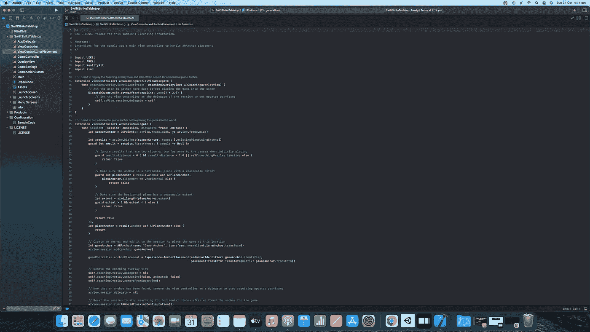

# 成功应用开发的良好开发习惯

> 原文：<https://medium.com/geekculture/great-developer-habits-for-successful-app-development-fa07f73fca16?source=collection_archive---------7----------------------->

## 通过将这些习惯应用到你的工作流程中来创建真正伟大的应用👨🏾‍💻🚀🤩

Image by author

当涉及到构建一个应用程序时，有很多细节需要注意。应用程序的最终用户很少看到这些细节。然而，它能以如此重要的方式被感受到；影响性能、可靠性和稳定性。