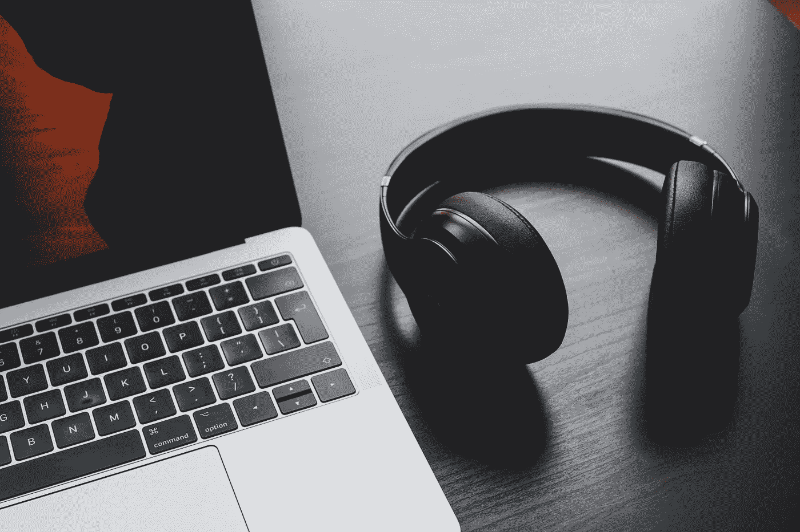

# 写代码的好音乐—第 1 部分

> 原文：<https://medium.com/geekculture/great-music-for-writing-code-part-1-b6024c88634e?source=collection_archive---------10----------------------->

Photo by [Dan Farrell](https://unsplash.com/@farreal?utm_source=unsplash&utm_medium=referral&utm_content=creditCopyText) on [Unsplash](https://unsplash.com/s/photos/headphones-computer?utm_source=unsplash&utm_medium=referral&utm_content=creditCopyText)

一边编码一边听音乐可能是一个非常极端的话题。一些开发人员喜欢安静，一些喜欢背景噪音，而另一些人想要重击 EDM 甚至金属。编码时选择听什么是一个非常个人化的问题。真正找到最适合你的方法需要时间。

尽管完全的安静(如果你喜欢的话，是白噪音)对一些人来说很有吸引力，但我发现…