# Greykite:来自 LinkedIn 的预测库(案例:比特币价格预测)

> 原文：<https://medium.com/geekculture/greykite-the-new-forecasting-library-from-linkedin-case-bitcoin-price-prediction-981d21e79b31?source=collection_archive---------10----------------------->

2021 年 5 月，LinkedIn 发布了一个时间序列预测库， [**Greykite**](https://github.com/linkedin/greykite) ，以简化其数据科学家的预测过程。


# **灰风筝简介**

**grey kite 库**是一个开源 Python 库，旨在支持 LinkedIn 的预测需求。LinkedIn 开发了 GreyKite，以支持其团队基于时间序列预测模型做出有效决策。这个库中使用的主要预测算法是`**Silverkite**`，它可以自动进行预测。

**Silverkite**模型有许多预先调整的模板(即参数配置),以适应不同的预测频率、范围和数据模式。除了 Silverkite，它还包括一个由脸书开发的先知模型的接口。下表解释了这些选项。

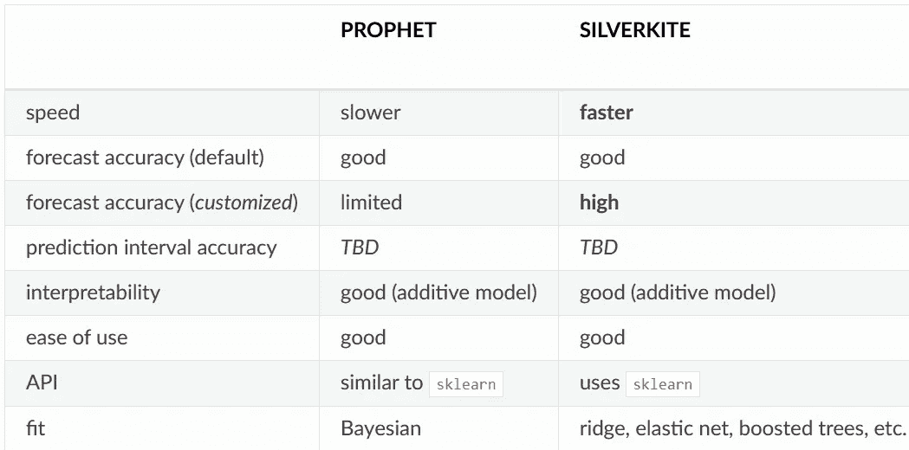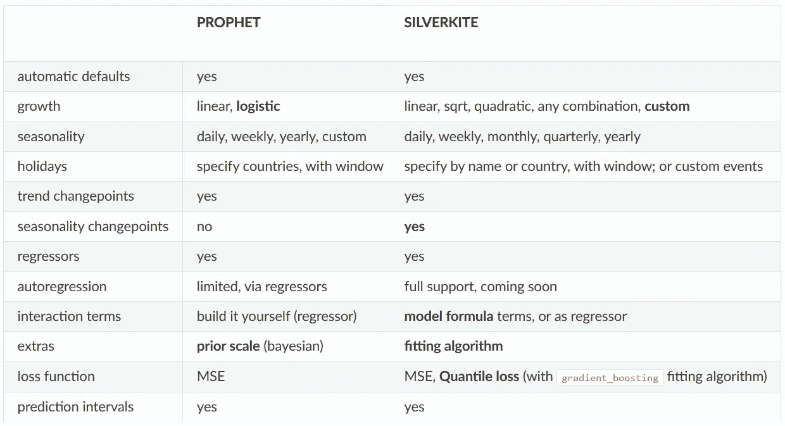

[Sources](https://linkedin.github.io/greykite/docs/0.1.0/html/pages/stepbystep/0100_choose_model.html)

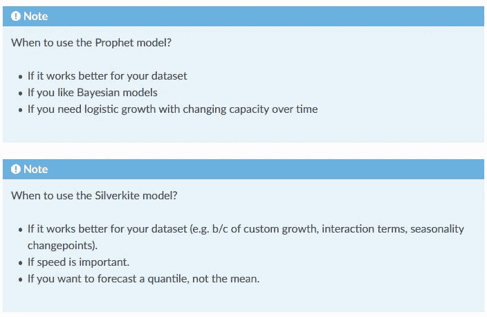

## 灰风筝的一些主要优点是:

*   **灵活**:提供时间序列回归器(趋势、季节性、节假日、变点和自回归)。
*   **直观**:提供强大的绘图工具、模型模板并产生可解释的输出(模型概要和组件图)。
*   **快速**:促进交互式原型、网格搜索和基准测试。
*   **可扩展框架**:在同一个界面中展示多种预测算法。同一管道提供预处理、交叉验证、回溯测试、预测和对任何算法的评估。

greykite 的其他主要优势是:探索性数据分析、异常值/异常预处理、特征提取和工程、网格搜索、评估、基准和绘图。

## 灰风筝的建筑图:

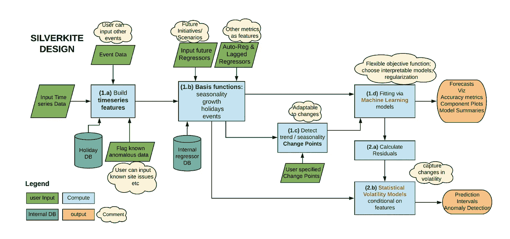

**Architecture Diagram of Greykite Library’s Main Forecasting Algorithm, Silverkite**

*   绿色:模型输入(时间序列、异常、潜在事件、潜在未来回归变量、自回归成分和变点日期)。
*   橙色:模型输出(预测、预测区间和诊断:准确性度量、可视化和摘要)。
*   蓝色:算法的计算步骤。

# **案例:比特币价格预测**

**比特币**是一种去中心化的数字货币，没有中央银行，可以在点对点的比特币网络上从一个用户发送到另一个用户，不需要中间人。交易由网络节点通过加密进行验证，并记录在一个名为“区块链”的公共分布式账本中。

对未来的准确了解对任何企业都有帮助。时间序列预测可以提供度量标准和其他随时间可测量的量的未来预期

# **我们来码！**

## 1.装置

`Greykite`在 PyPI 上可用，可与 pip 一起安装:

```
pip install greykite
```

`Greykite`库在 [**GitHub**](https://github.com/linkedin/greykite) 和 [**PyPI**](https://github.com/linkedin/greykite) 上都有。更多安装提示，参见[安装。](https://linkedin.github.io/greykite/installation)

## 2.导入所有必需的

```
**from** collections **import** defaultdict
**import** warningswarnings.filterwarnings("ignore")**import** pandas as pd
**import** numpy as np
**import** plotly
**import** plotly.offline as pyo
**import** plotly.graph_objs as gopyo.init_notebook_mode()**from** greykite.common.data_loader **import** DataLoader
**from** greykite.framework.templates.autogen.forecast_config **import** ForecastConfig
**from** greykite.framework.templates.autogen.forecast_config **import** MetadataParam
**from** greykite.framework.templates.forecaster **import** Forecaster
**from** greykite.framework.templates.model_templates **import** ModelTemplateEnum
**from** greykite.framework.utils.result_summary **import** summarize_grid_search_results
```

## 3.导入数据集

```
df = pd.read_csv('dataset.csv')
df['date'] = pd.to_datetime(df['Timestamp'],unit='s').dt.date
group = df.groupby('date')
Price = group['Weighted_Price'].mean()
```

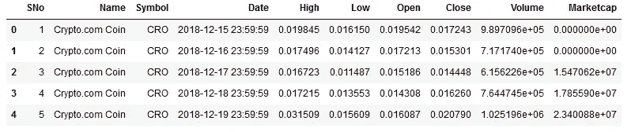

```
df_price_zz=Price.to_frame()
df_price_zz['Timestamp'] = df_price_zz.index
df_price_zz['Timestamp'] = pd.to_datetime(df_price_zz['Timestamp'])
df_price_zz.reset_index(drop=True,inplace=True)
df_price_include_zz = df_price_zz[df_price_zz['Timestamp'].dt.year >= 2017]
df_price_include_zz.reset_index(drop=True,inplace=True)
# df_price_include_zzdf_price_include_zz.set_index("Timestamp", inplace = True)
df_price_include_zz
```

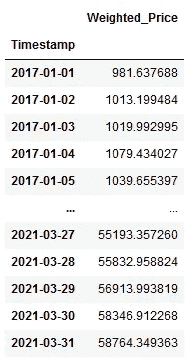

```
Price.to_numpy()
df_price=Price.to_frame()
df_price['Timestamp'] = df_price.index
df_price['Timestamp'] = pd.to_datetime(df_price['Timestamp'])
df_price.reset_index(drop=True,inplace=True)
df_price_include = df_price[df_price['Timestamp'].dt.year >= 2017]
df_price_include.reset_index(drop=True,inplace=True)prediction_days = 50
df_train= df_price_include_zz[:len(df_price_include_zz)-prediction_days]
df_test= df_price_include_zz[len(df_price_include_zz)-prediction_days:]
```

## 4.创建预测

首先，指定数据集信息。我们将`time_col`参数设置为“时间戳”，将`value_col`参数设置为“加权价格”，并将`freq`值设置为开始日期每天的 D。

```
metadata = MetadataParam(
           time_col="Timestamp",   
           value_col="Weighted_Price",  
           freq="W"           
)
```

之后使用 GreyKite 包中的**预测师**类创建一个预测师。我们可以选择`Prophet`或`Silverkite`预测模型。

在这个例子中，我们使用`'Silverkite`:

```
forecaster = Forecaster()  # Creates forecasts and stores the result
result = forecaster.run_forecast_config(  # result is also stored as `forecaster.forecast_result`.
 df=df,
 config=ForecastConfig(
     model_template=ModelTemplateEnum.**SILVERKITE**.name,
     forecast_horizon=365,  # forecasts 365 steps ahead
     coverage=0.95,         # 95% prediction intervals
     metadata_param=metadata
 )
)
```

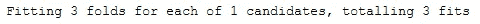

## 5.检查结果

`run_forecast_config`的输出是一个字典，包含未来预测、历史预测性能和原始时间序列。

让我们绘制原始时间序列，交互图由`plotly`生成

```
ts = result.timeseries
fig = ts.plot()
plotly.io.show(fig)
```

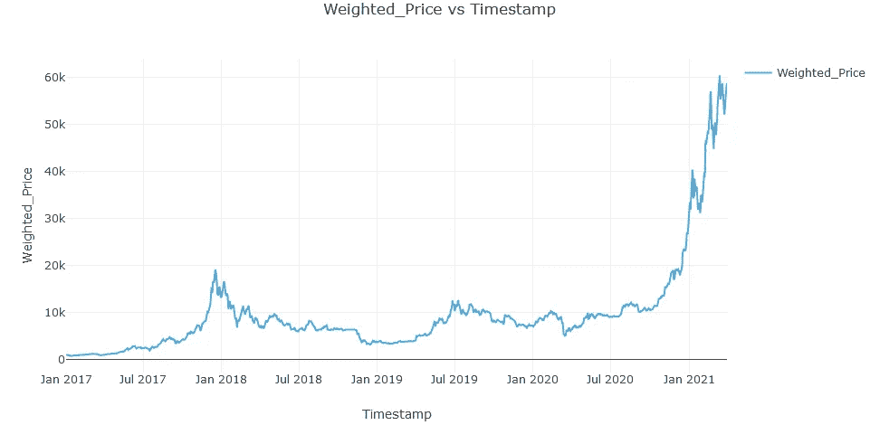

## 6.交叉验证

默认情况下，`run_forecast_config` 提供历史评估，存储在`grid_search`(交叉验证分割)和`backtest`(维持测试集)中。

默认情况下，`'ElementwiseEvaluationMetricEnum`中的所有指标都是在每次交叉验证训练/测试分割中计算的。交叉验证评估指标的配置可在评估指标中找到。

```
grid_search = result.grid_search
cv_results = summarize_grid_search_results(
    grid_search=grid_search,
    decimals=2,**# The below saves space in the printed output. Remove to show all available metrics and columns.**
    cv_report_metrics=None,
    column_order=["rank", "mean_test", "split_test", "mean_train",
    "split_train", "mean_fit_time", "mean_score_time", "params"])**# Transposes to save space in the printed output**
cv_results["params"] = cv_results["params"].astype(str)
cv_results.set_index("params", drop=True, inplace=True)
cv_results.transpose()
```

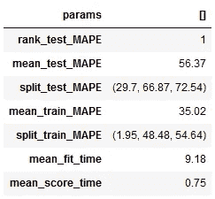

## 7.绘制回溯测试

让我们在维持测试集上绘制历史预测。

```
backtest = result.backtest
fig = backtest.plot()
plotly.io.show(fig)
```


我们还可以检查历史评估指标(在历史训练/测试集上)。

```
backtest_eval = defaultdict(list)
for metric, value in backtest.train_evaluation.items():
    backtest_eval[metric].append(value)
    backtest_eval[metric].append(backtest.test_evaluation[metric])
metrics = pd.DataFrame(backtest_eval, index=["train", "test"]).T
metrics
```

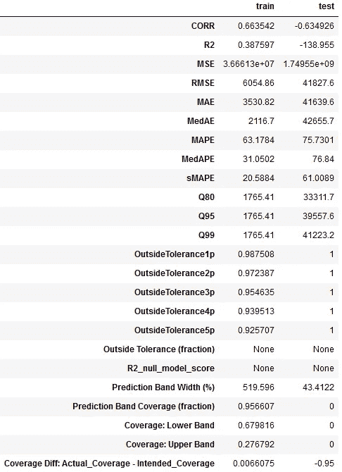

`forecast`属性包含预测的结果。至于`backtest` **，**我们就可以出结果了。

```
forecast = result.forecast
fig = forecast.plot()
plotly.io.show(fig)
```

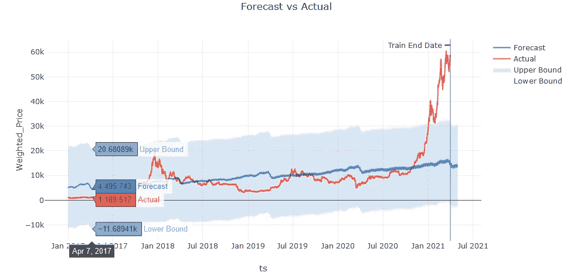

预测值在`df`中提供

```
forecast.df.head().round(2)
```

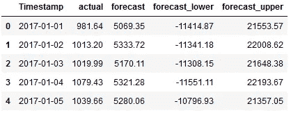

## 8.模型诊断

组件图显示了我们的数据集的趋势、季节性和事件/假日模式在模型中的处理方式:

```
fig = forecast.plot_components()
plotly.io.show(fig)
```

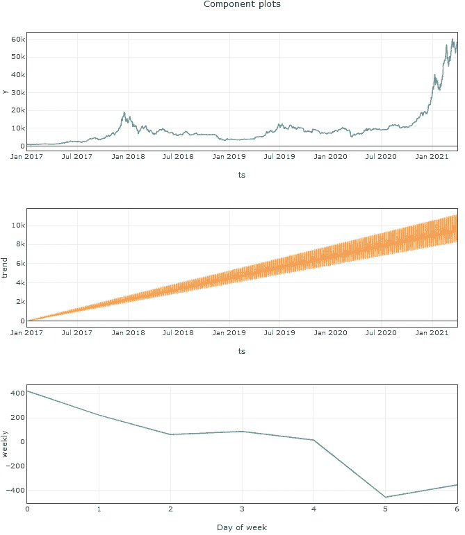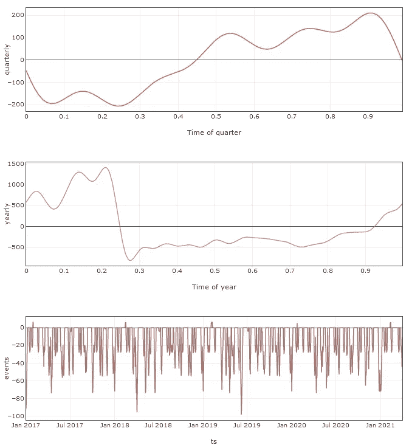

## **9。车型概要**

模型摘要允许检查单个模型术语。检查参数估计及其重要性，以了解模型如何工作以及哪些方面可以进一步改进。

```
summary = result.model[-1].summary()  # -1 retrieves the estimator from the pipeline
print(summary)
```

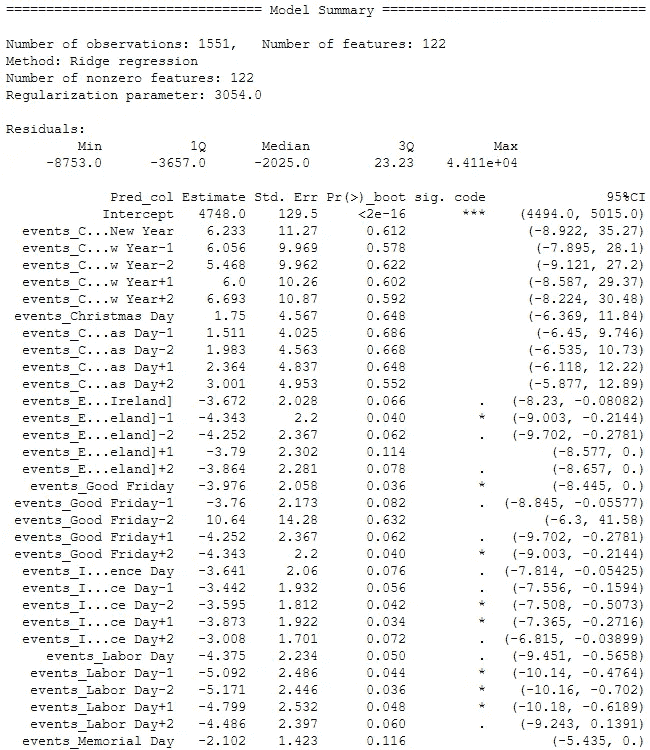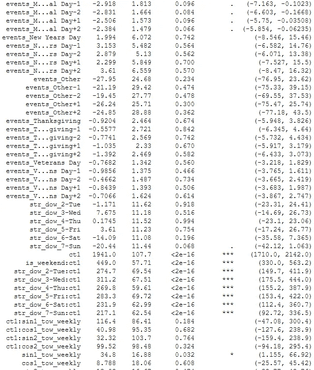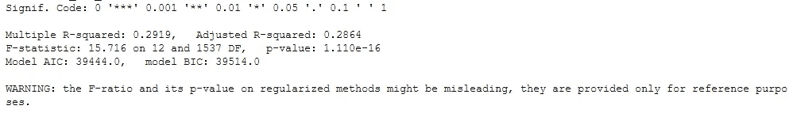

## 12.建模结果

经过训练的模型可用作拟合模型`sklearn.pipeline.Pipeline`

```
model = result.model
model
```

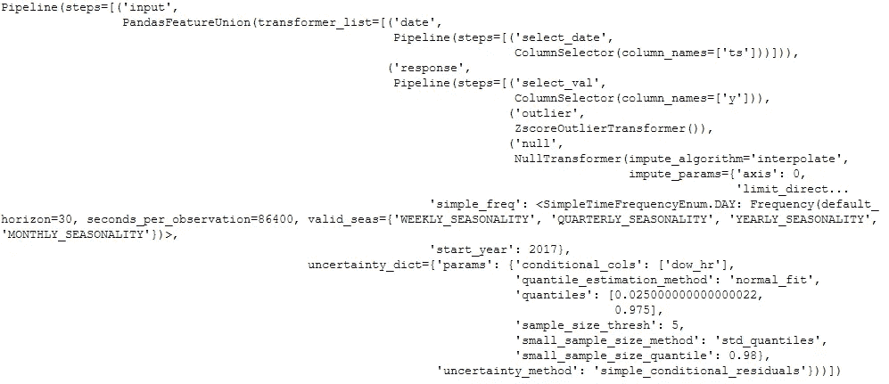

## 13.预测未来时间段的值

`make_future_dataframe`便利功能可用于创建该数据框。在这里，我们预测模型的训练结束日期之后的下 4 个期间。

```
future_df = result.timeseries.make_future_dataframe(
    periods=4,
    include_history=False)
future_df
```

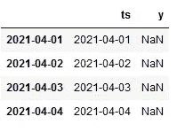

调用`.predict()`来计算预测。

```
model.predict(future_df)
```

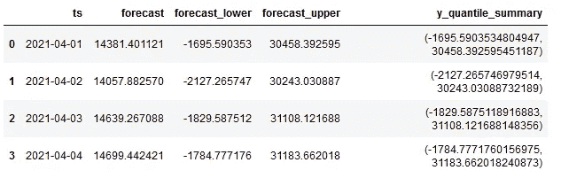

# 下一次探索的参考:

有关有助于我们改进预测和了解结果的其他工具:

*   [变点检测](https://linkedin.github.io/greykite/docs/0.1.0/html/gallery/quickstart/0200_changepoint_detection.html)
*   [季节性](https://linkedin.github.io/greykite/docs/0.1.0/html/gallery/quickstart/0300_seasonality.html)
*   [型号汇总](https://linkedin.github.io/greykite/docs/0.1.0/html/gallery/quickstart/0400_model_summary.html)
*   [网格搜索](https://linkedin.github.io/greykite/docs/0.1.0/html/gallery/quickstart/0500_grid_search.html)

# **参考文献:**

[](https://pypi.org/project/greykite/) [## 灰风筝

### Greykite:一个灵活、直观和快速的预测库

pypi.org](https://pypi.org/project/greykite/) [](https://www.kaggle.com/misalraj/greykite-a-library-for-time-series-forecasting) [## 📈Greykite:时间序列预测库

### 使用 Kaggle 笔记本探索和运行机器学习代码|使用来自时间序列分析的数据

www.kaggle.com](https://www.kaggle.com/misalraj/greykite-a-library-for-time-series-forecasting) [](https://github.com/linkedin/greykite) [## 领英/灰风筝

### Greykite:一个灵活、直观和快速的预测库

github.com](https://github.com/linkedin/greykite) [](https://www.analyticsvidhya.com/blog/2021/05/greykite-time-series-forecasting-in-python/) [## grey kite:Python 中的时间序列预测

### 本文是作为数据科学博客介绍的一部分发表的，时间序列预测是一个非常有用的工具

www.analyticsvidhya.com](https://www.analyticsvidhya.com/blog/2021/05/greykite-time-series-forecasting-in-python/) [](https://www.kaggle.com/kaustubh93/time-series-forecasting-of-dogecoin-using-greykite) [## 用灰风筝进行狗的时间序列预测

### 使用 Kaggle 笔记本探索和运行机器学习代码|使用来自加密货币历史价格的数据

www.kaggle.com](https://www.kaggle.com/kaustubh93/time-series-forecasting-of-dogecoin-using-greykite)  [## 概述— Greykite 库文档

### Greykite 是一个预测库，允许您进行探索性数据分析(EDA)、预测管道、模型调整…

领英. github.io](https://linkedin.github.io/greykite/docs/0.1.0/html/pages/greykite/overview.html) [](https://towardsdatascience.com/linkedins-response-to-prophet-silverkite-and-greykite-4fd0131f64cb) [## LinkedIn 对 Prophet-silver kite 和 Greykite 的回应

### 时间序列预测新算法综述

towardsdatascience.com](https://towardsdatascience.com/linkedins-response-to-prophet-silverkite-and-greykite-4fd0131f64cb) 

有关更多技术细节，我们可以阅读这篇论文:

[](https://arxiv.org/abs/2105.01098) [## 生产系统的柔性预测模型

### 本文讨论生产系统中预测模型的理想性质。然后它发展出一个家族…

arxiv.org](https://arxiv.org/abs/2105.01098)