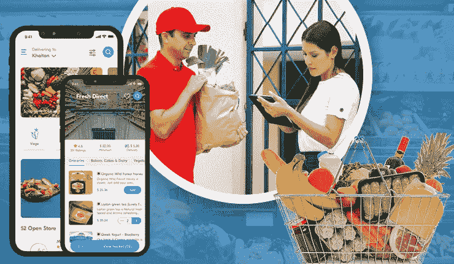
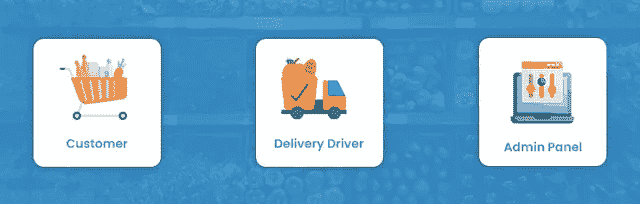

# 杂货交付应用程序开发指南——放在手边

> 原文：<https://medium.com/geekculture/grocery-delivery-app-development-guide-keep-it-handy-dd5da1ab106?source=collection_archive---------13----------------------->

Grocery Delivery App Development

今天的 Gen-Z 依赖于快速服务，从快速乘车到快速用餐。这并不令人惊讶，因此，像按需杂货交付应用程序这样的应用程序也慢慢地变得越来越受欢迎。由于帮助客户快速获得家庭用品配送，按需杂货应用程序的名气增长了许多倍。

因此，经营食品杂货递送业务的范围已经扩大了许多倍。尤其是在疫情之后，很明显，创业肯定会改变公司运作的趋势。

因此，如果你打算给你的传统超市建立一个竞争优势的解决方案，请阅读这篇文章。在你读完之后，当你计划建立一个彻底改变你的食品杂货配送设置的解决方案时，你将能够极其轻松和方便地完成这个任务。

# 描述杂货递送业务盈利性质的统计数据

> 1.到 2030 年，全球在线杂货市场的收入将达到 21583 亿美元
> 2。到 2025 年，全球最后一英里食品和杂货配送市场预计将产生 723 亿美元的利润
> 3。到 2027 年，全球在线杂货市场的规模将达到 2032.9 亿美元

通过这些有吸引力的数字，很明显是时候用应用程序将你的杂货交付数字化了。换句话说，在当前的 2022 年疫情之后，为你的杂货交付设置构建应用程序肯定会给它带来竞争优势。

在下面的几行中，我们讨论了一些步骤，这些步骤的遵守将确保你构建的应用程序帮助你获得最大的回报、收入和用户。

# 如何开发杂货配送 App？要遵循的步骤

## *关注业务发展阶段

这是第一个非常关键的阶段，当你构建按需杂货应用程序时，你需要把你的注意力放在这个阶段。

这需要确定应用程序的整体市场范围以及与开发相关的风险。了解了这一领域，你就可以进入发现阶段或第二步了。

## *收集关于应用程序如何运行的信息

这是您在构建杂货交付应用程序时必须遵循的下一个关键步骤。这需要你在进行非常强的研究后，找到一家知名的[杂货应用开发公司](https://www.peppyocean.com/grocery-delivery-app-development/)。这将确保你在开发应用程序的可行性、包含哪些将提高应用程序质量的功能等方面获得大量支持。

## *检查技术堆栈以实现强大的应用开发

当您创建一个应用程序来数字化您的杂货交付设置时，您希望确保最终解决方案以一种稳健的方式工作。因此，您需要利用适当的技术堆栈。

所以，你必须知道同样的道理。

这里有一些技术栈，有望在你构建按需杂货交付应用程序时派上用场。

*   swift for iOS/Flutter/React Native
*   Java for Android/Flutter/React Native
*   节点。JS/Express。后端和 API 的 JS
*   做出反应。前端的 JS
*   数据库的 MongoDB
*   服务器的 AWS
*   PayPal、Braintree、EWallets、Stripe 支付
*   推送通知的 Twilio

使用这些技术堆栈，您可以确保成功实现两个方面

可扩展性
面向未来

因此，当您构建解决方案时，请确保使用适当的技术堆栈，以便功能始终保持强大。

## *了解应用运营

当你知道[如何开发杂货递送应用](https://www.peppyocean.com/blog/grocery-app-development-for-startup/)时，你一定也对应用操作有所了解。这将确保您了解无缝简化这一领域的功能。

在下面的几行中，我们讨论了应用程序是如何工作的。

1.  进入应用程序并添加位置详细信息
2.  获取附近杂货店的列表
3.  从列表中选择一个符合您需求的
4.  选择您需要的项目
5.  付款后下单

完成所有这些步骤后，请求现在被发送到商店，然后商店将任务分配给送货司机。司机然后到达商店，提取订单，并提供送货服务。在这个过程中，顾客和司机都可以相互跟踪，前者特别了解物品的预期到达时间。

因此，当你开始为杂货递送服务开发应用程序时，要有一个应用程序操作的概念。

# 评估应用程序上简化杂货交付服务的功能

这是一个非常重要的步骤，将使您的杂货交付应用程序开发之旅无缝进行，有必要评估哪些功能将简化杂货交付服务的方式。

不过，在我们向您提供列表之前，您需要知道该应用程序中有三个主要部分——客户、送货司机、杂货店和您的企业。

因此，当您构建解决方案时，您需要在每个应用程序中拥有独特的功能。

有些你可以特别包括-

*   **针对客户**

1.  搜索食品杂货
2.  加入购物车
3.  计划订单
4.  订单历史
5.  评论和评级

*   **用于送货司机**

1.  订单管理
2.  更新交货状态
3.  实时位置跟踪
4.  应用内聊天和通话
5.  接受或拒绝递送请求

*   **管理面板(用于商店和杂货配送业务)**

1.  订单管理
2.  存货管理
3.  支付管理
4.  客户支持
5.  报告和分析

有了客户和送货司机的个人应用程序以及杂货店和杂货店送货业务的管理面板中的所有这些功能，您可以确保应用程序将稳定运行，并允许细分市场无缝地在其应用程序上执行不同的操作。

既然你已经知道了哪些步骤可以让你开发出功能强大的杂货交付应用，那么了解下一个方面——成本——就很重要了。

初创公司从零开始开发一款应用需要耗费大量的时间和资金。因此，你有必要关注财务方面。换句话说，企业必须在不影响质量的前提下，在应用开发上投入足够的资金。
因此，这需要评估。

这里给你一个按需杂货交付应用程序开发任务的估计预算。在你开始这段旅程之前，先看一眼吧。

# 构建按需杂货交付应用程序的预算估计

当你开始为你的设置构建按需杂货交付应用程序时，你需要分配的预算将在 12，000 美元到 20，000 美元之间。

但是，这可能会因区域而异，例如下面列出的区域。

**影响按需杂货交付应用开发成本的领域**

*   基于团队类型-内部、本地代理、自由职业者或外包。
*   基于位置
*   基于应用类型-品牌杂货、个人购物者(Instacart、Amazon Fresh)、按需杂货(UberEats、饺子)和基于订阅。

现在，您已经了解了食品杂货应用程序开发的步骤、功能和成本，很明显，该解决方案确实适用于超市。这将有助于 It 提高其可见性，确保最大限度的客户了解他们提供的服务，最后，在可见性方面，他们获得更多的访问。当您开发此解决方案时，也需要在这里添加它-您将获得以下好处。

**与杂货交付应用开发相关的优势**

1.  增强顾客的杂货购物体验
2.  存储客户的偏好，以便他们能够提供与偏好同步的服务
3.  提高零售商的收入潜力

# 包扎

读到这里，你就会明白，杂货配送应用有助于杂货业务建立一个坚实的基础。因此，如果您想将系统数字化，现在就开始吧。通过该解决方案成为 2032.9 亿美元盈利市场的一部分。找一个杂货交付应用程序开发公司，它会为你提供一个可定制的、随时启动的应用程序，确保可扩展性、回报和最大化，从而为你缓解这一问题