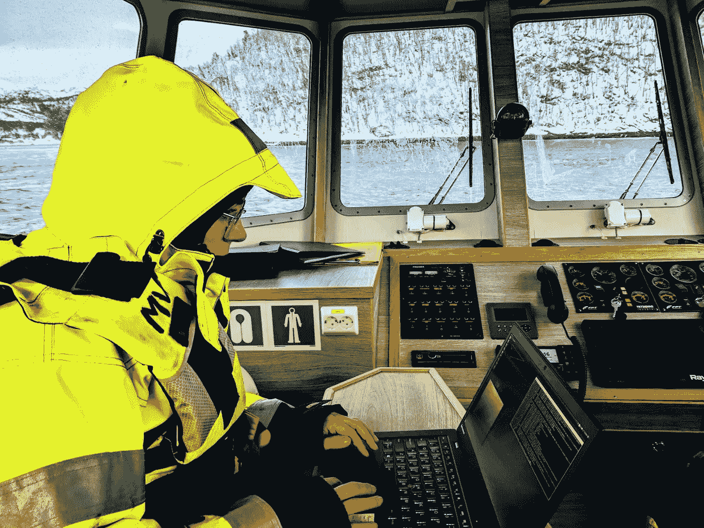
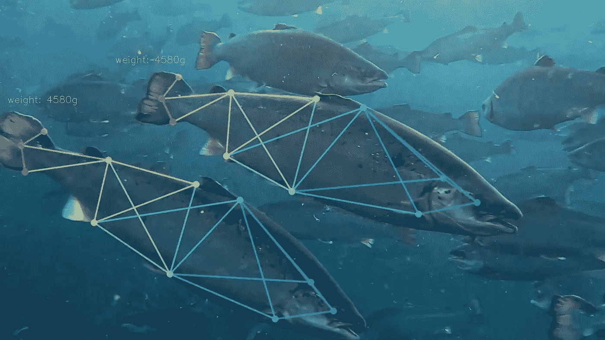

# 人工智能时代水产养殖业的发展和演变

> 原文：<https://medium.com/geekculture/growth-and-evolution-of-aquaculture-in-the-ai-era-c23a876475fe?source=collection_archive---------37----------------------->

对全球经济稳定具有重要意义的是，水产养殖业的现状与十年前大不相同。由于人员和流程的变化较少，水产养殖业在过去十年中一直保持稳定发展。虽然技术进步有限，但物联网的出现引发了基于人工智能的流程采用和自动化的引入。

这个部门相当大，从事水生动物的生产和供应。鱼、虾、牡蛎和藻类养殖与全球食品工业密切相关。在美国等国家，水产养殖实践相对广泛，分为海水和淡水。从牡蛎、蛤蜊、贻贝、虾、海藻和鱼类开始，如鲑鱼、黑海鲈鱼、黑鲈、黄鳍金枪鱼和鲳鲹，像美国、欧洲、亚太和拉美等地区涵盖了最多的水生动物种类。

# 现有趋势

根据 AMR 的研究，到 2025 年，全球水产养殖业将达到 3764.9 亿美元。水产养殖是北美(美国、墨西哥和加拿大)、欧洲(俄罗斯、挪威、冰岛和欧洲其他国家)、亚太(中国、菲律宾、日本、印度尼西亚、越南、澳大利亚和亚太其他国家)和拉美(拉丁美洲、中东和非洲)等地区的重要经济驱动力。

由于全球总消费量的上升，过去几年对海鲜的需求一直在增长。联合国机构引用的 [SOFIA 报告](https://www.seafoodsource.com/news/supply-trade/un-the-world-is-producing-and-consuming-more-seafood-but-overfishing-remains-rife)显示，未来几年全球海鲜消费将破纪录，而鱼类产量到 2030 年将跃升至 2600 万吨(公吨),累计增长 15%。随着该行业的规模继续扩大，一些挑战也成为焦点。质量、数量和环境依赖性等方面在很大程度上影响着该部门的生产流程和供应，最终影响到供应标准和消费者需求的满足。因此，越来越多的市场参与者正在求助于技术替代方案来改进现有做法，并引入创新方法来实施。

# 人工智能引领的变革

物联网在水产养殖领域也大有作为。技术进步不仅有助于提高畜产品的质量，还解决了过度捕捞、人工监控、饲料质量、疾病、捕食者攻击和生态系统管理以及环境变化等问题。

重要的是，通过传感设备对水质进行实时监控以分析病原体检测和清除，再加上自动饲养系统，改变了传统的养殖和饲养程序。使用可持续技术来减少气候影响的各种牲畜饲料也正在接受检查和开发。通过采用大数据分析和人工智能程序等方法，直接与安装在水产养殖笼或系统中的技术设备进行交互，牲畜生产商现在可以检测到牲畜中一些关键的紧迫问题。这也有助于提高产品质量。例如，一些生产商正在安装完整的人工智能基础设施来繁殖、喂养和饲养鱼类种群。机器鱼正在开发中，并被送到水中收集数据，帮助识别污染的水和野生鱼，以遏制对品种的开发。像海洋网箱系统这样的创新实践正在改变鱼类和水生动物的养殖方式。

Image Source: [Alphabet’s Tidal Moonshot](https://www.theverge.com/2020/3/2/21161029/tidal-moonshot-sustainable-fish-farms)

> 随着标注数据的增多，这个庞大而互联的水产养殖基础设施背后的人工智能程序被装备起来，以驾驭动物养殖保护的数字浪潮&。

生物量估计和识别、鱼类种群计数、鱼类运动跟踪和健康监测、疾病检测经常使用人工智能程序来执行。病原体检测也正在使用人工智能技术进行。各种类型的训练数据技术也为船舶监控系统或 VMS 提供动力，以检查船舶的状态和位置，并收集库存信息以供进一步监控。这种创新方法逐渐取代了费力的过程，提高了生产水平。

Image Source: [ABB](https://new.abb.com/news/detail/55912/feeding-the-world-responsibly-and-sustainably-with-artificial-intelligence-by-abb-and-microsoft) & Microsoft Azure Cloud

# 结束注释

在训练数据的帮助下，与技术设备相结合的人工智能程序正在简化管理牲畜数量和生产质量的流程，并有助于该行业的扩张和增长。训练数据行业的主要参与者，如 [**Cogito**](https://www.cogitotech.com/?utm_source=medium&utm_medium=blog&utm_campaign=content_sharing) 正在帮助水产养殖行业公司加强其人工智能计划，并提供可行的解决方案来实现全球需求。随着数字颠覆占据主导地位，水产养殖部门已经开始加快人工智能的实施，以彻底改变多个方面，从而获得不断变化的行业需求的回报。

最初发布于:【https://bit.ly/3xXSUjp 