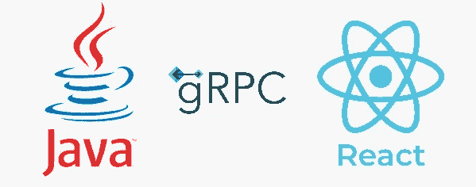
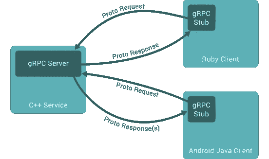
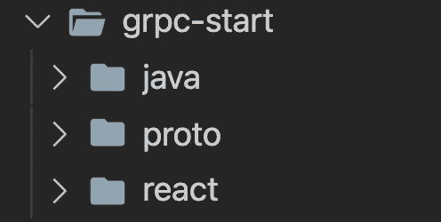
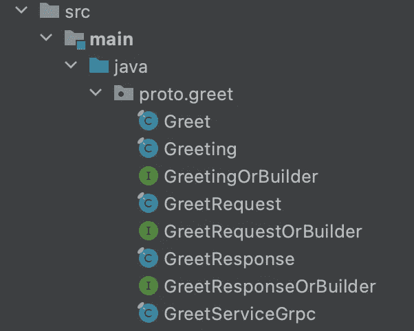
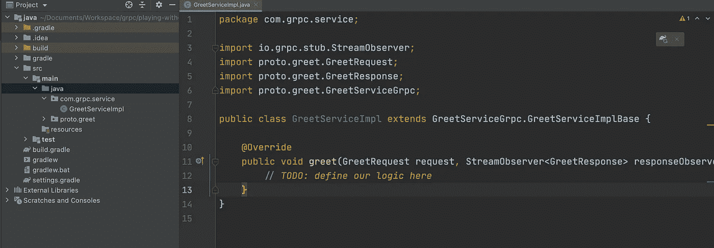
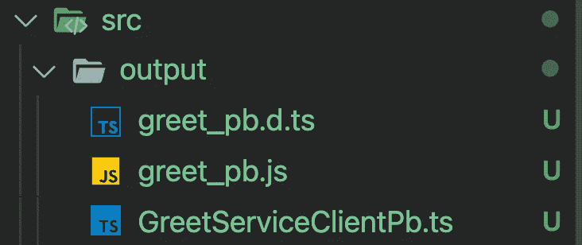
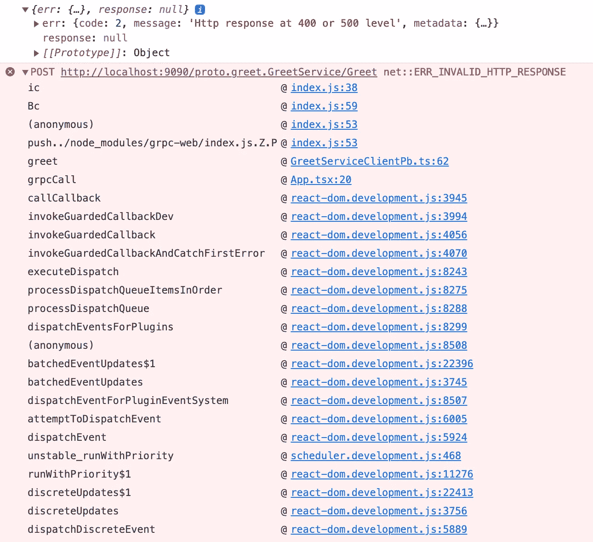
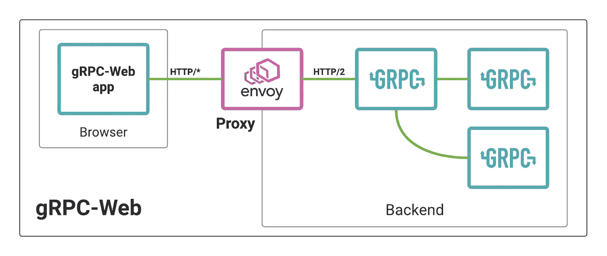

# Java 和 ReactJS 之间的 gRPC

> 原文：<https://medium.com/geekculture/grpc-between-java-and-reactjs-bbfefe42a1a6?source=collection_archive---------5----------------------->



RPC 代表远程过程调用，gRPC 是 Google 在 2015 年开发的 RPC 框架。

与 REST 或 GraphQL 一样，gRPC 有助于微服务之间的通信。然而，它有点不同，因为它使用 HTTP/2 而不是 HTTP/1，这就是 gRPC 受欢迎的原因，因为使用 HTTP/2 比 HTTP/1 更快、更安全。

# 服务之间如何通信？协议缓冲区是正确的选择

协议缓冲区是一种序列化结构化数据的机制，它定义了从不同服务发送或接收的数据的形状，包括属性和方法。

数据的形状必须在**中定义。proto** 文件如下:

```
syntax=”proto3";package greet;message Greeting{ string first_name = 1; string last_name = 2;}message GreetRequest{ Greeting greeting = 1;}message GreetResponse{ string result = 1;}service GreetService{ rpc Greet(GreetRequest) returns (GreetResponse){};}
```

这是一个将用于微服务之间通信的数据示例。我们有包含两个属性的**问候**对象，以及**问候请求**(将作为请求发送)和**问候响应**(将是来自服务的响应)，最重要的是**问候服务**，它包含可以从任何服务调用的方法，该服务是以**问候请求**作为参数并返回**问候响应**。

通过这种方式，您可以准确地知道要发送什么以及将接收什么样的数据。

但这还不是全部，在现实世界的场景中，企业应用可以由基于不同编程语言(Java、Python、PHP 等)的不同微服务组成，因此我们需要为每种语言声明这些数据。



现在你一定在想“我要为每个服务写所有的东西吗？！!"

答案是否定的，因为我们有一个名为[**protocol**](https://grpc.io/docs/protoc-installation/)的工具，可以用许多支持的语言编译你的代码，所以不用担心😁。

现在，这是你从 gRPC 开始需要知道的，如果你想深入了解，你可以查看官方[网站](https://grpc.io/docs/)，它非常全面。

# 先决条件:

现在我将展示如何使用 Java 和 ReactJS 从 gRPC 开始，但在此之前，请确保安装以下三样东西:

1.  这是编译器，你可以在这里找到安装[https://grpc.io/docs/protoc-installation/](https://grpc.io/docs/protoc-installation/)，你必须能够从你的命令行运行“协议”。
2.  protocol-gen-grpc-java:这是一个 protocol 插件，它将帮助我们从 proto 文件生成 Java 代码。(可以在这里找到[https://repo 1 . maven . org/maven 2/io/grpc/protocol-gen-grpc-Java/1 . 40 . 1/](https://repo1.maven.org/maven2/io/grpc/protoc-gen-grpc-java/1.40.1/))

> 注意:对于 MacOS 来说，这有点棘手，你需要下载[protocol-gen-grpc-Java-1 . 40 . 1-OS x-x86 _ 64 . exe](https://repo1.maven.org/maven2/io/grpc/protoc-gen-grpc-java/1.40.1/protoc-gen-grpc-java-1.40.1-osx-x86_64.exe)，因为这是一个 windows 应用程序，你需要删除。然后运行**chmod+x/usr/local/bin/protocol-gen-grpc-Java**

3.**protoco-gen-grpc-web**:这是一个 protoco 插件，用于从 proto 文件生成 TS 代码。(你可以在这里找到它[https://github.com/grpc/grpc-web/releases](https://github.com/grpc/grpc-web/releases)并确保将二进制文件移动到 */usr/local/bin* 就像我们对 java 插件做的那样)

# 动手操作:

现在我们将创建 3 个文件夹:

1.  **proto:** 我们将在这里存储为 java 和 react 生成的 proto buff 文件。
2.  **Java**:Java 微服务
3.  **react** :我们小应用的前端

您应该有类似的东西:



# 创建原型文件:

现在让我们创建一个名为 **greet.proto** 的原型文件，内容如下:

```
syntax="proto3";// syntax of the proto file (current version is 3)
package proto.greet; // package where we will generate the file

option java_multiple_files = true; // use multiple file for each object instead of one big file

message Greeting{
   string first_name = 1;
   string last_name = 2;
}

message GreetRequest{
   Greeting greeting = 1;
}

message GreetResponse{
   string result = 1;
}

service GreetService{
    rpc Greet(GreetRequest) returns (GreetResponse){};
}
```

这里我们将有 3 个可以在我们的服务之间传递的对象，它们是 **Greeting** 、 **GreetRequest** 和 **GreetResponse** ，我们的服务 **GreetService** 将告诉我们如何使用方法 **Greet** 进行通信，该方法将**greeteresuest**作为参数并返回 **GreetResponse** 。

# 设置 java 服务

简单地说，如果你有 IntellijIDEA，你可以开始一个新的 java 项目(我用的是 Gradle 而不是 Maven，所以请跟随我有同样的体验)。

项目准备就绪后，我们需要将 gRPC 依赖项添加到依赖项部分的 **build.gradle** 文件中，如下所示:

```
dependencies **{** testCompile group: 'junit', name: 'junit', version: '4.12'
    // these are the dependecies related to grpc
    implementation 'io.grpc:grpc-netty-shaded:1.40.1'
    implementation 'io.grpc:grpc-protobuf:1.40.1'
    implementation 'io.grpc:grpc-stub:1.40.1'
    compileOnly 'org.apache.tomcat:annotations-api:6.0.53' // necessary for Java 9+
**}**
```

***注意:一定要点击 IntellijIDEA 右上角的小按钮下载。***

# 为 Java 生成代码:

现在到了精彩的部分！我们现在想将 proto 文件的内容转移到 java 类，这可以通过运行以下命令来完成:

```
**$** cd /path/to/proto/folder # make sure to enter the proto folder to run the command from there
**$** protoc -I="./" --plugin=protoc-gen-grpc-java=/path/to/protoc-gen-grpc-java --grpc-java_out="./../java/src/main/java" --java_out="./../java/src/main/java" "./greet.proto"
```

让我们来理解这个命令:

1.  **协议**:是编译器
2.  **-I** :确定原型文件位置的标志(在我们的例子中是当前位置)
3.  **—插件**:是我们用来决定将 ptoto 文件转换成哪种语言的标志
4.  **— grpc-java_out &**
5.  **”。/greet.proto"** :要生成的文件的名称

然后嘣😎，您可以看到生成的文件如下所示:



我们还没完，不要高兴😊现在，协议为我们的对象和服务生成了基类，但现在我们需要为 greet 方法实现我们自己的逻辑，当一些服务调用 greet 方法时，我们到底想做什么，这取决于我们自己来定义它。

为此，我们将创建一个名为 **GreetServiceImpl** 的类，它将从 protoc 生成的类 **GreetServiceImplBase** 扩展而来。



如你所见，我已经创建了一个名为 **com.grpc.service** 的包，在其中我创建了从 **GreetServiceGrpc 扩展而来的 **GreetServiceImpl** 类。greeteserviceimplbase**由包含 greet 方法的 protoc 生成，我们将在其中定义自己的逻辑，我是这样做的:

```
package com.grpc.service;

import io.grpc.stub.StreamObserver;
import proto.greet.GreetRequest;
import proto.greet.GreetResponse;
import proto.greet.GreetServiceGrpc;
import proto.greet.Greeting;

public class GreetServiceImpl extends GreetServiceGrpc.GreetServiceImplBase {

    @Override
    public void greet(GreetRequest request, StreamObserver<GreetResponse> responseObserver) {
        System.*out*.println("You are in the greet method or the greet service");

        // we get the greeting object from the request (as defined in the proto file)
        Greeting greeting = request.getGreeting();
        String result = "Hello " + greeting.getFirstName() + greeting.getLastName();

        // build our response where the type should be GreetResponse
        GreetResponse response = GreetResponse.*newBuilder*()
                .setResult(result)
                .build();

        responseObserver.onNext(response);// send the response
        responseObserver.onCompleted();// complete the execution
    }
}
```

现在让我们构建服务器，首先创建一个名为 **com.grpc.server** 的新包，并在它下面创建**ServerImpl.java**类，然后复制以下内容:

```
package com.grpc.server;

import com.grpc.service.GreetServiceImpl;
import io.grpc.Server;
import io.grpc.ServerBuilder;

public class ServerImpl {

    public static void main(String[] args) throws Exception{
        final int PORT = 9090;

        // Create a new server to listen on port 9090
        Server server = ServerBuilder.*forPort*(PORT)
                .addService(new GreetServiceImpl())
                .build();

        // Start the server
        server.start();

        // Server threads are running in the background.
        System.*out*.println("Server started...");
        // Don't exit the main thread. Wait until server is terminated.
        server.awaitTermination();
    }
}
```

现在您可以运行服务器了，您应该会在终端中看到“服务器已启动…”。这样一来，我们在 java 方面的工作就完成了，现在让我们开始反应吧😊。

# 设置 ReactJS 服务:

使用以下命令创建基于 TypeScript 的 react 应用程序:

```
**$** npx create-react-app react-grpc --template typescript
```

像 java 依赖项一样，我们有两个依赖项需要添加到 react 中，它们是 [grpc-web](https://github.com/grpc/grpc-web) 和 google-protobuf，所以一定要安装它:

```
**$** cd react-grpc
**$** npm i grpc-web google-protobuf
```

现在，让我们通过运行以下命令，从我们的原型文件生成 typescript 代码，就像我们对 java 所做的那样:

```
**$** cd path/to/react-grpc # access the react project
**$** mkdir src/output # create a folder called "output" where to store the generated code
**$** cd path/to/proto/folder # access the proto files folder
**$** protoc ./greet.proto --js_out=import_style=commonjs:./src/output --grpc-web_out=import_style=typescript,mode=grpcwebtext:./src/output # this will generate the typescript code
```

> 注意:如果 protoco 命令不起作用，请验证 protoco-gen-grpc-web 插件。为了使该命令起作用，您应该正确设置它。

现在，您应该在 react 项目中看到类似这样的内容:



太棒了，正如你可以从一个文件中看到的，我们可以为我们的服务生成不同的源代码，并让它们说同一种语言:)

# React 和 Java 之间的通信:

现在转到 **App.tsx** 文件，删除其中的所有代码并复制粘贴这个文件:

```
import './App.css';
import { GreetServiceClient } from './output/GreetServiceClientPb';
import { Greeting, GreetRequest, GreetResponse } from './output/greet_pb';

function App() {

  const grpcCall = () => {

    // create our greeting object
    let greeting = new Greeting();
    greeting.setFirstName('Slimen')
    greeting.setLastName('Arnaout')

     // prepare the greet request
     const request = new GreetRequest();
     request.setGreeting(greeting);

     // create gRPC client that will call ou java server
     const client = new GreetServiceClient('http://localhost:9090')
                    .greet(request, {}, (err, response) => {
                console.log({err, response});
            });
        }

return (
      <div>
         <button onClick={grpcCall}>Click</button>
      </div>
 );
}

export default App;
```

简单地说，我们在这里所做的只是创建了我们的**问候**和**问候请求**对象，之后我们调用了**问候服务客户端**，这允许我们在 java 端调用问候方法。

在幕后，gRPC 将调用一个特定的 URL，该 URL 将与 java 通信以获得响应。

现在，您可以通过在控制台中键入“npm start”来运行该应用程序。

# 意外行为！！

如果我们点击按钮向 java 应用程序发送请求，我们会在控制台中得到这个错误



在 java 端，我们得到这个消息

```
Sep 06, 2021 1:09:17 PM io.grpc.netty.shaded.io.grpc.netty.NettyServerTransport notifyTerminated
INFO: Transport failed
io.grpc.netty.shaded.io.netty.handler.codec.http2.Http2Exception: **Unexpected HTTP/1.x request**: OPTIONS /proto.greet.GreetService/Greet
```

**现在这里发生了什么？！！**

正如我在本文开始时提到的，gRPC 使用 HTTP/2 而不是 HTTP/1，刚刚发生的情况是，我们的 React 应用程序试图向我们的 java 服务发送一个简单的 HTTP/1 请求，这就是它抱怨它的原因。

```
// the react app is trying to access directly to the java service via the port **9090**
const client = new GreetServiceClient('http://localhost:**9090**')
   .greet(request, {}, (err, response: GreetResponse) => {
    console.log({err, response});
});
```

正如你在这段代码中看到的，react 正试图通过端口 **9090、**直接调用我们的 java 服务，为了解决这个问题，我们需要在两个服务之间有一个代理，它将把 HTTP/1 请求转换成 HTTP/2，为此我们将使用 **Envoy。**你可以在这里阅读更多关于特使的内容**[https://www . Envoy proxy . io/docs/Envoy/latest/intro/what _ is _ Envoy](https://www.envoyproxy.io/docs/envoy/latest/intro/what_is_envoy)。**

****

# **解决问题:**

**首先，我们需要将 react 应用程序中的端口从 9090 改为 8080**

```
const client = new GreetServiceClient('http://localhost:8080') **<==**
.greet(request, {}, (err, response: GreetResponse) => {
    console.log({err, response});
});
```

# **设置特使:**

**现在，我们需要配置 Envoy 监听端口 8080，并在通过端口 9090 将请求发送到 java 服务之前将每个请求转换为 HTTP/2，为此，我们需要在 react 项目中创建一个名为 envoy.yaml 的 YAML 文件，并将以下内容复制粘贴到其中:**

```
admin:
  access_log_path: /tmp/admin_access.log
  address:
    socket_address: { address: 0.0.0.0, port_value: 9901 }

static_resources:
  listeners:
    - name: listener_0
      address:
        socket_address: { address: 0.0.0.0, port_value: 8080 } *# the port to listen to* filter_chains:
        - filters:
            - name: envoy.filters.network.http_connection_manager
              typed_config:
                "@type": type.googleapis.com/envoy.extensions.filters.network.http_connection_manager.v3.HttpConnectionManager
                codec_type: auto
                stat_prefix: ingress_http
                route_config:
                  name: local_route
                  virtual_hosts:
                    - name: local_service
                      domains: ["*"]
                      routes:
                        - match: { prefix: "/" }
                          route:
                            cluster: greeter_service *# name of the service, you can see it in the bottom of thi file* max_stream_duration:
                              grpc_timeout_header_max: 0s
                      cors:
                        allow_origin_string_match:
                          - prefix: "*"
                        allow_methods: GET, PUT, DELETE, POST, OPTIONS
                        allow_headers: keep-alive,user-agent,cache-control,content-type,content-transfer-encoding,custom-header-1,x-accept-content-transfer-encoding,x-accept-response-streaming,x-user-agent,x-grpc-web,grpc-timeout
                        max_age: "1728000"
                        expose_headers: custom-header-1,grpc-status,grpc-message
                http_filters:
                  - name: envoy.filters.http.grpc_web
                  - name: envoy.filters.http.cors
                  - name: envoy.filters.http.router
  clusters:
    - name: greeter_service *# name of our java service* connect_timeout: 0.25s
      type: logical_dns
      http2_protocol_options: {}
      lb_policy: round_robin
      load_assignment:
        cluster_name: greeter_service
        endpoints:
          - lb_endpoints:
              - endpoint:
                  address:
                    socket_address:
                      address: host.docker.internal
                      port_value: 9090 *# port of the java service*
```

**最后一步，我们需要使用 envoy 的 docker 图像，为了简化，我将使用 docker-compose，这是我的 **docker-compose.yaml** 文件:**

```
version: '3'
services:
  envoy:
    image: envoyproxy/envoy-dev:b145180d17cac80aa5f9a7801429d52017fea6d1
    volumes:
      - ./envoy.yaml:/etc/envoy/envoy.yaml
    ports:
      - "8080:8080"
      - "9901:9901"
```

> **注意:确保 envoy.yaml 和 docker-compose.yaml 在同一个位置**

**就这样，我们的 gRPC 项目现已准备就绪，要运行它，请确保:**

1.  **运行 java 后端**
2.  **通过“npm 启动”运行 react 应用程序**
3.  **使用“docker-compose up”运行特使代理**

**如果一切正常，您应该会在控制台中看到 java 服务的响应，如下所示:**

****

# **摘要**

**正如您所看到的，这是一个小项目，但它是理解如何从 gRPC 开始以及如何使它与不同的服务一起工作的一个简单方法，我们在本文中所做的步骤对于每种编程语言都是非常相同的。**

**如果您想更深入地了解 gRPC，我鼓励您阅读官方文档。**

**我希望你喜欢阅读这篇文章，并祝你有美好的一天😊**