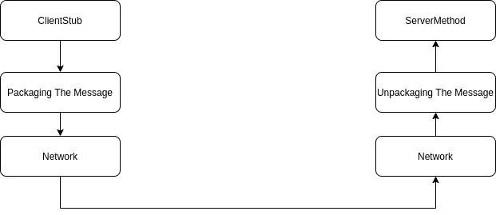
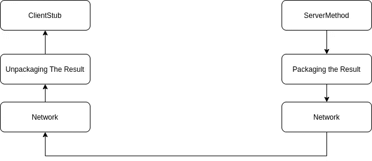
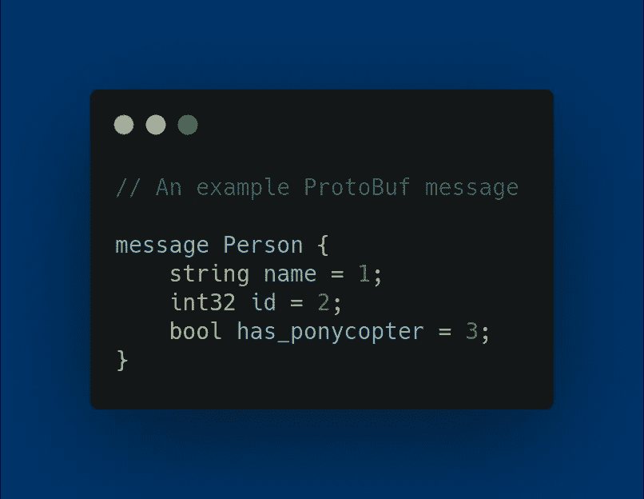
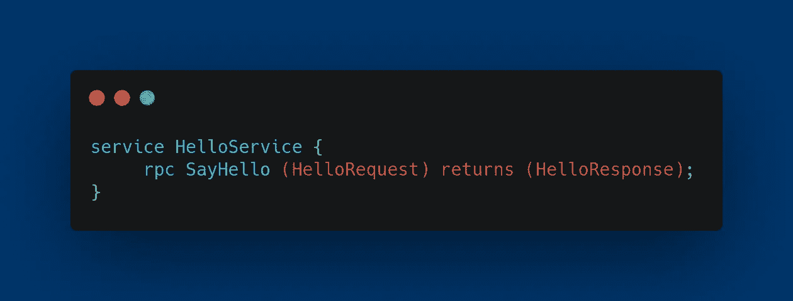

# gRPC——为什么、什么和如何

> 原文：<https://medium.com/geekculture/grpc-why-what-and-how-77080a59fc43?source=collection_archive---------5----------------------->

Photo by [Daniel Olah](https://unsplash.com/@danesduet?utm_source=medium&utm_medium=referral) on [Unsplash](https://unsplash.com?utm_source=medium&utm_medium=referral)

如果您在过去几年中一直从事软件行业，那么您一定非常熟悉 web 服务，以及它们是如何成为当今每个企业应用程序的主要部分的。SOAP、REST web 服务是这场 web 服务革命的先锋。但是从 2015 年开始，这个街区出现了一个新成员！他在软件行业中慢慢获得了关注和回头率。这不是别的谷歌大脑儿童 gRPC。

在本文中，让我们来看看 gRPC 的原因、内容和方式。

# 远程过程调用

在我们深入 gRPC 之前。让我们从基础开始。什么是真正的远程过程调用，或者简而言之，RPC？

过程调用是执行某种特定任务的一系列代码。过程调用最简单的例子是任何简单的方法。当你在那个词前面加上“远程”前缀时，它就有了完全不同的意思。

当另一个地址空间(另一台计算机、网络中的另一个节点等)中的过程。)可以从不同的地址空间被调用，就好像该过程调用是本地的一样，我们说它是远程过程调用。从本质上来说，RPC 所做的是给客户端一种“错觉”,以为它正在调用一个本地方法，但实际上它调用了远程机器中的一个方法，同时在后台隐藏了网络通信的细节。

如果我们深入一个简单的 RPC 调用，它可以分成几个子步骤。

在 RPC 中，通常有一个客户端和一个服务器。客户机是调用 RPC 的代码/程序，而服务器是真正调用过程调用并发回答案的。

## 步伐

*   客户端调用客户端的模拟代码。

我们通常将这种模拟实现称为存根。存根可以定义为代表另一组代码的代码块。这就是存根的全部目的，“充当”一个真正的函数，一个门面，以便可以在后台调用和处理 RPC。

*   客户端存根将参数和必要的元数据打包到消息中

在这一步中，客户机存根将客户机注入存根方法的参数和其他元数据打包到一个压缩消息中。

*   通过网络将消息传输到服务器。

元数据打包后，消息通过网络发送到服务器。并由服务器端接收。

*   在服务器端解包和调用过程。

在服务器端接收到消息后，它解包消息并在服务器端调用“真正的”方法/过程调用。

Message Flow from Client Stub to Server

*   将响应重新打包并发送给客户端。

在服务器端收到响应后，服务器代码将响应重新打包成消息，并通过相同的网络将其发送到客户端

*   解包响应并返回响应

收到响应消息后，客户机存根代码会对其进行解包，并将其作为被调用的客户机存根方法的响应返回。

Message flow from server to client stub

我们要记住的一个事实是，大多数情况下，上述细节都是在 RPC 调用中在后台完成的，所以客户端所要做的就是调用存根方法并等待结果！

# gRPC

现在让我们进入 gRPC 的主题。

gRPC 是由 Google 构建的高性能 RPC 框架/技术。它使用 Google 自己的“协议缓冲区”，这是一种用于数据序列化的开源消息格式，作为客户端和服务器之间的默认通信方法。与 REST APIs 大多使用 JSON 作为消息格式类似，gRPC 使用协议缓冲区(简称 ProtoBuf)格式作为消息格式，使用 IDL(接口定义语言)来描述负载参数和响应参数。

至于客户机存根和服务器代码之间的通信方法，gRPC 使用 HTTP/2 作为默认协议。因为 gRPC 使用 HTTP/2 特性，所以它支持 4 种类型的 API。

1.  一元——简单的客户端服务器通信。在本文中，为了简单起见，我们只关注这种格式。
2.  客户端流
3.  服务器流
4.  双向流

## 协议缓冲区

在简单协议缓冲区消息中，数据被结构化为具有名称、值对的消息。

An example ProtoBuf Message

以上是协议缓冲区中数据类型定义的简单示例。如您所见，它与 JSON 数据格式非常相似。

在开发人员创建了协议缓冲文件之后，我们可以使用“协议缓冲编译器”来编译编写的协议缓冲文件，该文件将生成处理消息所需的所有实用程序类和方法。例如，消息的 getter 和 setter 方法(getName、setName、setId)都是为特定的编程语言自动生成的。

如果我们以 Java 为例，编译完。proto 文件中，一个名为 Person 的类将自动生成，其中包含所有需要操作 Person 消息/数据类型的实用程序方法。

## 服务方法

在编写了必要的请求和响应消息类型之后，下一步是编写服务本身。

gRPC 服务也在协议缓冲区中定义，它们使用“服务”和“RPC”关键字来定义服务。

HelloService

上面我首先创建了两种消息类型，HelloRequest 和 HelloResponse。然后从关键字 **rpc** 开始，用 HelloRequest 作为输入，HelloResponse 作为输出，声明了一个简单的 gRPC 服务方法。

finalized HelloService.proto file

要了解更多关于协议缓冲格式的语法和结构，可以参考 [***官方协议缓冲文档***](https://developers.google.com/protocol-buffers/docs/proto3) 。

在完成 ProtoBuf 文件之后，Google 已经提供了一个特定于编程语言的 API，它会将这个 protobuf 文件转换/转化为该语言的服务器方法和客户端存根。gRPC API 生成必要的文件后，您可以实现这些方法，并根据自己的意愿创建方法实现。**这将因不同的编程语言而异**。

当一个服务被调用时，正如我上面所说的，网络通信是在后台发生的，被调用的方法将在整个周期后给出响应。

这是对 gRPC 和 RPC 世界的简单介绍。我还没有解释代码级的细节以及如何创建和实现 gRPC 服务，希望在以后的文章中讨论。

非常感谢您阅读这篇文章，并关注更多内容！干杯。

 [## Ravindu Rashmin -软件工程师- WSO2 | LinkedIn

### 在世界上最大的职业社区 LinkedIn 上查看 Ravindu Rashmin 的个人资料。Ravindu 列出了 7 个工作…

www.linkedin.com](https://www.linkedin.com/in/rashmin95/) 

## 资源

[1]——【https://web.cs.wpi.edu/~cs4514/b98/week8-rpc/week8-rpc.html T2

[2]——【https://grpc.io/ 