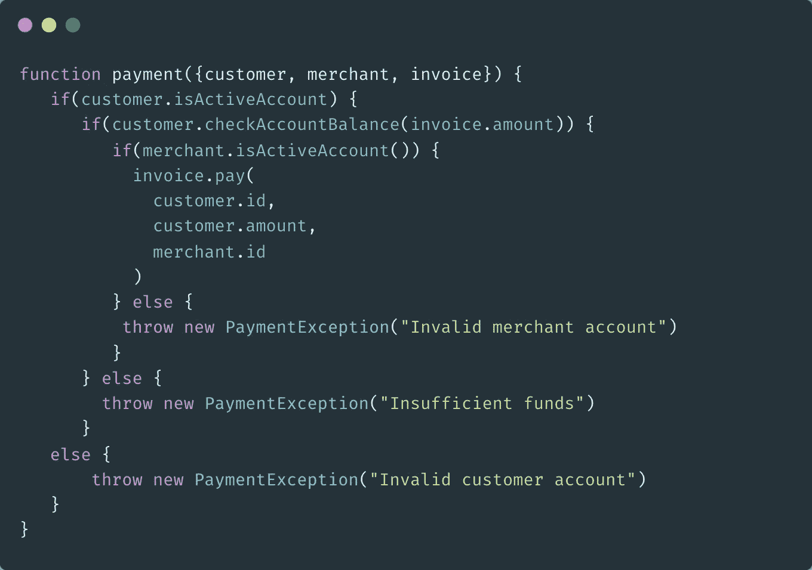
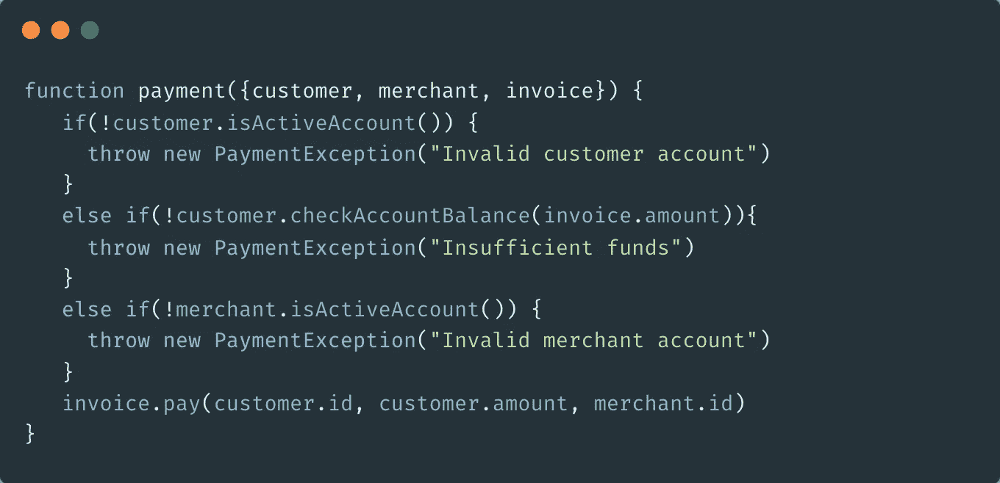

# 更清晰代码组合的保护条款

> 原文：<https://medium.com/geekculture/guard-clause-for-cleaner-codebase-6e84c56c0c2f?source=collection_archive---------14----------------------->

Guard 子句是一种编码策略，它侧重于在调用重要的业务函数之前，在代码块的开头编写不需要的条件规范

保护条款旨在促进

*   更清晰的代码组合
*   高可维护性方面
*   代码复杂度更低

Guard 子句立即返回或抛出代码块中不需要的规范。

让我们用 JavaScript 来可视化一个例子。

现在给出一个名为 payment 的函数，它接受三个函数参数，即客户、商家和发票对象。

流程从支付功能检查客户的账户是否有效开始，然后如果前提为真，它将继续到下一个报表条目。否则它会抛出一个支付异常消息。

第二个嵌套语句是检查客户的帐户余额，如果该语句可能是真的，那么最后它将检查商家的帐户是否是活动的，一旦所有条件都满足，那么将调用 invoice.pay 函数。在相反的情况下，它会抛出一个异常消息。

代码示例首先关注快乐路径条件，然后在满足第一个条件后，它将转到下一个条件条目。

## 问题

最大的问题依赖于如何维护、测试和读取代码结构。

**嵌套的条件语句**是一个已知的问题，它给代码块带来了很高的复杂度分数。如果 bug 发生在函数范围内，重构将更加困难

添加额外的函数行为实现起来会更加复杂，并且会使代码熵变得更快

## 更好的解决方案

前面的例子工作正常，但是由于代码是如何组成的，它将被认为是缓慢的代码复杂性。

更好的解决方案是使用 guard 子句来改进代码组成。

它从移动函数作用域级别上的所有条件语句开始。这消除了条件逻辑嵌套问题。

第二种方法是使用非快乐路径条件表达式，如果不需要的条件已经满足，则抛出 PeymentException。

最后把实际的支付函数放在所有不愉快的路径条件之后

这个例子现在不那么复杂，可读性更好，而且代码块的可维护性更高。

**结论**

逐渐增加的复杂性并不局限于 JavaScript，可以在任何软件编程语言下实现

这种编码策略非常简单，对您的应用程序产生了良好的影响。