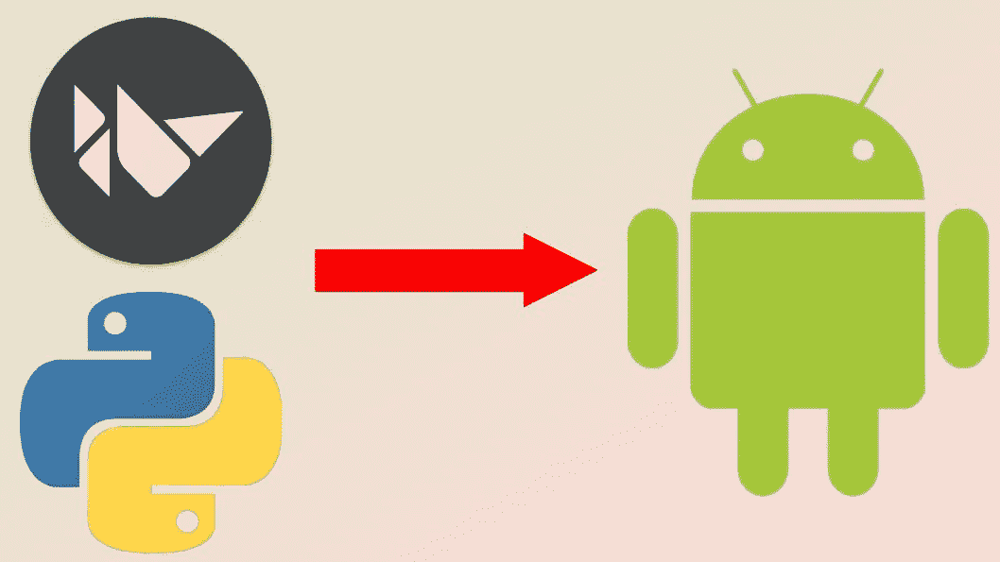

# GUI 使用 Python 和 Kivy，从任何没有 Virtualbox 的操作系统将它部署到 APK👐

> 原文：<https://medium.com/geekculture/gui-using-python-with-kivy-deploy-it-to-apk-from-any-operating-system-without-virtualbox-fe2268518286?source=collection_archive---------2----------------------->

## 用 kivy 或 kivymd 制作一个 android 应用程序，它也支持 Windows、Mac、Linux 和 Raspberry pi。



Kivy(Python Framework) to Android App

## 第一步。

Ubuntu 18.04 用户可以跳过这一步。

其他操作系统在 docker 安装 Ubuntu 18.04，如下图。记住，如果你在这个过程中安装了 Ubuntu，你就不必像 virtual box 那样浪费太多内存。

[](https://ujjwalkar.medium.com/try-another-linux-environment-on-one-using-docker-without-virtual-box-or-its-alternative-which-86049c6cd7ae) [## 在一个使用 Docker 而没有 virtual box 或其替代产品的 Linux 环境上尝试另一个环境…

### 尝试它的终端从您的终端，它的文件从您的 VScode 或文件管理器。

ujjwalkar.medium.com](https://ujjwalkar.medium.com/try-another-linux-environment-on-one-using-docker-without-virtual-box-or-its-alternative-which-86049c6cd7ae) 

## 第二步:安装 Kivy

在 ubuntu 中，Kivy 是由包`python-kivy`、`python-kivy-examples`构建的。
所以通过运行安装这些包..

```
sudo apt-get install python-kivy python-kivy-examples debhelper python python-all-dev cython libgl1-mesa-dev libgles2-mesa-dev
```

# Buildozer

Buildozer 是一个旨在轻松打包移动应用程序的工具。它自动化了整个构建过程，下载了 python-for-android、Android SDK、NDK 等先决条件。

# 如何安装？

首先下载 buildozer。

```
apt install git # if git is not installed already
git clone [https://github.com/kivy/buildozer.git](https://github.com/kivy/buildozer.git)
```

安装 Python

```
sudo apt install python3.6
```

安装安装工具

```
sudo apt-get install python3-setuptools
```

转到 buildozer 目录

```
cd buildozer
```

通过该命令安装`setup.py`

```
sudo python3 setup.py install
```

安装一些软件包

```
sudo apt install -y git zip unzip openjdk-8-jdk python3-pip autoconf libtool pkg-config zlib1g-dev libncurses5-dev libncursesw5-dev libtinfo5 cmake libffi-dev libssl-devpip3 install --user --upgrade Cython==0.29.19 virtualenvexport PATH=$PATH:~/.local/bin/
```

安装 Cython

`sudo apt-get install cython`

# 将你的应用程序转换为 APK

移动到 kivy 项目所在的目录

初始化 Buildozer

```
buildozer init
```

写`nano buildozer.spec`

做一些改变

```
#(str) Title of your application    
title = My Application (name of your applications)#(str) Package name    
package.name = myapp (package name)
```

并改变这一点

```
#(str) Android logcat filters to use    
#android.logcat_filters = *:S python:D
```

到

```
#(str) Android logcat filters to use    
android.logcat_filters = *:S python:D
```

运行最后一个命令

```
buildozer android debug deploy run
```

## 类似帖子:

[](https://ujjwalkar.netlify.app/post/expert-on-linux-tips-and-tricks/) [## Linux 专家，提示和技巧| Ujjwal Kar

### 嗨，我是 Ujjwal Kar，在各种基于 linux 内核的操作系统上工作了很长时间，比如 Ubuntu，Ubuntu Linux Mint…

ujjwalkar.netlify.app](https://ujjwalkar.netlify.app/post/expert-on-linux-tips-and-tricks/)