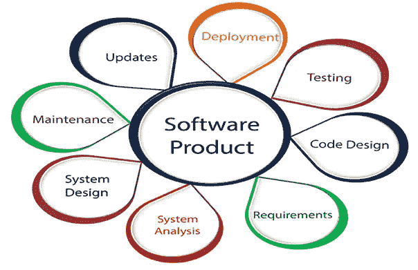

# 高效构建软件指南——在开发之前、期间和之后要考虑什么

> 原文：<https://medium.com/geekculture/guide-to-building-software-efficiently-what-to-consider-before-during-and-after-developing-c11eb150ec9b?source=collection_archive---------24----------------------->

采用有效的方法来构建软件会提高构建的质量和准确性。在实践中，在整个团队中遵循共同的标准和方法被证明对现在和将来都是最好的。无论是作为团队还是个人，在 SDLC 的不同阶段采用某些度量标准和考虑因素将是构建高效和可伸缩软件的最佳方式。在这篇文章中，我们将看看在开发软件之前、期间和之后需要考虑的事项。

## 开发前

首先，要考虑软件的需求和用户。因此，一个普遍的问题来了，为什么观众如果有需求呢？软件的可用性必须根据受众来判断——公众通常更喜欢易于使用的界面。另一方面，由于其功能和需求，供内部行业使用的软件可能是技术性的，因此需要关于内部的知识。

> 目的是保持它的可用性，而不是极客或高科技

## 开发期间

需求在任何地方都是一个普遍的因素，在这里也是如此。除此之外，任何开发人员都应该考虑另外两个重要因素——可维护性和性能。软件从来都不是“一劳永逸”的类型。将来可能需要对各种组件进行更改——因此，要保持整体架构和代码的可维护性和可伸缩性。从用户角度、速度、网络使用、数据安全等方面来看，一个构建良好的软件在各个层面都应该有良好的性能。

> 不要忘记你构建了什么，它会在稍后的时间回来改变。

## **显影后**

你可能认为这已经结束了，但事实并非如此。仍然有一些需要检查和调整的地方——**边缘案例**(你永远不知道会发生什么)**可用性**(从用户的角度来看完整的产品)以及其他一些日常工作。任何软件都是经过充分开发后才能完全理解和评价的。

> 首先构建，最后进行基准测试

感谢您的阅读！

## 有用的链接:

在 LinkedIn 上找到我:[https://linkedin.com/in/vishnuu0399](https://linkedin.com/in/vishnuu0399)

更多地了解我:https://bit.ly/vishnu-u