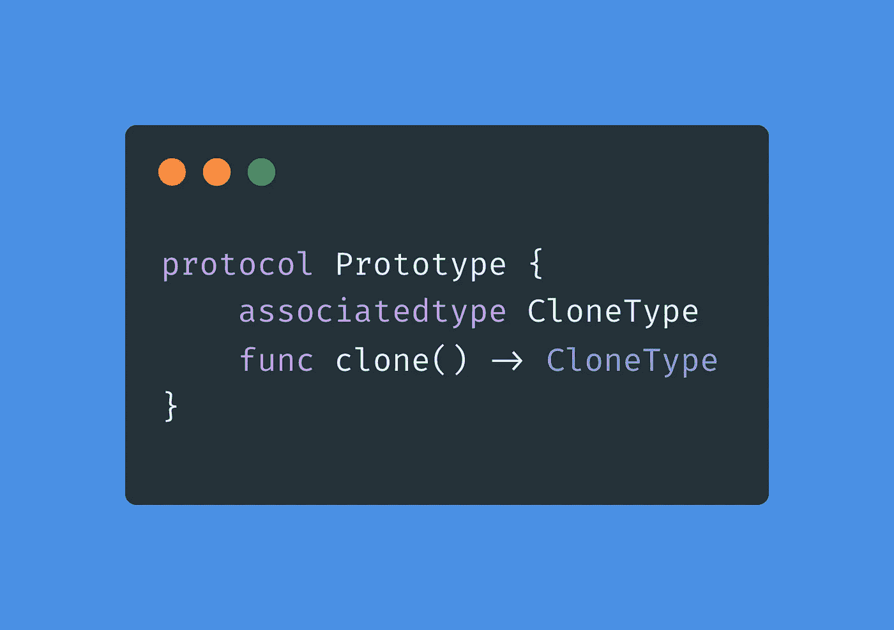
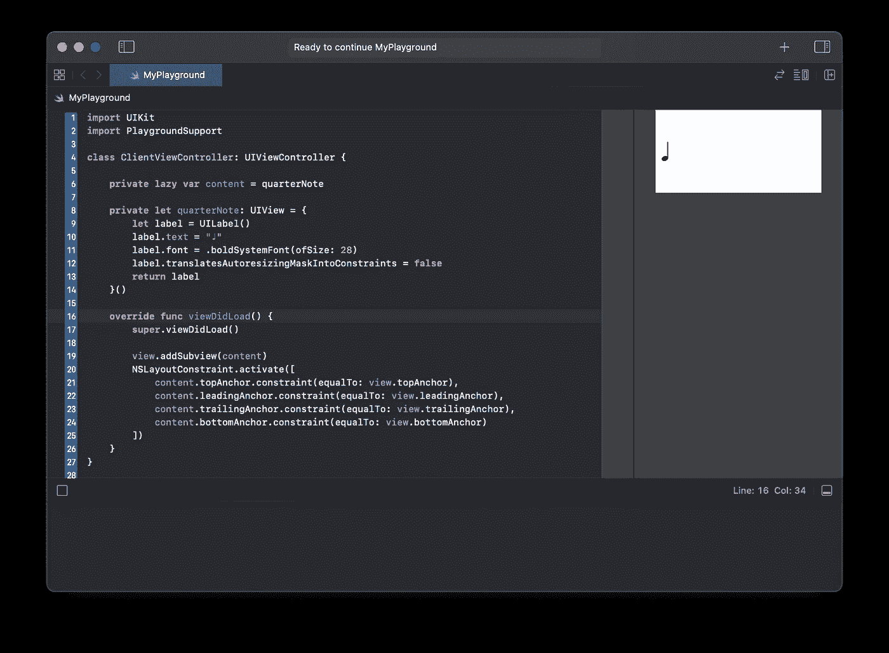
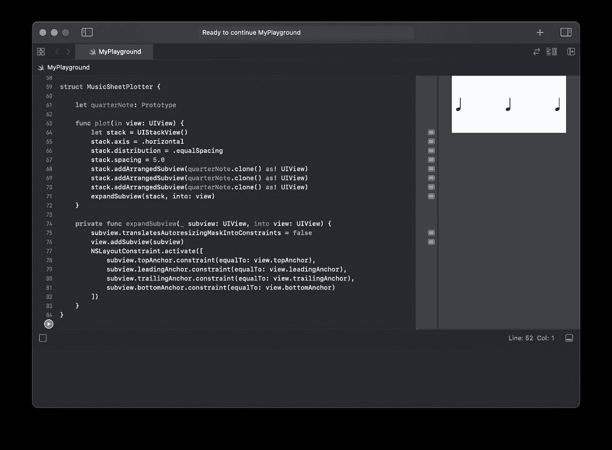
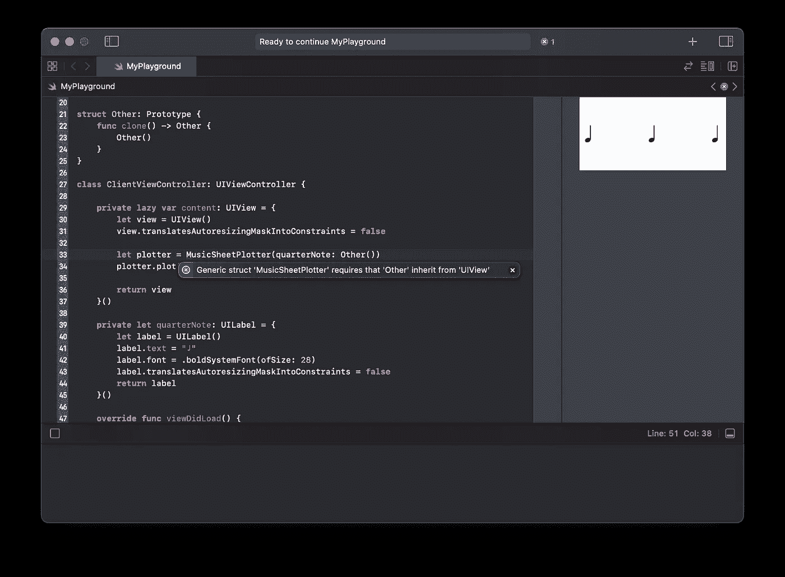

# Swift 原型模式指南

> 原文：<https://medium.com/geekculture/guide-to-prototype-pattern-in-swift-c6f4735d8e2b?source=collection_archive---------8----------------------->

## 在代码中创建抽象对象

原型是一种创造性的模式，由《设计模式，可重用面向对象软件的元素》一书定义。该模式的主要目标是通过复制给定的实例来创建新的对象。

复制对象而不知道其具体类型的能力是非常强大的。例如，您可能正在创建一个需要来自客户端的对象的框架，它需要在运行时的不同时刻实例化该对象。有了 Prototype，你可以分离你的框架，同时仍然允许客户定制它。

书中给出了一个音乐编辑器框架的例子。在这个例子中，框架允许客户端注册代表音符、休止符和五线谱的不同对象。

使用该模式还有其他优点，比如减少应用程序的类的数量，通过改变值或结构来指定新的对象，以及在运行时添加和删除产品，所以我强烈推荐阅读。然而，在我们的例子中，我们将把重点放在前面的例子上，看看如何使用它来抽象新对象的创建，在这些新对象中，具体的类型对于您的类来说是未知的。

# 设置

让我们从一个简单的操场例子开始。我们将创建一个类 **ClientViewController** ，它代表我们的音乐表单框架的一个客户端。

结果是一个简单的四分音符显示在实时视图中:

现在，假设音乐表单框架为其用户提供了一个名为 **MusicSheetPlotter** 的类。这个类的客户端传递一个对 quarterNote 的引用，为了简单起见，quarter note 是一个 UILabel。有了参考，当调用`plot(in:)`时，绘图仪尝试 3 次将注释添加到堆栈中。

现在，让我们从 **ClientViewController** 修改我们之前的`**private lazy var** content`，使其使用 MusicSheetPlotter:

如果你现在经营操场，你觉得会发生什么？

你可能猜对了。结果是只有一个*四分音符*出现，和之前一模一样。这是因为 UIView 是作为引用传递的，多次将同一个引用添加到堆栈视图中是没有意义的。我们需要的是在运行时创建那个四分音符的不同实例。

# 使用原型

虽然 Foundation 为我们提供了一个`NSCopying`，但是它要求我们除了从**n object、**继承之外，还要遵守一个丑陋的接口`**func** copy(with zone: NSZone? = nil) -> **Any**` **、**，这很让人想起 ol' Objective-C

因此，让我们自己创建协议。这也将提供更多的灵活性。不要忘记扩展 UILabel，使其符合 Prototype。见下文:

*注意，原型协议将存在于我们的框架中，而不是在客户端。*

现在我们可以修改我们的 **MusicSheetPlotter** ，这样它就可以克隆对象了。

再次跑操场:

随着最新的变化，我们的 **MusicSheetPlotter** 如预期般工作！客户端可以提供任何类型的 UIView(无论是否是 UILabel ),只要它符合 Prototype。定制现在对我们的框架来说是简单和透明的。

这就是实现协议模式的传统方式。然而，仍然有一些事情让我不完全高兴:**我们必须对克隆对象进行造型的事实**。

# 多走一英里

上述实现的问题是它很容易被破坏。**例如，** **如果客户端传递了一个不是 UIView 的原型，它就会崩溃**。

我们可以取消克隆对象的强制解包，并在添加它们之前确保它们的类型是 UIView，但这仍然为客户端的意外行为和糟糕体验敞开了大门。

**客户端不知道 MusicSheetPlotter 需要将 *quarterNote* 投射到 UIView。我们唯一期望从他们那里得到的是一个原型。从他们的角度来看，任何原型都应该这样做。**

我们可以用两种方法解决这个问题。

## 1.协议组成

这是最简单的解决方案。我们只需要用我们期望的另一种类型组成原型。在这种情况下，UIView:

这将保证客户端将传递一个我们可以实际使用的对象。我们仍然需要对其进行造型，但至少我们知道该对象实际上可以被造型为 UIView。

## 2.关联类型

这里的第一步是修改我们的原型协议，使其使用关联的类型。第二，我们必须在 UILabel 扩展中，或者任何其他实现 Prototype 的类中，对我们的`clone()`方法的返回类型进行专门化。见下文。

这将导致来自 **MusicSheetPlotter** 内*四分音符*的以下错误:

> 协议“Prototype”只能用作一般约束，因为它具有自身或关联的类型要求

最后，为了修复错误消息，我们将原型作为通用约束传递，确保我们指定了 *CloneType* 需要符合 UIView:

搞定了。现在，我们框架的 **MusicSheetPlotter** 的客户端被限制在它们可以传递的类型，因此，不可能由于强制转换而中断。如果他们尝试，将会收到一条错误消息:

今天就到这里，希望这篇文章对你有帮助。再见，编码快乐！