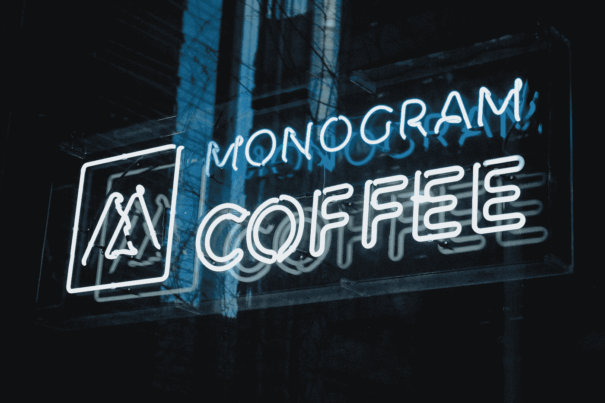

# monogram 设计指南

> 原文：<https://medium.com/geekculture/guide-to-the-monogram-design-7f5aa16f51be?source=collection_archive---------22----------------------->

## 通过这个循序渐进的指南，学习如何设计一个字母组合。

Photo by [Ben den Engelsen](https://unsplash.com/@benjeeeman?utm_source=medium&utm_medium=referral) on [Unsplash](https://unsplash.com?utm_source=medium&utm_medium=referral)

会标是婚礼、纪念日和其他特殊场合的流行设计趋势。如果你计划在你的下一个项目中使用字母组合，你会想知道这个过程的基础。本指南将概述创建美丽的 monogram 设计所需的步骤。