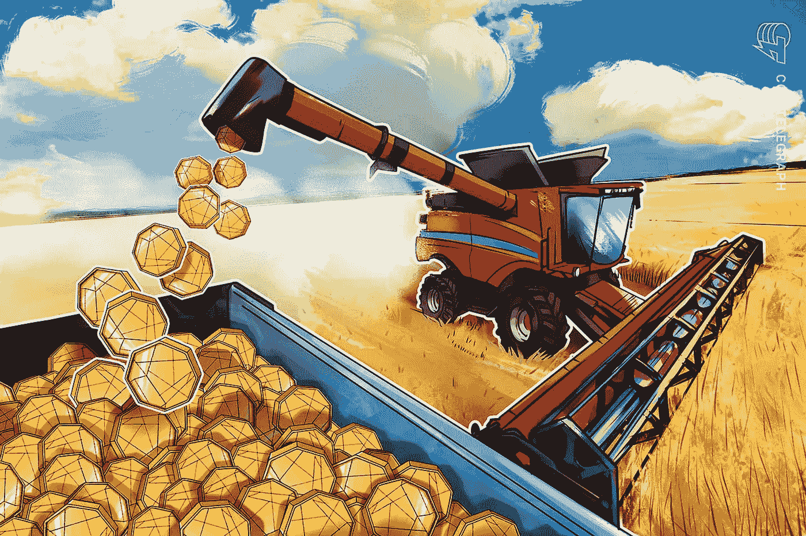
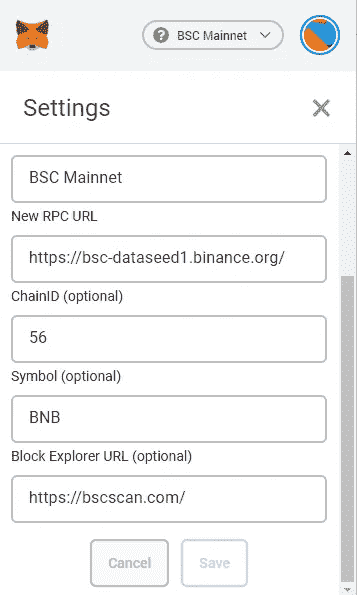

# 收益农业和标记加密资产指南

> 原文：<https://medium.com/geekculture/guide-to-yield-farming-staking-crypto-assets-ca2404097b90?source=collection_archive---------1----------------------->

Source: cointelegraph, not affiliated

我写这篇文章，因为我发现自己需要能够指出一些简要总结产量农业的主要方面，并以一种涵盖“基础知识”的方式解释它，而我还没有找到真正的参考资料。把它很快放在一起，所以我可能会不时地编辑，可能会有错别字。

什么是产量农业？

随着 Uniswap、Pancakeswap、Quickswap 或 Serum (DEXes)等去中心化交易所的出现，让它们发挥作用的一个关键因素是，人们要为其他人提供交易所需的流动性。这只是意味着，对于每个应该在 DEX 上交易的令牌对(如 ETH-UNI ),需要有人锁定这两个令牌(在本例中为 ETH 和 UNI ),以便其他人可以“进入 DEX”(调用智能合约)并将一个资产交换为另一个资产。提供这种流动性是有风险的，因为如果这两种资产中的一种出现问题，你实际上是在允许其他人向你抛售。

由于这种流动性对于新代币/项目至关重要，因此人们可以交易它，对于 DEXes 也至关重要，因此它们仍然相关，流动性提供者将获得以下奖励:( 1)由相应代币对交易产生的费用的一部分，以及(2)通常是一个池/场，您可以在其中下注您的流动性提供者代币(LP 代币)并获得一些新代币(奖励代币)的奖励，您可以出售这些代币或再次将其转换为流动性，您可以获得 LP 代币，然后可以再次下注以获得更多奖励。这就是所谓的“产量农业”。它意味着为提供流动性而获得回报。

我注意到，这个过程不仅适用于向 DEXes 提供流动性，还适用于根据贷款协议将您的加密资产借给其他人，或者提供它们作为保险的抵押品，等等。

**什么是赌注？**

下注是将某个令牌(可以是 LP 令牌，但也可以是稳定币或任何其他令牌)发送到智能合约中的操作。然后它被锁定在本合同中，直到您赎回/撤回它。对于此操作，您通常会得到智能合约所有者的奖励。

**为什么会有产量耕作或打桩？**

如上所述，主要原因是吸引 DEX 上的令牌对的流动性，这对 DEX 和项目都有好处。然而，还有更进一步的原因。例如，许多项目提供“单一资产抵押”，这意味着你不需要在任何地方提供流动性，你可以锁定一项资产，如瑞士联邦理工学院、USDC 或项目代币，并获得代币作为奖励。这可能看起来没有意义，但它也有一个目的:通常，资产被锁定一段时间(比如一天左右)，有存款或取款费，或者它只是增加了项目的 TVL。所有这些都可以用来回购项目的令牌，减少流通供应(因为它被锁定在智能合同中)，使令牌看起来更便宜，或者帮助项目在 TVL 排名中获得关注等。

什么是 TVL？

TVL 代表“锁定的总价值”,代表一个以美元表示的数字，显示当前在给定项目的智能合同中持有多少价值。在 DeFi 世界中，它经常被用来评估一个项目的成功或存活的可能性等。

**APY&APR 有什么区别？**

你投资或耕作的回报(收益)通常以四月或 APY 表示。两者都是百分比回报数字，假设您因下注而获得的奖励代币的价格以及您正在下注的资产的当前价值(以美元计)保持不变，而它只是根据您计划在一年内获得的奖励代币的数量来计算您的回报。

APR 不考虑复利，而 APY 考虑。通常，APY 是用每日复利来表述的，但这可能会有所不同。复利是提取奖励代币(“收获”)并再次将其重新投入同一池的行为。

**什么是奖励令牌？什么是 LP 令牌？**

当我说“奖励代币”时，我指的是你在耕作/打桩时获得的代币。它通常是项目或 DEX 自己的令牌。通常它有无限的供应，但并不总是如此。如果它不是无限供应的，奖励会在某个时候结束。

LP 代币是“流动性提供者代币”,它们被 DEXes 用作您拥有池流动性份额的“证明”。当您向池中贡献资产时，这些资产将被“证券化”到该令牌中，并且您会将该令牌发送到您的钱包中，以便您以后可以将其兑换为您提供流动性的两个令牌中的份额。

指数的价格是如何形成的？

理解指数的价格通常是通过当前提供的流动性形成的是有用的。你可以购买代币的价格就是一个资金池中提供的资产比率。所以如果一个池中有 1 个 ETH 和 5 个 UNI，那么 1 个 UNI 的价格就是 0.2 个 ETH。当有人用 ETH 交换 UNI 时，合同中会锁定一个不同的比率，因此价格会发生变化。

这意味着，你可以用很少的流动性创造一个极高的价格(从而表明你的代币是有价值的)，但一旦很多人交易，它可能会下跌。这也意味着，如果一个项目开始时流动性很低，那么价格就会强劲上涨，只有在那时才会增加大量流动性(例如，由项目所有者增加)，你可以“人为”锁定更高的价格(因为现在需要更多的钱才能再次降低价格)，以及过去那种让人垂涎三尺的大趋势。

如果交易的价格影响太高，DEXes 通常不会让你交易太多，所以价格不会直接变为零或无穷大。中间总会有步骤。

我注意到血清 Dex 不是这样工作的。

产量农业最常见的风险是什么？

高产农业是一个有风险的行业。最常见的风险是:

*   智能合约风险:当您将资产发送到智能合约中时，如果该智能合约有缺陷，攻击者可能会窃取您的资产。这就是为什么许多大型协议都有外部团体定期进行代码审计，但是即使有 100 次审计，你也永远不能确定你的钱是真正安全的。你可以在像 Nexus Mutual 这样的平台上为智能合约风险投保，但他们通常只为大型、审计良好的平台提供保险。
*   非永久性损失:这是在两种资产中提供流动性的风险，其中一种资产的质量可能低于另一种。因此，假设你在 USDT-USDC 资金池中提供流动性。两者都是稳定的硬币，都应该总是以 1 美元交易，所以理论上，你可能认为这是非常安全的。然而，USDC 提供由审计师出具的月度余额证明，并受美国监管。另一方面，USDT 长期以来一直对其实际外汇储备存在疑问，过去可能做过也可能没有做过见不得人的事情。因此，如果有一天，USDT 没有得到支持，或者他们收到了“停止和终止”的命令，所有人都会逃离 USDT，去寻找更安全的资产。你在提供流动性，所以你最终会得到很多可能一文不值的 USDT，而不再有 USDC。这是一个极端的例子，但是这个例子的基础适用于所有的对，比如(sh 1 tokenx-ETH 或者甚至 ETH-USDC)。总有一种资产比另一种质量更高，在“银行挤兑”的情况下，你通常会剩下质量较低的一种。这种风险被称为“非永久性”损失，因为在很长一段时间内，假设你永远不会从池中提取流动性，这应该会平衡(“除非你出售，否则这不是损失”)。实际上，由于收益率非常诱人，这是一个关键问题。
*   法规:监管行动总是有可能针对整个流程或您使用的资产之一(如稳定币)。
*   拉地毯:一个诈骗项目可能会让你提供流动性，并假装一切正常，但随后他们会收回自己的流动性，并出售所有他们可以利用的代币来抵消你的流动性，所以你现在面临着全部的“非永久性”损失，而且没有办法挽回。
*   超级通货膨胀:大多数奖励代币有无限的供应和高通货膨胀，特别是在开始。他们开始时流动性很低(因此即使是小额购买也会大幅提高价格)，然后尽早向池中释放大量新令牌，因此 apy 非常高(如 100 万%)。但是当这些 APY 以奖励代币支付时，这些代币释放越多，它的价格将下跌越多，导致 APY 强烈下跌，资产的损失可能超过你的奖励的收益(非永久性损失>奖励)。
*   分散的金字塔计划:我曾经称产量农业为分散的金字塔计划。这是事实，因为(我希望你现在能更好地理解)，你正在购买一项资产，以提供该资产的流动性，从而获得大量该资产，而你知道其他人也会获得大量该资产，并压低其价格。没有中央骗子(因为这个过程是有目的的，我不相信这是一个骗局)，但就像在传销中，最后到达的人会赔钱。

**我实际上是如何产出农场的？**

你选择一个你想参与的资金池，参与任何一个提供这种服务的项目(有数千个)，提供流动性或他们想要的稳定资产，看着你的收益率增长，同时随时监控你的非永久性损失。找到最佳收益率是大多数“阿尔法”的来源。因此，要做到这一点并不容易。

**什么样的连锁店提供高产农业机会，我如何使用不同的连锁店？**

有多个链，包括第 1 层和第 2 层，提供了机会。一般来说，你离主链越远，你的风险就越高。为了在一个给定的链条上耕种，你需要把你的资产押在这个链条上。

这些是您需要添加到网络->“自定义 RPC”下的元掩码中的主要内容和信息，以便使用元掩码连接到它们:

*   以太坊:不言自明，这是大多数 yield faring 的“大本营”,也是 Metamask 中的标准网络。不需要改变什么。
*   币安智能链:Metamask 设置如下图；要将资产从 ETH 转移到 BSC，你可以使用 https://www.binance.org/en/bridge[的币安桥](https://www.binance.org/en/bridge)

*   Matic 网络:下面是元掩码设置；要将资产从 ETH 转移到 Matic，您可以在[https://wallet . Matic . network/](https://wallet.matic.network/login/)Bridge 使用 Matic Bridge

*   索拉纳:在这种情况下，你需要使用索拉纳钱包(如 sollet.io)。它们一般都很好用(而且 Phantom Wallet 和 metamask 很像)。通过 FTX 可以很容易地将资产转移到索拉纳

更多的连锁店提供这样的机会，但我认为这些是主要的家伙。

重要提示:这些都不是财务建议或任何其他类型的建议。这是我个人的意见，不是我的专业意见。我对你遭受的任何损失不负任何责任，我在这里写的一切都可能是假的，因为我绝对会犯错。这应该是你自己做研究的一个资源。它不应该取代这项研究。